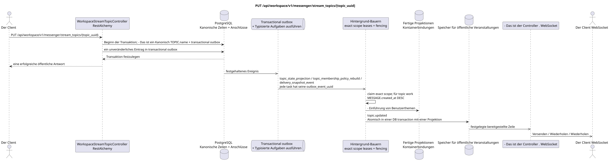

# PUT /api/workspace/v1/messenger/stream_topics/{topic_uuid}


Allgemeine Ziel-Invariante der Zuverlässigkeit: Jedes immutable outbox-Ereignis führt genau eine immutable typed task mit einem einzigartigen `outbox_event_uuid`; coalescing fehlt. Task speichert den tatsächlichen exact scope key, verwendet lease/fencing, retry/backoff, max attempts/DLQ, reaper und idepotent effect guard. Topic scope wird nur für placement/message-binding work angewendet; shared rows erhalten keinen impliziten Fallback auf topic.

[← Hauptindex der Dokumentation](../../../../index.md) · [Index der Abfolge](../../README.md) · [Abschnitt Core Messenger](../README.md)

## Status und Grenze des laufenden Vertrags

Die Methode, der Weg, die öffentliche JSON und die Autorisierung folgen dem aktuellen Vertrag von [`workspace_api.md`](../../../../workspace_api.md); bounded pagination und asynchrone visibility folgen dem separat angenommenen target compatibility ADR.



Ausgangsgestalt , die bearbeitet werden kann: [`put_stream_topic.puml`](diagrams/put_stream_topic.puml).

## Die Operation

**Methode und Weg:** `PUT /api/workspace/v1/messenger/stream_topics/{topic_uuid}`

**Zweck:** Das kanonische Thema umbenennen.

## Öffentliche Anfrage

```json
{
  "name": "Планирование релизов"
}
```

## Eine erfolgreiche öffentliche Antwort

HTTP `200`:

```json
{
  "uuid": "4ec0b996-b778-45f8-8ef4-ef863be0c047",
  "project_id": "22222222-2222-2222-2222-222222222222",
  "name": "Планирование релизов",
  "stream_uuid": "75309057-419c-4b12-a7c1-3932429ec4a6",
  "user_uuid": "11111111-1111-1111-1111-111111111111",
  "color": 4491468,
  "last_message_uuid": "a93dca35-3061-4748-bda4-7f6f8c660ea5",
  "unread_count": 2,
  "active_unread_count": 2,
  "passive_unread_count": 0,
  "is_default": false,
  "is_done": false,
  "notification_mode": "default",
  "summary": null,
  "summary_last_message_uuid": null,
  "summary_has_new_messages": null,
  "summary_enabled": true,
  "summary_system_prompt": null,
  "summary_reasoning_effort": null,
  "source_name": "native",
  "source": {
    "kind": "native"
  },
  "provider": null,
  "delivery": null,
  "created_at": "2026-06-22T09:10:00Z",
  "updated_at": "2026-06-22T10:20:00Z"
}
```

## Öffentliche Fehler

Bewerber-Token IAM und Projektbereich erforderlich. Falsch UUID oder Anfrage-Body wird HTTP `400` gegeben; fehlende oder nicht verfügbare Ressource in diesem Bereich  `404`. Standarddokumenterter Validierungsfehler-Body:

```json
{
  "type": "ValidationErrorException",
  "code": 400,
  "message": "Validation error occurred."
}
```

## Zielgrenze RestAlchemy

```python
from restalchemy.api import controllers
from restalchemy.api import resources
from restalchemy.dm import models
from restalchemy.dm import properties
from restalchemy.dm import types
from restalchemy.storage.sql import orm


class WorkspaceUserTopic(
    models.ModelWithUUID,
    models.ModelWithProject,
    orm.SQLStorableMixin,
):
    __tablename__ = "messenger_api_user_topics_v1"

    stream_uuid = properties.property(types.UUID(), read_only=True)
    user_uuid = properties.property(types.UUID(), read_only=True)
    last_message_uuid = properties.property(types.UUID(), read_only=True)
    summary_last_message_uuid = properties.property(types.UUID(), read_only=True)


class WorkspaceStreamTopicController(controllers.BaseResourceControllerPaginated):
    __resource__ = resources.ResourceByRAModel(
        WorkspaceUserTopic, convert_underscore=False, process_filters=True,
    )
```

Die öffentlichen Verweise auf Wesen sind skalare Eigenschaften .`types.UUID()`- nicht Beziehungen .RestAlchemy, die inURI- physische Spalten`*_uuid`bleiben als indexierte externe Schlüssel mit eindeutig ausgewählten Verweisungsabläufen.TOPICist ein kanonisches Wesen; einzigartigUSER_TOPIC_BINDINGSie sorgt für Sichtbarkeit, persönlichen Status und Themen-Zähler.

## Synchrone Transaktion

1. Die Mitgliedschaft erlauben.
2. Erneuern TOPIC.name.
3. Fügen Sie einzelne immutable Outbox-Events zu den Ausgabekarten hinzu
   `topic_state_projection`, `topic_membership_policy_rebuild` und
   `delivery_snapshot_event` tasks.

Betroffener Zustand: TOPIC und transactional outbox.

## Typisierte Aufgaben und Hintergrund-Ausfüllung

Aufgaben: Einzelne `topic_state_projection`,
`topic_membership_policy_rebuild` und `delivery_snapshot_event`, jeweils für
Eigene source outbox event.

Die Projektionen der Nutzer/Anbieter erhalten einzelne immutable tasks
`user-topic`/provider scopes. Topic worker nur Placements und
message bindings Themen; ein fenced owner schreibt exact key.

## Öffentliche Veranstaltungen und WebSocket

`topic.updated` für Benutzer.

## Idempotenz, Rennen und zeitliche Merkmale, die dem Kunden sichtbar sind

Wiederholung der kanonischen Aktualisierung mit aktueller Quelle sicher. Der Anrufer sieht das Ergebnis sofort, Ereignisse  asynchron.

[← Hauptindex der Dokumentation](../../../../index.md) · [Index der Abfolge](../../README.md) · [Abschnitt Core Messenger](../README.md)
