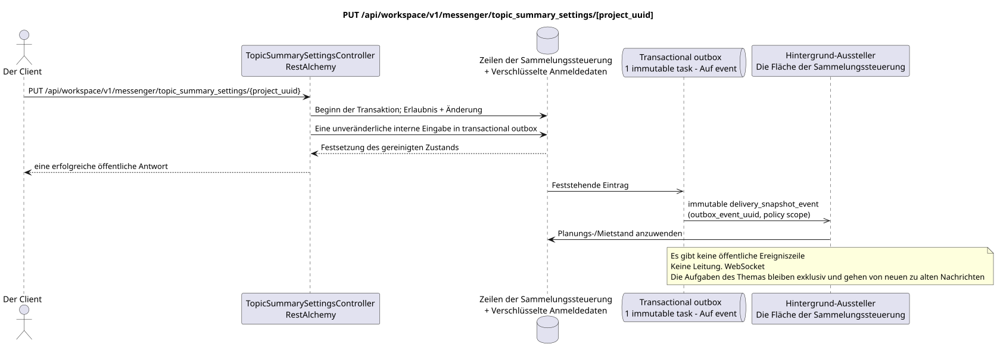

# PUT /api/workspace/v1/messenger/topic_summary_settings/{project_uuid}

[← Hauptindex der Dokumentation](../../../../index.md) · [Index der Abfolge](../../README.md) · [Abschnitt Core Messenger](../README.md)

## Status und Grenze des laufenden Vertrags

Die Ziel-Spezifikation in der docs-first-Ansatz. HTTP-Vertrag bleibt ein aktuelles Vertrag von [`workspace_api.md`](../../../../workspace_api.md); Zielmäßige interne Mechanismen sind nur ein Vorschlag.



Ausgangsgestalt , die bearbeitet werden kann: [`put_topic_summary_settings.puml`](diagrams/put_topic_summary_settings.puml).

## Die Operation

**Methode und Weg:** `PUT /api/workspace/v1/messenger/topic_summary_settings/{project_uuid}`

**Zweck:** Beide Bedingungen für die Einbeziehung der Themensumme festlegen.

## Öffentliche Anfrage

```json
{
  "global_enabled": true,
  "project_enabled": true
}
```

## Eine erfolgreiche öffentliche Antwort

HTTP `200`:

```json
{
  "project_id": "12345678-1234-4234-8234-123456789abc",
  "global_enabled": true,
  "project_enabled": true
}
```

Die Status- und Fehlerzeitzeichenfelder können in der Antwort fehlen, wenn `null` zugelassen und diesen Wert haben. `api_key` und die aktiven Antrags-Token werden nie zurückgegeben.

## Öffentliche Fehler

Beförderer-Token IAM erforderlich. Falsche UUID oder Anfrage-Body geben HTTP `400`; keine Verwaltungserlaubnis  `403`. Standard-Body Validierungsfehler:

```json
{
  "type": "ValidationErrorException",
  "code": 400,
  "message": "Validation error occurred."
}
```

Wenn UUID auf dem Weg nicht mit dem Projekt IAM übereinstimmt, kehrt `403` zurück; GET erfordert die Mitgliedschaft im Projekt, und PUT  die Berechtigung zur Verwaltung.

## Zielgrenze RestAlchemy

```python
from restalchemy.api import controllers
from restalchemy.api import resources
from restalchemy.dm import models
from restalchemy.dm import properties
from restalchemy.dm import types
from restalchemy.storage.sql import orm


class WorkspaceTopicSummarySettings(
    models.ModelWithProject,
    orm.SQLStorableMixin,
):
    __tablename__ = "messenger_topic_summary_settings"

    project_id = properties.property(types.UUID(), id_property=True, read_only=True)
    global_enabled = properties.property(types.Boolean(), default=False)
    project_enabled = properties.property(types.Boolean(), default=False)


class TopicSummarySettingsController(controllers.BaseResourceController):
    __resource__ = resources.ResourceByRAModel(
        WorkspaceTopicSummarySettings,
        convert_underscore=False,
        process_filters=True,
    )
```

Ein öffentliches Feld `project_id`  skalierende Eigenschaft UUID, nicht ein Verhältnis in Form URI. Ein physisch indexierter Außenschlüssel für ein Projekt Workspace hat eine eindeutig festgelegte Verweisungsintegritätsfunktion. UUID aus dem Weg muss mit dem Kontext des Projekts übereinstimmen IAM.

## Synchrone Transaktion

1. Fordern Sie die Übereinstimmung des Projekts mit dem Projekt IAM und die Genehmigung `workspace.topic_summary_settings.manage`.
2. Beide logischen Einschaltbedingungen in einer Zeile festlegen.
3. Eine unveränderliche Eingabe in transactional outbox.

## Typisierte Aufgabe und Hintergrund-Ausfüllung

Eine unabhängige immutable `delivery_snapshot_event` Task mit der exact scope Policy
Zusammenfassung für die Source Outbox Event-Pläne für das betroffene Projekt; unique
`outbox_event_uuid`, Ohne coalescing.

Der Hintergrund-Ausfüllungs-Ausfüllungs-Ausfüllungs-Ausfüllungs-Ausfüllungs-Ausfüllung kann die Schaltplanung nach den letzten Bedingungen aktivieren oder absagen.`(project_id, topic_uuid)`, beschränkt und verarbeitet kanonische Nachrichten von neuen zu alten.

## Öffentliche Ereignisse, Wiederholungen und zeitliche Charakteristiken

Die Antwort mit den Einschaltbedingungen wird sofort zurückgegeben; Planung und Stornierung erfolgen asynchron und impotent.WorkspaceUnd die Sendung nachWebSocketnicht definiert.

Für diese administrative Operation gibt es kein öffentliches Ereignis Workspace, so dass der Manager WebSocket nicht daran teilnimmt.

[← Hauptindex der Dokumentation](../../../../index.md) · [Index der Abfolge](../../README.md) · [Abschnitt Core Messenger](../README.md)
