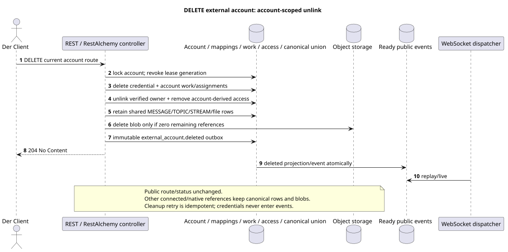

# Löschen eines externen Kontos

[← Hauptindex der Dokumentation](../../../../index.md) ·
[Index der Abfolge-Diagramme](../../README.md) ·
[Abschnitt Außenintegration/runtime](../README.md)

`DELETE /api/workspace/v1/messenger/external_accounts/{account_uuid}`

Löschen Sie die Account-Kredentials und Account-Scoped Verbindung/Zugriff, indem Sie shared
canonical provider data, anderen zugänglich connected accounts.



[Ausgangsgestalt , die bearbeitet werden kann PlantUML](diagrams/delete_external_account.puml)

## Anfrage

Es gibt keine weiteren Anforderungsparameter außer den oben genannten Variablen..

Der Körper ist weg. JSON.

## Eine erfolgreiche Antwort

`204 No Content`; Antwortkörper JSON fehlt.

## Fehler

| HTTP | Verhalten in der Öffentlichkeit |
| --- | --- |
| `403` | `workspace.external_account.delete` ist nicht zugelassen oder die Ressource befindet sich außerhalb des autorisierten Bereichs. |
| `404` | Die Ressource in dem angegebenen Bereich existiert nicht oder ist nicht sichtbar. |
| `400` | Für nicht zulässige Pfadwerte, Anfrageparameter oder Körper wird ein Standard-Validierungsfehler verwendet RESTAlchemy. |

Beispiel für Validierungsfehler:

```json
{
  "type": "ValidationErrorException",
  "code": 400,
  "message": "Validation error occurred."
}
```

## Grenze RestAlchemy

Ziel-Ressource-/Kontrollanzeige (Angebotsdokumentation, nicht Produktionscode)):

```python
class ExternalAccount(models.ModelWithUUID, models.ModelWithTimestamp, orm.SQLStorableMixin):
    __tablename__ = "m_external_accounts_v2"

    owner_user_uuid = properties.property(types.UUID(), required=True)
    settings = properties.property(EXTERNAL_ACCOUNT_SETTINGS_TYPE, required=True)
    status = properties.property(types.Enum(ACCOUNT_STATUSES), read_only=True)
    capabilities = properties.property(types.Dict(), read_only=True)
    revision = properties.property(types.Integer(min_value=1), read_only=True)


class ExternalAccountController(controllers.BaseResourceControllerPaginated):
    __resource__ = resources.ResourceByRAModel(
        ExternalAccount, hidden_fields=["owner_user_uuid"]
    )
```

`owner_user_uuid` verborgen; öffentliche `settings.default_project_id` ist eine skalare UUID-Eigenschaft. Im Ziellager verweist die indizierte `owner_user_uuid` auf den Benutzer Workspace mit `ON DELETE CASCADE`, und die extrahierte indizierte `default_project_uuid`  auf die Projektregister mit `ON DELETE RESTRICT`; bei der Serialisierung ist die letzte noch in `settings` eingebettet. Öffentliche Anzeigen RestAlchemy verwenden nicht `relationships.relationship` für JSON in der Form UUID, weil die Beziehung (relationship) als URI serialisiert wird. An der Grenze der physischen Schema ist jede kanonische nichtpolymorphe Verbindung `*_uuid` ein indizierter externer Schlüssel mit einer eindeutig ausgewählten Verweisungsfunktion. Die Sanitäre verbergen den Besitzer, die Daten, die Provider-ID, die private Zertifikatsadresse, die interne Protokoll- und Quellfläche.

## Synchrone Transaktion

1. Authentifizieren Sie die Anfrage, definieren Sie den Bereich, überprüfen Sie die Auflösung/Body und finden Sie die kanonische Zeile für den indizierten Schlüssel.
2. Account sperren, Lease Generation widerrufen, löschen credential,
   account assignments/mappings/queued work und account-derived bindings/access;
   die verified identity vom Owner entfernen und immutable Outbox löschen.
3. Nicht löschen shared canonical messages/topics/streams/files, solange es existiert
   andere provider/native access/reference; physical blob nur nach
   Bewiesen zero-reference check.
4. Antwort erst zurückgeben, wenn die Transaktion festgestellt ist; provider/network cleanup nicht
   Sie wird in ihr ausgeführt..

## Hintergrundbearbeitung, Ereignisse und Übereinstimmung

Typisierte `delivery_snapshot_event` bedient exact external-account
scope und fertig `external_account.deleted`; cleanup provider lifecycle bleibt
und nicht nur mit Rechentechniken. request path.

Der Hintergrund-Handler in einer DB-Transaktion erfasst den materialisierten Zustand und den fertig gestellten Umschlag des vollständigen Bildes `external_account.deleted`; beide Effekte von commit oder rollback zusammen. Nach dem commit sendet, wiederholt und spielt ein separater Manager WebSocket ihn aus; API/worker besitzt keine Clientverbindungen.

Übereinstimmung, sichtbar für den Client: HTTP 204 bedeutet, dass der Account von
Sie haben ein öffentliches Bild und Access erlaubt es nicht mehr zu lesen. Shared canonical
history bleibt für andere Accounts; die Anmeldeinformationen kommen nie in event.
Es ist accepted target semantics bei unveränderlichem public route/status und unterscheidet sich
Aus dem alten destructive product text.:
[`zulip_bridge/account_lifecycle_and_identity.md`](../../../../zulip_bridge/account_lifecycle_and_identity.md#delete-accepted-target-semantics).

## Idempotenz und Parallelismus

UUID Das Konto wird vom Kunden beim Erstellen erstellt; Business-Unikum erlaubt nur ein Konto .`(owner_user_uuid, provider_kind)`. Der Verschlüsselungstext der Zähldaten wird separat gespeichert und niemals serialisiert.

Die Wiederholungen verwenden stabile Geschäftsschlüssel und den aktuellen Ausgangszustand. Jedes immutable outbox event erstellt eine separate task mit einem einzigartigen `outbox_event_uuid`; die Wiederholung dieser task muss idempotent sein, coalescing fehlt. Die monopolistische Verarbeitung des Themas Messenger von neuen Eintragungen zu den alten wird nur dann angewendet, wenn die betroffene kanonische Platzierung tatsächlich auf `(project_id, topic_uuid)` bezieht; Provider-Administration/Leseoperationen erstellen kein künstliches Thema und gehören nicht zu dieser Schlange.

## Die Quellen

- [`workspace_api.md`](../../../../workspace_api.md) — Autoritätreiche öffentliche Routen, allgemeine JSON, Pagination, Ereignisse und Vertrag WebSocket.
- [`zulip_bridge_v1_product_and_api.md`](../../../../zulip_bridge_v1_product_and_api.md) — gesundheitsschützender Lebenszyklus von externen Ressourcen, Berechtigungen und Provider-Semantik.

[← Hauptindex der Dokumentation](../../../../index.md) ·
[Index der Abfolge-Diagramme](../../README.md) ·
[Abschnitt Außenintegration/runtime](../README.md)
