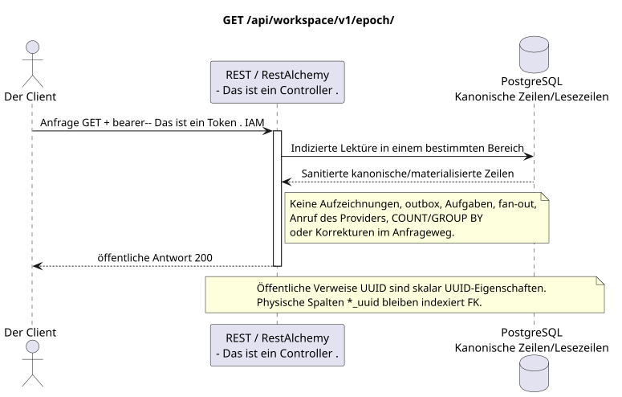

# Die aktuelle Ereigniszeit erhalten

[← Hauptindex der Dokumentation](../../../../index.md) ·
[Index der Abfolge-Diagramme](../../README.md) ·
[Abschnitt Außenintegration/runtime](../README.md)

`GET /api/workspace/v1/epoch/`

Lässt den letzten sichtbaren Kursor und die gespeicherte untere Grenze für den authentifizierten Benutzer zurück.



[Ausgangsgestalt , die bearbeitet werden kann PlantUML](diagrams/get_epoch.puml)

## Anfrage

Es gibt keine weiteren Anforderungsparameter außer den oben genannten Variablen..

Der Körper ist weg. JSON.

## Eine erfolgreiche Antwort

HTTP `200`:

```json
{
  "epoch_version": 124,
  "epoch_generation": "781203",
  "current_epoch_version": 124,
  "minimum_epoch_version": 37
}
```

## Fehler

| HTTP | Verhalten in der Öffentlichkeit |
| --- | --- |
| `400` | Für nicht zulässige Pfadwerte, Anfrageparameter oder Körper wird ein Standard-Validierungsfehler verwendet RESTAlchemy. |

Beispiel für Validierungsfehler:

```json
{
  "type": "ValidationErrorException",
  "code": 400,
  "message": "Validation error occurred."
}
```

## Grenze RestAlchemy

Ziel-Ressource-/Kontrollanzeige (Angebotsdokumentation, nicht Produktionscode)):

```python
class WorkspaceEpoch(models.Model, orm.SQLStorableMixin):
    # Read-only, calculation-free view rooted in one physical event-cursor row.
    __tablename__ = "m_workspace_epoch_view"

    project_id = properties.property(types.UUID(), required=True)
    user_uuid = properties.property(types.UUID(), required=True)
    epoch_generation = properties.property(types.String(min_length=1), read_only=True)
    epoch_version = properties.property(types.Integer(min_value=0), read_only=True)
    current_epoch_version = properties.property(types.Integer(min_value=0), read_only=True)
    minimum_epoch_version = properties.property(types.Integer(min_value=1), read_only=True)

    @classmethod
    def get_id_property(cls) -> dict[str, typing.Any]:
        return {
            "project_id": cls.properties.properties["project_id"],
            "user_uuid": cls.properties.properties["user_uuid"],
        }


class WorkspaceEpochController(controllers.BaseResourceController):
    __resource__ = resources.ResourceByRAModel(
        WorkspaceEpoch,
        hidden_fields=["project_id", "user_uuid"],
    )

    def filter(self, filters, order_by=None):
        del filters, order_by
        return WorkspaceEpoch.objects.get_one(
            filters={
                "project_id": dm_filters.EQ(self.get_context().project_id),
                "user_uuid": dm_filters.EQ(self.get_context().user_uuid),
            }
        )
```

Die Ansicht zeigt eine indizierte physische Zeile des Ereignisschaltfadens in einer Zeile der öffentlichen Antwort an und gibt einen Alias an .`epoch_version <- current_epoch_version`Es kann keine Aggregation von Ereignisdaten durchführen.`(project_id, user_uuid)`ist die technische Identität der ZeileRestAlchemy- und nicht öffentlich .JSONBeide physischen SpaltenUUIDIndex- externe Schlüssel mit`ON DELETE CASCADE`- öffentliche AnzeigenRestAlchemySie benutzen sie nicht .`relationships.relationship`Für ...JSON- Das ist die Form .UUID, weil die Beziehung (relationship) als URI.

## Synchrone Transaktion

1. Authentifizieren der Anfrage und definieren des Projekt-/Benutzereignisses IAM.
2. Überprüfen Sie den Weg, die Anfrage-Parameter und die erforderliche Berechtigung.
3. Führen Sie ein Indexlesen durch , wobei der Bereich aus der kanonischen Zeile oder der vormaterialierten Leseboden gespeichert wird.
4. Nur gesundheitsschützende öffentliche Felder serialisieren.

Eine Lesetransaction schreibt keinen Domain-Outbox, eine typische Projektionsvorgabe, einen gewünschten Statusbefehl oder ein bereites öffentliches Ereignis auf. Während der Anfrage führt sie keine `COUNT`, `GROUP BY`, korrelierte Unteranfrage, Fan-out-Bindung, Provider-Aufruf oder Cache-Feststellung aus.

## Hintergrundbearbeitung, Ereignisse und Übereinstimmung

Typisierte Projektionsvorgaben: keine.

Für diese Operation wird kein öffentliches Ereignis Workspace erstellt, so dass der einzelne Dispatcher WebSocket nichts zu liefern hat.

Absprache, die dem Kunden sichtbar ist: keine zusätzliche Verzögerung; die Antwort ist ein autoritatives festgehaltenes Bild.

## Idempotenz und Parallelismus

`epoch_version` Monotone innerhalb von `epoch_generation`; `(epoch_generation, epoch_version)` ist die Identität des Wiedergabens/Kursors.

Die Wiederholungen verwenden stabile Geschäftsschlüssel und den aktuellen Ausgangszustand. Jedes immutable outbox event erstellt eine separate task mit einem einzigartigen `outbox_event_uuid`; die Wiederholung dieser task muss idempotent sein, coalescing fehlt. Die monopolistische Verarbeitung des Themas Messenger von neuen Eintragungen zu den alten wird nur dann angewendet, wenn die betroffene kanonische Platzierung tatsächlich auf `(project_id, topic_uuid)` bezieht; Provider-Administration/Leseoperationen erstellen kein künstliches Thema und gehören nicht zu dieser Schlange.

## Die Quellen

- [`workspace_api.md`](../../../../workspace_api.md) — Autoritätreiche öffentliche Routen, allgemeine JSON, Pagination, Ereignisse und Vertrag WebSocket.
- [`zulip_bridge_v1_product_and_api.md`](../../../../zulip_bridge_v1_product_and_api.md) — gesundheitsschützender Lebenszyklus von externen Ressourcen, Berechtigungen und Provider-Semantik.

[← Hauptindex der Dokumentation](../../../../index.md) ·
[Index der Abfolge-Diagramme](../../README.md) ·
[Abschnitt Außenintegration/runtime](../README.md)
