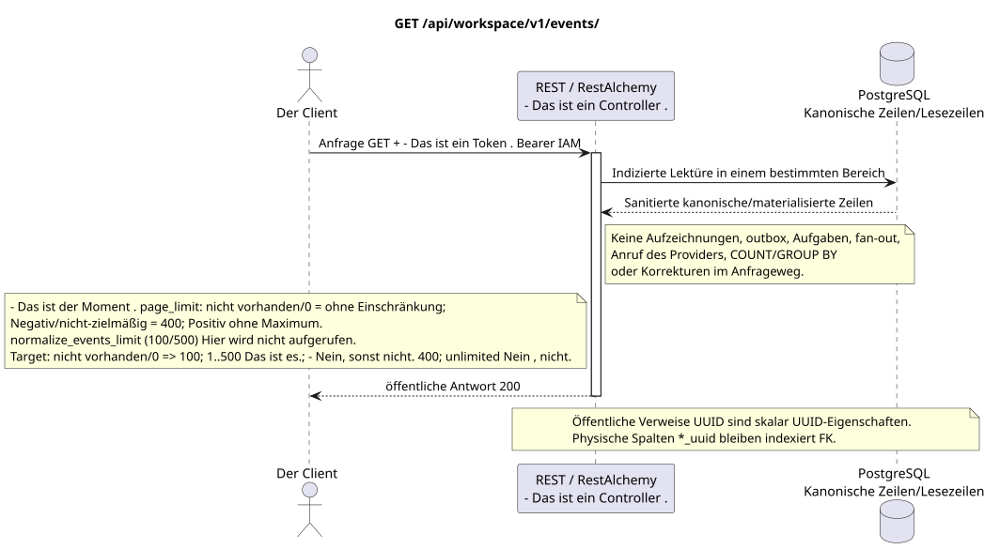

# Liste der nachhaltigen Ereignisse Workspace

[← Hauptindex der Dokumentation](../../../../index.md) ·
[Index der Abfolge-Diagramme](../../README.md) ·
[Abschnitt Außenintegration und Ausführungszeit](../README.md)

`GET /api/workspace/v1/events/`

Das für den aktuellen Benutzer sichtbare Ereignis-Sustable-Suffix in wachsender Epochenfolge zurückgeben.



[Ausgangsgestalt , die bearbeitet werden kann PlantUML](diagrams/get_events.puml)

## Anfrage

Abfrage-Parametervertrag:

- `epoch_version>` (wird in URL als `epoch_version%3E` kodiert) mit einem ganzen Kurzer
- `epoch_generation` mit jedem nicht-Null-Kursor gepaart
- Vollzahl `page_limit`; `page_marker`  Vollzahl der Epoche
- Andere dokumentierte typische Filter von Ereignissen und AIP-160 `q`

Verhalten `page_limit` in der aktuellen Implementierung: fehlende Parameter oder `0` bedeutet
Eine unbegrenzte Auswahl; ein negativer oder nicht ganzheitlicher Wert gibt HTTP `400`;
Jeder positive Wert wird ohne Maximum und ohne Einschränkung angewendet
Es gibt eine Hilfsfunktion in der Codebase.
`normalize_events_limit` mit dem Standardwert `100` und dem Maximum `500`, aber
Der Controller dieser HTTP Operation ruft sie nicht auf, also sind diese Zahlen nicht
Zielrichtlinie: fehlen/`0` => `100`; `1..500` wird genau angenommen; negativ, nicht ganz und `>500` => HTTP `400` ohne Clamp. Unbounded mode fehlt; der Client vollständigen Exports geht bis zur Abwesenheit des folgenden marker.

Der Körper ist weg. JSON.

## Eine erfolgreiche Antwort

HTTP `200`:

```json
[
  {
    "schema_version": 1,
    "uuid": "5bb95582-b4f3-4de1-bf84-f0244910fc82",
    "epoch_version": 124,
    "project_id": "00000000-0000-4000-8000-000000000001",
    "user_uuid": "3f433fee-b27f-4c67-98bd-31fe4df42cc8",
    "object_type": "external_account",
    "action": "updated",
    "created_at": "2026-07-17T12:12:00Z",
    "updated_at": "2026-07-17T12:12:00Z",
    "payload": {
      "kind": "external_account.updated",
      "uuid": "0d4ae1d0-30ad-4d15-bf26-5789e8406201",
      "snapshot": {
        "uuid": "0d4ae1d0-30ad-4d15-bf26-5789e8406201",
        "settings": {
          "kind": "zulip",
          "server_url": "https://zulip.example.invalid",
          "email": "owner@example.invalid",
          "selection_mode": "explicit",
          "history_depth": "30_days",
          "default_project_id": "00000000-0000-4000-8000-000000000001"
        },
        "credential_present": true,
        "status": "live",
        "live_ready": true,
        "safe_error": null,
        "capabilities": {},
        "desired_generation": 7,
        "applied_generation": 7,
        "last_progress_at": "2026-07-17T12:00:00Z",
        "created_at": "2026-07-17T11:00:00Z",
        "updated_at": "2026-07-17T12:00:00Z",
        "revision": 7
      }
    }
  }
]
```

## Fehler

| HTTP | Verhalten in der Öffentlichkeit |
| --- | --- |
| `410` | `EventsCursorExpiredError` mit `Cache-Control: no-store` bei fehlender/veränderter Generation, zukünftigem Kurzer oder entferntem Suffix. |
| `400` | Für nicht zulässige Pfadwerte, Anfrageparameter oder Körper wird ein Standard-Validierungsfehler verwendet RESTAlchemy. |

Beispiel für Validierungsfehler:

```json
{
  "type": "ValidationErrorException",
  "code": 400,
  "message": "Validation error occurred."
}
```

Antwortkörper beim Auslauf des Cursors:

```json
{
  "type": "EventsCursorExpiredError",
  "code": 410,
  "error": "epoch_pruned",
  "message": "The event cursor is outside the retained suffix.",
  "reason": "epoch_pruned",
  "epoch_generation": "781203",
  "current_epoch_version": 124,
  "minimum_epoch_version": 37
}
```

## Grenze RestAlchemy

Ziel-Ressource-/Kontrollanzeige (Angebotsdokumentation, nicht Produktionscode)):

```python
class WorkspaceEvent(models.ModelWithUUID, models.ModelWithTimestamp, orm.SQLStorableMixin):
    __tablename__ = "m_workspace_events"

    epoch_version = properties.property(types.Integer(min_value=1), required=True)
    project_id = properties.property(types.UUID(), required=True)
    user_uuid = properties.property(types.AllowNone(types.UUID()), default=None)
    object_type = properties.property(types.String(), required=True)
    action = properties.property(types.String(), required=True)
    payload = properties.property(types.Dict(), required=True)


class WorkspaceEventController(controllers.BaseResourceControllerPaginated):
    __resource__ = resources.ResourceByRAModel(WorkspaceEvent)
    # Scope by project/user or stored compact audience before indexed keyset read.
```

`uuid`, `project_id`, `user_uuid` Und ...UUIDDie Nutzlast innerhalb der Bilder sind skalare Werte .UUID. Verzeichnis`project_id`Die Veranstaltung ist nicht möglich .`null` `user_uuid`Verweisen auf ihre kanonischen Zeilen des Gebiets mit`ON DELETE CASCADE`; UUID, kopiert in unveränderbarJSONDie Daten sind Ereignisdaten, nicht Beziehungsspalten, also nicht alsURIund nicht als gültige Eckschlüssel gelten.RestAlchemySie benutzen sie nicht .`relationships.relationship`Für ...JSON- Das ist die Form .UUID, weil die Beziehung sich alsURI- An der Grenze der physikalischen Schaltung ist jede kanonische nicht-polymorphe Verbindung .`*_uuid`ist ein indexierter externer Schlüssel mit einer eindeutig ausgewählten Verweisung. Sanitizer verbergen Besitzer, Account, Roh-ID-Anbieter, geheime Zertifikate, interne Adresse und Roh-Protokollfelder.

## Synchrone Transaktion

1. Authentifizieren der Anfrage und definieren des Projekt-/Benutzereignisses IAM.
2. Überprüfen Sie den Weg, die Anfrage-Parameter und die erforderliche Berechtigung.
3. Führen Sie ein Indexlesen durch , wobei der Bereich aus der kanonischen Zeile oder der vormaterialierten Leseboden gespeichert wird.
4. Nur gesundheitsschützende öffentliche Felder serialisieren.

Eine Lesetransaction schreibt keinen Domain-Outbox, eine typische Projektionsvorgabe, einen gewünschten Statusbefehl oder ein bereites öffentliches Ereignis auf. Während der Anfrage führt sie keine `COUNT`, `GROUP BY`, korrelierte Unteranfrage, Fan-out-Bindung, Provider-Aufruf oder Cache-Feststellung aus.

## Hintergrundbearbeitung, Ereignisse und Übereinstimmung

Typisierte Projektionsvorgaben: keine.

Für diese Operation wird kein öffentliches Ereignis Workspace erstellt, so dass der einzelne Dispatcher WebSocket nichts zu liefern hat.

Absprache, die dem Kunden sichtbar ist: keine zusätzliche Verzögerung; die Antwort ist ein autoritatives festgehaltenes Bild.

## Idempotenz und Parallelismus

`epoch_version` Monotone innerhalb von `epoch_generation`; `(epoch_generation, epoch_version)` ist die Identität des Wiedergabens/Kursors.

Die Wiederholungen verwenden stabile Geschäftsschlüssel und den aktuellen Ausgangszustand. Jedes immutable outbox event erstellt eine separate task mit einem einzigartigen `outbox_event_uuid`; die Wiederholung dieser task muss idempotent sein, coalescing fehlt. Die monopolistische Verarbeitung des Themas Messenger von neuen Eintragungen zu den alten wird nur dann angewendet, wenn die betroffene kanonische Platzierung tatsächlich auf `(project_id, topic_uuid)` bezieht; Provider-Administration/Leseoperationen erstellen kein künstliches Thema und gehören nicht zu dieser Schlange.

## Die Quellen

- [`workspace_api.md`](../../../../workspace_api.md) — Autoritätreiche öffentliche Routen, allgemeine JSON, Pagination, Ereignisse und Vertrag WebSocket.
- [`zulip_bridge_v1_product_and_api.md`](../../../../zulip_bridge_v1_product_and_api.md) — gesundheitsschützender Lebenszyklus von externen Ressourcen, Berechtigungen und Provider-Semantik.

[← Hauptindex der Dokumentation](../../../../index.md) ·
[Index der Abfolge-Diagramme](../../README.md) ·
[Abschnitt Außenintegration und Ausführungszeit](../README.md)
