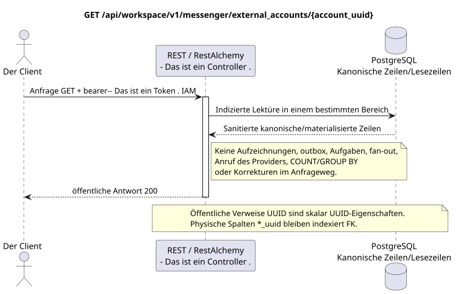

# Erhalten eines externen Kontos

[← Hauptindex der Dokumentation](../../../../index.md) ·
[Index der Abfolge-Diagramme](../../README.md) ·
[Abschnitt Außenintegration/runtime](../README.md)

`GET /api/workspace/v1/messenger/external_accounts/{account_uuid}`

Einen gesundheitsgetriebenen Account zurückgeben.



[Ausgangsgestalt , die bearbeitet werden kann PlantUML](diagrams/get_external_account.puml)

## Anfrage

Es gibt keine weiteren Anforderungsparameter außer den oben genannten Variablen..

Der Körper ist weg. JSON.

## Eine erfolgreiche Antwort

HTTP `200`:

```json
{
  "uuid": "0d4ae1d0-30ad-4d15-bf26-5789e8406201",
  "settings": {
    "kind": "zulip",
    "server_url": "https://zulip.example.invalid",
    "email": "owner@example.invalid",
    "selection_mode": "explicit",
    "history_depth": "30_days",
    "default_project_id": "00000000-0000-4000-8000-000000000001"
  },
  "credential_present": true,
  "status": "live",
  "live_ready": true,
  "safe_error": null,
  "capabilities": {},
  "desired_generation": 7,
  "applied_generation": 7,
  "last_progress_at": "2026-07-17T12:00:00Z",
  "created_at": "2026-07-17T11:00:00Z",
  "updated_at": "2026-07-17T12:00:00Z",
  "revision": 7
}
```

Die Antworten der Reviereinrichtungen enthalten strenge `ETag: "<revision>"`.

## Fehler

| HTTP | Verhalten in der Öffentlichkeit |
| --- | --- |
| `403` | `workspace.external_account.read` ist nicht zugelassen oder die Ressource befindet sich außerhalb des autorisierten Bereichs. |
| `404` | Die Ressource in dem angegebenen Bereich existiert nicht oder ist nicht sichtbar. |
| `400` | Für nicht zulässige Pfadwerte, Anfrageparameter oder Körper wird ein Standard-Validierungsfehler verwendet RESTAlchemy. |

Beispiel für Validierungsfehler:

```json
{
  "type": "ValidationErrorException",
  "code": 400,
  "message": "Validation error occurred."
}
```

## Grenze RestAlchemy

Ziel-Ressource-/Kontrollanzeige (Angebotsdokumentation, nicht Produktionscode)):

```python
class ExternalAccount(models.ModelWithUUID, models.ModelWithTimestamp, orm.SQLStorableMixin):
    __tablename__ = "m_external_accounts_v2"

    owner_user_uuid = properties.property(types.UUID(), required=True)
    settings = properties.property(EXTERNAL_ACCOUNT_SETTINGS_TYPE, required=True)
    status = properties.property(types.Enum(ACCOUNT_STATUSES), read_only=True)
    capabilities = properties.property(types.Dict(), read_only=True)
    revision = properties.property(types.Integer(min_value=1), read_only=True)


class ExternalAccountController(controllers.BaseResourceControllerPaginated):
    __resource__ = resources.ResourceByRAModel(
        ExternalAccount, hidden_fields=["owner_user_uuid"]
    )
```

`owner_user_uuid` verborgen; öffentliche `settings.default_project_id` ist eine skalare UUID-Eigenschaft. Im Ziellager verweist die indizierte `owner_user_uuid` auf den Benutzer Workspace mit `ON DELETE CASCADE`, und die extrahierte indizierte `default_project_uuid`  auf die Projektregister mit `ON DELETE RESTRICT`; bei der Serialisierung ist die letzte noch in `settings` eingebettet. Öffentliche Anzeigen RestAlchemy verwenden nicht `relationships.relationship` für JSON in der Form UUID, weil die Beziehung (relationship) als URI serialisiert wird. An der Grenze der physischen Schema ist jede kanonische nichtpolymorphe Verbindung `*_uuid` ein indizierter externer Schlüssel mit einer eindeutig ausgewählten Verweisungsfunktion. Die Sanitäre verbergen den Besitzer, die Daten, die Provider-ID, die private Zertifikatsadresse, die interne Protokoll- und Quellfläche.

## Synchrone Transaktion

1. Authentifizieren der Anfrage und definieren des Projekt-/Benutzereignisses IAM.
2. Überprüfen Sie den Weg, die Anfrage-Parameter und die erforderliche Berechtigung.
3. Führen Sie ein Indexlesen durch , wobei der Bereich aus der kanonischen Zeile oder der vormaterialierten Leseboden gespeichert wird.
4. Nur gesundheitsschützende öffentliche Felder serialisieren.

Eine Lesetransaction schreibt keinen Domain-Outbox, eine typische Projektionsvorgabe, einen gewünschten Statusbefehl oder ein bereites öffentliches Ereignis auf. Während der Anfrage führt sie keine `COUNT`, `GROUP BY`, korrelierte Unteranfrage, Fan-out-Bindung, Provider-Aufruf oder Cache-Feststellung aus.

## Hintergrundbearbeitung, Ereignisse und Übereinstimmung

Typisierte Projektionsvorgaben: keine.

Für diese Operation wird kein öffentliches Ereignis Workspace erstellt, so dass der einzelne Dispatcher WebSocket nichts zu liefern hat.

Absprache, die dem Kunden sichtbar ist: keine zusätzliche Verzögerung; die Antwort ist ein autoritatives festgehaltenes Bild.

## Idempotenz und Parallelismus

UUID Das Konto wird vom Kunden beim Erstellen erstellt; Business-Unikum erlaubt nur ein Konto .`(owner_user_uuid, provider_kind)`. Der Verschlüsselungstext der Zähldaten wird separat gespeichert und niemals serialisiert.

Die Wiederholungen verwenden stabile Geschäftsschlüssel und den aktuellen Ausgangszustand. Jedes immutable outbox event erstellt eine separate task mit einem einzigartigen `outbox_event_uuid`; die Wiederholung dieser task muss idempotent sein, coalescing fehlt. Die monopolistische Verarbeitung des Themas Messenger von neuen Eintragungen zu den alten wird nur dann angewendet, wenn die betroffene kanonische Platzierung tatsächlich auf `(project_id, topic_uuid)` bezieht; Provider-Administration/Leseoperationen erstellen kein künstliches Thema und gehören nicht zu dieser Schlange.

## Die Quellen

- [`workspace_api.md`](../../../../workspace_api.md) — Autoritätreiche öffentliche Routen, allgemeine JSON, Pagination, Ereignisse und Vertrag WebSocket.
- [`zulip_bridge_v1_product_and_api.md`](../../../../zulip_bridge_v1_product_and_api.md) — gesundheitsschützender Lebenszyklus von externen Ressourcen, Berechtigungen und Provider-Semantik.

[← Hauptindex der Dokumentation](../../../../index.md) ·
[Index der Abfolge-Diagramme](../../README.md) ·
[Abschnitt Außenintegration/runtime](../README.md)
