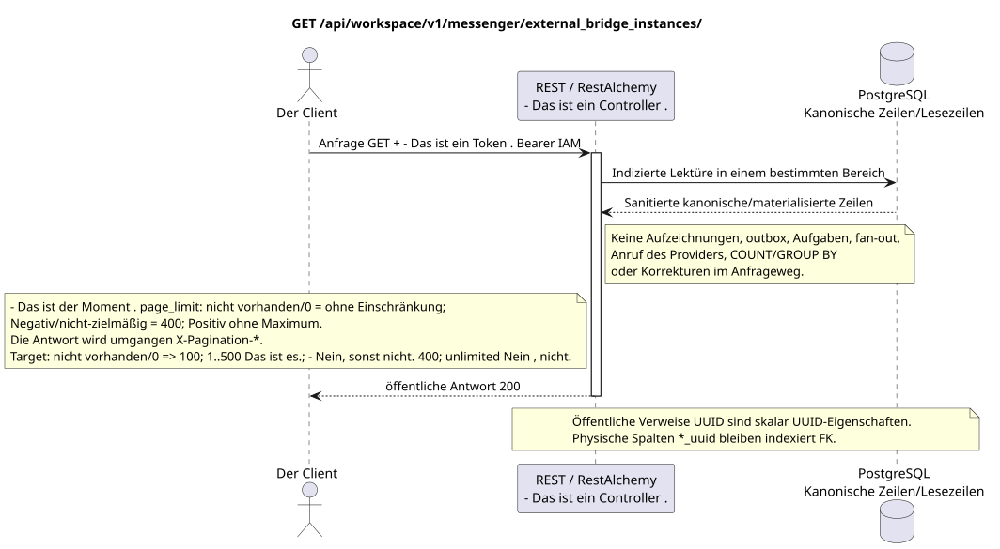

# Liste der Exemplare der Außenbrücke

[← Hauptindex der Dokumentation](../../../../index.md) ·
[Index der Abfolge-Diagramme](../../README.md) ·
[Abschnitt Außenintegration und Ausführungszeit](../README.md)

`GET /api/workspace/v1/messenger/external_bridge_instances/`

Sanitierte Identitäten der Ausführungszeitbrücken für alle Providerarten auflisten.



[Ausgangsgestalt , die bearbeitet werden kann PlantUML](diagrams/get_external_bridge_instances.puml)

## Anfrage

Abfrage-Parametervertrag:

- Dokumentation von typischen Filtern/AIP-160 `q`
- `page_limit`
- `page_marker` (UUID Das letzte Exemplar)

Verhalten `page_limit` in der aktuellen Implementierung: fehlende Parameter oder `0` bedeutet
Eine unbegrenzte Auswahl; ein negativer oder nicht ganzheitlicher Wert gibt HTTP `400`;
Jeder positive Wert wird ohne Maximum und ohne Einschränkung angewendet
Die Umschreibung von `ExternalResourceController` umgeht
Standardüberschriften `X-Pagination-*`. Target policy: fehlen/`0` => `100`; `1..500` wird genau angenommen; negativ, nicht vollständig und `>500` => HTTP `400` ohne Clamp. Unbounded mode fehlt; der Client für den vollständigen Export geht vor der fehlenden nächsten marker.

Der Körper ist weg. JSON.

## Eine erfolgreiche Antwort

HTTP `200`:

```json
[
  {
    "uuid": "6dd6741b-0d90-490a-8e51-749a411be1ad",
    "provider": "zulip",
    "identity_generation": 3,
    "status": "active",
    "capabilities": {},
    "last_heartbeat_at": "2026-07-17T12:11:00Z",
    "certificate_not_after": "2026-10-17T12:00:00Z",
    "safe_error": null,
    "revision": 8,
    "created_at": "2026-07-01T09:00:00Z",
    "updated_at": "2026-07-17T12:11:00Z"
  }
]
```

## Fehler

| HTTP | Verhalten in der Öffentlichkeit |
| --- | --- |
| `403` | `workspace.external_bridge_instance.read` ist nicht zugelassen oder die Ressource befindet sich außerhalb des autorisierten Bereichs. |
| `400` | Für nicht zulässige Pfadwerte, Anfrageparameter oder Körper wird ein Standard-Validierungsfehler verwendet RESTAlchemy. |

Beispiel für Validierungsfehler:

```json
{
  "type": "ValidationErrorException",
  "code": 400,
  "message": "Validation error occurred."
}
```

## Grenze RestAlchemy

Ziel-Ressource-/Kontrollanzeige (Angebotsdokumentation, nicht Produktionscode)):

```python
class ExternalBridgeInstance(models.ModelWithUUID, models.ModelWithTimestamp, orm.SQLStorableMixin):
    __tablename__ = "m_external_bridge_instances_v2"

    provider = properties.property(types.Enum(PROVIDER_KINDS), required=True)
    identity_generation = properties.property(types.Integer(min_value=1), required=True)
    status = properties.property(types.Enum(BRIDGE_STATUSES), read_only=True)
    capabilities = properties.property(types.Dict(), read_only=True)
    revision = properties.property(types.Integer(min_value=1), read_only=True)


class ExternalBridgeInstanceController(controllers.BaseResourceControllerPaginated):
    __resource__ = resources.ResourceByRAModel(ExternalBridgeInstance)
    # Dedicated IAM permission checks wrap standard indexed reads/actions.
```

UUID der Ressource ist sein skalarer Primärschlüssel; Provider-Art  Streckenschlüssel des Weges/Domänen. In dieser öffentlichen Form gibt es keinen InteressensverweisUUIDDie Anzeige ist für alle öffentlich zugänglich .RestAlchemySie benutzen sie nicht .`relationships.relationship`Für ...JSON- Das ist die Form .UUID, weil die Beziehung sich alsURI- An der Grenze der physikalischen Schaltung ist jede kanonische nicht-polymorphe Verbindung .`*_uuid`ist ein indexierter externer Schlüssel mit einer eindeutig ausgewählten Verweisungsaktion. Sanitizer verbergen den Besitzer, die Anmeldeinformationen, die rohe Provider-ID, das geschlossene Zertifikat, die interne Adresse und die rohen Protokollfelder.

## Synchrone Transaktion

1. Authentifizieren der Anfrage und definieren des Projekt-/Benutzereignisses IAM.
2. Überprüfen Sie den Weg, die Anfrage-Parameter und die erforderliche Berechtigung.
3. Führen Sie ein Indexlesen durch , wobei der Bereich aus der kanonischen Zeile oder der vormaterialierten Leseboden gespeichert wird.
4. Nur gesundheitsschützende öffentliche Felder serialisieren.

Eine Lesetransaction schreibt keinen Domain-Outbox, eine typische Projektionsvorgabe, einen gewünschten Statusbefehl oder ein bereites öffentliches Ereignis auf. Während der Anfrage führt sie keine `COUNT`, `GROUP BY`, korrelierte Unteranfrage, Fan-out-Bindung, Provider-Aufruf oder Cache-Feststellung aus.

## Hintergrundbearbeitung, Ereignisse und Übereinstimmung

Typisierte Projektionsvorgaben: keine.

Für diese Operation wird kein öffentliches Ereignis Workspace erstellt, so dass der einzelne Dispatcher WebSocket nichts zu liefern hat.

Absprache, die dem Kunden sichtbar ist: keine zusätzliche Verzögerung; die Antwort ist ein autoritatives festgehaltenes Bild.

## Idempotenz und Parallelismus

UUID Die Rückmeldung ist für die aktive Generation unwiderruflich und potent..

Die Wiederholungen verwenden stabile Geschäftsschlüssel und den aktuellen Ausgangszustand. Jedes immutable outbox event erstellt eine separate task mit einem einzigartigen `outbox_event_uuid`; die Wiederholung dieser task muss idempotent sein, coalescing fehlt. Die monopolistische Verarbeitung des Themas Messenger von neuen Eintragungen zu den alten wird nur dann angewendet, wenn die betroffene kanonische Platzierung tatsächlich auf `(project_id, topic_uuid)` bezieht; Provider-Administration/Leseoperationen erstellen kein künstliches Thema und gehören nicht zu dieser Schlange.

## Die Quellen

- [`workspace_api.md`](../../../../workspace_api.md) — Autoritätreiche öffentliche Routen, allgemeine JSON, Pagination, Ereignisse und Vertrag WebSocket.
- [`zulip_bridge_v1_product_and_api.md`](../../../../zulip_bridge_v1_product_and_api.md) — gesundheitsschützender Lebenszyklus von externen Ressourcen, Berechtigungen und Provider-Semantik.

[← Hauptindex der Dokumentation](../../../../index.md) ·
[Index der Abfolge-Diagramme](../../README.md) ·
[Abschnitt Außenintegration und Ausführungszeit](../README.md)
