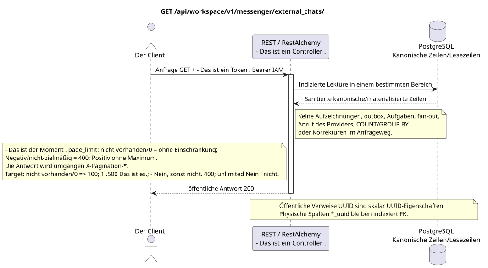

# Liste der externen Chats

[← Hauptindex der Dokumentation](../../../../index.md) ·
[Index der Abfolge-Diagramme](../../README.md) ·
[Abschnitt Außenintegration und Ausführungszeit](../README.md)

`GET /api/workspace/v1/messenger/external_chats/`

Das gesäuberte Chat-Katalog des Providers und den Zustand des Eigentümers auflisten.



[Ausgangsgestalt , die bearbeitet werden kann PlantUML](diagrams/get_external_chats.puml)

## Anfrage

Abfrage-Parametervertrag:

- - Das ist Pflicht . `external_account_uuid`
- `page_limit`
- `page_marker` (UUID Der letzte Chat)

Verhalten `page_limit` in der aktuellen Implementierung: fehlende Parameter oder `0` bedeutet
Eine unbegrenzte Auswahl; ein negativer oder nicht ganzheitlicher Wert gibt HTTP `400`;
Jeder positive Wert wird ohne Maximum und ohne Einschränkung angewendet
Die Umschreibung von `ExternalResourceController` umgeht
Standardüberschriften `X-Pagination-*`. Target policy: fehlen/`0` => `100`; `1..500` wird genau angenommen; negativ, nicht vollständig und `>500` => HTTP `400` ohne Clamp. Unbounded mode fehlt; der Client für den vollständigen Export geht vor der fehlenden nächsten marker.

Der Körper ist weg. JSON.

## Eine erfolgreiche Antwort

HTTP `200`:

```json
[
  {
    "uuid": "26f4907e-d181-4b7b-bdac-cc9685d37c40",
    "external_account_uuid": "0d4ae1d0-30ad-4d15-bf26-5789e8406201",
    "source": {
      "kind": "zulip",
      "chat_type": "channel",
      "original_url": "https://zulip.example.invalid/#narrow/channel/42"
    },
    "display_name": "Engineering",
    "selected": true,
    "project_id": "00000000-0000-4000-8000-000000000001",
    "history_depth": "30_days",
    "projection_stream_uuid": "8ce8c018-4c4f-4f48-9bb7-9d95ce6d5d91",
    "status": "live",
    "capabilities": {},
    "safe_error": null,
    "transition_pending": false,
    "revision": 4,
    "created_at": "2026-07-17T11:05:00Z",
    "updated_at": "2026-07-17T12:05:00Z"
  }
]
```

## Fehler

| HTTP | Verhalten in der Öffentlichkeit |
| --- | --- |
| `400` | Für nicht zulässige Pfadwerte, Anfrageparameter oder Körper wird ein Standard-Validierungsfehler verwendet RESTAlchemy. |

Beispiel für Validierungsfehler:

```json
{
  "type": "ValidationErrorException",
  "code": 400,
  "message": "Validation error occurred."
}
```

## Grenze RestAlchemy

Ziel-Ressource-/Kontrollanzeige (Angebotsdokumentation, nicht Produktionscode)):

```python
class ExternalChat(models.ModelWithUUID, models.ModelWithTimestamp, orm.SQLStorableMixin):
    __tablename__ = "m_external_chats_v2"

    external_account_uuid = properties.property(types.UUID(), required=True)
    source = properties.property(EXTERNAL_CHAT_SOURCE_TYPE, required=True)
    project_id = properties.property(types.AllowNone(types.UUID()), default=None)
    projection_stream_uuid = properties.property(types.AllowNone(types.UUID()), read_only=True)
    selected = properties.property(types.Boolean(), default=False)
    revision = properties.property(types.Integer(min_value=1), read_only=True)


class ExternalChatController(controllers.BaseResourceControllerPaginated):
    __resource__ = resources.ResourceByRAModel(ExternalChat)
    # Owner/account scope and narrow select/deselect/move actions only.
```

`external_account_uuid`, `project_id` und `projection_stream_uuid` sind skalare UUID-Eigenschaften. Für die entsprechenden indexierten physischen Spalten werden `external_account_uuid -> external_account ON DELETE CASCADE`, `project_id -> project registry ON DELETE RESTRICT` und ein zulässiger `null` `projection_stream_uuid -> STREAM ON DELETE SET NULL` verwendet. Öffentliche Anzeigen RestAlchemy verwenden `relationships.relationship` nicht für JSON in der Form UUID, weil das Verhältnis als URI serialisiert wird. An der Grenze des physischen Schemas ist jede kanonische nichtpolymorphe Verbindung `*_uuid` ein indexierter externer Schlüssel mit einer eindeutig ausgewählten Verweisungsaktion..

## Synchrone Transaktion

1. Authentifizieren der Anfrage und definieren des Projekt-/Benutzereignisses IAM.
2. Überprüfen Sie den Weg, die Anfrage-Parameter und die erforderliche Berechtigung.
3. Führen Sie ein Indexlesen durch , wobei der Bereich aus der kanonischen Zeile oder der vormaterialierten Leseboden gespeichert wird.
4. Nur gesundheitsschützende öffentliche Felder serialisieren.

Eine Lesetransaction schreibt keinen Domain-Outbox, eine typische Projektionsvorgabe, einen gewünschten Statusbefehl oder ein bereites öffentliches Ereignis auf. Während der Anfrage führt sie keine `COUNT`, `GROUP BY`, korrelierte Unteranfrage, Fan-out-Bindung, Provider-Aufruf oder Cache-Feststellung aus.

## Hintergrundbearbeitung, Ereignisse und Übereinstimmung

Typisierte Projektionsvorgaben: keine.

Für diese Operation wird kein öffentliches Ereignis Workspace erstellt, so dass der einzelne Dispatcher WebSocket nichts zu liefern hat.

Absprache, die dem Kunden sichtbar ist: keine zusätzliche Verzögerung; die Antwort ist ein autoritatives festgehaltenes Bild.

## Idempotenz und Parallelismus

UUID Der Chat ist stabil; die Bestimmung wird im Chat-/Accountbereich serialisiert. Die UUID-Felder des Projektes/Flusses sind die indexierten externen Schlüssel, nicht die öffentlichen URI-Beziehungen.

Die Wiederholungen verwenden stabile Geschäftsschlüssel und den aktuellen Ausgangszustand. Jedes immutable outbox event erstellt eine separate task mit einem einzigartigen `outbox_event_uuid`; die Wiederholung dieser task muss idempotent sein, coalescing fehlt. Die monopolistische Verarbeitung des Themas Messenger von neuen Eintragungen zu den alten wird nur dann angewendet, wenn die betroffene kanonische Platzierung tatsächlich auf `(project_id, topic_uuid)` bezieht; Provider-Administration/Leseoperationen erstellen kein künstliches Thema und gehören nicht zu dieser Schlange.

## Die Quellen

- [`workspace_api.md`](../../../../workspace_api.md) — Autoritätreiche öffentliche Routen, allgemeine JSON, Pagination, Ereignisse und Vertrag WebSocket.
- [`zulip_bridge_v1_product_and_api.md`](../../../../zulip_bridge_v1_product_and_api.md) — gesundheitsschützender Lebenszyklus von externen Ressourcen, Berechtigungen und Provider-Semantik.

[← Hauptindex der Dokumentation](../../../../index.md) ·
[Index der Abfolge-Diagramme](../../README.md) ·
[Abschnitt Außenintegration und Ausführungszeit](../README.md)
