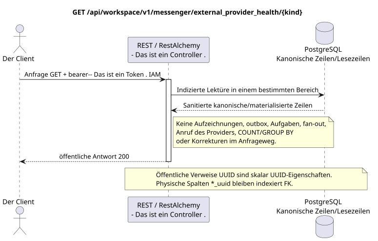

# Der Gesundheitszustand des externen Providers zu erhalten

[← Hauptindex der Dokumentation](../../../../index.md) ·
[Index der Abfolge-Diagramme](../../README.md) ·
[Abschnitt Außenintegration/runtime](../README.md)

`GET /api/workspace/v1/messenger/external_provider_health/{kind}`

Lesen Sie die gesundheitsgesundheitsgesunde Gesamtheit der Brücken, Accounts, Chats und Operationen für eine Providerart.



[Ausgangsgestalt , die bearbeitet werden kann PlantUML](diagrams/get_external_provider_health.puml)

## Anfrage

Es gibt keine weiteren Anforderungsparameter außer den oben genannten Variablen..

Der Körper ist weg. JSON.

## Eine erfolgreiche Antwort

HTTP `200`:

```json
{
  "provider": "zulip",
  "status": "healthy",
  "account_counts": {
    "live": 2
  },
  "chat_counts": {
    "live": 12
  },
  "bridge_counts": {
    "active": 1
  },
  "operation_counts": {
    "queued": 1,
    "failed": 0
  },
  "metrics": {
    "queue_depth": 1,
    "selected_chats": 12,
    "synchronized_messages": 4800,
    "synchronized_users": 93
  },
  "updated_at": "2026-07-17T12:12:30Z"
}
```

## Fehler

| HTTP | Verhalten in der Öffentlichkeit |
| --- | --- |
| `403` | `workspace.external_provider_health.read` ist nicht zugelassen oder die Ressource befindet sich außerhalb des autorisierten Bereichs. |
| `400` | Für nicht zulässige Pfadwerte, Anfrageparameter oder Körper wird ein Standard-Validierungsfehler verwendet RESTAlchemy. |

Beispiel für Validierungsfehler:

```json
{
  "type": "ValidationErrorException",
  "code": 400,
  "message": "Validation error occurred."
}
```

## Grenze RestAlchemy

Ziel-Ressource-/Kontrollanzeige (Angebotsdokumentation, nicht Produktionscode)):

```python
class ExternalProviderHealth(models.Model, orm.SQLStorableMixin):
    # Worker-maintained physical projection; public controller is read-only.
    __tablename__ = "m_external_provider_health_state_v1"

    provider = properties.property(types.Enum(PROVIDER_KINDS), required=True)
    status = properties.property(types.String(), read_only=True)
    account_counts = properties.property(types.Dict(), read_only=True)
    chat_counts = properties.property(types.Dict(), read_only=True)
    bridge_counts = properties.property(types.Dict(), read_only=True)
    operation_counts = properties.property(types.Dict(), read_only=True)
    metrics = properties.property(types.Dict(), read_only=True)
    updated_at = properties.property(types.UTCDateTimeZ(), read_only=True)

    @classmethod
    def get_id_property(cls) -> dict[str, typing.Any]:
        return {"provider": cls.properties.properties["provider"]}


class ExternalProviderHealthController(controllers.BaseResourceController):
    __resource__ = resources.ResourceByRAModel(ExternalProviderHealth)
    # GET by provider kind reads one pre-materialized row; writes are worker-only.
```

Die physische Projektion enthält eine Zeile pro Anbieter-Auftritt, und`provider`Der Public Controller wird nicht von einem anderen Controller verwendet, sondern ist gleichzeitig seine einzigartige technische Identität und der öffentliche Schlüssel des Weges. Der Hintergrundworker ersetzt diese Zeile impotent aus dem festgelegten Ausgangszustand. Der öffentliche Controller aggregiert niemals Konten, Chats, Brücken, Operationen, Nachrichten oder Benutzer während der Anfrage. Zählerkarten/Metriken enthalten keine Ressourcenbeziehungen oder externen LinksUUID- öffentliche AnzeigenRestAlchemySie benutzen sie nicht .`relationships.relationship`Für ...JSON- Das ist die Form .UUID, weil Beziehung alsURI. Sanitizer verbergen Besitzer, Account, Roh-ID-Anbieter, geheime Zertifikate, interne Adresse und Roh-Protokollfelder.

## Synchrone Transaktion

1. Authentifizieren der Anfrage und definieren des Projekt-/Benutzereignisses IAM.
2. Überprüfen Sie den Weg, die Anfrage-Parameter und die erforderliche Berechtigung.
3. Führen Sie ein Indexlesen durch , wobei der Bereich aus der kanonischen Zeile oder der vormaterialierten Leseboden gespeichert wird.
4. Nur gesundheitsschützende öffentliche Felder serialisieren.

Eine Lesetransaction schreibt keinen Domain-Outbox, eine typische Projektionsvorgabe, einen gewünschten Statusbefehl oder ein bereites öffentliches Ereignis auf. Während der Anfrage führt sie keine `COUNT`, `GROUP BY`, korrelierte Unteranfrage, Fan-out-Bindung, Provider-Aufruf oder Cache-Feststellung aus.

## Hintergrundbearbeitung, Ereignisse und Übereinstimmung

Typisierte Projektionsvorgaben: keine.

Für diese Operation wird kein öffentliches Ereignis Workspace erstellt, so dass der einzelne Dispatcher WebSocket nichts zu liefern hat.

Konsistenz, die dem Kunden sichtbar ist: Die Antwort liest die letzte vormaterialierte Gesundheitsprojektion und stimmt sich absichtlich schließlich mit dem Herzschlag und den Schlangen ab.

## Idempotenz und Parallelismus

Für jede Art von Provider gibt es eine materialisierte Projektion..

Die Wiederholungen verwenden stabile Geschäftsschlüssel und den aktuellen Ausgangszustand. Jedes immutable outbox event erstellt eine separate task mit einem einzigartigen `outbox_event_uuid`; die Wiederholung dieser task muss idempotent sein, coalescing fehlt. Die monopolistische Verarbeitung des Themas Messenger von neuen Eintragungen zu den alten wird nur dann angewendet, wenn die betroffene kanonische Platzierung tatsächlich auf `(project_id, topic_uuid)` bezieht; Provider-Administration/Leseoperationen erstellen kein künstliches Thema und gehören nicht zu dieser Schlange.

## Die Quellen

- [`workspace_api.md`](../../../../workspace_api.md) — Autoritätreiche öffentliche Routen, allgemeine JSON, Pagination, Ereignisse und Vertrag WebSocket.
- [`zulip_bridge_v1_product_and_api.md`](../../../../zulip_bridge_v1_product_and_api.md) — gesundheitsschützender Lebenszyklus von externen Ressourcen, Berechtigungen und Provider-Semantik.

[← Hauptindex der Dokumentation](../../../../index.md) ·
[Index der Abfolge-Diagramme](../../README.md) ·
[Abschnitt Außenintegration/runtime](../README.md)
