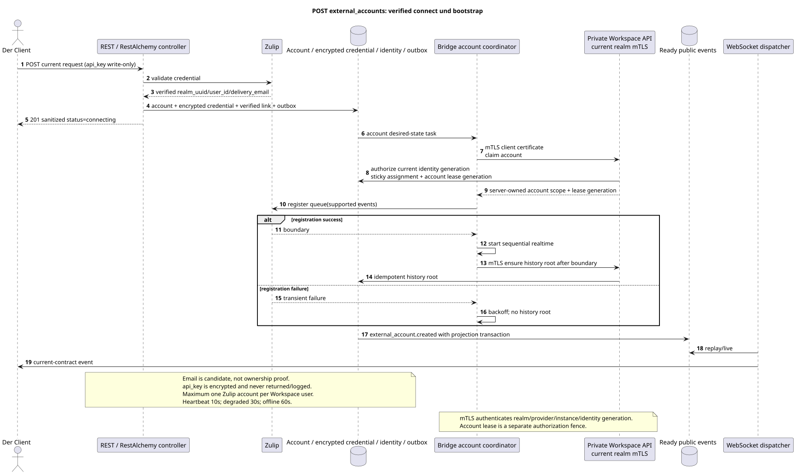

# Erstellen eines externen Kontos

[← Hauptindex der Dokumentation](../../../../index.md) ·
[Index der Abfolge-Diagramme](../../README.md) ·
[Abschnitt Außenintegration/runtime](../README.md)

`POST /api/workspace/v1/messenger/external_accounts/`

Erstellen und überprüfen Sie ein providerneutrales Konto mit einem erstellten Client UUID und nur für das Schreiben zugänglichen Konten.



[Ausgangsgestalt , die bearbeitet werden kann PlantUML](diagrams/post_external_accounts.puml)

## Anfrage

Es gibt keine weiteren Anforderungsparameter außer den oben genannten Variablen..

```json
{
  "uuid": "0d4ae1d0-30ad-4d15-bf26-5789e8406201",
  "settings": {
    "kind": "zulip",
    "server_url": "https://zulip.example.invalid",
    "email": "owner@example.invalid",
    "api_key": "write-only",
    "selection_mode": "explicit",
    "history_depth": "30_days",
    "default_project_id": "00000000-0000-4000-8000-000000000001"
  }
}
```

## Eine erfolgreiche Antwort

HTTP `201`:

```json
{
  "uuid": "0d4ae1d0-30ad-4d15-bf26-5789e8406201",
  "settings": {
    "kind": "zulip",
    "server_url": "https://zulip.example.invalid",
    "email": "owner@example.invalid",
    "selection_mode": "explicit",
    "history_depth": "30_days",
    "default_project_id": "00000000-0000-4000-8000-000000000001"
  },
  "credential_present": true,
  "status": "connecting",
  "live_ready": false,
  "safe_error": null,
  "capabilities": {},
  "desired_generation": 1,
  "applied_generation": 0,
  "last_progress_at": null,
  "created_at": "2026-07-17T11:00:00Z",
  "updated_at": "2026-07-17T11:00:00Z",
  "revision": 1
}
```

Die Antworten der Reviereinrichtungen enthalten strenge `ETag: "<revision>"`.

## Fehler

| HTTP | Verhalten in der Öffentlichkeit |
| --- | --- |
| `403` | `workspace.external_account.create` ist nicht zugelassen oder die Ressource befindet sich außerhalb des autorisierten Bereichs. |
| `409` | `ExternalAccountConflictError`: Der Eigentümer hat bereits einen Account für diese Art von Provider. |
| `400` | Für nicht zulässige Pfadwerte, Anfrageparameter oder Körper wird ein Standard-Validierungsfehler verwendet RESTAlchemy. |

Beispiel für Validierungsfehler:

```json
{
  "type": "ValidationErrorException",
  "code": 400,
  "message": "Validation error occurred."
}
```

## Grenze RestAlchemy

Ziel-Ressource-/Kontrollanzeige (Angebotsdokumentation, nicht Produktionscode)):

```python
class ExternalAccount(models.ModelWithUUID, models.ModelWithTimestamp, orm.SQLStorableMixin):
    __tablename__ = "m_external_accounts_v2"

    owner_user_uuid = properties.property(types.UUID(), required=True)
    settings = properties.property(EXTERNAL_ACCOUNT_SETTINGS_TYPE, required=True)
    status = properties.property(types.Enum(ACCOUNT_STATUSES), read_only=True)
    capabilities = properties.property(types.Dict(), read_only=True)
    revision = properties.property(types.Integer(min_value=1), read_only=True)


class ExternalAccountController(controllers.BaseResourceControllerPaginated):
    __resource__ = resources.ResourceByRAModel(
        ExternalAccount, hidden_fields=["owner_user_uuid"]
    )
```

`owner_user_uuid` verborgen; öffentliche `settings.default_project_id` ist eine skalare UUID-Eigenschaft. Im Ziellager verweist die indizierte `owner_user_uuid` auf den Benutzer Workspace mit `ON DELETE CASCADE`, und die extrahierte indizierte `default_project_uuid`  auf die Projektregister mit `ON DELETE RESTRICT`; bei der Serialisierung ist die letzte noch in `settings` eingebettet. Öffentliche Anzeigen RestAlchemy verwenden nicht `relationships.relationship` für JSON in der Form UUID, weil die Beziehung (relationship) als URI serialisiert wird. An der Grenze der physischen Schema ist jede kanonische nichtpolymorphe Verbindung `*_uuid` ein indizierter externer Schlüssel mit einer eindeutig ausgewählten Verweisungsfunktion. Die Sanitäre verbergen den Besitzer, die Daten, die Provider-ID, die private Zertifikatsadresse, die interne Protokoll- und Quellfläche.

## Synchrone Transaktion

1. Authentifizieren Sie die Anfrage, definieren Sie den Bereich, überprüfen Sie die Auflösung/Body und finden Sie die kanonische Zeile für den indizierten Schlüssel.
2. Vor der Eingabe überprüfen Sie die Zulip -Zugriffsnummer und erhalten Sie verified realm UUID,
   provider user ID und `delivery_email`; normalized email bleibt candidate, nicht
   - Das ist ein Beweis. ownership.
3. In einer Transaktion einfügen account, encrypted credential envelope, atomic
   verified identity link, desired-state record und immutable outbox.
4. Nach dem Commit eine Antwort zurückgeben; die weitere Bootstrap-Warteschlange wird außerhalb dieser Warteschlange ausgeführt
   Transaktionen nach einem einzigen Algorithmus connect/reconnect.

## Hintergrundbearbeitung, Ereignisse und Übereinstimmung

Typisierte `delivery_snapshot_event` bedient exact external-account
scope; topic task Der Status wird ohne Placement nicht verfügbar.
wird durch eine separate , stabile Warteschlange ausgeführt control plane.

Der Hintergrund-Handler in einer DB-Transaktion erfasst den materialisierten Zustand und den fertig gestellten Umschlag des vollständigen Bildes `external_account.created`; beide Effekte von commit oder rollback zusammen. Nach dem commit sendet, wiederholt und spielt ein separater Manager WebSocket ihn aus; API/worker besitzt keine Clientverbindungen.

Vereinbarkeit, die dem Kunden sichtbar ist: Die Zeile der Kontoaufzeichnung wird sofort mit dem Status `connecting` festgehalten; Brückeprüfung, Erkennung, angewandte Generation, Live-Readiness und Möglichkeiten überschneiden sich asynchron.

Nach commit Workspace gibt sticky scheduler einen healthy compatible Bridge mit
Minimal normalized load; Instanz erhält whole-account lease, registriert
eine neue Zulip-Warteschlange nur für supported events, startet sequential realtime und
Sie können die Daten aus dem Programm auswählen, und dann die History-Root-Aufgabe erstellen. registration boundary.
Alle Bridge→Workspace Anrufe verwenden den aktuellen private
`workspace-external-bridge-api` mit realm-bound mTLS certificate; certificate
identity Die aktuelle Instanzgeneration wird vor der separaten account
assignment/lease authorization. Enrollment secret oder Zulip `api_key` nicht
als ständige verwendet werden S2S credential.
Einzelheiten: [`zulip_bridge/account_lifecycle_and_identity.md`](../../../../zulip_bridge/account_lifecycle_and_identity.md).

## Idempotenz und Parallelismus

UUID Das Konto wird vom Kunden beim Erstellen erstellt; Business-Unikum erlaubt nur ein Konto .`(owner_user_uuid, provider_kind)`. Der Verschlüsselungstext der Zähldaten wird separat gespeichert und niemals serialisiert.

Die Wiederholungen verwenden stabile Geschäftsschlüssel und den aktuellen Ausgangszustand. Jedes immutable outbox event erstellt eine separate task mit einem einzigartigen `outbox_event_uuid`; die Wiederholung dieser task muss idempotent sein, coalescing fehlt. Die monopolistische Verarbeitung des Themas Messenger von neuen Eintragungen zu den alten wird nur dann angewendet, wenn die betroffene kanonische Platzierung tatsächlich auf `(project_id, topic_uuid)` bezieht; Provider-Administration/Leseoperationen erstellen kein künstliches Thema und gehören nicht zu dieser Schlange.

## Die Quellen

- [`workspace_api.md`](../../../../workspace_api.md) — Autoritätreiche öffentliche Routen, allgemeine JSON, Pagination, Ereignisse und Vertrag WebSocket.
- [`zulip_bridge_v1_product_and_api.md`](../../../../zulip_bridge_v1_product_and_api.md) — gesundheitsschützender Lebenszyklus von externen Ressourcen, Berechtigungen und Provider-Semantik.

[← Hauptindex der Dokumentation](../../../../index.md) ·
[Index der Abfolge-Diagramme](../../README.md) ·
[Abschnitt Außenintegration/runtime](../README.md)
