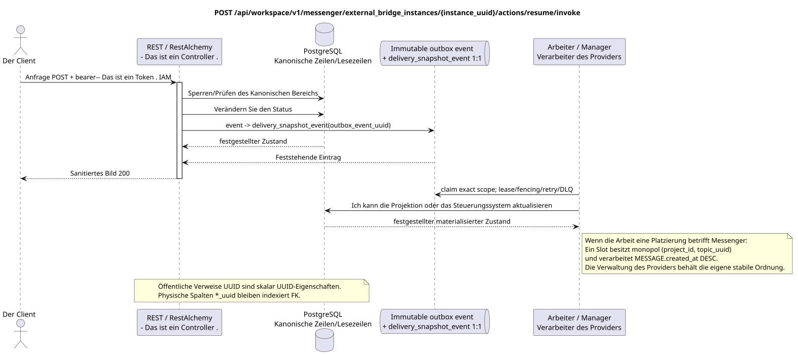

# Wiederholung der Arbeit des Exemplars der Außenbrücke

[← Hauptindex der Dokumentation](../../../../index.md) ·
[Index der Abfolge-Diagramme](../../README.md) ·
[Abschnitt Außenintegration/runtime](../README.md)

`POST /api/workspace/v1/messenger/external_bridge_instances/{instance_uuid}/actions/resume/invoke`

Wieder aufnehmen einer ausgesetzten, aber nicht zurückgerufenen Identität.



[Ausgangsgestalt , die bearbeitet werden kann PlantUML](diagrams/post_external_bridge_instance_resume.puml)

> Die nun generierte OpenAPI gibt die Antwort auf diese Aktion falsch als `ExternalOperation_Get` an. Das Verhalten des Runtime-Controllers und der dazugehörige öffentliche Vertrag geben eine aktualisierte Ressource dieser Endpunktfamilie zurück. Diese Dokumentation behält die öffentliche Runtime-Grenze; die Behebung der generierten OpenAPI geht nur in der Dokumentation über diese Aufgabe hinaus. (docs-only).

## Anfrage

Es gibt keine weiteren Anforderungsparameter außer den oben genannten Variablen..

Der Körper ist weg. JSON.

## Eine erfolgreiche Antwort

HTTP `200`:

```json
{
  "uuid": "6dd6741b-0d90-490a-8e51-749a411be1ad",
  "provider": "zulip",
  "identity_generation": 3,
  "status": "active",
  "capabilities": {},
  "last_heartbeat_at": "2026-07-17T12:11:00Z",
  "certificate_not_after": "2026-10-17T12:00:00Z",
  "safe_error": null,
  "revision": 9,
  "created_at": "2026-07-01T09:00:00Z",
  "updated_at": "2026-07-17T12:11:00Z"
}
```

## Fehler

| HTTP | Verhalten in der Öffentlichkeit |
| --- | --- |
| `403` | `workspace.external_bridge_instance.resume` ist nicht zugelassen oder die Ressource befindet sich außerhalb des autorisierten Bereichs. |
| `404` | Die Ressource in dem angegebenen Bereich existiert nicht oder ist nicht sichtbar. |
| `403` | Keine spezielle Genehmigung oder der Wechsel ist verboten (z.B. Wiederaufnahme/Stopp nach Rückruf)). |
| `400` | Für nicht zulässige Pfadwerte, Anfrageparameter oder Körper wird ein Standard-Validierungsfehler verwendet RESTAlchemy. |

Beispiel für Validierungsfehler:

```json
{
  "type": "ValidationErrorException",
  "code": 400,
  "message": "Validation error occurred."
}
```

## Grenze RestAlchemy

Ziel-Ressource-/Kontrollanzeige (Angebotsdokumentation, nicht Produktionscode)):

```python
class ExternalBridgeInstance(models.ModelWithUUID, models.ModelWithTimestamp, orm.SQLStorableMixin):
    __tablename__ = "m_external_bridge_instances_v2"

    provider = properties.property(types.Enum(PROVIDER_KINDS), required=True)
    identity_generation = properties.property(types.Integer(min_value=1), required=True)
    status = properties.property(types.Enum(BRIDGE_STATUSES), read_only=True)
    capabilities = properties.property(types.Dict(), read_only=True)
    revision = properties.property(types.Integer(min_value=1), read_only=True)


class ExternalBridgeInstanceController(controllers.BaseResourceControllerPaginated):
    __resource__ = resources.ResourceByRAModel(ExternalBridgeInstance)
    # Dedicated IAM permission checks wrap standard indexed reads/actions.
```

UUID der Ressource ist sein skalarer Primärschlüssel; Provider-Art  Streckenschlüssel des Weges/Domänen. In dieser öffentlichen Form gibt es keinen InteressensverweisUUIDDie Anzeige ist für alle öffentlich zugänglich .RestAlchemySie benutzen sie nicht .`relationships.relationship`Für ...JSON- Das ist die Form .UUID, weil Beziehung alsURI- An der Grenze der physikalischen Schaltung ist jede kanonische nicht-polymorphe Verbindung .`*_uuid`ist ein indexierter externer Schlüssel mit einer eindeutig ausgewählten Verweisungsaktion. Sanitizer verbergen den Besitzer, die Anmeldeinformationen, die rohe Provider-ID, das geschlossene Zertifikat, die interne Adresse und die rohen Protokollfelder.

## Synchrone Transaktion

1. Authentifizieren Sie die Anfrage, definieren Sie den Bereich, überprüfen Sie die Auflösung/Body und finden Sie die kanonische Zeile für den indizierten Schlüssel.
2. Sperren Sie die Bridge-Instanz; Verwenden Sie den `resume`-Zustandsschritt und die Revisions-/Generierungsregel; Schreiben Sie einen unveränderlichen Domain-Outbox-Eintrag; Verwalten Sie die Transaktion.
3. Antwort erst zurückgeben , wenn die Transaktion festgehalten wurde; Netzwerk-Zustellung wird nie innerhalb der Transaktion ausgeführt.

## Hintergrundbearbeitung, Ereignisse und Übereinstimmung

Typisierte `delivery_snapshot_event` bedient exact bridge-instance
scope; topic task Es gibt keine Placement-Lösung.
Vor jeder Anfrage überprüft die Identität erneut.

Für diese Operation wird kein öffentliches Ereignis Workspace erstellt, so dass der einzelne Dispatcher WebSocket nichts zu liefern hat.

Absprache, die dem Kunden sichtbar ist: Administrative Status gilt nach Feststellung. Der Gesundheitszustand/die Fähigkeit, die aus dem Herzschlag gewonnen wurde, kann später aktualisiert werden; öffentliche Ansicht des Ereignisses der Brücke ist nicht registriert.

## Idempotenz und Parallelismus

UUID Die Rückmeldung ist für die aktive Generation unwiderruflich und potent..

Die Wiederholungen verwenden stabile Geschäftsschlüssel und den aktuellen Ausgangszustand. Jedes immutable outbox event erstellt eine separate task mit einem einzigartigen `outbox_event_uuid`; die Wiederholung dieser task muss idempotent sein, coalescing fehlt. Die monopolistische Verarbeitung des Themas Messenger von neuen Eintragungen zu den alten wird nur dann angewendet, wenn die betroffene kanonische Platzierung tatsächlich auf `(project_id, topic_uuid)` bezieht; Provider-Administration/Leseoperationen erstellen kein künstliches Thema und gehören nicht zu dieser Schlange.

## Die Quellen

- [`workspace_api.md`](../../../../workspace_api.md) — Autoritätreiche öffentliche Routen, allgemeine JSON, Pagination, Ereignisse und Vertrag WebSocket.
- [`zulip_bridge_v1_product_and_api.md`](../../../../zulip_bridge_v1_product_and_api.md) — gesundheitsschützender Lebenszyklus von externen Ressourcen, Berechtigungen und Provider-Semantik.

[← Hauptindex der Dokumentation](../../../../index.md) ·
[Index der Abfolge-Diagramme](../../README.md) ·
[Abschnitt Außenintegration/runtime](../README.md)
