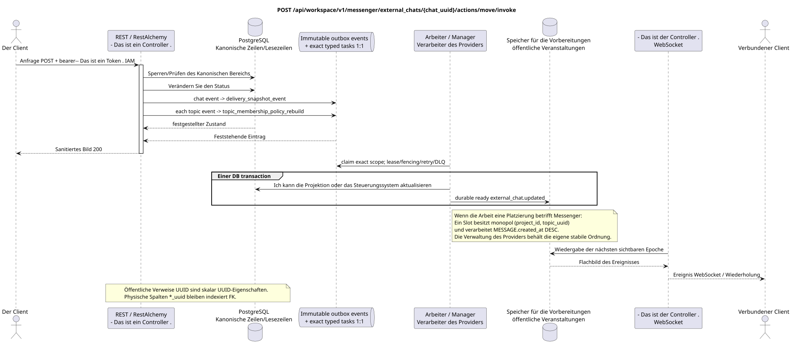

# Die Vorführung des externen Chats verschieben

[← Hauptindex der Dokumentation](../../../../index.md) ·
[Index der Abfolge-Diagramme](../../README.md) ·
[Abschnitt Außenintegration/runtime](../README.md)

`POST /api/workspace/v1/messenger/external_chats/{chat_uuid}/actions/move/invoke`

Die ausgewählte Projektion in ein anderes Projekt automatisch verschieben, wobei die Ressourcen stabil bleiben UUID.



[Ausgangsgestalt , die bearbeitet werden kann PlantUML](diagrams/post_external_chat_move.puml)

## Anfrage

Es gibt keine weiteren Anforderungsparameter außer den oben genannten Variablen..

Titel zusätzlich zum Bearer-Token:

- `If-Match: "<revision>"` - Das ist obligatorisch .

```json
{
  "project_id": "00000000-0000-4000-8000-000000000001"
}
```

## Eine erfolgreiche Antwort

HTTP `200`:

```json
{
  "uuid": "26f4907e-d181-4b7b-bdac-cc9685d37c40",
  "external_account_uuid": "0d4ae1d0-30ad-4d15-bf26-5789e8406201",
  "source": {
    "kind": "zulip",
    "chat_type": "channel",
    "original_url": "https://zulip.example.invalid/#narrow/channel/42"
  },
  "display_name": "Engineering",
  "selected": true,
  "project_id": "00000000-0000-4000-8000-000000000001",
  "history_depth": "30_days",
  "projection_stream_uuid": "8ce8c018-4c4f-4f48-9bb7-9d95ce6d5d91",
  "status": "syncing",
  "capabilities": {},
  "safe_error": null,
  "transition_pending": false,
  "revision": 4,
  "created_at": "2026-07-17T11:05:00Z",
  "updated_at": "2026-07-17T12:05:00Z"
}
```

Die Antworten der Reviereinrichtungen enthalten strenge `ETag: "<revision>"`.

## Fehler

| HTTP | Verhalten in der Öffentlichkeit |
| --- | --- |
| `404` | Die Ressource in dem angegebenen Bereich existiert nicht oder ist nicht sichtbar. |
| `428` | Nicht vorhanden `If-Match`. |
| `412` | Die Revision stimmt nicht überein. |
| `409` | `ExternalProjectionMoveConflictError`, Während die Angabe des Lesenproviders ausgeführt wird. |
| `400` | Für nicht zulässige Pfadwerte, Anfrageparameter oder Körper wird ein Standard-Validierungsfehler verwendet RESTAlchemy. |

Beispiel für Validierungsfehler:

```json
{
  "type": "ValidationErrorException",
  "code": 400,
  "message": "Validation error occurred."
}
```

## Grenze RestAlchemy

Ziel-Ressource-/Kontrollanzeige (Angebotsdokumentation, nicht Produktionscode)):

```python
class ExternalChat(models.ModelWithUUID, models.ModelWithTimestamp, orm.SQLStorableMixin):
    __tablename__ = "m_external_chats_v2"

    external_account_uuid = properties.property(types.UUID(), required=True)
    source = properties.property(EXTERNAL_CHAT_SOURCE_TYPE, required=True)
    project_id = properties.property(types.AllowNone(types.UUID()), default=None)
    projection_stream_uuid = properties.property(types.AllowNone(types.UUID()), read_only=True)
    selected = properties.property(types.Boolean(), default=False)
    revision = properties.property(types.Integer(min_value=1), read_only=True)


class ExternalChatController(controllers.BaseResourceControllerPaginated):
    __resource__ = resources.ResourceByRAModel(ExternalChat)
    # Owner/account scope and narrow select/deselect/move actions only.
```

`external_account_uuid`, `project_id` und `projection_stream_uuid` sind skalare UUID-Eigenschaften. Für die entsprechenden indexierten physikalischen Spalten werden `external_account_uuid -> external_account ON DELETE CASCADE`, `project_id -> project registry ON DELETE RESTRICT` und ein zulässiger `null` `projection_stream_uuid -> STREAM ON DELETE SET NULL` verwendet. Öffentliche Anzeigen RestAlchemy verwenden `relationships.relationship` nicht für JSON in der Form UUID, weil die Beziehung (relationhip) als URI serialisiert wird. An der Grenze des physikalischen Schemas ist jede kanonische nichtpolymorphe Verbindung `*_uuid` ein indexierter externer Schlüssel mit einer eindeutig ausgewählten Verweisungsaktion. Sanitizer verbergen den Besitzer, die Konten, die Roh-Provider-ID, das geschlossene Zertifikat, die interne Adresse und die rohen Protokollfelder.

## Synchrone Transaktion

1. Authentifizieren Sie die Anfrage, definieren Sie den Bereich, überprüfen Sie die Auflösung/Body und finden Sie die kanonische Zeile für den indizierten Schlüssel.
2. Blockieren Sie die Revision des Chats und die alte/neue Bestimmung des Projekts; verweigern Sie die parallele Bereitstellung von Lesen des Providers; Atomisch hinzufügen Kanonische Umschaltungsübergang, gewünschter Zustand und unveränderlicher outbox.
3. Antwort erst zurückgeben , wenn die Transaktion festgehalten wurde; Netzwerk-Zustellung wird nie innerhalb der Transaktion ausgeführt.

## Hintergrundbearbeitung, Ereignisse und Übereinstimmung

Typisierte Aufgaben: Einzel `topic_membership_policy_rebuild` für alte und
neue Themen und `delivery_snapshot_event` für external-chat state/event, jede mit
mit der source outbox event; request path kann nicht Fan-out oder Aggregat-Scan ausführen.

Der Hintergrund-Handler in einer DB-Transaktion erfasst den materialisierten Zustand und den fertig gestellten Umschlag des vollständigen Bildes `external_chat.updated`; beide Effekte von commit oder rollback zusammen. Nach dem commit sendet, wiederholt und spielt ein separater Manager WebSocket ihn aus; API/worker besitzt keine Clientverbindungen.

Übereinstimmung, die dem Kunden sichtbar ist: Die Bestimmungsschwankung kann warten, bis die Projektionen des alten/neuen Projekts zusammenkommen; stabile öffentliche UUID Chats/Entitäten werden erhalten.

## Idempotenz und Parallelismus

UUID Der Chat ist stabil; die Bestimmung wird im Chat-/Accountbereich serialisiert. Die UUID-Felder des Projektes/Flusses sind die indexierten externen Schlüssel, nicht die öffentlichen URI-Beziehungen (relationship).

Die Wiederholungen verwenden stabile Geschäftsschlüssel und den aktuellen Ausgangszustand. Jedes immutable outbox event erstellt eine separate task mit einem einzigartigen `outbox_event_uuid`; die Wiederholung dieser task muss idempotent sein, coalescing fehlt. Die monopolistische Verarbeitung des Themas Messenger von neuen Eintragungen zu den alten wird nur dann angewendet, wenn die betroffene kanonische Platzierung tatsächlich auf `(project_id, topic_uuid)` bezieht; Provider-Administration/Leseoperationen erstellen kein künstliches Thema und gehören nicht zu dieser Schlange.

## Die Quellen

- [`workspace_api.md`](../../../../workspace_api.md) — Autoritätreiche öffentliche Routen, allgemeine JSON, Pagination, Ereignisse und Vertrag WebSocket.
- [`zulip_bridge_v1_product_and_api.md`](../../../../zulip_bridge_v1_product_and_api.md) — gesundheitsschützender Lebenszyklus von externen Ressourcen, Berechtigungen und Provider-Semantik.

[← Hauptindex der Dokumentation](../../../../index.md) ·
[Index der Abfolge-Diagramme](../../README.md) ·
[Abschnitt Außenintegration/runtime](../README.md)
