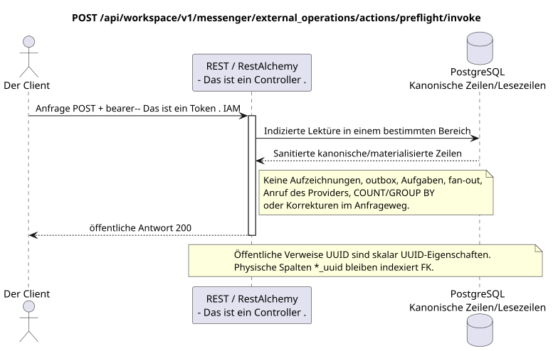

# Vorprüfung der Außenoperation

[← Hauptindex der Dokumentation](../../../../index.md) ·
[Index der Abfolge-Diagramme](../../README.md) ·
[Abschnitt Außenintegration/runtime](../README.md)

`POST /api/workspace/v1/messenger/external_operations/actions/preflight/invoke`

Überprüfen Sie die Anbieteranzeige, die effektive Möglichkeit und den Verlust der Umwandlung bis zur kanonischen Ausgangsänderung.



[Ausgangsgestalt , die bearbeitet werden kann PlantUML](diagrams/post_external_operation_preflight.puml)

## Anfrage

Es gibt keine weiteren Anforderungsparameter außer den oben genannten Variablen..

```json
{
  "external_account_uuid": "0d4ae1d0-30ad-4d15-bf26-5789e8406201",
  "action": "message.create",
  "target": {
    "type": "message",
    "uuid": "a93dca35-3061-4748-bda4-7f6f8c660ea5"
  }
}
```

## Eine erfolgreiche Antwort

HTTP `200`:

```json
{
  "allowed": true,
  "action": "message.create",
  "target": {
    "type": "message",
    "uuid": "a93dca35-3061-4748-bda4-7f6f8c660ea5"
  },
  "losses": [],
  "requires_confirmation": false
}
```

Die Antworten der Reviereinrichtungen enthalten strenge `ETag: "<revision>"`.

## Fehler

| HTTP | Verhalten in der Öffentlichkeit |
| --- | --- |
| `400` | Für nicht zulässige Pfadwerte, Anfrageparameter oder Körper wird ein Standard-Validierungsfehler verwendet RESTAlchemy. |

Beispiel für Validierungsfehler:

```json
{
  "type": "ValidationErrorException",
  "code": 400,
  "message": "Validation error occurred."
}
```

## Grenze RestAlchemy

Ziel-Ressource-/Kontrollanzeige (Angebotsdokumentation, nicht Produktionscode)):

```python
class ExternalOperation(models.ModelWithUUID, models.ModelWithTimestamp, orm.SQLStorableMixin):
    __tablename__ = "m_external_operations_v2"

    external_account_uuid = properties.property(types.UUID(), required=True)
    target_uuid = properties.property(types.AllowNone(types.UUID()), default=None)
    action = properties.property(types.String(), required=True)
    status = properties.property(types.Enum(OPERATION_STATUSES), read_only=True)
    details = properties.property(types.Dict(), read_only=True)
    revision = properties.property(types.Integer(min_value=1), read_only=True)


class ExternalOperationController(controllers.BaseResourceControllerPaginated):
    __resource__ = resources.ResourceByRAModel(ExternalOperation)
    # Owner scope; retry, discard and preflight are narrow action overrides.
```

`external_account_uuid` und einnehmend .`null` `target_uuid`sind Skalier .UUID- Eigenschaften.`external_account_uuid`Verweist auf den Account von`ON DELETE CASCADE`- Weil ...`target_uuid`Der Schlüssel ist ein Polymorphen für den Stream/Theme/Message, in der aktuellen Form kann er nicht korrekt ein einziger externer Schlüssel sein.SQLDer Zielsatz sollte die kanonische Zielliste oder die FK-typischen Spalten wählen, wobei der gleiche öffentliche Satz erhalten bleibt.JSON `target_uuid`- öffentliche AnzeigenRestAlchemySie benutzen sie nicht .`relationships.relationship`Für ...JSON- Das ist die Form .UUID, weil Beziehung alsURI- An der Grenze der physikalischen Schaltung ist jede kanonische nicht-polymorphe Verbindung .`*_uuid`ist ein indexierter externer Schlüssel mit einer eindeutig ausgewählten Verweisung. Sanitizer verbergen Besitzer, Account, Roh-ID-Anbieter, geheime Zertifikate, interne Adresse und Roh-Protokollfelder.

## Synchrone Transaktion

1. Authentifizieren der Anfrage und definieren des Projekt-/Benutzereignisses IAM.
2. Überprüfen Sie den Weg, die Anfrage-Parameter und die erforderliche Berechtigung.
3. Führen Sie ein Indexlesen durch , wobei der Bereich aus der kanonischen Zeile oder der vormaterialierten Leseboden gespeichert wird.
4. Nur gesundheitsschützende öffentliche Felder serialisieren.

Eine Lesetransaction schreibt keinen Domain-Outbox, eine typische Projektionsvorgabe, einen gewünschten Statusbefehl oder ein bereites öffentliches Ereignis auf. Während der Anfrage führt sie keine `COUNT`, `GROUP BY`, korrelierte Unteranfrage, Fan-out-Bindung, Provider-Aufruf oder Cache-Feststellung aus.

## Hintergrundbearbeitung, Ereignisse und Übereinstimmung

Typisierte Projektionsaufgaben: fehlen. Vorprüfung führt nur Lesen durch und sollte keine Providerarbeit, Outbox-Einträge oder Projektionsaufgaben anstellen.

Für diese Operation wird kein öffentliches Ereignis Workspace erstellt, so dass der einzelne Dispatcher WebSocket nichts zu liefern hat.

Konsistenz, die dem Kunden sichtbar ist: Das Ergebnis ist die Entscheidung über die Möglichkeit/Verluste zu einem bestimmten Zeitpunkt..

## Idempotenz und Parallelismus

UUID Die Erhöhung der Versuchszahl und die Endschritte werden unter der Zeilenblockade festgehalten..

Die Wiederholungen verwenden stabile Geschäftsschlüssel und den aktuellen Ausgangszustand. Jedes immutable outbox event erstellt eine separate task mit einem einzigartigen `outbox_event_uuid`; die Wiederholung dieser task muss idempotent sein, coalescing fehlt. Die monopolistische Verarbeitung des Themas Messenger von neuen Eintragungen zu den alten wird nur dann angewendet, wenn die betroffene kanonische Platzierung tatsächlich auf `(project_id, topic_uuid)` bezieht; Provider-Administration/Leseoperationen erstellen kein künstliches Thema und gehören nicht zu dieser Schlange.

## Die Quellen

- [`workspace_api.md`](../../../../workspace_api.md) — Autoritätreiche öffentliche Routen, allgemeine JSON, Pagination, Ereignisse und Vertrag WebSocket.
- [`zulip_bridge_v1_product_and_api.md`](../../../../zulip_bridge_v1_product_and_api.md) — gesundheitsschützender Lebenszyklus von externen Ressourcen, Berechtigungen und Provider-Semantik.

[← Hauptindex der Dokumentation](../../../../index.md) ·
[Index der Abfolge-Diagramme](../../README.md) ·
[Abschnitt Außenintegration/runtime](../README.md)
