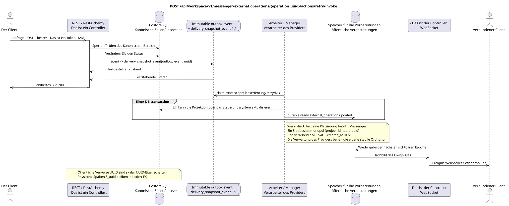

# Wiederholen des externen Vorgangs

[← Hauptindex der Dokumentation](../../../../index.md) ·
[Index der Abfolge-Diagramme](../../README.md) ·
[Abschnitt Außenintegration/runtime](../README.md)

`POST /api/workspace/v1/messenger/external_operations/{operation_uuid}/actions/retry/invoke`

Wiederholen Sie den Fehler , der diesen Fehler verursacht hat.



[Ausgangsgestalt , die bearbeitet werden kann PlantUML](diagrams/post_external_operation_retry.puml)

## Anfrage

Es gibt keine weiteren Anforderungsparameter außer den oben genannten Variablen..

```json
{
  "confirm_duplicate_risk": false
}
```

## Eine erfolgreiche Antwort

HTTP `200`:

```json
{
  "uuid": "42bd324f-45f0-4755-9a59-7b7316b2923c",
  "external_account_uuid": "0d4ae1d0-30ad-4d15-bf26-5789e8406201",
  "action": "message.create",
  "target_type": "message",
  "target_uuid": "a93dca35-3061-4748-bda4-7f6f8c660ea5",
  "details": {
    "kind": "zulip"
  },
  "attempt_history": [],
  "status": "queued",
  "attempt": 1,
  "safe_error": null,
  "can_retry": false,
  "can_discard": true,
  "duplicate_risk": false,
  "retry_requires_confirmation": false,
  "original_url": null,
  "reconciliation_state": "not_required",
  "reconciliation_reason": null,
  "reconciliation_evidence": {},
  "revision": 1,
  "created_at": "2026-07-17T12:10:00Z",
  "updated_at": "2026-07-17T12:10:00Z"
}
```

Die Antworten der Reviereinrichtungen enthalten strenge `ETag: "<revision>"`.

## Fehler

| HTTP | Verhalten in der Öffentlichkeit |
| --- | --- |
| `404` | Die Ressource in dem angegebenen Bereich existiert nicht oder ist nicht sichtbar. |
| `400` | Wiederholung nicht möglich oder erforderlich, aber keine Bestätigung. |
| `400` | Für nicht zulässige Pfadwerte, Anfrageparameter oder Körper wird ein Standard-Validierungsfehler verwendet RESTAlchemy. |

Beispiel für Validierungsfehler:

```json
{
  "type": "ValidationErrorException",
  "code": 400,
  "message": "Validation error occurred."
}
```

## Grenze RestAlchemy

Ziel-Ressource-/Kontrollanzeige (Angebotsdokumentation, nicht Produktionscode)):

```python
class ExternalOperation(models.ModelWithUUID, models.ModelWithTimestamp, orm.SQLStorableMixin):
    __tablename__ = "m_external_operations_v2"

    external_account_uuid = properties.property(types.UUID(), required=True)
    target_uuid = properties.property(types.AllowNone(types.UUID()), default=None)
    action = properties.property(types.String(), required=True)
    status = properties.property(types.Enum(OPERATION_STATUSES), read_only=True)
    details = properties.property(types.Dict(), read_only=True)
    revision = properties.property(types.Integer(min_value=1), read_only=True)


class ExternalOperationController(controllers.BaseResourceControllerPaginated):
    __resource__ = resources.ResourceByRAModel(ExternalOperation)
    # Owner scope; retry, discard and preflight are narrow action overrides.
```

`external_account_uuid` und einnehmend .`null` `target_uuid`sind Skalier .UUID- Eigenschaften.`external_account_uuid`Verweist auf den Account von`ON DELETE CASCADE`- Weil ...`target_uuid`Der Schlüssel ist ein Polymorphen für den Stream/Theme/Message, in der aktuellen Form kann er nicht korrekt ein einziger externer Schlüssel sein.SQLDer Zielsatz sollte die kanonische Zielliste oder die FK-typischen Spalten wählen, wobei der gleiche öffentliche Satz erhalten bleibt.JSON `target_uuid`- öffentliche AnzeigenRestAlchemySie benutzen sie nicht .`relationships.relationship`Für ...JSON- Das ist die Form .UUID, weil Beziehung alsURI- An der Grenze der physikalischen Schaltung ist jede kanonische nicht-polymorphe Verbindung .`*_uuid`ist ein indexierter externer Schlüssel mit einer eindeutig ausgewählten Verweisung. Sanitizer verbergen Besitzer, Account, Roh-ID-Anbieter, geheime Zertifikate, interne Adresse und Roh-Protokollfelder.

## Synchrone Transaktion

1. Authentifizieren Sie die Anfrage, definieren Sie den Bereich, überprüfen Sie die Auflösung/Body und finden Sie die kanonische Zeile für den indizierten Schlüssel.
2. Eine Operation sperren; Wiederholungs- und Duplikatrisiko-Bestätigung überprüfen; genau eine Wiederholungs-/Geschäftsversuchserfassung hinzufügen; eine Operation aktualisieren; eine unveränderliche Aktualisierungs-Outbox aufschreiben; eine Transaktion festhalten.
3. Antwort erst zurückgeben , wenn die Transaktion festgehalten wurde; Netzwerk-Zustellung wird nie innerhalb der Transaktion ausgeführt.

## Hintergrundbearbeitung, Ereignisse und Übereinstimmung

Typisierte Projektionsaufgaben: Erstellen Sie eine separate immutable task `delivery_snapshot_event` für source outbox event und Ziel, wenn zutreffend; die Lieferung an den Provider bleibt ein stabiler Auftrag in der Account/Chat-Warteschlange.

Der Hintergrund-Handler in einer DB-Transaktion erfasst den materialisierten Zustand und den fertig gestellten Umschlag des vollständigen Bildes `external_operation.updated`; beide Effekte von commit oder rollback zusammen. Nach dem commit sendet, wiederholt und spielt ein separater Manager WebSocket ihn aus; API/worker besitzt keine Clientverbindungen.

Die Lieferung, die Vergleichsbescheinigungen, der URL Anbieter und das Zielbild der Lieferung werden asynchron aktualisiert.

## Idempotenz und Parallelismus

UUID Die Erhöhung der Versuchszahl und die Endschritte werden unter der Zeilenblockade festgehalten..

Die Wiederholungen verwenden stabile Geschäftsschlüssel und den aktuellen Ausgangszustand. Jedes immutable outbox event erstellt eine separate task mit einem einzigartigen `outbox_event_uuid`; die Wiederholung dieser task muss idempotent sein, coalescing fehlt. Die monopolistische Verarbeitung des Themas Messenger von neuen Eintragungen zu den alten wird nur dann angewendet, wenn die betroffene kanonische Platzierung tatsächlich auf `(project_id, topic_uuid)` bezieht; Provider-Administration/Leseoperationen erstellen kein künstliches Thema und gehören nicht zu dieser Schlange.

## Die Quellen

- [`workspace_api.md`](../../../../workspace_api.md) — Autoritätreiche öffentliche Routen, allgemeine JSON, Pagination, Ereignisse und Vertrag WebSocket.
- [`zulip_bridge_v1_product_and_api.md`](../../../../zulip_bridge_v1_product_and_api.md) — gesundheitsschützender Lebenszyklus von externen Ressourcen, Berechtigungen und Provider-Semantik.

[← Hauptindex der Dokumentation](../../../../index.md) ·
[Index der Abfolge-Diagramme](../../README.md) ·
[Abschnitt Außenintegration/runtime](../README.md)
