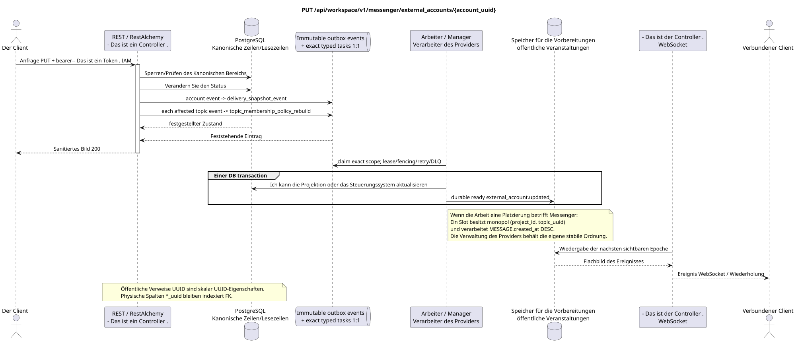

# Die Einstellungen für ein externes Konto aktualisieren

[← Hauptindex der Dokumentation](../../../../index.md) ·
[Index der Abfolge-Diagramme](../../README.md) ·
[Abschnitt Außenintegration/runtime](../README.md)

`PUT /api/workspace/v1/messenger/external_accounts/{account_uuid}`

Nicht-geheime Einstellungen des Kontos ersetzen.



[Ausgangsgestalt , die bearbeitet werden kann PlantUML](diagrams/put_external_account.puml)

## Anfrage

Es gibt keine weiteren Anforderungsparameter außer den oben genannten Variablen..

Titel zusätzlich zum Bearer-Token:

- `If-Match: "<revision>"` - Das ist obligatorisch .

```json
{
  "settings": {
    "kind": "zulip",
    "selection_mode": "all",
    "history_depth": "30_days",
    "default_project_id": "00000000-0000-4000-8000-000000000001"
  }
}
```

## Eine erfolgreiche Antwort

HTTP `200`:

```json
{
  "uuid": "0d4ae1d0-30ad-4d15-bf26-5789e8406201",
  "settings": {
    "kind": "zulip",
    "server_url": "https://zulip.example.invalid",
    "email": "owner@example.invalid",
    "selection_mode": "all",
    "history_depth": "30_days",
    "default_project_id": "00000000-0000-4000-8000-000000000001"
  },
  "credential_present": true,
  "status": "live",
  "live_ready": true,
  "safe_error": null,
  "capabilities": {},
  "desired_generation": 8,
  "applied_generation": 7,
  "last_progress_at": "2026-07-17T12:00:00Z",
  "created_at": "2026-07-17T11:00:00Z",
  "updated_at": "2026-07-17T12:00:00Z",
  "revision": 8
}
```

Die Antworten der Reviereinrichtungen enthalten strenge `ETag: "<revision>"`.

## Fehler

| HTTP | Verhalten in der Öffentlichkeit |
| --- | --- |
| `403` | `workspace.external_account.update` ist nicht zugelassen oder die Ressource befindet sich außerhalb des autorisierten Bereichs. |
| `404` | Die Ressource in dem angegebenen Bereich existiert nicht oder ist nicht sichtbar. |
| `428` | Nicht vorhanden `If-Match`. |
| `412` | Die Revision stimmt nicht überein. |
| `400` | Für nicht zulässige Pfadwerte, Anfrageparameter oder Körper wird ein Standard-Validierungsfehler verwendet RESTAlchemy. |

Beispiel für Validierungsfehler:

```json
{
  "type": "ValidationErrorException",
  "code": 400,
  "message": "Validation error occurred."
}
```

## Grenze RestAlchemy

Ziel-Ressource-/Kontrollanzeige (Angebotsdokumentation, nicht Produktionscode)):

```python
class ExternalAccount(models.ModelWithUUID, models.ModelWithTimestamp, orm.SQLStorableMixin):
    __tablename__ = "m_external_accounts_v2"

    owner_user_uuid = properties.property(types.UUID(), required=True)
    settings = properties.property(EXTERNAL_ACCOUNT_SETTINGS_TYPE, required=True)
    status = properties.property(types.Enum(ACCOUNT_STATUSES), read_only=True)
    capabilities = properties.property(types.Dict(), read_only=True)
    revision = properties.property(types.Integer(min_value=1), read_only=True)


class ExternalAccountController(controllers.BaseResourceControllerPaginated):
    __resource__ = resources.ResourceByRAModel(
        ExternalAccount, hidden_fields=["owner_user_uuid"]
    )
```

`owner_user_uuid` verborgen; öffentliche `settings.default_project_id` ist eine skalare UUID-Eigenschaft. Im Ziellager verweist die indizierte `owner_user_uuid` auf den Benutzer Workspace mit `ON DELETE CASCADE`, und die extrahierte indizierte `default_project_uuid`  auf die Projektregister mit `ON DELETE RESTRICT`; bei der Serialisierung ist die letzte noch in `settings` eingebettet. Öffentliche Anzeigen RestAlchemy verwenden nicht `relationships.relationship` für JSON in der Form UUID, weil die Beziehung (relationship) als URI serialisiert wird. An der Grenze der physischen Schema ist jede kanonische nichtpolymorphe Verbindung `*_uuid` ein indizierter externer Schlüssel mit einer eindeutig ausgewählten Verweisungsfunktion. Die Sanitäre verbergen den Besitzer, die Daten, die Provider-ID, die private Zertifikatsadresse, die interne Protokoll- und Quellfläche.

## Synchrone Transaktion

1. Authentifizieren Sie die Anfrage, definieren Sie den Bereich, überprüfen Sie die Auflösung/Body und finden Sie die kanonische Zeile für den indizierten Schlüssel.
2. Verhindern Sie, dass ein Benutzerkonto überprüft wird; aktualisieren Sie die Einstellungen, die geändert werden können/generieren Sie; fügen Sie atomar den gewünschten Status und den unveränderlichen Status hinzu outbox.
3. Antwort erst zurückgeben , wenn die Transaktion festgehalten wurde; Netzwerk-Zustellung wird nie innerhalb der Transaktion ausgeführt.

## Hintergrundbearbeitung, Ereignisse und Übereinstimmung

Typisierte `delivery_snapshot_event` bedient exact external-account
scope. Einzigartige `topic_membership_policy_rebuild` erscheinen nur für
Wirklich betroffen Placement topics und haben ihre eigenen source events.

Der Hintergrund-Handler in einer DB-Transaktion erfasst den materialisierten Zustand und den fertig gestellten Umschlag des vollständigen Bildes `external_account.updated`; beide Effekte von commit oder rollback zusammen. Nach dem commit sendet, wiederholt und spielt ein separater Manager WebSocket ihn aus; API/worker besitzt keine Clientverbindungen.

Vereinbarkeit, die dem Kunden sichtbar ist: zurückgegebene gewünschte Einstellungen sind festgehalten; die angewandte Bridge-Generation, der Status der Chat-Synchronisierung und die effektiven Funktionen stimmen asynchron zusammen.

## Idempotenz und Parallelismus

UUID Das Konto wird vom Kunden beim Erstellen erstellt; Business-Unikum erlaubt nur ein Konto .`(owner_user_uuid, provider_kind)`. Der Verschlüsselungstext der Zähldaten wird separat gespeichert und niemals serialisiert.

Die Wiederholungen verwenden stabile Geschäftsschlüssel und den aktuellen Ausgangszustand. Jedes immutable outbox event erstellt eine separate task mit einem einzigartigen `outbox_event_uuid`; die Wiederholung dieser task muss idempotent sein, coalescing fehlt. Die monopolistische Verarbeitung des Themas Messenger von neuen Eintragungen zu den alten wird nur dann angewendet, wenn die betroffene kanonische Platzierung tatsächlich auf `(project_id, topic_uuid)` bezieht; Provider-Administration/Leseoperationen erstellen kein künstliches Thema und gehören nicht zu dieser Schlange.

## Die Quellen

- [`workspace_api.md`](../../../../workspace_api.md) — Autoritätreiche öffentliche Routen, allgemeine JSON, Pagination, Ereignisse und Vertrag WebSocket.
- [`zulip_bridge_v1_product_and_api.md`](../../../../zulip_bridge_v1_product_and_api.md) — gesundheitsschützender Lebenszyklus von externen Ressourcen, Berechtigungen und Provider-Semantik.

[← Hauptindex der Dokumentation](../../../../index.md) ·
[Index der Abfolge-Diagramme](../../README.md) ·
[Abschnitt Außenintegration/runtime](../README.md)
