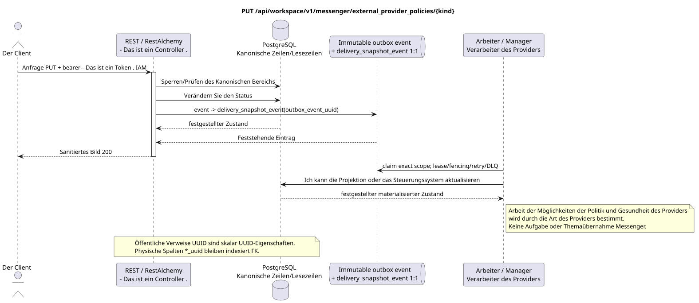

# Die Politik des externen Providers aktualisieren

[← Hauptindex der Dokumentation](../../../../index.md) ·
[Index der Abfolge-Diagramme](../../README.md) ·
[Abschnitt Außenintegration/runtime](../README.md)

`PUT /api/workspace/v1/messenger/external_provider_policies/{kind}`

Sie können die Provider-Richtlinien, die Zertifikatslimits und die freiwilligen Zertifikate ändern CA.



[Ausgangsgestalt , die bearbeitet werden kann PlantUML](diagrams/put_external_provider_policy.puml)

## Anfrage

Es gibt keine weiteren Anforderungsparameter außer den oben genannten Variablen..

Titel zusätzlich zum Bearer-Token:

- `If-Match: "<revision>"` - Das ist obligatorisch .

```json
{
  "settings": {
    "kind": "zulip",
    "enabled": true,
    "limits": {
      "max_accounts": 100,
      "max_selected_chats_per_account": 1000,
      "max_file_bytes": 5368709120
    },
    "custom_ca_bundle": null
  }
}
```

## Eine erfolgreiche Antwort

HTTP `200`:

```json
{
  "uuid": "bbf5398b-7d85-5770-aaf6-827605ca1200",
  "provider": "zulip",
  "enabled": true,
  "emergency_suspended": false,
  "limits": {
    "max_accounts": 100,
    "max_selected_chats_per_account": 1000,
    "max_file_bytes": 5368709120
  },
  "custom_ca_bundle": null,
  "revision": 5,
  "created_at": "2026-07-01T09:00:00Z",
  "updated_at": "2026-07-17T12:12:00Z"
}
```

Die Antworten der Reviereinrichtungen enthalten strenge `ETag: "<revision>"`.

## Fehler

| HTTP | Verhalten in der Öffentlichkeit |
| --- | --- |
| `403` | `workspace.external_provider_policy.update` ist nicht zugelassen oder die Ressource befindet sich außerhalb des autorisierten Bereichs. |
| `428` | Nicht vorhanden `If-Match`. |
| `412` | Die Revision stimmt nicht überein. |
| `400` | Unzulässige Limits, Anbieterart, Zertifikatssammlung oder Eingabe eines geschlossenen Schlüssels. |
| `400` | Für nicht zulässige Pfadwerte, Anfrageparameter oder Körper wird ein Standard-Validierungsfehler verwendet RESTAlchemy. |

Beispiel für Validierungsfehler:

```json
{
  "type": "ValidationErrorException",
  "code": 400,
  "message": "Validation error occurred."
}
```

## Grenze RestAlchemy

Ziel-Ressource-/Kontrollanzeige (Angebotsdokumentation, nicht Produktionscode)):

```python
class ExternalProviderPolicy(models.ModelWithUUID, models.ModelWithTimestamp, orm.SQLStorableMixin):
    __tablename__ = "m_external_provider_policies_v1"

    provider = properties.property(types.Enum(PROVIDER_KINDS), required=True)
    enabled = properties.property(types.Boolean(), required=True)
    emergency_suspended = properties.property(types.Boolean(), read_only=True)
    limits = properties.property(types.Dict(), required=True)
    custom_ca_bundle = properties.property(types.AllowNone(types.Dict()), read_only=True)
    revision = properties.property(types.Integer(min_value=1), read_only=True)

    @classmethod
    def get_id_property(cls) -> dict[str, typing.Any]:
        return {"provider": cls.properties.properties["provider"]}


class ExternalProviderPolicyController(controllers.BaseResourceController):
    __resource__ = resources.ResourceByRAModel(ExternalProviderPolicy)
    # ResourceByRAModel restores by provider kind, not by the hidden storage UUID.
```

Die öffentliche Ressource wird an den `kind` Anbieter adressiert; die UUID Metadaten bleiben skalare UUID Eigenschaften. Wenn die benutzerdefinierten CA-Metadaten physisch normalisiert sind, verweist der `null` `custom_ca_bundle_uuid` verzeichnete Zugriff auf den geschützten CA-Paket mit `ON DELETE SET NULL`. Die öffentliche Anzeige RestAlchemy verwendet nicht `relationships.relationship` für JSON in der Form UUID, weil die Beziehung als URI serialisiert wird. An der Grenze der physischen Schema ist die kanonische nicht-polymorphe Verbindung `*_uuid` ein indexierter externer Schlüssel mit einer eindeutig ausgewählten Verweisungsaktion. Die Sanitizer verbergen den Besitzer, die Rohdaten, die Roh-Provider-ID, das geschlossene Zertifikat, die interne Adresse und die Protokollfelder.

## Synchrone Transaktion

1. Authentifizieren Sie die Anfrage, definieren Sie den Bereich, überprüfen Sie die Auflösung/Body und finden Sie die kanonische Zeile für den indizierten Schlüssel.
2. Verhindern Sie die Revision der Richtlinien; überprüfen Sie Limits und Eingabe PEM nur für CA; speichern Sie gesäuberte Metadaten und geschützte Zertifikatsmaterial; fügen Sie den gewünschten Status und die unveränderliche Outbox hinzu; verzeichnen Sie die Transaktion.
3. Antwort erst zurückgeben , wenn die Transaktion festgehalten wurde; Netzwerk-Zustellung wird nie innerhalb der Transaktion ausgeführt.

## Hintergrundbearbeitung, Ereignisse und Übereinstimmung

Typisierte Projektionsaufgaben: Einzelne immutable `delivery_snapshot_event`
Politik/Gesundheit für jede source outbox event und einzelne nachhaltige Arbeit
Jede hat einen tatsächlichen Anbieter-Scope und
unique `outbox_event_uuid`; coalescing Ohne Placement ist die Operation nicht möglich.
Erstellt topic task/claim.

Für diese Operation wird kein öffentliches Ereignis Workspace erstellt, so dass der einzelne Dispatcher WebSocket nichts zu liefern hat.

Absprache, die dem Kunden sichtbar ist: die gewünschte Politik wird sofort festgehalten..

## Idempotenz und Parallelismus

Für jede Providerart gibt es eine einzige Richtlinienzeile. Revision/ETag verhindert den Verlust von Updates; jede verändernde Operation führt zu einer eigenen unveränderlichen Aufgabe, und eine Wiederholung einer Aufgabe ist potentiell.

Die Wiederholungen verwenden stabile Geschäftsschlüssel und den aktuellen Ausgangszustand. Jedes immutable outbox event erstellt eine separate task mit einem einzigartigen `outbox_event_uuid`; die Wiederholung dieser task muss idempotent sein, coalescing fehlt. Die monopolistische Verarbeitung des Themas Messenger von neuen Eintragungen zu den alten wird nur dann angewendet, wenn die betroffene kanonische Platzierung tatsächlich auf `(project_id, topic_uuid)` bezieht; Provider-Administration/Leseoperationen erstellen kein künstliches Thema und gehören nicht zu dieser Schlange.

## Die Quellen

- [`workspace_api.md`](../../../../workspace_api.md) — Autoritätreiche öffentliche Routen, allgemeine JSON, Pagination, Ereignisse und Vertrag WebSocket.
- [`zulip_bridge_v1_product_and_api.md`](../../../../zulip_bridge_v1_product_and_api.md) — gesundheitsschützender Lebenszyklus von externen Ressourcen, Berechtigungen und Provider-Semantik.

[← Hauptindex der Dokumentation](../../../../index.md) ·
[Index der Abfolge-Diagramme](../../README.md) ·
[Abschnitt Außenintegration/runtime](../README.md)
