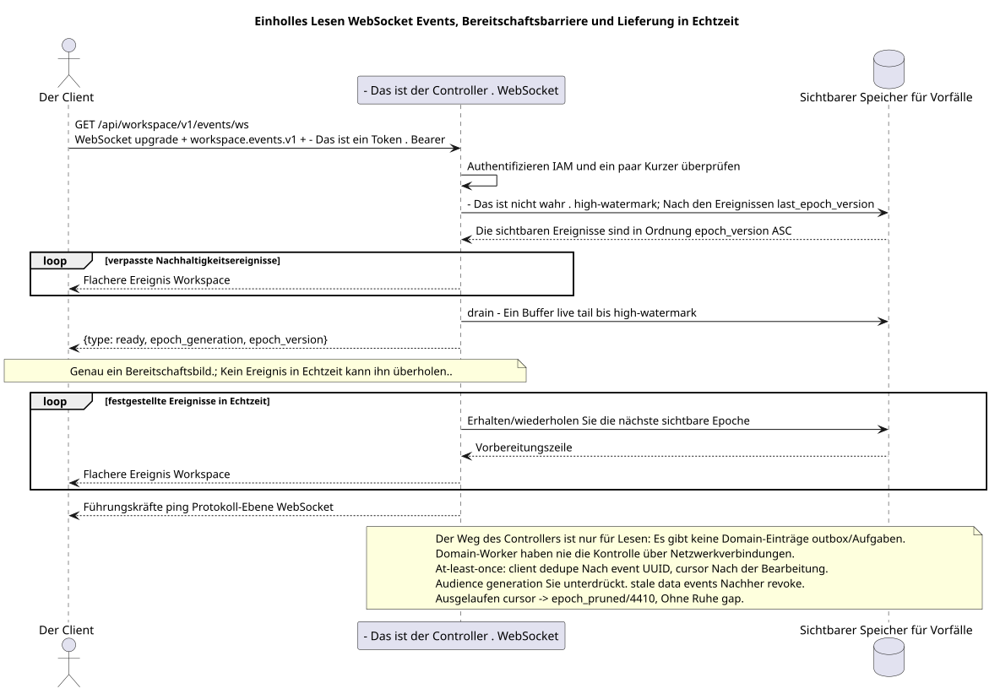

# Verbindung von WebSocket Ereignissen

[← Hauptindex der Dokumentation](../../../../index.md) ·
[Index der Abfolge-Diagramme](../../README.md) ·
[Abschnitt Außenintegration und Ausführungszeit](../README.md)

Eingangspunkt: `GET /api/workspace/v1/events/ws` mit WebSocket upgrade und query
`last_epoch_version=<number>&epoch_generation=<generation>`.

Öffnen Sie einen öffentlichen Echtzeit-Flow, spielen Sie das sichtbare, stabile Suffix, erhalten Sie genau einen Stand-up-Bild, und dann nehmen Sie die Flachveranstaltungen.WorkspaceDas ist ein dokumentierter Eingangspunkt der Ausführungszeit, nichtHTTP- Eine Operation. OpenAPI.



[Ausgangsgestalt , die bearbeitet werden kann PlantUML](diagrams/websocket_events.puml)

## Anschluss einrichten

Anfrage-Parameter:

- `last_epoch_version`: letzter vollständig bearbeitete ganzzahlige Epoche; `0`  kalter Kurzer.
- `epoch_generation`: muss mit einem nicht nullen Cursor und der gespeicherten Generation übereinstimmen.

Werte `Sec-WebSocket-Protocol` in der Reihenfolge:

```text
workspace.events.v1, bearer.<IAM access token>
```

Der Anforderungskörper JSON wird nicht gesendet. Der Client sendet keine `ack` oder `pong`-Ebene der Anwendung; Aktivitätsprüfung verwendet Protokoll-Ebene-Ping-Betriebsfotos WebSocket.

## Servernachrichten

Genau eine Bereitschaftsmeldung wird nach dem Nachlesen und vor den Ereignissen in Echtzeit gesendet:

```json
{
  "type": "ready",
  "epoch_generation": "781203",
  "epoch_version": 124
}
```

Dann hat jede Ereignismeldung genau die gleiche flache Form wie REST `/events/`:

```json
{
  "schema_version": 1,
  "uuid": "5bb95582-b4f3-4de1-bf84-f0244910fc82",
  "epoch_version": 124,
  "project_id": "00000000-0000-4000-8000-000000000001",
  "user_uuid": "3f433fee-b27f-4c67-98bd-31fe4df42cc8",
  "object_type": "external_account",
  "action": "updated",
  "created_at": "2026-07-17T12:12:00Z",
  "updated_at": "2026-07-17T12:12:00Z",
  "payload": {
    "kind": "external_account.updated",
    "uuid": "0d4ae1d0-30ad-4d15-bf26-5789e8406201",
    "snapshot": {
      "uuid": "0d4ae1d0-30ad-4d15-bf26-5789e8406201",
      "settings": {
        "kind": "zulip",
        "server_url": "https://zulip.example.invalid",
        "email": "owner@example.invalid",
        "selection_mode": "explicit",
        "history_depth": "30_days",
        "default_project_id": "00000000-0000-4000-8000-000000000001"
      },
      "credential_present": true,
      "status": "live",
      "live_ready": true,
      "safe_error": null,
      "capabilities": {},
      "desired_generation": 7,
      "applied_generation": 7,
      "last_progress_at": "2026-07-17T12:00:00Z",
      "created_at": "2026-07-17T11:00:00Z",
      "updated_at": "2026-07-17T12:00:00Z",
      "revision": 7
    }
  }
}
```

JSON-`hello`, `ping`, `pong` oder `ack` Anwendungslevel keine Nachrichten.

## Kurzerfehler

Bei ausgebliebenem Cursor wird der folgende typische Fehler JSON gesendet, woraufhin die Verbindung mit dem Code `4410` und der Ursache geschlossen wird `epoch_pruned`:

```json
{
  "type": "EventsCursorExpiredError",
  "code": 410,
  "error": "epoch_pruned",
  "message": "The event cursor is outside the retained suffix.",
  "reason": "epoch_pruned",
  "epoch_generation": "781203",
  "current_epoch_version": 124,
  "minimum_epoch_version": 37
}
```

## Lesen und Dispechieren

Bei der Anbindung wird der Bereich IAM authentifiziert, überprüft
`(epoch_generation, last_epoch_version)` und wird festgehalten high-watermark durable
event store. Dispatcher Erstellt alle sichtbaren Ereignisse nach der Erhöhung
cursor, Gleichzeitig buffert er den aufgetauchten Live-Tail, entleert ihn und nur
und dann ohne Gap in live wechselt./business events
Der Worker hat bereits die Projektions-Update atomar gespeichert und ready event row
in einer DB-Transaktion; der Dispatcher liest nur den durable store und liefert.

## Grenze RestAlchemy und Identität

```python
class WorkspaceEvent(models.ModelWithUUID, models.ModelWithTimestamp, orm.SQLStorableMixin):
    __tablename__ = "m_workspace_events"

    epoch_version = properties.property(types.Integer(min_value=1), required=True)
    project_id = properties.property(types.UUID(), required=True)
    user_uuid = properties.property(types.AllowNone(types.UUID()), default=None)
    object_type = properties.property(types.String(), required=True)
    action = properties.property(types.String(), required=True)
    payload = properties.property(types.Dict(), required=True)


class WorkspaceEventController(controllers.BaseResourceControllerPaginated):
    __resource__ = resources.ResourceByRAModel(WorkspaceEvent)
    # Scope by project/user or stored compact audience before indexed keyset read.
```

Die öffentlichen UUID Ereignisse/Wesen sind skalare UUID-Eigenschaften, nicht URI-Beziehungen. Die indizierten `project_id`-Ereignisse und die zulässigen `null`- `user_uuid`-Ereignisse verweisen auf die kanonischen Zeilen des Bereichs mit `ON DELETE CASCADE`; UUID, die in eine unveränderliche JSON-Nutzlast kopiert werden, sind Ereignisdaten, nicht die wirksamen Spalten der Beziehung. Die Ereignisidentität/Wiedergabe nutzt `(epoch_generation, epoch_version)`-Eigenschaften, nicht nur UUID-Eigenschaften.

## Parallelismus, Zeit und Wiederherstellung

Ablesen und Ablassen des Live Buffers bis zur Bereitschaftsbarriere.
Echtzeitlieferungen können die Bereitschaft nicht übertreffen.
at-least-once: Der Client dupliziert nach event UUID und bewegt nur den Cursor
Die Audience Row bringt membership generation; dispatcher
und replay liefern keine Datenveranstaltungen , wenn die Mitglieder nicht aktiv sind oder nicht übereinstimmen
generation Die Antwort 4410/`epoch_pruned` verlangt, dass Sie die Daten löschen.
Abgeleitete Caches, hochladen von Autoritätsbildern und starten mit zurückgegebenen
Die Anzahl der Daten, die in der Datenbank gespeichert werden, ist operational
policy, Aber ein stiller Verlust von Ereignissen ist verboten..

## Die Quellen

- [`workspace_api.md`](../../../../workspace_api.md), Abschnitte `Runtime Entry Points`, `Events And Epoch` und `WebSocket Realtime Summary`.

[← Hauptindex der Dokumentation](../../../../index.md) ·
[Index der Abfolge-Diagramme](../../README.md) ·
[Abschnitt Außenintegration und Ausführungszeit](../README.md)
