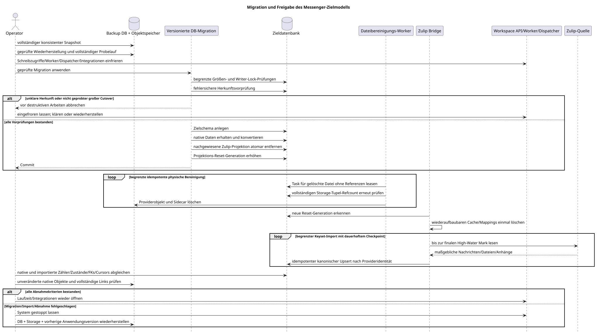

[← Dokumentationsübersicht](../../../index.md) · [Übersicht der Sequenzdiagramme](../README.md) · [Worker-Abläufe](README.md)

# Runbook für Migration und Freigabe des Messenger-Zielmodells

Status: **für Workspace Server v2 implementiert; verbindliche Betriebsanweisung**.

Dieses Runbook behandelt Critic-Risiko Nr. 11. Es erteilt für sich allein keine
Freigabe für Migration, Datenlöschung oder Änderungen am Produktionsschema. Der
gültige öffentliche Vertrag ist in
[`workspace_api.md`](../../../workspace_api.md) festgelegt.

Bearbeitbare Diagrammquelle:
[`migration_release_runbook.puml`](diagrams/migration_release_runbook.puml).

## Verantwortungsgrenzen

| Mechanismus | Verantwortung | Ausführung |
| --- | --- | --- |
| versionierte DB-Migrationen | Zielschema anlegen, maßgebliche native Daten migrieren, nachgewiesene Zulip-Nachrichten-/Dateiprojektionen löschen und die Reset-Generation erhöhen | reguläre Release-Pipeline nach Backup-, Probelauf-, Größen- und Freeze-Prüfung |
| Messenger-Worker | begrenzte und idempotente physische Bereinigung nur für bereits gelöschte Zulip-Dateizeilen ohne Referenzen | automatisch nach Commit der Migration |
| Zulip Bridge | neue Reset-Generation erkennen, wiederaufbaubaren lokalen Zustand löschen und einen vollständigen Neuimport ausführen | automatisch mit dauerhaftem Backfill-Checkpoint und Wiederholungen |
| Betriebsprüfungen | Backup/Restore, Freeze, Vorher-/Nachher-Zähler, Abgleich und Abnahmekriterien prüfen | vor der Migration und nach abgeschlossenem Neuimport |

Jedes manuelle Hilfsprogramm muss die Modi `check-only`/`dry-run` und `apply`,
einen eindeutigen Projekt-/Bereichs-/Provider-/Account-Scope, begrenzte Batches,
fortsetzbare Checkpoints, idempotente Wiederholungen, Fortschritts- und
Auditprotokolle sowie ein Abschlussmanifest bereitstellen. Eine fehlgeschlagene
Prüfung sperrt den nächsten Schritt.

## Vorbereitung und Freeze

1. Das vereinbarte vollständige Backup beziehungsweise einen Snapshot von
   Datenbank und Objektspeicher erstellen.
2. Das Backup in einer isolierten Instanz wiederherstellen. Ausgangsversion der
   Anwendung, Schema-/Migrationsstand und Cursors für Outbox, Tasks, Events und
   Provider dokumentieren.
3. Den vollständigen Ablauf auf dieser wiederhergestellten produktionsnahen
   Kopie proben, Dauer und Speicherbedarf messen und den Rollback prüfen.
4. Für den inkompatiblen Cutover API-Schreibzugriffe, Worker-Slots,
   WebSocket-Dispatcher und Provider-Integrationen stoppen. Laufende
   Transaktionen und Tasks abschließen lassen und die finalen High-Water Marks
   erfassen.
5. Zwischen finalem Watermark/Backup, Konvertierung und Wiederöffnung der
   Schreibzugriffe darf kein Producer neue, später verlorene Daten erzeugen.

## Trennung nach Datenherkunft

### Native Workspace

Native Nachrichten und in native Chats hochgeladene Dateien sind maßgebliche
lokale Daten. Sie werden weder gelöscht noch erneut importiert. Versionierte
DB-Migrationen überführen sie deterministisch in die Zielzeilen `MESSAGE`,
`MESSAGE_PLACEMENT`, `USER_MESSAGE_BINDING` und `USER_MESSAGE_STATE`, wobei
Inhalt und Benutzerzustand erhalten bleiben. Native Dateizeilen, Blob-Objekte,
Referenzen, Prüfsummen und UUIDs müssen vor und nach der Freigabe übereinstimmen.

### Zulip: beabsichtigter Reset abgeleiteter Workspace-Identität

Aus Zulip importierte Nachrichten, Dateien/Anhänge und ihre abgeleiteten
Projektionen sind wiederaufbaubar. Nach dem geprüften Backup löscht die
versionierte Migration nur nachgewiesene Zeilen im eingefrorenen Scope
`provider=zulip`, erhöht die gewünschten Account-/Chat-Generationen und
veröffentlicht `projection_reset_generation`. Die Bridge verwirft den alten
wiederaufbaubaren Deduplizierungszustand und importiert vollständig neu aus der
maßgeblichen Zulip-Quelle. Ausgewählte Account-/Chat-Konfiguration sowie
Identitäts- und Katalogdaten bleiben erhalten.

Dies ist eine **bewusst destruktive Identitätsgrenze** ausschließlich für aus
Zulip abgeleitete Workspace-Daten:

- alte kanonische `MESSAGE.uuid`, öffentliche `MESSAGE_PLACEMENT.uuid`, Deep
  Links und weitere Verweise auf importierte Zulip-Nachrichten bleiben nicht
  erhalten;
- alte Workspace-lokale Bindings/Zustände (`read`, `starred`, `hidden`),
  Reaktionen und manuelle Platzierungen zu alten Zulip-UUIDs müssen nicht
  erhalten bleiben, wenn der maßgebliche Zulip-Payload sie nicht rekonstruieren
  kann;
- aus Zulip abgeleitete Datei-UUIDs sowie Anhangs-, Link- und Blob-Identitäten
  bleiben nicht erhalten; der Neuimport kann neue Zeilen, UUIDs und
  Speicherobjekte anlegen;
- es wird keine Zuordnung von externer ID zur alten Workspace-UUID angelegt oder
  wiederhergestellt;
- diese Grenze gilt nicht für native Nachrichten, nativen Zustand oder Dateien
  in nativem Besitz.

## Fehlersichere Herkunftsklassifikation

Die Bereinigung entscheidet niemals anhand eines einzelnen nullable Feldes.
Historische Migrationen garantierten kein korrektes `source_name` für jede
importierte Nachricht, und eine native ausgehende Nachricht kann nach dem
Echo-Abgleich Provider-/Account-Kennungen erhalten. Die Migration führt daher
unter demselben Writer-Freeze eine deterministische Vorprüfung aus und akzeptiert
nur diese Kombinationen:

- eingehende Nachricht: konsistente Werte für `source_name` und `source.kind`,
  eine Provider-Nachrichtenidentität aus `source.message_id` oder der älteren
  `provider_external_id` (wenn beide vorhanden sind, müssen sie übereinstimmen)
  und die vollständige historische Bridge-Identität
  `UUIDv5(legacy_namespace, "zulip:<account_uuid>:message:<provider_id>")`
  sowie einen passenden
  Zulip-Account, einen Zulip-eigenen Stream oder bestätigende historische
  Entity-Evidenz;
- native ausgehende Nachricht: eine dauerhafte Zeile in
  `m_external_operations_v2` mit `action=message.create`, passender
  `target_uuid`, lokaler `owner_user_uuid` und demselben Account, falls die
  Nachricht bereits einen Account trägt;
- ältere native/ausgehende Nachricht, die vor dieser Operationswarteschlange
  erstellt wurde: das konsistente Paar `source_name=native` und
  `source.kind=native`; später beim Echo-Abgleich angefügte Provider-Kennungen
  überschreiben dieses Paar nicht;
- externe Datei: ein Zulip-Account, der reservierte External-Content-Namespace
  im Storage und keine Referenz aus einer erhaltenen Nachricht. Eine
  verbleibende Referenz `urn:file|image|video:<uuid>` hat immer Vorrang und
  erhält Zeile und physisches Objekt.

Jede Zeile mit unvollständigen oder widersprüchlichen Source- oder Zulip-Signalen
bricht die Migration vor destruktiven Arbeiten ab. Wenn ein vollständig
abgeglichenes historisches Echo sowohl eingehende Felder als auch eine exakt
passende dauerhafte `message.create`-Operation enthält, hat die Operation Vorrang
und die native/ausgehende Zeile bleibt erhalten. Jede UUID einer Zulip-Quellzeile,
einschließlich einer beliebigen UUIDv5, gilt ohne Übereinstimmung mit der
vollständigen Legacy-Identität und ohne diese Operation als mehrdeutiger
Workspace-Versand aus der Zeit vor der Operationswarteschlange und bricht statt
eines Resets ab.
`m_zulip_processed_entities`
reicht allein niemals aus und dient nur zusammen mit konsistenten Source-Feldern
als zusätzliche Evidenz.

Reaktionen aus dem Provider werden über ihre Zulip-Account-Herkunft gelöscht,
auch wenn sie an erhaltenen nativen/ausgehenden Nachrichten hängen. Native
Reaktionen bleiben bestehen. Kompakter Lese-/Topic-Zustand und abhängige Events
werden nur für nachgewiesene Reset-Kandidaten entfernt.

Der Datenbank-Reset läuft als einzelne atomare, mengenbasierte Transaktion im
eingefrorenen Writer-Scope. Ein unbeaufsichtigter Cutover ist auf eine Million
Legacy-Nachrichten begrenzt, wartet höchstens 30 Sekunden auf Writer-Locks und
hat ein Statement-Limit von 30 Minuten. Eine größere Legacy-Datenbank wird vor
destruktiven Arbeiten abgelehnt, sofern der Operator den großen Cutover nicht
nach erfolgreichem produktionsgroßem Probelauf und geprüftem Backup ausdrücklich
freigibt. Das Zielprofil von 50 Millionen Nachrichten beschreibt den stabilen
Betrieb nach dem Neuimport und erlaubt keine ungeprobte automatische
Legacy-Konvertierung.

Datenbankzeilen werden atomar entfernt; bei einem Fehler wird daher der gesamte
Zustand vor der Migration wiederhergestellt. Physische Dateiobjekte verarbeitet
nach dem Commit bewusst eine dauerhafte, begrenzte Worker-Queue. Vor dem Löschen
eines gemeinsam genutzten oder deduplizierten Objekts prüft der Worker erneut
den Null-Referenzzähler für das vollständige Tupel
`(storage_type,storage_id,storage_object_id)` und das Fehlen erhaltener nativer
Referenzen. Metadaten-Sidecars werden getrennt entfernt; Wiederholungen sind
idempotent.

Im aktuellen Schema gibt es keine normalisierte Nachricht↔Anhang-Tabelle:
Referenzen stehen als `urn:file|image|video:<uuid>` im Markdown. Die Migration
prüft vor der Auswahl eines Dateikandidaten alle verbleibenden Payloads und kann
dadurch weder einen hängenden Link erzeugen noch auf einen erfundenen FK bauen.

## Vollständiger frischer Zulip-Neuimport

Der Neuimport vergibt eine neue kanonische `MESSAGE.uuid`; die öffentliche
Placement-UUID wird erneut als
`UUIDv5(namespace=TOPIC.uuid, name=MESSAGE.uuid)` berechnet. Auch eine neue
Datei-UUID kann vergeben werden. Der Import sucht nicht nach der alten
Workspace-Identität.

Idempotenz ist **innerhalb des neuen Imports** zwingend. Nachrichten verwenden
mindestens den physischen eindeutigen Provider-Schlüssel
`(project_id, external_account_uuid, provider_external_id)`. Die Laufzeit führt
zusätzlich `source.message_id`, die eindeutig auf die normalisierte
`provider_external_id` abgebildet wird. Der erste Import erstellt die neue
kanonische Zeile; Wiederholung oder Fortsetzung mit demselben Provider-Schlüssel
verwendet beziehungsweise aktualisiert diese Zeile, statt ein Duplikat anzulegen.

Dateien und Anhangslinks verwenden die entsprechende stabile Zulip-Datei- oder
Nachrichtenidentität im Account-/Projekt-Scope. Wiederholte Batches konvergieren
auf dieselben neuen Datei-/Anhangszeilen, duplizieren keine Blobs und stellen
Links auf die bereits importierte neue kanonische Nachricht wieder her.

Der Import arbeitet automatisch in begrenzten Keyset-Batches mit dauerhaften
Checkpoints, Retry/Backoff, Fortschrittsprotokoll und Abgleich. Die
Provider-Integration bleibt eingefroren, bis der finale Source-Cursor/High-Water
Mark gespeichert ist; so entstehen an der Freeze-Grenze weder Verluste noch
Duplikate.

## Rebuild- und Abnahmekriterien

Nach Migration und Neuimport bauen versionierte Verfahren Placements,
Bindings/Zustände, Reaktions-Snapshots, Ordnerobjekte/-Snapshots,
Unread-/Mention-Zähler und weitere materialisierte Projektionen neu auf. Der
Rebuild ist idempotent und ersetzt nicht die Prüfung der Quelldaten.

Schreibzugriffe bleiben geschlossen, bis alle Kriterien erfüllt sind:

- native Nachrichten-/Inhalts-/Zustandszahlen und deterministische native
  Placement-Zuordnung stimmen überein;
- `UNIQUE(project_id, uuid)`, zusammengesetzte Tenant-FKs,
  Topic→Stream/Projekt-Integrität und Membership-Generationen sind gültig;
- Anzahl, Referenzen, Prüfsummen und Größen nativer Dateizeilen/Blobs sind
  unverändert;
- nach der Zulip-Bereinigung existieren weder ausstehende
  History-/Provider-/Dateitransfer-Producer noch verwaiste Zeilen/Objekte,
  hängende `urn:file|image|video`-Referenzen oder gelöschte erhaltene native
  Objekte;
- nach dem Neuimport stimmen Source-High-Water Marks, Anzahlen und Bereiche;
  Provider-Identitäten haben keine Duplikate oder Lücken; stichprobenartige und
  vollständige Inhaltsabgleiche sind erfolgreich;
- Summen, Prüfsummen/Größen und Links von Zulip-Dateien, Blobs und Anhängen sind
  vollständig, dedupliziert und intakt;
- Reaktionen, Ordner, Ordnerobjekt-Snapshots, Unread-Zähler sowie
  Outbox-/Task-/Event-/Provider-Cursors sind abgeglichen;
- vorgeschriebene manuelle Verfahren sind beendet, Checkpoints geschlossen und
  es bleibt keine DLQ-/hängende Arbeit, sofern der Release Owner sie nicht
  ausdrücklich akzeptiert.

Der Control-Plane-Lasttest umfasst mindestens 15.000 große Zuweisungen. Er muss
belegen, dass die Snapshot-Erstellung normalisierte geordnete Zeilen ohne eine
In-Process-Sammlung schreibt, Seiten nur begrenzte Zeilen lesen, der Backend-RSS
begrenzt bleibt und die Bridge jede Ressource genau einmal installiert, bevor
sie den Anchor-Cursor fortschreibt.

## Fehler und Rollback

Jeder Fehler bei Migration, Bereinigung, Neuimport oder Abnahme stoppt den
Ablauf. Produktion darf nicht ad hoc anstelle einer Wiederherstellung repariert
werden. Das geprüfte Datenbank-/Objektspeicher-Backup vor der Migration und die
vorherige Anwendungsversion wiederherstellen, die aufgezeichneten Cursors erneut
prüfen und erst dann ein neues Wartungsfenster planen. Backups und Manifeste bis
zur ausdrücklichen Abnahme und bis zum Ablauf der festgelegten
Aufbewahrungsfrist behalten.

Risiko Nr. 11 wird durch dieses Verfahren geschlossen: Native Daten werden ohne
Verlust migriert; für aus Zulip abgeleitete Nachrichten-/Dateiidentität gilt eine
explizite destruktive Reset-Grenze mit Backup, fehlersicherer Herkunftsprüfung,
begrenzter physischer Bereinigung, vollständigem Neuimport und überprüfbarem
Rollback.

[← Dokumentationsübersicht](../../../index.md) · [Übersicht der Sequenzdiagramme](../README.md) · [Worker-Abläufe](README.md)
