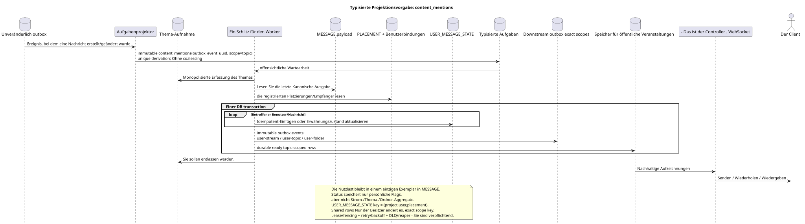

# Typisierte Aufgabe: `content_mentions`

[← Hauptindex der Dokumentation](../../../index.md) · [Index der Abfolge-Diagramme](../README.md) · [Verteilen von Workflow-Daten](README.md)

Status: **gebotener Hintergrundstrom; kein Endpunkt HTTP**.

Ausgangsgestalt , die bearbeitet werden kann:
[`task_content_mentions.puml`](diagrams/task_content_mentions.puml).

## Zweck und Quelle der Wahrheit

Die Aufgabe aktualisiert den materialisierten Zustand von Inhalten und Erwähnungen nach
Erstellung/Änderung der kanonischen Nachricht und nach dem Auftreten von Bindungen
Die Quelle der Wahrheit  letzter Zustand `MESSAGE.payload`, offensichtlich
`MESSAGE_PLACEMENT`, Bereiter Zugriff auf Empfänger und kanonische Identifikatoren
Die öffentliche Nutzenleistung bleibt Teil der einzigen
`MESSAGE`; Der persönliche Erwähnungspflagge wird in einer einzigartigen Aufzeichnung gespeichert
`USER_MESSAGE_STATE (project,user,placement)`.

## Der Fluss

1. Die zustandsändernde Transaktion API schreibt die kanonische Änderung und
   `GET` und Liste-Operationen werden nicht erstellt.
2. Der Projektor liefert eine separate immutable `content_mentions` task für jeden
   source outbox event; `outbox_event_uuid` verbindet Ereignis und Aufgabe einzigartig.
3. Monopol-Theme-Slot wählt die Arbeit nach `MESSAGE.created_at DESC`.
4. Der Arbeiter liest die letzte Nutzungsdauer und die festgelegten Verbindungen
   Empfänger.
5. Der Arbeiter erstellt und aktualisiert nur persönliche Flaggen/Zustände.
   Erwähnungen und alle entsprechenden durable ready `message.updated` rows in
   Eine DB-Transaktion; es kopiert keine Nutzungsdaten und ändert keine öffentliche
   UUID oder zeitliche Nachrichtenmarkierungen.
6. Wenn sich die Einstufung von Erwähnungen/Nichtgelesenen geändert hat, werden
   Einzelne Aufgaben des genauen Bereichs: `user-stream`, `user-topic` und/oder
   `user-folder`. Topic-worker ändert diese gemeinsamen Zeilen nicht.
7. Nach dem commit liefert der Manager bereitgestellte events;
   event rows Container erstellen ihre exact-scope tasks atomar mit ihren
   Die Projektionen werden nicht aufgezeichnet. shared rows.

## Wiederholungen, Rennen und Konsistenz

- Jede Aufgabe entspricht einem Ereignis; der Handler liest die letzte
  kannonischer Belastung und wendet das Ereignis idympotent;
- Status-Schlüssel `(project_id,user_uuid,placement_uuid)` schließt Duplikate aus
  Zustände innerhalb der Unterkunft, ohne verschiedene placements;
- Das Erfassen eines Themas schließt gleichzeitig die Bearbeitung von etwa einem Thema aus;
- lease expiry/fencing, retry/backoff, DLQ Und der Reaper wird wieder arbeiten, nachdem
  Fehler; initial design nicht ausgeführt coalescing;
- Wiederholte Einfügung oder Aktualisierung (upsert) kommt zum gleichen Ergebnis aus der letzten Quelle;
- Bis zur Festsetzung durch den Vorarbeiter kann der Kunde kurz den vorherigen Zustand sehen
  Erwähnungen/Zählern; Antwort auf Änderung des kanonischen Inhalts bereits
  Die Daten werden von `MESSAGE`.

[← Hauptindex der Dokumentation](../../../index.md) · [Index der Abfolge-Diagramme](../README.md) · [Verteilen von Workflow-Daten](README.md)
