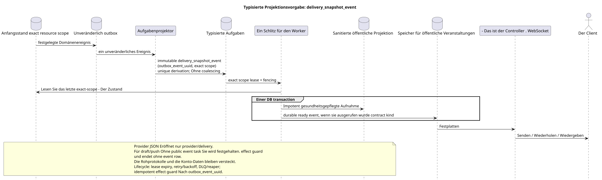

# Typisierte Aufgabe: `delivery_snapshot_event`

[← Hauptindex der Dokumentation](../../../index.md) · [Index der Abfolge-Diagramme](../README.md) · [Verteilen von Workflow-Daten](README.md)

Status: **gebotener Hintergrundstrom; kein Endpunkt HTTP**.

Ausgangsgestalt , die bearbeitet werden kann:
[`task_delivery_snapshot_event.puml`](diagrams/task_delivery_snapshot_event.puml).

## Zweck und Quelle der Wahrheit

Die Aufgabe konvertiert den letzten festgelegten Ausgangszustand exact resource
scope in eine saubere Projektion und/oder eine stabile öffentliche Veranstaltung.
Sie bedient provider/delivery, file/user und andere einfache resource-event
flows. Für contract families ohne öffentliche Veranstaltung (z.B. draft/push
registration) Der gleiche Handler erfasst den einzigartigen effect guard und beendet task
öffentliche API speichert die aktuelle JSON; roh
Protokoll-Metadaten, Accountdaten und interne Lieferfelder werden nicht
öffentlich.

## Der Fluss

1. Der Domänenwechsel aktualisiert die ursprüngliche Zeile und das unveränderliche Ereignis atomar
   outbox.
2. Der Projektor führt eine immutable Task für ein Source-Outbox-Event mit
   einzigartig `outbox_event_uuid` und eindeutig erklärt scope Ressource; coalescing
   nicht vorhanden.
3. Worker liest den letzten exact-scope Zustand und in **einer DB transaction**
   die sanitierte Projektion zusammen mit allen
   durable ready public event rows; Beide Effekte , commit oder rollback , zusammen.
   Wenn der aktuelle Vertrag keine public event dafür hat resource kind,
   Die Transaktion speichert nur den Effekt Guard/task completion und erfindet keine
   event kind.
4. Nach dem commit sendet, wiederholt und spielt ein separater Manager
   Vorbereitete Aufnahme; Vorlauf nicht
   besitzt eine Verbindung WebSocket/Netzwerk.

## Wiederholungen, Rennen und Konsistenz

- Keine Zwischenereignisse werden übergangen: eine immutable outbox event
  entspricht einer immutable task;
- Wiederholung der Materialisierung liest den letzten Zustand und ist eine idympotente;
- exact scope lease/fencing, retry/backoff, max attempts/DLQ Und der Reaper schützt
  lifecycle; reconciliation Wiederherstellt die fehlende derivation;
- Die veraltete Endung des Providers darf keine neuere überschreiben
  Autorität; der konkrete Vergleichsmechanismus/Versionen bleibt ein Detail
  der Vermarktung des aktuellen Domains des Providers;
- Die Änderungserklärung API und die endgültige Liefervorstellung können
  durch ein Übereinstimmungsintervall in der endgültigen Zahl geteilt;
- Wiederholung des Dispepters wiederholt keine Provider/Domain-Änderung.

[← Hauptindex der Dokumentation](../../../index.md) · [Index der Abfolge-Diagramme](../README.md) · [Verteilen von Workflow-Daten](README.md)
