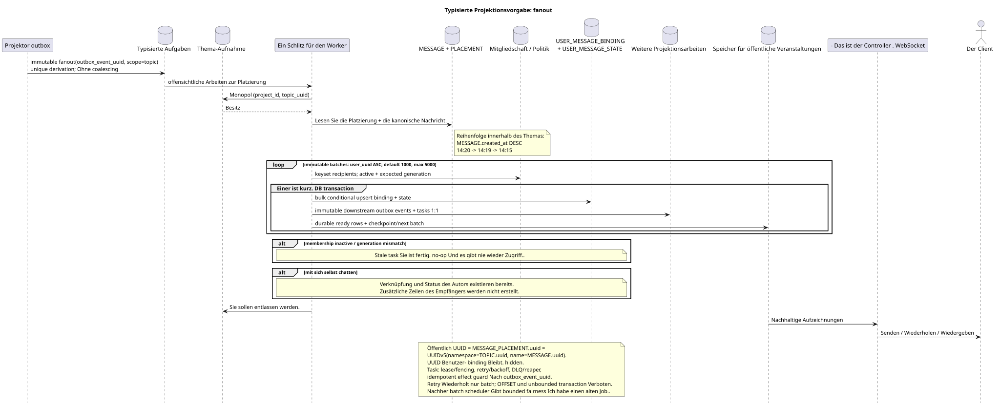

# Typisierte Aufgabe: `fanout`

[← Hauptindex der Dokumentation](../../../index.md) · [Index der Abfolge-Diagramme](../README.md) · [Verteilen von Workflow-Daten](README.md)

Status: **gebotener Hintergrundstrom; kein Endpunkt HTTP**.

Ausgangsgestalt , die bearbeitet werden kann:
[`task_fanout.puml`](diagrams/task_fanout.puml).

## Zweck und Quelle der Wahrheit

Die Aufgabe baut das fehlende Paar auf `USER_MESSAGE_BINDING` +
`USER_MESSAGE_STATE` für jeden zugelassenen Empfänger einen offensichtlichen
`MESSAGE_PLACEMENT`. Die Platzierung enthält eindeutig bereits die kanonischen
`message_uuid`, `stream_uuid` und verpflichtend `topic_uuid`; Vorker nicht heraus
Der kanonische `MESSAGE` ist physisch eins, und
Die öffentliche UUID/Parameter `{message_uuid}` ist
`MESSAGE_PLACEMENT.uuid = UUIDv5(namespace=TOPIC.uuid, name=MESSAGE.uuid)`.

## Der Fluss

1. Synchronisierte Sendung erzeugt `MESSAGE`, `MESSAGE_PLACEMENT`,
   Autoren `USER_MESSAGE_BINDING` und `USER_MESSAGE_STATE` sowie
   Der Autor sieht die Nachricht sofort..
2. Der Projektor führt eine immutable `fanout` root-Task pro Ereignis aus
   outbox; einzigartiger Ableitungsschlüssel enthält `outbox_event_uuid`, coalescing
   nicht vorhanden.
3. Der Schlot erhält die monopolistische Eroberung `(project_id,topic_uuid)`.
4. Die wartenden Platzierungen werden nach der kanonischen
   `MESSAGE.created_at DESC`: `14:20`, `14:19`, `14:15`.
5. Der Worker liest den letzten Status der Mitgliedschaft/Politik.
   erwartet `membership_generation`; der Empfänger ist nur zulässig , wenn
   `USER_STREAM_BINDING.active = true` Und genau zusammenfallen. generation.
6. Root Erstellt unveränderliche Batches mit default `1000`, maximum `5000`.
   werden mit einer Keyset-Anfrage `USER_STREAM_BINDING.user_uuid ASC` ohne `OFFSET`;
   Der Wert von config ist außerhalb von `1..5000` und blockiert startup.
7. Jeder kurze Batch überprüft die Membership Generation und bulk
   insert/upsert Erstellt `USER_MESSAGE_BINDING`, einzigartig in
   `(project_id,placement_uuid,user_uuid)`, mit einer Generation Snapshot, und
   `USER_MESSAGE_STATE`, Einzigartig nach
   `(project_id,user_uuid,placement_uuid)`. Stale task macht No-op und kann nicht
   Zugang wieder aufleben lassen; die neue Generation der Mitgliedschaft erhält frische binding/state.
8. In derselben Batch-Transaktion werden separate immutable downstream outbox
   events und entsprechende tasks 1:1: placement/topic-scoped Arbeit
   bleibt im Scope `topic`, die Aggregate werden in
   `user-stream`/`user-folder`/`user-topic`; Eine Aufgabe entspricht einer anderen
   Eigene source event.
9. Binding/state, downstream outbox/tasks und ready event rows commit/rollback
   Checkpoint cursor/count/status und der nächste immutable batch
   Die Dispatcher liefern nur nach einer erfolgreichen Charge..

Der Chat mit sich selbst hat bereits die Urheberrechte `USER_MESSAGE_BINDING` und
`USER_MESSAGE_STATE` Nach dem Ausschluss
Der Autor der Annahme ist leer, also ist der Fan-Out erfolgreich ohne
neue Zeilen des Empfängers und ohne Nachrichtenspurduplikat in UI.

## Wiederholungen, Rennen und Konsistenz

- Die Aufgabe lässt sich wiederholen: Einzigartige Schlüssel und Zustände verhindern
  - Das ist ein Duplikat .;
- retry Wiederholt nur den aktuellen batch; root+start cursor — unique derivation
  key, Die bereits festgelegten Batches werden nicht mehr abgespielt;
- Parallel Fan-out ein Thema gibt es nicht dank der Monopol-Griff;
- verschiedene Themen können innerhalb des eingestellten Limites parallel bearbeitet werden;
- Vorker liest den letzten Ausgangszustand und vergleicht die erwartete Generation;
- Die Aufgabe geht `pending -> leased/running -> completed/failed`, verwendet
  lease expiry/fencing, retry/backoff, DLQ und reaper; `outbox_event_uuid`
  Sie sorgt für eine effect guard;
- topic-worker ändert nicht shared stream/folder/message rows: für sie werden
  Aufgaben des tatsächlichen Bereichs;
- Die Zeitmarkierung der Bindungen ändert nicht das öffentliche Datum/die Anordnung der Nachricht;
- Der Empfänger sieht die Nachricht nach der atomaren Festsetzung binding/state/event mit
  Verzögerung; etwa eine Sekunde und `<=1s p95` batch transaction  SLO intent für
  Die hard guarantee;
- Nach jedem Batch kann topic claim zu einem alten Job wechseln; newest-first nicht
  Sie wird aufgehoben. bounded fairness;
- metrics: batch latency/rows/WAL, recipients remaining, fanout lag, oldest
  batch, retries/DLQ. Unbounded recipient transaction Verboten.

[← Hauptindex der Dokumentation](../../../index.md) · [Index der Abfolge-Diagramme](../README.md) · [Verteilen von Workflow-Daten](README.md)
