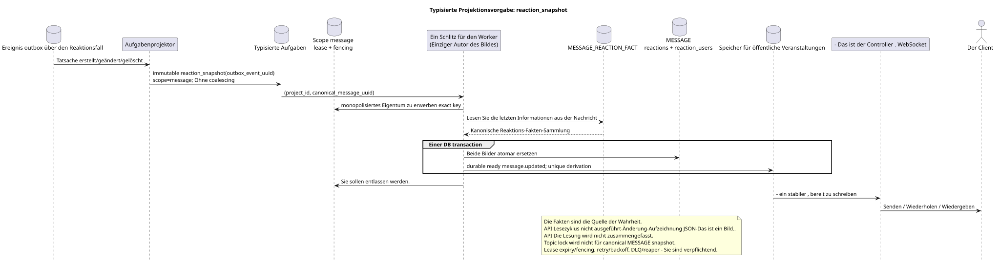

# Typisierte Aufgabe: `reaction_snapshot`

[← Hauptindex der Dokumentation](../../../index.md) · [Index der Abfolge-Diagramme](../README.md) · [Verteilen von Workflow-Daten](README.md)

Status: **gebotener Hintergrundstrom; kein Endpunkt HTTP**.

Ausgangsgestalt , die bearbeitet werden kann:
[`task_reaction_snapshot.puml`](diagrams/task_reaction_snapshot.puml).

## Zweck und Quelle der Wahrheit

Die Rohzeilen `WorkspaceMessageReactionFact` sind die einzige Quelle
Der Geschäftsschlüssel `(project_id,canonical_message_uuid,user_uuid,emoji_name)` verbietet
Eine Kopie einer Reaktion eines Teilnehmers auf eine kanonische Nachricht.
Die Angabe der Angabe ist nur für die Zugriffsprüfung API erforderlich; die Reaktion bezieht sich nicht auf
- eine spezielle.

## Der Fluss

1. Eine Reaktion zu erstellen/zu ändern/zu löschen verändert genau die eine, die
   Benutzer die Datenzeile anzeigen und ein unveränderliches Outbox-Ereignis in der Kurzzeit hinzufügen
   Transaktionen.
2. Der Projektor liefert eine immutable `reaction_snapshot` Task für source event;
   `outbox_event_uuid` ist ein einzigartiger derivation/effect Schlüssel.
3. Die Aufgabe wird mit dem Schlüssel in den Scope `message` geleitet
   `(project_id, canonical_message_uuid)`. Ein Lease/fencing Token erlaubt
   Aufzeichnungen nur für einen Eigentümer; topic lock nicht verwendet.
4. Worker liest die letzten Rohdaten und in einem DB-Transaktion ganz
   Ersetzt `MESSAGE.reactions`/`MESSAGE.reaction_users` ** zusammen mit ** mit allen
   mit den entsprechenden durable ready `message.updated` rows; beide Effekte commit
   oder rollback zusammen.
5. Nach dem commit liefert der Manager bereitgestellte rows.

## Wiederholungen, Rennen und Konsistenz

- Parallele Teilnehmer setzen/löschen unabhängige Faktenzeilen sicher ein;
- Das Duplikat des Geschäftsschlüssels wird durch den aktuellen Konfliktvertrag bearbeitet;
- API führt nie den lesen-Ändern-Schreiben-Zyklus des allgemeinen JSON-Bildes aus;
- Wiederholung der Aufgabe erzeugt das gleiche Bild des letzten Zustands;
- task lifecycle beinhaltet lease expiry, retry/backoff, DLQ und reaper; initial
  design nicht erfüllt coalescing;
- API Die Lesung/die Liste sammelt keine Fakten und kann kurz die vorherige zurückgeben
  Das ist ein Foto.;
- Die öffentliche Projektion `provider`/`delivery` bleibt erhalten, roh
  `provider_metadata`/`delivery_metadata` nicht veröffentlicht werden.

[← Hauptindex der Dokumentation](../../../index.md) · [Index der Abfolge-Diagramme](../README.md) · [Verteilen von Workflow-Daten](README.md)
