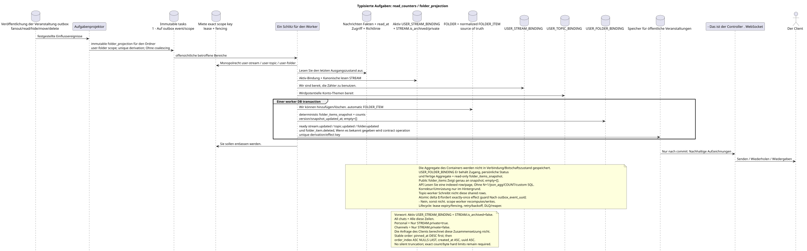

# Typisierte Aufgaben: `read_counters` und `folder_projection`

[← Hauptindex der Dokumentation](../../../index.md) · [Index der Abfolge-Diagramme](../README.md) · [Verteilen von Workflow-Daten](README.md)

Status: **gebotener Hintergrundstrom; kein Endpunkt HTTP**.

Ausgangsgestalt , die bearbeitet werden kann:
[`task_read_counters.puml`](diagrams/task_read_counters.puml).

## Zweck und Quelle der Wahrheit

Der ursprüngliche Status einer einzelnen Nachricht enthält die gespeicherten `read_at`
(öffentliche `read = read_at IS NOT NULL`) und persönliche Flaggen.
Die Kontainer werden nicht in `USER_MESSAGE_BINDING`/`USER_MESSAGE_STATE`.
Die fertigen Zähler werden in einzigartigen `USER_STREAM_BINDING
(project,user,stream)`, `USER_TOPIC_BINDING (project,user,topic)` und
`USER_FOLDER_BINDING (project,user,folder)`.

Die kanonische `FOLDER` wird einmal gespeichert; `FOLDER_ITEM` verbindet sie mit
kannonisch unterstützten Objekt, z.B. mit `STREAM`, entsprechend dem aktuellen
`USER_FOLDER_BINDING` bestimmt Benutzerzugriff und
Die Datenbank enthält die persönlichen Daten des Ordners und enthält die bereitgestellten Aggregate der nicht gelesenen Nachrichten
und Erwähnungen.
Normalisierte `FOLDER_ITEM`  Source of truth Zusammensetzung, und read-only
JSONB `USER_FOLDER_BINDING.folder_items_snapshot` — bereit öffentlich
Form. Leer Array ist gleich `[]`; Zeilen werden serialisiert
mit dem Konto aus `USER_STREAM_BINDING`.
Genaue Reihenfolge: pinned items zuerst über `pinned_at DESC`, dann
Restliche; innerhalb der Gruppe — `order_index ASC NULLS LAST`, `created_at ASC`,
`uuid ASC`. Version/Zeit-Snapshot ist intern und nicht öffentlich ersetzt
Das Bild wird nicht still beschnitten, sondern vor der Umsetzung
Zahlen-Hard Limits count/bytes und eine kompatible Politik für nicht beschneidbare
Systemische `All chats`.
Systembindungen von Ordnern haben eine feste interne Regel und einen festen Typ, und ihre
Die automatische `FOLDER_ITEM` ist eine umkonstruierbare Projektion.
Ausgangspredikat  aktiv `USER_STREAM_BINDING`, verbunden mit der kanonischen
`STREAM`, für die `STREAM.is_archived = false`. `All chats` beinhaltet alles
solcher Zeilen, `Personal`  nur Zeilen mit `STREAM.private = true`, `Channels`
— Nur mit `STREAM.private = false`.

## Trigger und Fluss {#триггеры-и-поток}

Eine eigene Aufgabe entsteht nach dem Fan-Out, dem Lesen von Post/Theme/Flow,
Lesen bis zur Angabe der Nachricht, Verbergen, Verschieben, Löschen der Nachricht/der Nachricht,
Änderungen der Mitgliedschaft/Politik, Erstellung/Aktualisierung/Löschung `USER_STREAM_BINDING`, Archivierung
oder Änderungen `STREAM.private` und andere Operationen, die die effektive
Nichtgelesenen Nachrichten zu klassifizieren.

1. Die ursprüngliche Transaktion oder der vorherige Worker schreibt eine separate immutable
   outbox event mit einem neuen UUID für jeden betroffenen tatsächlichen Bereich; Projektor
   führt aus jedem Ereignis genau eine Aufgabe nach
   `UNIQUE(project_id,outbox_event_uuid)`. Für den Ordner exact kind —
   `folder_projection`, exact scope —
   `user-folder:(project_id,user_uuid,folder_uuid)`; coalescing nicht vorhanden.
2. Der Eigentümer von exact scope wird von fencing token: `user-stream`,
   `user-topic` oder `user-folder`. Topic-worker schreibt diese nicht auf shared rows.
   Der Besitzer liest die aktuellen Informationen, Zugangs- und Benachrichtigungsrichtlinien seiner Region.
3. Der Arbeiter schreibt die bereitgestellten Zähler `raw`/`active`/`passive` und
   `last_message_uuid` zum Binden des Benutzers an den Stream,  zum Binden der Themenzähler
   Benutzer zum Thema, und bereit `unread_count` und Aggregate von Ordner Erwähnungen —
   Benutzer in den Ordner binden.
4. Für Systemordner liest er die aktuelle aktive `USER_STREAM_BINDING` und
   kannonischer `STREAM`, lässt nur `STREAM.is_archived = false` zurück, dann
   Idimpotent führt automatisch `FOLDER_ITEM` zu den Regeln: alle übrigen
   Zeilen für `All chats`, `STREAM.private = true` für `Personal` und
   `STREAM.private = false` für `Channels`.
5. In **einer worker DB transaction** gibt der Besitzer exact scope an
   automatic `FOLDER_ITEM` Die Quelle der Wahrheit ersetzt die fertige Projektion und alles, was sie hat.
   state/snapshot/version/timestamp, und auch alle ready
   `topic.updated`, `stream.updated`, `folder.updated` oder
   `folder_item.deleted` event rows für wirklich veränderte Ressourcen.
   Ein Ausfall verhindert die Projektion und ready event rows.
6. Nur nach dem commit sendet, wiederholt und spielt der Manager
   Es erstellt keine dauerhaften Aufzeichnungen. business event.

API Vorstellungen für den Stream/Theme/Ordner verbinden nur eine vorbereitete
Die Folge `folder_items` liegt bereits in dieser Zeile als
Ich bin bereit .JSONBSie sind nicht
Sie können `COUNT`, `GROUP BY`, Fenster, lateral oder korrelierte Anfragen ausführen und nicht
Die volle Umzählung ist nur als offene Hintergrundzählung zulässig.
Korrektur-/Umstrukturierungsvorgabe.

## Wiederholungen, Rennen und Konsistenz

- Die Aufgabe liest die letzten Quellen und ersetzt die Projektion;
- Einzigartige Benutzerschlüssel von Containern schließen konkurrierende Zeilen aus
  - von Aggregaten;
- Gleichzeitig ist ein Lease auf exact scope key; verschiedene Bereiche können
  Parallel aktualisiert und sichtbar werden eventual-consistently;
- Atom-Delta-Zähler ist nur mit exactly-once effect guard
  `outbox_event_uuid`; Ansonsten scope worker determinant rechnet und
  ersetzt die Zeile;
- task lifecycle, lease expiry/fencing, retry/backoff, max attempts/DLQ und reaper
  entsprechen der allgemeinen Architektur; initial design nicht coalescing;
- Wiederholung ist sicher; das vorbereitete Ereignis tritt erst nach
  - die Festsetzung des Zustands;
- Die Antwort auf die Klientendaten kann etwa eine Sekunde vor dem Update liegen
  Es ist eine geplante Übereinstimmung im Endeffekt..

[← Hauptindex der Dokumentation](../../../index.md) · [Index der Abfolge-Diagramme](../README.md) · [Verteilen von Workflow-Daten](README.md)
