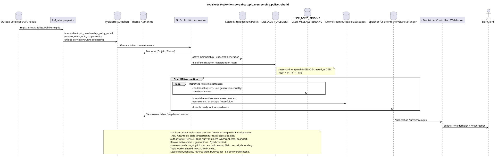

# Typisierte Aufgabe: `topic_membership_policy_rebuild`

[← Hauptindex der Dokumentation](../../../index.md) · [Index der Abfolge-Diagramme](../README.md) · [Verteilen von Workflow-Daten](README.md)

Status: **gebotener Hintergrundstrom; kein Endpunkt HTTP**.

Ausgangsgestalt , die bearbeitet werden kann:
[`task_topic_membership_policy_rebuild.puml`](diagrams/task_topic_membership_policy_rebuild.puml).

## Zweck und Quelle der Wahrheit

Die Aufgabe aktualisiert die Sichtbarkeit des Benutzers in dem Thema, die Berechtigungen und die betroffenen bereit
Die kanonische `TOPIC` wird allein gespeichert
Einmal; Zugriff, Benachrichtigungen und Zähler des Benutzers gehören einer einzigartigen
`USER_TOPIC_BINDING (project,user,topic)`. Vorgestellter Nachrichtenkontext
kommt nur aus dem offensichtlichen `MESSAGE_PLACEMENT`, nicht aus der Verbindung.

## Der Fluss

1. Die Mitgliedschaft/Politik-Team registriert die Autorität der Änderung und die Unveränderlichkeit
   Ereignis outbox.
2. Der Projektor führt eine immutable Task für ein Source-Outbox-Event in scope
   `topic`; `outbox_event_uuid` Einzigartig, keine Koalition.
3. Ein Slot erhält monopolisierte Besitzungen über das Thema; verschiedene Themen können
   Parallel bis zum eingestellten Limit verarbeitet werden.
4. Worker liest den letzten Status der Mitgliedschaft / Politik und offensichtliche Veröffentlichungen;
   membership-dependent task Er trägt das erwartete `membership_generation`.
5. Der Conditional-upsert-Worker erstellt/aktualisiert Access-Reihen und entsprechende
   durable ready topic-scoped event rows Eine DB-Transaktion nur bei active
   `USER_STREAM_BINDING` und generation; stale task macht no-op.
   Revoke Der Read Path ist bereits synchron verboten, und das Cleanup der alten Reihen ist nicht möglich
   security boundary.
6. Der Worker erzeugt einzelne tasks `user-stream`/`user-topic`/`user-folder`
   für shared rows; topic worker ändert sie nicht selbst und führt keine schwierigen Aufgaben aus
   Aggregat in der Anfrage API.
7. Nach dem Commit liefert ein separater Administrator ready topic-scoped events.
   Projektionen/ready events des Flusses, Ordner und andere shared rows werden erstellt
   Einzelne exact-scope-Tasks und auch atomar in ihren Transaktionen.

## `topic_state_projection` {#topic_state_projection}

Derselbe topic-owned flow dokumentiert einen separaten genauen TASK_KIND
`topic_state_projection`: Nach dem synchronen Commit
`TOPIC.is_done`/version Er ist im Scope `(project_id,topic_uuid)` atomar fixiert.
bereit `topic.updated` und wenn es physisch notwendig ist, rebuildable read-only copy.
Diese Aufgabe ändert nicht die autoritative `TOPIC.is_done` und hat ihre eigene source
outbox event/`outbox_event_uuid`.

## Wiederholungen, Ordnung und Konsistenz

- Der Worker erhält eine offensichtliche Aufgabe; das Scannen der Tabelle auf der Suche nach fehlenden
  Das Bindungszeichen wird nicht verwendet;
- Massenverbindungen innerhalb des Themas
  `MESSAGE.created_at DESC` (`14:20`, `14:19`, `14:15`) und garantiert die endgültige
  Fortschritt;
- einzigartiger Schlüssel der Bindung des Benutzers an das Thema verhindert Duplikate der Zugriffszeile/des Zustands;
- Aufgabe liest die letzte Richtlinie und überprüft generation; Wiederholung ist möglich
  nach `outbox_event_uuid`;
- lease expiry/fencing, retry/backoff, max attempts/DLQ Und der Reaper ist verpflichtend.;
- Umbau/Berichtigung wird nie durch `GET` oder eine Liste durchgeführt;
- Der Benutzer kann kurz die vorherigen Zugriffe/Zähler vor der Festsetzung sehen
  Projektion; nach dem bereit Ereignis Zustand REST und WebSocket vereinbart.

[← Hauptindex der Dokumentation](../../../index.md) · [Index der Abfolge-Diagramme](../README.md) · [Verteilen von Workflow-Daten](README.md)
