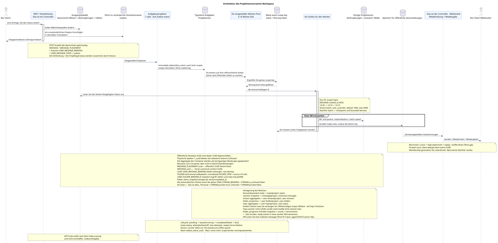

# Architektur des Vorker

[← Hauptindex der Dokumentation](../../../index.md) · [Index der Abfolge-Diagramme](../README.md) · [Verteilen von Workflow-Daten](README.md)

Status: **Vorschlag, der mit Dokumentation begonnen hat; öffentlich API Workspace nicht geändert**.

Dieses Dokument beschreibt den allgemeinen Hintergrundweg, auf den sich die Spezifikationen beziehen.
Hier wählen Sie nicht die Produktionsumwandlung, die Parameter
Konfiguration, Warteschlange/Leasing-Technologie und SQL.

Ausgangsgestalt , die bearbeitet werden kann:
[`worker_architecture.puml`](diagrams/worker_architecture.puml).

## Grenze API und Hintergrundbearbeitung

Jede Transaktion API ändert den Status atomar  Quellen
und fügt ein unveränderliches Domänenereignis in das Transaktionsjournal hinzu
(transactional outbox). `GET` und Listeoperationen keine Ereignisse oder
Die ursprüngliche Design ** hat kein coalescing **: jedes Ereignis outbox
entspricht einer einzelnen unveränderlichen typischen Aufgabe mit einem einzigartigen
`outbox_event_uuid`/Die Ableitung ist eine Wiederholung der Aufgabe für die gleiche
Die Nutzlast der Aufgabe ist nicht
ersetzt die Wahrheit: der Worker (worker) liest bei jeder Ausführung die letzten
festgelegte Zeilen.

Synchronisierte Nachrichtensendung ist auf die Anzahl begrenzt `MESSAGE` +
`MESSAGE_PLACEMENT` + Autoren `USER_MESSAGE_BINDING` + Autoren
`USER_MESSAGE_STATE` + transactional outbox. Bindung und Zustand
Jeder Empfänger wird gemeinsam über eine Lüfterverbreitung erstellt
(fan-out) bounded batches; Die meisten der neuen Technologien, die wir heute kennen, sind die, die die Container-Aggregate und die öffentlichen Veranstaltungen später erscheinen lassen.
mit sich selbst bereits bestehende Urheberbindung und Status; Fan-out erstellt keine
Zusätzliche Zeilen des Empfängers.

## Parallelismus und Ordnung

- Die maximale Anzahl der gleichzeitig aktiven Worker-Slots wird angegeben
  Konfiguration; Parametername und Ausführungsmechanismus bleiben offen;
- für topic-scoped Arbeit Einheit des monopolistischen Besitzes —
  `(project_id, topic_uuid)`, Es ist nicht der Strom.;
- ein Thema gehört gleichzeitig nicht mehr als einem Slot; verschiedene Themen
  parallel innerhalb der `N`;
- Die Grundordnung innerhalb des Themas  `MESSAGE.created_at DESC`: `14:20`, dann
  `14:19`, Dann `14:15`;
- Zeitzeichen von Aufgaben und Bindungen ändern nicht die Ordnung oder öffentliche Zeitzeichen
  Nachrichtenmarkierungen;
- Stabiler Kurzer bei gleicher Zeit, die Umsetzung der Erfassung und begrenzte
  Die Gerechtigkeit bleibt die engsten offenen Lösungen für die Umsetzung;
- Die Bearbeitung von neuen Eintrag zu alten kann den alten nicht unbegrenzt sperren
  Arbeit.

Fan-out root Scans das active `USER_STREAM_BINDING` Keyset nach `user_uuid ASC`,
nicht `OFFSET`. Default batch  `1000`, hard maximum  `5000`; Konfiguration außerhalb
`1..5000` Sie werden nicht durch Startup-Validierung geprüft. batch commit
Sie werden mit dem Cursor/count/status fixiert und erst dann erscheint der folgende immutable
batch. Scheduler Nach batch gibt bounded fairness den alten roots/history; eins
Ein großes Publikum nimmt nicht unbounded transaction.

## Besitz von Projektionen

`TOPIC` ist nicht ein universelles Block. Jede Aufgabe enthält
`scope_kind` und genau `scope_key`; gleichzeitig nicht mehr als eine Miete
Mit einem fencing token für einen genauen Schlüssel.
werden parallel im Rahmen des Poollimits bearbeitet:

| Aufgabenart | Besitzbereich | Aufzeichnungsgarantie |
| --- | --- | --- |
| `fanout`, placement-scoped `content_mentions`, history/backfill | `topic`: `(project_id, topic_uuid)` | Folgearbeit mit Placements/bindings eines Themas `MESSAGE.created_at DESC` |
| `reaction_snapshot` und andere Aufnahmen der kanonischen Nachricht | `message`: `(project_id, canonical_message_uuid)` | Ein Autor `MESSAGE.reactions`/`reaction_users` |
| Stromaggregate | `user-stream`: `(project_id, user_uuid, stream_uuid)` | ein Autor der fertigen Zeile `USER_STREAM_BINDING` |
| `folder_projection` | `user-folder`: `(project_id, user_uuid, folder_uuid)` | Ein Autor normalized `FOLDER_ITEM`, `folder_items_snapshot`, fertig Zähler und ready event |
| Themenaggregate | `user-topic`: `(project_id, user_uuid, topic_uuid)` | ein Autor der fertigen Zeile `USER_TOPIC_BINDING` |
| Lieferung und andere gemeinsame Zeilen | Ein offensichtlich deklariertes Gebiet, das der physischen Zeile entspricht | Unbemerktes Fallback ist verboten `topic` |

Topic-worker Sie können die unsichere Read-Modify-Write-Verbindung nicht ausführen.
Der Delta-Zähler ist nur durch eine atomare Incrementation /decrement mit exactly-once
effect guard, einzigartig nach `outbox_event_uuid`; ansonsten ist der Besitzer der entsprechenden
Die Projektion wird von der Quelle abgelesen und durch die Projektion ersetzt.
Die Ergebnisse und öffentliche
Ereignisse können zu verschiedenen Zeiten im Rahmen der eventual
consistency.

`MESSAGE`, `STREAM`, `TOPIC` und `FOLDER`  kanonische Wesen in einem einzigen
Die Platzierung gibt den Kontext des Nachrichten deutlich an.
UUID Nachrichten  `MESSAGE_PLACEMENT.uuid`; kanonische `MESSAGE.uuid` bleibt
UUID Inhalt, und UUID Benutzerbindung bleibt verborgen
die technische Identität der Zeile.
Benutzeraggregate von Containern werden auf einzigartigen
`USER_STREAM_BINDING`, `USER_TOPIC_BINDING` und `USER_FOLDER_BINDING`.
`USER_MESSAGE_BINDING`/`USER_MESSAGE_STATE` Speichern nur Zugriff und Status
eine Nachricht (`read_at`, `mentioned`/`starred`/`pinned` und ähnliche Flaggen), aber
Sie enthalten niemals Containerzähler..

Die kanonische `FOLDER` wird einmal gespeichert. `USER_FOLDER_BINDING` bestimmt
Zugang des Benutzers, sein persönlicher Zustand und die bereitgestellten Aggregate der nicht gelesenen
`FOLDER_ITEM` verbindet den Ordner mit dem kanonischen
Einer unterstützten Einrichtung, z.B. mit `STREAM`, gemäß der aktuellen öffentlichen
Die automatische Zusammensetzung der Systemordner wird nur aus aktiven
`USER_STREAM_BINDING`, verbunden mit der kanonischen `STREAM`, für die
`STREAM.is_archived = false`: `All chats` beinhaltet alle diese Ströme,
`Personal` — Nur `STREAM.private = true`, `Channels`  nur
`STREAM.private = false`. Öffentliche Endpunkte, JSON und benutzerdefinierte
Die Semantik von Ordnern und Ordnerelementen (`folders`/`folder_items`) bleiben ohne
Änderungen.

Normalisiert `FOLDER_ITEM` — source of truth. `USER_FOLDER_BINDING`
Speichert auch read-only JSONB `folder_items_snapshot` mit genau
öffentliche Form (`[]` für leere Ordner), interne Version und Zeit
`folder_projection` serialisiert items in einer stabilen Reihenfolge und
Atomisch festhält Snapshot + Counts + Version/timestamp + alle ready event
rows. Nur nach dem Commit kann der Verwalter diese Ereignisse liefern. API
Liest eine fertige Zeile/Seite ohne N+1, `json_agg`, `COUNT` und custom SQL.

Die vorgestellten Aufgaben aktualisieren die fertigen Projektionen (projection).
Wiederherstellung aus den ursprünglichen Fakten oder Verknüpfungen nur als Hintergrund erlaubt
Die API-Vorstellungen werden nur von einfachen indexierten
Ein-zu-einem oder mehr-zu-einem Verbindungen und nicht enthalten , die bei
Anfrage `COUNT`, `GROUP BY`, Fenster, lateral oder korrelierte Anfragen.

Die Reaktionsfakten sind die Quelle der Wahrheit. `message`
Materialiert die kanonischen `MESSAGE.reactions` und `MESSAGE.reaction_users`; API
nicht den allgemeinen Zyklus Lesen-Ändern-Schreiben ausführt» (read-modify-write) JSON.

## Öffentliche Veranstaltungen und Lieferung

Handler fixiert materialized state und alle entsprechenden durable ready event
rows in einer DB-Transaktion: beide Effekte commit oder rollback zusammen. Unique
event derivation key auf `outbox_event_uuid` verhindert, dass die Vervielfältigung bei retry.
Ein separater WebSocket Dispatcher erstellt keine Business-Event: er liest durable
store, Sendet/wiederholt/wiederholt, und network send hat keinen Einfluss auf
Langlebigkeit.

Reconnect Der Dispatcher wird die letzte verarbeitete Cursor-Datei anzeigen.
high-watermark, replay alle neuen sichtbaren Zeilen, buffert live tail und
drain-Lieferung at-least-once; Client dedupe nach event UUID und
cursor advance Ein zu alter Cursor gibt einen offensichtlichen
`epoch_pruned`/`410`; retention window Bleibt. operational policy. Data event
audience Es speichert die Membership Generation, also inactive/new generation
unterdrückt stale delivery/replay nach revoke.

## Garantie bei Ausfällen

- Quelle ändern und Atomare in Outbox hinzufügen;
- derivation verwendet einzigartige `(project_id, outbox_event_uuid)`, also
  Wiederholung erzeugt keine zweite Aufgabe, aber Reconciliation stellt die Aufgabe für
  Die Ausbox-Ereignis wird zwischen der Erfassung der Ereignis und der derivation;
- Aufgabe-Lebenszyklus: `pending -> leased/running -> completed` oder
  `failed -> pending` mit `attempts`, `next_retry_at` und backoff; nach
  `max_attempts` Die Aufgabe fällt in DLQ;
- Die Miete speichert den Eigentümer, den Expiry und das Fencing-Token; der Reaper gibt das abgelaufene zurück
  `running` Die Aufgabe ist zu erledigen, und der veraltete Besitzer kann die Aufzeichnung nicht einloggen;
- Wiederholung ist dank einzigartiger Geschäftsschlüssel sicher,
  `outbox_event_uuid` effect guard und dem impotenten Aufzeichnen von Projektionen;
- Ein Worker Transaction-Fehler rückt die Projektion zurück und ready events; retry
  Ich habe zwei Effekte.;
- Wiederholung des Verwalters wiederholt keine Domänenänderung und verwendet eine stabile
  Identifizierer/Kursor des Ereignisses;
- Die Metriken decken lag, pending/running age, retries, expired leases, stuck
  tasks und DLQ; kein Zusammenwachsen bedeutet eine Aufgabe pro Ereignis,
  Daher sind capacity/backpressure ein zwingender Teil der Nutzung.

## Typisierte Aufgabenkatalog

| Aufgabenart | Scope kind/key | Das Ergebnis ist fertig |
| --- | --- | --- |
| `fanout` | `topic`: `(project_id, topic_uuid)` | `USER_MESSAGE_BINDING` + `USER_MESSAGE_STATE` Empfängerpaare |
| `content_mentions` | `topic`: `(project_id, topic_uuid)` für den Placement State; einzelne Downstream-Aufgaben für die allgemeinen Zeilen | Flags der Platzierungs-Erwähnung |
| `reaction_snapshot` | `message`: `(project_id, canonical_message_uuid)` | Bilder `reactions` + `reaction_users` |
| `read_counters` | `user-stream`: `(project_id, user_uuid, stream_uuid)` | Fertige Aggregate `USER_STREAM_BINDING` |
| `folder_projection` | `user-folder`: `(project_id, user_uuid, folder_uuid)` | normalized items + `folder_items_snapshot` + Zähler + Version/timestamp + ready event atomar |
| `read_counters` | `user-topic`: `(project_id, user_uuid, topic_uuid)` | Fertige Aggregate `USER_TOPIC_BINDING` |
| `delivery_snapshot_event` | `message:(project_id,canonical_message_uuid)` für die Lieferung oder `resource:(project_id,resource_kind,resource_uuid)` | Sanitierte Projektion/ready Event oder effect-guarded no-public-event completion |
| `topic_membership_policy_rebuild` | `topic`: `(project_id, topic_uuid)`; shared rows — Einzelne Aufgaben des tatsächlichen Bereichs | Fertiges Binden/Zulassungen |
| `topic_state_projection` | `topic`: `(project_id, topic_uuid)` | ready `topic.updated` und freiwillige read-only copies canonical `TOPIC.is_done` |

Detaillierte Aufgabenflüsse:

- [`fanout`](task_fanout.md)
- [`content_mentions`](task_content_mentions.md)
- [`reaction_snapshot`](task_reaction_snapshot.md)
- [`read_counters`](task_read_counters.md)
- [`delivery_snapshot_event`](task_delivery_snapshot_event.md)
- [`topic_membership_policy_rebuild`](task_topic_membership_policy_rebuild.md)

[← Hauptindex der Dokumentation](../../../index.md) · [Index der Abfolge-Diagramme](../README.md) · [Verteilen von Workflow-Daten](README.md)
