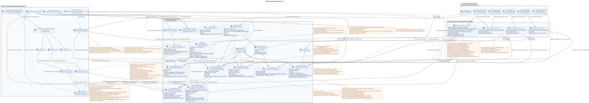

# Projekt-Domainmodell Messenger API

Status: **Ein Vorschlag für eine künftige Neugestaltung**.

Dieses Dokument beschreibt die Ziel-Ebene Messenger API.
ändert aktuelle Routen, JSON-Felder, Filter, Pagination, Aktionen, Ereignisse
Oder ...WebSocketDer aktuelle öffentliche Vertrag ist in
[`workspace_api.md`](workspace_api.md) und bleibt eine harte Invariante.
Die Domänenlösungen sind in
[`messenger_domain_model.md`](messenger_domain_model.md).
Konkrete Erklärungen RestAlchemy, Anzeige der Felder und vollständiger Vertrag
Die wichtigsten Endpunkte befinden sich in
[`messenger_restalchemy_api_spec.md`](messenger_restalchemy_api_spec.md).

Die Begriffe werden in den [allgemeines Glossar](index.md#глоссарий-проектной-документации):
Platzierung (placement), Bindung (binding), Transaktionsjournal der ausgehenden
Ereignisse (transactional outbox), Projektion (projection), Windverbreitung
(fan-out) und Hintergrund-Aussteller (worker).

## Grenze zwischen aktuellem Zustand und Projektangebot

Die aktuelle Implementierung enthält bereits öffentliche Domänenmodelle
`WorkspaceUserMessage`, `WorkspaceUserStream`, `WorkspaceUserTopic` und
`WorkspaceUser`. Die ersten drei werden von den SQL-Vorstellungen gelesen, und die Controller Messenger
Sie benutzen `StoreResourceController` und `sql_canonical_store`.
Die aktuellen Vorstellungen werden von Aggregaten, seitlichen/korrelierten Unteranfragen und
andere Berechnungen auf dem Leseweg.

Das Zielmodell behält die öffentlichen Namen und Form der Ressourcen, ändert aber nur diese
Innenquelle:

- Die physischen in den SQL RestAlchemy-Modellen gespeicherten Daten speichern kanonische Daten und
  Vorher verwirklichtes Nutzungszustand;
- SQL-Vorstellungen nur zum Lesen passen eine flache Form an und führen keine schweren
  Berechnungen;
- `ResourceByRAModel`, Standard `objects`/`filters` und skalar UUID Eigenschaften
  für öffentliche UUID-Verweise; physische Spalten bleiben indexiert FK;
  Pagination-Controller bedienen den normalen Lesegang;
- Die Einschränkung der Bereiche und die Neudefinition der Controller bleiben nur dort, wo sie benötigt werden.
  IAM-Kontext, Speicherung der Namen query/header und marker shape bei angenommenen target
  Pagination `100/500`, oder Domänenaktionen;
- Handgeschriebenes SQL und das aktuelle nicht-standardabhängige SQL Speicher sind nicht in die Haupt-
  Anfrage-Pfad.

Keine der Tabellennamen oder neuen Spalten, die unten als Entwurf markiert sind, sind
Dieses Dokument erlaubt nicht, dass neue öffentliche
Endpunkt oder Feld.

## Drei Schichten

Bearbeitbarer PlantUML-Quelltext:
[`messenger_api_domain_model.puml`](diagrams/messenger_api_domain_model.puml).

| Öffentliche RestAlchemy-Modelle | Bestätigter aktueller Quell | Zielquelle |
| --- | --- | --- |
| `WorkspaceUserMessage` | `m_workspace_user_messages_view` | `messenger_api_user_messages_v1`: führende `USER_MESSAGE_BINDING`, indexierte Joins mit einem placement/message/state. |
| `WorkspaceUserStream` | `m_workspace_user_streams` | `messenger_api_user_streams_v1`: Führende `USER_STREAM_BINDING`, bereit Zähler und eine canonical stream. |
| `WorkspaceUserTopic` | `m_workspace_user_topics_view` | `messenger_api_user_topics_v1`: führende `USER_TOPIC_BINDING`, bereit user counts und ein canonical topic mit global `is_done`. |
| `WorkspaceUser` | `m_workspace_users` | Direktes Ziel `WorkspaceUser`/`messenger_users`; keine separate berechenbare Ansicht erforderlich. |

`WorkspaceStreamBinding`, `WorkspaceStream`, `WorkspaceUserTopicFlags`,
`WorkspaceStreamTopic` und `WorkspaceUser`  bestätigte aktuelle Namen
RestAlchemy-Die aktuelle Physik `WorkspaceMessage` verwendet
`m_workspace_messages`; Dieser Name ist nur für den Vergleich mit dem aktuellen
Zielvorgabe für die zukünftige Migration ist die Verwendung von einheitlichen Paaren
Modell/Tabelle: `WorkspaceMessage`/`messenger_messages`,
`WorkspaceMessagePlacement`/`messenger_message_placements`,
`WorkspaceUserMessageBinding`/`messenger_user_message_bindings` und
`WorkspaceUserMessageState`/`messenger_user_message_states`. Diese Namen sind Teil
Ein Projektvorschlag für eine zukünftige Migration, aber es gibt noch keine
Arbeitsschema.

RestAlchemy `relationships.relationship` wird nicht für UUID-Felder verwendet,
die der Akteur JSON als UUID zurückgibt: die Beziehung würde als serialized
URI. Zum Beispiel ist die öffentliche `WorkspaceStream.owner`  die normale UUID-Eigenschaft, und
physikalische `owner_uuid`  FK-indiziert auf `WorkspaceUser` c
`ON DELETE RESTRICT`. Dieselbe Trennung API/BD gilt für öffentliche
`author_uuid`, `user_uuid`, `message_uuid`, `stream_uuid`, `topic_uuid` und
- Mit anderen .UUID- Verweise auf den Vertrag.UUIDDie Veröffentlichung erfolgt als
`WorkspaceUserMessage.uuid`; versteckte `binding_uuid` und innere kanonische
`MESSAGE.uuid` bleiben skalarische UUID-Eigenschaften über physikalischen äußeren
mit Schlüsseln/Identitäten, aber nicht in den aktuellen öffentlichen JSON.
Die Integrität wird nicht in die Validierung übertragen
Die spezifischen indexierten Beschränkungen und Handlungen der FK sind in
[`messenger_restalchemy_api_spec.md`](messenger_restalchemy_api_spec.md#uuid-свойства-в-api-и-внешние-ключи-в-бд).

## Nachricht: Zeile von der Bindung mit öffentlichem UUID

### Die physischen Wesen

Ziel-Projekt `WorkspaceMessage` (`messenger_messages`) erhält die Semantik
Kanonische `MESSAGE`; die vorhandene Tabelle ist nur im Vergleich zu
Nach der nächsten Migration speichert ein Ziel genau ein
Ein Exemplar:

- Inhalt und Autor;
- Projektionen von Feldern `source`, `provider`, `delivery`;
- die materialisierten `reactions` und `reaction_users`;
- öffentliche `created_at` und `updated_at`.

`MESSAGE.uuid` — einzigartiger Eingabe-Identifikator
Eine öffentliche ID in allen Antworten und URL —
`MESSAGE_PLACEMENT.uuid`, für alle Nutzer derselben Platzierung gleich und
Verschiedene für verschiedene topics derselben kanonischen `MESSAGE`.

Das Zielfysikalische Modell teilt sich in drei Konzepte:

- `MESSAGE_PLACEMENT` — globalen Kontext einer kanonischen `MESSAGE` in
  Einzigartig in einem bestimmten Stream/Thema
  `(project_id,message_uuid,stream_uuid,topic_uuid)`; `topic_uuid` - Das ist obligatorisch .;
- `USER_MESSAGE_BINDING` — Benutzerzugang zu einem bestimmten Standort,
  Beziehung/Rolle, Sichtbarkeit und Auflösung, einzigartig in
  `(project_id,placement_uuid,user_uuid)`;
- `USER_MESSAGE_STATE` — Benutzer- und Zeilenplatz einzigartig
  mit gespeichertem `read_at` (öffentlich) `read = read_at IS NOT NULL`), `mentioned`,
  `starred`, `pinned` und ähnliche Flaggen, einzigartig in
  `(project_id,user_uuid,placement_uuid)`.

Die Benutzerbindung hat ihre eigene versteckte UUID für den Lebenszyklus
UUID Platzierungen, im Gegensatz dazu, wird als veröffentlicht
Nachricht ID. `revision` oder Verknüpfung Version fehlt.
Das Kopieren erzeugt eine neue offensichtliche `MESSAGE_PLACEMENT` und die gewünschten Benutzer-
Bindungen, aber behält die ursprüngliche interne `MESSAGE.uuid`.

### Die Entscheidung UUIDv5

`MESSAGE_PLACEMENT.uuid` wird bestimmt als
`UUIDv5(namespace=TOPIC.uuid, name=MESSAGE.uuid)`. Namespace — Kanonisch
global einzigartiges UUID Thema; name  nur kanonische UUID Nachrichten in
lowercase hyphenated ASCII-Vorlage ohne Klammern, Präfixe und zusätzliche
Projekt und Stream sind nicht Teil von name.

Das ist nur sicher zusammen mit der physischen Invariante: jeder `TOPIC` gehört
`PROJECT` und `STREAM` gleich sind, und seine Ownership/identity ist unveränderlich.
Themen bedeutet die Schaffung neuer `TOPIC` und Migration von Veranstaltungen, nicht update
UUIDv5 ersetzt nicht den autoritativen business key
`(project_id,message_uuid,stream_uuid,topic_uuid)`, Komponenten FK und Überprüfung
Die Zugehörigkeit zu dem topic project/stream.

### Flachmodell `WorkspaceUserMessage`

Lese-allein-Ausstellung `messenger_api_user_messages_v1` in Ziel
Das Modell beginnt mit einer Zeile `USER_MESSAGE_BINDING` und läuft
Indexverbindungen mit einem
`MESSAGE_PLACEMENT`, Ein `WorkspaceMessage` und ein
`USER_MESSAGE_STATE`. FK und einzigartige Schlüssel verbieten die Wiedergabe von Zeilen: ein
Benutzerbindung gibt genau eine öffentliche Zeile.

| Öffentliche Felder | Quelle |
| --- | --- |
| `uuid` | `MESSAGE_PLACEMENT.uuid`; Bestimmter öffentlicher Identifikator placement. |
| Verborgen `binding_uuid` | `USER_MESSAGE_BINDING.uuid`; die einzigartige technische Identität der Zeile ORM, fehlt in der aktuellen öffentlichen JSON. |
| - Innen `message_uuid` | `MESSAGE.uuid`; Kanonische FK Inhalt, fehlt in der aktuellen öffentlichen JSON. |
| `project_id`, `user_uuid` | Benutzerbindungsbereich/Zustand. |
| `stream_uuid`, `topic_uuid` | Kontext aus `MESSAGE_PLACEMENT`. |
| `read`, `mentioned`, `starred`, `pinned` | Bereiter Benutzerzustand für die Platzierung von `USER_MESSAGE_STATE`; `read`  Skalarprojektion `read_at IS NOT NULL`. |
| `is_own` | Einfache skalare Vergleichung von `user_uuid` und `MESSAGE.author_uuid`; es erfordert keine Umgehung anderer Zeilen. |
| `author_uuid`, `payload` | Kanonisch `MESSAGE`. |
| `source_name`, `source`, `provider`, `delivery` | Kanonischer `MESSAGE`; der interne Speicher `provider`/`delivery` wird nicht öffentlich. |
| `reactions`, `reaction_users` | Vormaterialiertes Zustand des kanonischen `MESSAGE`, ohne Aggregate in der Leserdarstellung. |
| `created_at`, `updated_at` | Nur die kanonische `MESSAGE`. |

Öffentliche Zeitzeichen werden nie von der Zeit der Erstellung oder Änderung genommen
Also sehen der Autor und der Empfänger das gleiche Datum der Nachricht, auch wenn
Die Angabe des Empfängers erschien später./
Die Anlage/Veränderung der Sichtbarkeit kann
Technisches Zustand/Bindungszeitzeichen, aber nicht öffentlich
`WorkspaceUserMessage.updated_at`.

Die öffentliche Sortierung und die Paginierungskontrakte bleiben
`(created_at, uuid)`: `created_at` kommt von `MESSAGE` und `uuid`  kommt von
`MESSAGE_PLACEMENT`. - Nein, nicht wirklich.
Das doppelte Zeitzeichen oder der Sortierungsschlüssel im Bindemittel ist nicht verfügbar
werden.

Wenn der Benutzer mehrere Platzierungen einer kanonischen `MESSAGE`, Liste
enthält mehrere Zeilen mit verschiedenen öffentlichen Placement UUID und verschiedenen
`stream_uuid`/`topic_uuid`; Persönliche Flaggen auch placement-scoped. `binding_uuid`
bleibt einzigartig `get_id_property()` nur für Wiederherstellung/Ausstellung
ObjekteRestAlchemy. Der Adapter des öffentlichen Ressourcens und die Routen werden von
`MESSAGE_PLACEMENT.uuid` und veröffentlichen niemals die interne binding key.
Die Erhaltungs- und Placement-scoped-Aktionen wiederherstellen eindeutig eine sichtbare
- Ich habe eine Frage .`(project_id,current_user,placement_uuid)`. Seitenaufkleber  öffentlich
placement UUID; Der Controller stellt die stabile Grenze wieder her
`(MESSAGE.created_at,MESSAGE_PLACEMENT.uuid)` ohne verborgenes `binding_uuid`.

### Reaktionen

Die Quelle der Wahrheit für Reaktionen sind einzelne wechselbare Faktenzeilen.
Zeile mit Business-Schlüssel
`(project_id, canonical_message_uuid, user_uuid, emoji_name)`
bedeutet eine Reaktion eines bestimmten Benutzers auf die kanonische `MESSAGE`;
Die sichtbare Verbindung ist nur für
Überprüfung des Zugangs/der Genehmigungen für die öffentliche PlatzierungUUID- Reaktion kannonisch
Global und absichtlich in allen Placements der Nachrichten sichtbar, auch wenn ihre
Diese Privatsphäre-Trade-off wird als Critic risk
#8 und ist nicht OPEN.

Die öffentlichen Felder `reactions` und `reaction_users` werden ohne Umbenennung als
Materialierte Bilder nur zum Lesen in `MESSAGE`./
Die Löschung einer Reaktion in einer Anfrage-Transaktion ändert genau eine Zeile der Tatsache und nicht
führt den Zyklus  Lesen  Ändern  Schreiben  Allgemeiner JSON aus. fenced
Besitzer der Scope`message`Mit dem Schlüssel .`(project_id, canonical_message_uuid)`Er liest.
Die Tatsache , dass die Nachricht betroffen ist , und als einziger Autor atomar
Fakten sind die Quelle der Wahrheit, Bilder können umgebaut werden,
Eine kurze Verzögerung ihrer Erneuerung ist eine im
Schätzt ab (eventual consistency).

## Modelle für die Lektüre von Benutzern, Streams und Themen

### `WorkspaceUser`

`WorkspaceUser` wird ein direktes Zielfysikalisches Modell über
`messenger_users`; `m_workspace_users` Hier geht es nur um current-runtime
comparison höher.
Standard `ResourceByRAModel` verbirgt die internen Provider-IDs und
Die Projektion der Nachrichten wird von der Website des Anbieters durchgeführt.
verweist nur über einen indexierten externen Schlüssel auf den Benutzer
«viele-zu-einem und nicht zusammengefasst Benutzerdaten.

### `WorkspaceUserStream`

`WorkspaceUserStream` behält die aktuellen öffentlichen Felder, aber die gezielte Darstellung
wird vom physischen `WorkspaceStreamBinding` aktuellen Benutzer errichtet:

- Die Mitgliedschaft/Rolle/Benachrichtigung und der Status im Bereich des Benutzers werden aus der Verbindung genommen;
- Kanonische Name/Beschreibung/Quelle/Privatsphäre/Standardthema und Zeitzeichen
  Sie werden aus einer `WorkspaceStream`;
- Nichtgelesenen Nachrichten-Zählgeräte und andere vorher errechnete Zustände
  werden direkt in der einzigartigen Bindungszeile verwirklicht
  `(project_id,user_uuid,stream_uuid)`;
- `last_message_uuid` auch als reibungsloses Material aufbewahrt wird, und nicht
  wird bei jedem Lesen mit einer Nebenabfrage gesucht;
- Der Name des privaten Chats kann nur von
  Indexverbindung Viele-zu-einem mit `WorkspaceUser`, ohne Windschrauber
  Verbreitung.

Die physische `WorkspaceStream` speichert `owner_uuid` und die ursprüngliche
`direct_user_uuid` Wie der Skalar UUID FK. `owner` — alias
`owner_uuid AS owner`, und öffentlich. `direct_user_uuid` viewer-relative: owner
Sieht `stream.direct_user_uuid`, der zweite Teilnehmer — `stream.owner_uuid`, self-chat
— - Ich habe es mir selbst vorgenommen .UUID. View verwendet nur Scalar`CASE`über eine Stream-Reihe und
Die Haupt `USER_STREAM_BINDING`; list/get/event snapshot haben die gleiche
Semantik, relationship URI oder one-to-many join nicht erforderlich.

Die physische `WorkspaceStreamBinding` wird nicht bei der Abrufung gelöscht.
`active` und monotone `membership_generation` erleben revoke/re-add und nicht
werden in public  hinzugefügtJSON. Message/reaction view/actionSie überprüft es immer. active
membership und generation snapshot übereinstimmen; visibility binding alone nicht
ist authorization.

Die Erstellung mit einem `direct_user_uuid` hält immer den Strom mit `private=true`.
Wenn UUID gleich dem aktuellen Besitzer/Benutzer ist, ist es ein Chat mit sich selbst: physisch
Es gibt nur eine Eigentümerbindung, und nur dieser Benutzer sieht den Stream..
Ein Chat mit sich bringt eine kanonische `MESSAGE`, eine offene
Veröffentlichung, Verfasser und ihre einzigartige `USER_MESSAGE_STATE`; Ventilator
die Verbreitung an die Empfänger keine anderen Nutzerverbindungen schafft oder
Die Nachricht erscheint also nur einmal bei der aktuellen
Benutzer.

Ein separater Status-Tabelle für den Nutzer im Stream wird standardmäßig nicht eingegeben:
Zugangs- und Projektionslebenszyklen verwenden dieselbe einzigartige
Kardinalität des Benutzers/Streams.
Nachgewiesene Notwendigkeit.

### `WorkspaceUserTopic`

`WorkspaceUserTopic` Nutzt eine zielgerichtete Darstellung
`messenger_api_user_topics_v1`. Die führende physische Zeile wird einzigartig
`USER_TOPIC_BINDING` `(project_id,user_uuid,topic_uuid)`:

- Benachrichtigungsmodus und Zähler im Bereich des Benutzers werden aus dem
  `USER_TOPIC_BINDING`;
- Global `is_done`, Name/Stream/Quelle/Konfiguration von Zusammenfassungen und kanonischen
  Die Zeitmarken kommen aus einer `WorkspaceStreamTopic`/`TOPIC`;
- `last_message_uuid`, Veraltete Hinweise und nicht gelesenen Meldungen zählen
  - Vorher .;
- Die Angabe der Nachrichten wird nicht für die Berechnung oder Suche nach der letzten Nachricht verwendet.

Die Themen-Level-Aggregate werden in dieser Bindungszeile gespeichert.
Standart ist nicht eingetragen; öffentliche Darstellung erfüllt eine
Indexverbindung mit dem kanonischen Thema.

### Ordner

Kanonische `FOLDER` und einzigartig nach `(project_id,user_uuid,folder_uuid)`
`USER_FOLDER_BINDING` Sie teilen die allgemeinen Dateien und die benutzerdefinierten Dateien auf
Sichtbarkeit/Zustand. `unread_count` und `mention_count` werden direkt in
Bindung zusammen mit read-only JSONB `folder_items_snapshot`, seine interne
Die Version und das Update.`folder_items`Zeigt ein Bild an
direkt (`[]` für leere Ordner), und die Anzeige des Ordnerlesens verbindet eine
Die öffentliche Feldfläche der Ordnerelemente
`unread_count`, `active_unread_count` und `passive_unread_count` werden von
entsprechende `USER_STREAM_BINDING` für den indizierten Schlüssel
Die Benutzer-/Stream-Ansicht ist nicht möglich.
Sie führen `COUNT`, `GROUP BY`, eine korrelierte Anfrage oder ein Bindungsumgehen aus
Nachrichten.

`FOLDER_ITEM` Sie verbindet den Ordner mit einem Canonical-unterstützten Objekt, z. B.
Für Systemordner, die in der Form eines öffentlichen Vertrags vorhanden sind,
Sie `USER_FOLDER_BINDING` enthält eine feste `rule`/`type`, die nicht
Sie können die Daten mit einem normalen Benutzervorgang löschen oder beliebig ändern.
Die Systemordner werden im Voraus in automatischen `FOLDER_ITEM`:

- `All chats` — alle nicht archivierten Streams , die dem Benutzer zugänglich sind;
- `Personal` — Zugängliche nicht-archivbezogene Streams mit `private = true`;
- `Channels` — verfügbare nicht archivierbare Streams `private = false`.

Das ist das genaue Kriterium `Personal`: es wird `private = true` definiert, und
- Ich habe keine .`direct_user_uuid`. Die Quelle der Wahrheit sind die aktiven
`USER_STREAM_BINDING` und kanonische `STREAM` mit obligatorisch
`is_archived = false`; Dann dividiert `private` `Personal` und `Channels`, und
`All chats` Sie werden alle verfügbaren Streams einbinden.
Normalisierte items/pin oder automatische Zusammensetzung schreibt transactional outbox
und führt die immutable task `folder_projection` ohne coalescing aus, mit scope
`user-folder:(project_id,user_uuid,folder_uuid)`. Hintergrund-Aussteller führt
`FOLDER_ITEM` zu aktuellen source of truth und atomar ersetzt die bereit
Bild, Zähler, Version/Zeit der Projektion und ready event.
Wiedergabe der Lese- und Lese-Anweisungen N+1, `json_agg`, `COUNT`
und custom SQL; bis zum Ende der Aufgabe wird das vorherige Bild angezeigt.

## RestAlchemy Anzeige und Controller

Zielgerichtete Umsetzung folgt dem üblichen Stil Exordos Core:

1. Die physikalischen Wesen verwenden `SQLStorableMixin`, die Standardwellen
   `objects`/`filters` und die skalaren UUID-Eigenschaften.
   Indexbeschränkungen für externe Schlüssel mit eindeutig ausgewählten Verweisern
   durch Aktionen; öffentliche UUID wird nie in URI Beziehung umgewandelt
   RestAlchemy.
2. Die öffentlichen Modelle werden durch `ResourceByRAModel` mit aktuellen
   Verborgene Felder und nur-lesbare Berechtigungen.
3. Die Sammlung wird von `BaseResourceControllerPaginated` mit einem minimalen
   Umschreibung und Einschränkung des Projektbereichs/Nutzers.
   Target policy: Die fehlenden `page_limit` und `0` geben `100`, `1..500`
   wird genau angenommen, negativ/nicht ganz/größer `500` gibt HTTP `400` ohne
   clamp; unbounded mode Es gibt keine bestätigte aktuelle Implementierungslücke.
   vom Entwurfsvorschlag getrennt: fehlende `page_limit` und
   `page_limit=0` Jetzt gibt es unbegrenzte Lesungen, negativ oder
   Nichtintegerwert  HTTP `400`, und positive Werte haben keine
   Ziel `100/500`  bewusst
   observable compatibility change, und nicht eine Beschreibung des aktuellen runtime.
4. Eine enge Umschreibung ist zulässig , um die geltende
   Pagination von Nachrichten nach Schlüssel und aktuellen IAM-/Domain-Aktionen, aber es
   arbeitet über Modelle/Filter RestAlchemy, nicht über Rohmaterial SQL oder
   Abstraktion des Speichers.
5. Die Erstellung/Aktualisierung wird von physischen Modellen in der aktuellen Transaktion geschrieben
   Anfrage; die Lese-Nur-Ansicht wird nie als Ziel verwendet
   Aufzeichnungen.

## Lesen

### Nachrichten

1. IAM-Der Kontext gibt `project_id` an und `user_uuid`.
2. Der normale Filter RestAlchemy wählt die indizierte
   `USER_MESSAGE_BINDING` in diesem Bereich.
3. Die einfache Vorstellung ist, dass es eine `MESSAGE_PLACEMENT`, eine
   Kanonische `MESSAGE` und ein einzigartiges `USER_MESSAGE_STATE`.
4. `ResourceByRAModel` Gibt die vorhandene Fläche zurück
   `WorkspaceUserMessage`: `MESSAGE_PLACEMENT.uuid` wird als `uuid` veröffentlicht, und
   Kanonische `MESSAGE.uuid`, technische `binding_uuid` und Zugriffsfelder
   Sie verstecken sich..

Es gibt keine Publikumszählung, keine Auflösungen, keine Erwähnungen, keine Reaktionen, keine Zähler oder
All diese Werte sind bereits in der Verbindung/Zustand/Nachricht aufgezeichnet..

### Streams, Themen, Ordner und Benutzer

Streams, Themes und Ordner beginnen mit einer einzigartigen physischen Zeile
Benutzer an den Container binden und eine kanonische Zeile verbinden
Die bereitgestellten Aggregate sind bereits in der Hauptreibe geschrieben.
Sie lesen `WorkspaceUser` direkt aus.
Aggregiert Benutzernachrichten und umgeht nicht mehrere
Nachrichten.

## Aufzeichnungsweg

### Synchronisiert verschicken

Der normale `POST /messages/` führt die minimale synchrone Arbeit in einer
Anfrage-Transaktionen:

1. Prüft den aktuellen Zugriff des Autors auf den ausgewählten Stream/Theme.
2. Erstellt eine kanonische `MESSAGE`.
3. Erstellt ein offenes `MESSAGE_PLACEMENT` in einem ausgewählten Stream/Theme.
4. Erstellt sofort eine Urheber `USER_MESSAGE_BINDING` und ihre einzigartige
   `USER_MESSAGE_STATE` mit bereitem gemeinsamen Flaggen für die Kommunikation.
5. Schreibt unveränderliche Domain-Ereignisse in derselben Transaktion ein transactional
   outbox — Genau eins für jede auszuführende initial typed task.
6. Gibt dem Autor die flache API -Zeile dieses Bindungsstrangs zurück.

API nicht die Vernetzung an die Empfänger durchführt, Rechte nicht berechnet und
Sieht man, dass die Daten nicht mehr alle Empfänger sehen, und dass man die Aggregate nicht mehr zählt.
Nachricht sofort verschickt.

### Weitere Aufzeichnungen

- Das Kopieren erzeugt eine neue offensichtliche `MESSAGE_PLACEMENT`, benutzerdefinierte
  Verfasser und Ereignis des Zeitschriftenverlaufs mit Bezug auf
  - die es gibt .`MESSAGE`. Neuer öffentlicher Endpunkt für das Kopieren dieses Dokuments
  wird nicht eingeführt.
- Lesen/Bearbeiten des ausgewählten/festgelegten Eintrags ändern das eindeutige
  `USER_MESSAGE_STATE`; Sichtbarkeit/Zugriff gehören `USER_MESSAGE_BINDING`
  - eine spezielle.
- Die Bearbeitung von Inhalten erfolgt zunächst durch Überprüfung der Berechtigungen über die entsprechende
  Benutzerbindung, dann ändert die einzige kanonische
  `MESSAGE`; Alle Einträge lesen den aktualisierten Inhalt.
- Der aktuelle `DELETE /messages/{uuid}` behält die öffentliche Semantik des vollständigen
  Löschung: `MESSAGE_PLACEMENT.uuid` adressiert die Platzierung über die jeweilige
  Die sichtbare Benutzerbindung wird zugänglich und autorisiert, und dann
  entfernt werden `MESSAGE`, Platzierungen, Benutzerbindungen und Status.
  Eine einzelne Verbindung verschleiern oder löschen , bleibt eine andere interne Domäne
  und ersetzt nicht die öffentliche
  `DELETE`.

Jede Zustandsänderung schreibt ein unveränderliches Domänenereignis/Ereignis
Jedes Ereignis erzeugt ein anderes Ereignis.
eine unabhängige immutable typed task mit einem eindeutigen `outbox_event_uuid`; wiederholt
derivation Initial Design verbindet keine Aufgaben.`GET`- Die Operationen.
Liste keine Ereignisse oder Aufgaben erstellen.

Task Verläuft `pending -> leased/running -> completed|failed`; Lease hat
expiry, owner Fehler erhöht die Versuche und Planung
`next_retry_at` mit backoff; nach max. Versuchen wird der Eintrag in DLQ. Reaper
Gibt expired running work zurück, reconciliation erstellt eine fehlende Task
immutable outbox event, handlers und projection schreibt idempotent nach
`outbox_event_uuid`. Die Beobachtbarkeit umfasst Lag, Retries, stuck/expired leases und
DLQ. Die fehlende Koalisation erhöht die Durchsendung/storage der Last, daher
backpressure und capacity budget sind obligatorisch; die zukünftige Optimierung ist nicht in
initial design.

## Hintergrundbearbeitungspfad {#путь-фоновой-обработки}

Nach der Synchronisierung erstellt der Ausgangsevent-Log-Prozessor/Projektor
Typisierte Aufgabe `fanout` für eine bestimmte Platzierung; Hintergrund-Ausübender
Sie wird nicht erkannt, indem sie die fehlenden Bindungen scannt.
Ausführende Asynchron:

1. Ein freier Slot des Hintergrundspielers erhält exklusiven Besitz
   spezifisches `(project_id, topic_uuid)` mit erwarteten Nachrichten.
2. Wählt innerhalb des erfassten Themas eindeutige Positionsprobleme aus, ordnet sie an
   Kanonische `MESSAGE` von der spätesten bis zu den frühesten
   `MESSAGE.created_at DESC`.
3. Berechnet Empfänger, Auflösungen und Sichtbarkeit.
4. Für jede Platzierung erstellt `USER_MESSAGE_BINDING` einzeln zulässige
   Empfänger, die einzigartig sind auf `(project_id,placement_uuid,user_uuid)`, und zusammen
   mit dem erzeugt oder impotent ein einzigartiges
   `USER_MESSAGE_STATE` - Ich weiß .`(project_id,user_uuid,placement_uuid)`. Binding und
   state Sie halten die gleiche `membership_generation`.
   Wenn Sie die gleiche Nachricht zusätzlich platzieren , wird ein separater Zustand erstellt;
   Der bestehende Zustand wird nur innerhalb des selben wiederverwendet placement.
   Zielstrom/Theme wird nie aus
   Benutzerbindungen.
   Die erwartete `membership_generation` kommt von source event/task; conditional
   upsert Wird nur bei aktivem Membership und exaktem Übereinstimmung ausgeführt. Stale
   task Re-add conditional-upsert übersetzt die gleichen einzigartigen
   binding/state rows Es wird die neue Generation und den vollständigen Status auf
   defaults; Alte persönliche Fahnen werden nicht wiederverwendet.
5. Erstellt einzelne unwandelbare Aufgaben der tatsächlichen Bereiche für die allgemeinen
   Jeder Handler erfasst atomar die Projektions-Updates und alles, was sie tun.
   die entsprechenden durable ready public event-Zeilen in einer DB transaction.

Bestätigte Literalen für typische Aufgabenarten: `fanout`,
`content_mentions`, `reaction_snapshot`, `read_counters`,
`delivery_snapshot_event`, `topic_state_projection` und
`topic_membership_policy_rebuild`. Initial design nicht zusammenfassen: ein
source outbox event entspricht einer immutable typed task mit einem eindeutigen
`outbox_event_uuid`; handler beim Ausführen liest die letzte registrierte
- der Zustand der Quelle.

Die Besitz der Aufgaben wird durch die tatsächliche Zeile bestimmt, die sie ändern.:

| Task kind | Scope kind/key | Ordnung und einziger Autor |
| --- | --- | --- |
| `fanout`, placement-scoped `content_mentions`, history/backfill | `topic`: `(project_id, topic_uuid)` | Nach und nach im Inneren topic, `MESSAGE.created_at DESC` |
| `reaction_snapshot` | `message`: `(project_id, canonical_message_uuid)` | Ein Autor canonical reaction snapshots |
| stream counters | `user-stream`: `(project_id, user_uuid, stream_uuid)` | ein Zeilen-Autor stream binding |
| folder counters/automatic items | `user-folder`: `(project_id, user_uuid, folder_uuid)` | ein Zeilen-Autor folder binding/items |
| topic counters | `user-topic`: `(project_id, user_uuid, topic_uuid)` | ein Zeilen-Autor topic binding |
| `topic_state_projection` | `topic`: `(project_id, topic_uuid)` | ready events/read-only copies Nachher canonical `TOPIC.is_done` commit |
| - andere shared projection | offenkundig verkündet scope exact physical row | fallback `topic` ist verboten |

Gleichzeitig funktioniert ein Lease/fencing Token für einen exact scope key;
Die verschiedenen Scopes laufen parallel. Topic-worker arbeitet nur mit
placements/bindings Sie ist nicht in der Lage, ihr Thema zu erfüllen. unsafe read-modify-write shared
rows. Atomic counter delta Nur mit exactly-once effect guard
`outbox_event_uuid`; Ansonsten liest scope worker die Quellen und ersetzt
Die Ergebnisse verschiedener Scopes können dem Kunden zu unterschiedlichen Zeiten sichtbar werden.
im Rahmen der eventual consistency.

Nach der Windverbreitung, Lesen, Verbergen, Verschieben, Löschen und anderen
Die typischen Aufgaben der Zähler werden immer wieder aktualisiert.
Bereite Felder in einzigartigen
`USER_STREAM_BINDING`, `USER_TOPIC_BINDING` Und `USER_FOLDER_BINDING`. Diese
Aggregate werden nie in einem Bindungszustand gespeichert.
Faktenzählung/Bindungen von Nachrichten sind nur als offensichtliche Hintergrundnachricht zulässig
Wiederherstellung/Umstrukturierung; weder `GET`/Listeoperation noch Zustandseränderung
Die Anfrage wird nicht synchron ausgeführt.

Fan-out root Verarbeitet nur ein Outbox-Event recipients immutable keyset
batches: `USER_STREAM_BINDING.user_uuid ASC`, Ohne `OFFSET`. Default batch size
`1000`, hard maximum `5000`; Konfiguration außerhalb von `1..5000` nicht ausgeführt. Batch
Atomisch schreibt binding/state, downstream outbox/tasks und ready events, dann
Das wird festgesetzt/countUnd dann erzeugt er die nächste Charge.
batch. Nach jedem Batch kann der Topic Claim einem anderen alten Job übergeben werden;
newest-first Intent `<=1s p95` verlangt, dass die
benchmark und ist nicht hard API guarantee.

Erstellen, ändern oder löschen `USER_STREAM_BINDING` erzeugt auch
eine unveränderliche automatische Ordner-Task.
Liest aktuelle aktive Strombindungen und nur die kanonischen `STREAM` mit
`is_archived = false`: `All chats` beinhaltet alle verfügbaren Streams,
`Personal` — Zeilen mit `private = true`, `Channels`  Zeilen mit
`private = false`. Dann führt er impotent die bereit `FOLDER_ITEM` zu diesen
Regeln und aktualisiert ihre Aggregate
`USER_FOLDER_BINDING`. Diese Projektion ist vollständig umkonstruierbar; der Client `GET` ist nicht
Erstellt eine Aufgabe ohne die Ordnermitgliedschaft zu berechnen.

Um die Reaktion zu ändern, erhält die Aufgabe scope `message` die betroffene kanonische
Die Nachricht, liest seine ursprünglichen Reaktionsfakten und aktualisiert sie monopol.
`MESSAGE.reactions` Zusammen mit `MESSAGE.reaction_users`. API
Sie können unabhängige Faktenzeilen sicher einfügen/löschen, einzigartiger Geschäftsschlüssel
Verhindert, dass die gleiche Reaktion des Benutzers doppelt gemacht wird, und die gemeinsamen Bilder
Wenn eine Nachricht mit einem Posten ist,
In mehreren Themen, genau der Schlüssel `(project_id, canonical_message_uuid)` ist egal
leitet die Aufgabe an genau einen Besitzer weiter; topic lock für diese shared row nicht
verwendet wird.

Der Hintergrund-Ausfüllungs-Plattform in einer DB-Transaktion aktualisiert den materialized state und
Erstellt alle entsprechenden öffentlichen Aufzeichnungen
`WorkspaceEvent`/WebSocket; beide Effekte von commit/rollback zusammen. Unique
derivation key von `outbox_event_uuid` macht den Wiederholungs-Handler idempotent und nicht
Erstellt ein Duplikat im Event Store. Ein separater WebSocket Dispatcher erstellt kein
business events: Er liest durable rows, er liefert sie ab.,
Und die Netzwerk-Send-Funktion beeinflusst die Aufzeichnungsdauer nicht..

Bei der Wiederverbindung übermittelt der Client den letzten vollständig verarbeiteten Cursor.
Sie fixiert ein hohes Wasserzeichen, spielt immer neue sichtbare durable events,
Buffert den auftretenden Live-Tail und schaltet nach dem Drain ohne Verbindung ab gap.
Lieferung at-least-once: Der Kunde deupliziert nach event UUID und setzt fort cursor
Der gelinkte Cursor gibt eine eindeutige `epoch_pruned`/`410`
Die Anzahl der Werte, die in der Wartungsliste enthalten sind, wird von der Wartungsliste geändert.
Benutzer werden von membership generation überwacht; Dispatcher und Replay werden unterdrückt data
events, Wenn die Mitgliedschaft nicht aktiv ist oder die Generation bereits geändert wurde.
`stream.deleted`/revocation-Die Ereignis wird getrennt bleiben. control effect.

Die Bearbeitung erfolgt mit einem Pool aus mehreren Parallelslots der Hintergrund-
Die Konfiguration gibt die maximale Anzahl von Personen an, die gleichzeitig arbeiten.
Slots `N`; Konkreter Name des Konfigurationsparameters und Ausführungsmodell  Fluss
OS, asyncio-Aufgaben, Prozesse oder andere Implementierungen  sind noch nicht ausgewählt.
Jeder Moment wird ein Slot nicht mehr als ein Thema behandeln, sondern ein
`(project_id, topic_uuid)` Es gibt verschiedene Themen, die mit
Die erwarteten Nachrichten können von verschiedenen Slots gleichzeitig verarbeitet werden, aber
Die Summe der eingestellten Beschränkung `N`.

Das Thema zu besitzen bedeutet nicht, dass es ständig abgeschnitten wird.
Sie können das Thema erhalten, es sicher freigeben und einem anderen Slot erlauben, es zu wiederholen.
Architektur-Invariant  Nicht gleichzeitige Besitzer eines Themas
und sichere Freigabe/Wiedererfassung; Mietlinie, empfehlenswerte
Sperrung, `SKIP LOCKED`, Koordinator oder andere spezielle Mechanismus mit diesem
nicht durch Projektvorschlag ausgewählt wird.

Diese Ordnung ist  erst neu  für die Fanverbreitung zwingend erforderlich.
Erhaltenden, Überlagerungen/Umbauten und jeder anderen Massenkonstruktion
Die primäre Ordnung wird nur durch die kanonischen
`MESSAGE.created_at`, und nicht die Zeit , in der die Aufgabe des Hintergrund-Ausübers erstellt wurde,
Nachrichten mit temporären
Die Markierungen `14:20`, `14:19`, `14:15` werden genau in der Reihenfolge behandelt
`14:20` → `14:19` → `14:15`, Damit die Kunden die neuesten Nachrichten erhalten
Die ersten.

Neue Nachrichten werden nicht priorisiert , wenn sie nicht weitergeleitet werden: Alte Nachrichten
Nachrichten können nicht unendlich hungern , wenn ständig neue.
Der konkrete Mechanismus
Grenzen der Aufnahme oder Schlange muss funktionieren
Das ist ein sehr schwieriges Thema, aber es bleibt noch ein Detail der Umsetzung und dieses Design.
Das Projekt wird nicht durch ein.

Die Einheit der Ausnahme ist `TOPIC`, nicht `STREAM`. placement,
einschließlich direct chat und self-chat, muss sich auf die kanonischen oder
`TOPIC`; `null`, Sentinel und Zusatzabteilung stream
Verboten.

Die Empfänger-Bindungen erscheinen mit einer zulässigen Verzögerung von etwa einer Sekunde.
Der Empfänger sieht die Nachricht nicht; es ist die geplante Übereinstimmung in
Die Endzahl, nicht der Fehler.API- Nach der Anbindung .APIund das Ereignis
Echtzeit-Befehl mit kanonischen
`MESSAGE.created_at`/`updated_at`, Nicht mit der Zeit der Windbreite.

Das Ausgangsevent-Log, der Hintergrund-Ausübende und der Dispepter sind in der Abbildung dargestellt
Die Task-Lifesail muss bereits lease expiry, owner/fencing token,
attempts, retry/backoff, max attempts/DLQ und Reaper/reconciliation; konkret
runtime/transport Der Controller wird nicht ausgewählt.

## Invarianten einfacher Vorstellungen, Kardinalheiten und Indizes

1. Eine einzige physikalische Zeile liefert genau eine Zeile der Leservorstellung..
2. Nur die `LEFT JOIN`/`INNER JOIN`-Verbindungen sind zulässig
   «Ein-zu-einem oder mehr als einem..
3. In den Lesebereichen sind Aggregate, `GROUP BY`, Fensterfunktionen verboten,
   Seitengliederungen, korrelierte Unteranfragen und Ventilatorverbreitung
   «Ein-zu-viele».
4. Jeder Schlüssel, der an der Verbindung beteiligt ist, ist indiziert.
   Projekt/Benutzer und tatsächliche öffentliche Filterungs-/Sortierungswege
   Die entsprechenden Komponentenindex müssen vorhanden sein; die genaue DDL wird durch die Pläne überprüft
   Anfragen vor der Migration.
5. `MESSAGE_PLACEMENT` Einzigartig nach
   `(project_id,message_uuid,stream_uuid,topic_uuid)` und ist das einzige
   Die `USER_MESSAGE_BINDING` ist einzigartig in ihrer Art und Weise.
   `(project_id,placement_uuid,user_uuid)`; Unterbringung/Bindung ohne Elternbeistand
   `TOPIC` ist verbindlich, global einzigartig und unveränderlich
   gehört genau zu einem `PROJECT`/`STREAM`; die zusammengesetzten FK garantieren dies
   unabhängig von UUIDv5.
6. `USER_MESSAGE_STATE` Einzigartig nach
   `(project_id,user_uuid,placement_uuid)`, Deshalb ... `read`, `mentioned`,
   `starred`, `pinned` die eindeutig dem öffentlich ansprechenden placement.
7. Kanonische Daten von Streams/Themen/Ordnern werden nur einmal gespeichert.
   Die Benutzer-Streifen sind direkt in den Benutzer-Streifen
   Ein Container mit Schlüsseln
   `(project,user,stream)`, `(project,user,topic)` und `(project,user,folder)`;
   Eine separate Zustandstabelle wird nicht ohne bewiesenes Bedürfnis eingeführt
   Lebenszyklus.
8. Die öffentliche Nachrichtenordnung verwendet die kanonische `MESSAGE.created_at`;
   Zeitmarken ändern die Zeitfolge nicht.
9. Höchstzahl gleichzeitig arbeitender Slots des Hintergrund-Ausführers
   wird durch die Konfiguration festgelegt; Parametername und Ausführungsprimit sind nicht Teil
   Architekturvertrag.
10. Exklusive Eigentumsberechtigung für topic-scoped work —
    `(project_id, topic_uuid)`. Bearbeitet nicht mehr als ein Thema gleichzeitig
    Einer einzigen Schlitze; verschiedene Themen können parallel innerhalb
    Sie können die Parallelität einschränken.
    - und message/user-stream/user-folder rows.
11. Das Thema zu beherrschen erlaubt eine dynamische Erfassung, aber es erfordert eine sichere
    Freigabe und Wiederergreifung ohne gleichzeitige Besitzer.
12. Innerhalb jedes erfassten Themas verarbeitet der Hintergrund-Ausübende eindeutige Aufgaben
    Er wählt die Kanonische Nachrichten aus
    `MESSAGE.created_at DESC`. Die Zeitmarkierung der Aufgaben/Bindungen ist nicht in der
    - in erster Instanz.
13. Die Priorität zuerst neue  muss die Förderung der alten Nachrichten in
    Sie werden nicht endlos hungern..
14. Der Anfrageweg erzeugt keine Empfängerbindungen/Zustände und zählt nicht
    Der Hintergrundspieler erzeugt eine Verbindung.
    Empfänger und entsprechende einzigartige `USER_MESSAGE_STATE` zusammen.
15. `revision`/Verknüpfung nicht verfügbar.
16. Die öffentliche UUID Nachricht ist immer gleich `MESSAGE_PLACEMENT.uuid` und wird berechnet
    Wie ?`UUIDv5(namespace=TOPIC.uuid, name=MESSAGE.uuid)`. `MESSAGE.uuid`und
    `binding_uuid` nicht in die öffentliche JSON gehören; verschiedene placements haben verschiedene
    öffentliche UUID.
17. Die Reaktion ist einzigartig in
    `(project_id,canonical_message_uuid,user_uuid,emoji_name)`. API ändert eine Zeile der Tatsache,
    und ein exklusiver Besitzer  Hintergrund-Aussteller  ist der einzige
    Schriftsteller der Bilder `reactions`/`reaction_users`.
18. Jede Statusänderung schreibt eine unveränderliche Domäne
    Ereignis/Ereignis des ausgehenden Ereignisjournals; `GET`/Operationen der Liste erstellen nicht
    Jedes Ereignis entspricht einer unwandelbaren typischen Aufgabe mit unique
    `outbox_event_uuid`; coalescing Abwesend, Handler sind nicht potent..
19. Der Hintergrund-Aussteller erstellt öffentliche Aufnahmen der Ereignisse WebSocket
    Nur in einer DB-Transaktion mit materialized state.
    Versand/Wiederholung/Wiedergabe gehören einem einzelnen Dispepter/Service.
20. Öffentliche UUID-Verweise sind skalare UUID-Eigenschaften, und physische
    Die Speicherspalten bleiben als indexierte externe Schlüssel mit offensichtlichen
    Sie werden in der Regel durch Verweisungen ersetzt., `WorkspaceStream.owner` — UUID,
    Die physische `owner_uuid` verweist auf den Benutzer. placement UUID,
    Die innere `MESSAGE.uuid` und die versteckte `binding_uuid` sind skalar
    UUID/FK/Identifikatoren; nur der erste wird als UUID-Ressource serialisiert.
21. `direct_user_uuid` bei der Erstellung zwangsweise bedeutet `private=true`.
    Ein Chat mit sich selbst, bei dem `direct_user_uuid` gleich UUID des aktuellen Benutzers ist,
    hat einen Eigentümerbinden; seine Platzierung erhält keine zusätzlichen
    Erhält die Verbindung der Empfänger und zeigt die kanonische Nachricht nur einmal an
    für diesen Benutzer.
22. Der Status der einzelnen Nachricht speichert `read_at` (oder ein gleichwertiger Marker
    Die Daten werden von der Quelle (source) und persönlichen Flaggen, aber nicht von Containeraggregaten, verbreitet.
    Die Streams/Themen/Ordner-Vorstellungen lesen die bereitgestellten Feldbindungen ohne `COUNT`,
    `GROUP BY`, Korrelatierte Unteranfrage oder Umgehung von Nachrichtenbindungen.
23. Die Aktualisierung der Projektionen der Aggregate ist im Endeffekt möglich und vereinbart;
    Die Umstrukturierung aus Nachrichtenbindungen ist nur eine Hintergrundfunktion
    Wiederherstellung.
24. Die System `USER_FOLDER_BINDING` haben einen festen `rule`/`type`, und
    automatische `FOLDER_ITEM` sind die umkonstruierbare materialisierte
    Projektion der aktiven `USER_STREAM_BINDING` und kanonischen `STREAM` mit
    `is_archived = false`: `All chats` Sie enthält alles, `Personal`  nur
    `private = true`, `Channels` — Nur `private = false`.
    Benutzerweg löscht keinen Ordner und ändert keine Regeln.
25. `USER_STREAM_BINDING` — persistent lifecycle row. Revoke Wechseln synchron
    `active=false` und erhöht generation; jeder read/action überprüft dies
    Status, stale task kann den Zugriff nicht wiederherstellen, Cleanup optional.
26. Jede Aufgabe besitzt einen exakten Scope-Key.
    `message`, Aggregate  `user-stream`/`user-topic`/`user-folder`; nicht offensichtlich
    fallback `topic` ist verboten. lease/fencing
    token Atomic Delta ist nur mit
    exactly-once effect guard nach `outbox_event_uuid`; andernfalls scope worker
    recomputes/writes.
27. `TOPIC.is_done` — Toggle wird auf
    `TOPIC`, Vergrößert version/`updated_at` und schreibt outbox; benutzerdefiniert
    binding Nein . authoritative writer.
28. Reaktionen von canonical-message-global auf alle placements; cross-audience
    visibility Absichtlich nach placement access check.
29. `2xx`/`201` bedeutet primary commit, nicht das Ende der Hintergrund-Effekte.
    - Ich bin ein Autor .RYWSynchronisiert; recipient/history/counters/snapshots/events
    Sie sind asynchron, etwa eine Sekunde. — SLO intent.
30. Projection update Und ready events sind atomar in einer worker transaction.
    Reconnect Zwangsweise über Cursor Replay ohne Gap; Lieferung at-least-once.
31. Tenant-owned rows haben `project_id`, `UNIQUE(project_id,uuid)` und composite
    FK; worker scope/query Das Projekt wird aktiviert.
    Die genaue nicht-direkte Rolle Matrix bleibt OPEN,
    Weil der aktuelle Vertrag sie nicht definiert..
32. Fan-out benutzt nicht unbounded recipient transaction: immutable batches
    Sie haben default `1000`, maximum `5000`, cursor `user_uuid ASC`, checkpoint und
    bounded fairness.

## Geschlossene Sperrrisiken Critic-review

- **Risk #1 resolved:** public message ID — Bestimmt placement UUID;
  canonical content ID bleibt intern.
- **Risk #2 resolved:** persistent stream membership mit `active` und
  `membership_generation` Erstellt eine Synchronisierung deny boundary.
- **Risk #3 resolved:** initial design verwendet kein Coalescing; eins immutable
  task entspricht einem Outbox-Event, und lease/retry/reaper/DLQ schließt
  crash-stuck lifecycle.
- **Risk #4 resolved:** topic ownership beschränkt auf topic-scoped work; jede
  shared projection hat seinen exakten und einzigartigen fenced writer.
- **Risk #5 resolved:** pagination `100/500`, `0 -> 100` und observable async
  timing als bewusste Verhaltensänderung angenommen.
- **Risk #6 resolved:** `TOPIC.is_done` Kanonisch und verändert
  mit der serialisierten Version/outbox toggle; binding nicht writable source.
- **Risk #8 accepted:** reactions Absichtlich canonical-message-global in allen
  placements, einschließlich verschiedener Publikum.
- **Risk #9 resolved:** projection und ready event rows sind atomar; mandatory
  cursor replay mit at-least-once delivery schließt event-loss window.
- **Risk #7 partially resolved:** tenant integrity und transactional recheck
  festgesetzt sind; non-direct role/action cells bleiben punktmäßig OPEN.
- **Risk #10 resolved:** bounded keyset fan-out batches `1000/5000` ausgeschlossen
  unbounded transaction und geben checkpoint/retry/fairness.
- **Risk #11 resolved:** native data Versioned Migrations werden nach
  verified backup/restore rehearsal; Die manuellen bounded Scripts führen Rebuild und
  Einzelne destructive reset Zulip-derived messages/files mit fresh reimport.
  Die vollständige Prozedur und das Rollback Gate sind in
    [`migration_release_runbook.md`](diagrams/sequence/worker_flows/migration_release_runbook.md).
- **Risk #12 resolved:** Normalisierte `FOLDER_ITEM` bleiben die Quelle
  Die Wahrheit, und `USER_FOLDER_BINDING.folder_items_snapshot` gibt eine genaue öffentliche
  Ein Index-Leseverhalten ohne N+1 und runtime aggregation.

## Offene Lösungen

Die einzige kanonische Liste ist in
[`messenger_architecture_inventory.md`](messenger_architecture_inventory.md#единственный-список-open-решений).
Dieses Dokument unterstützt keine separaten Kopien der Liste.
