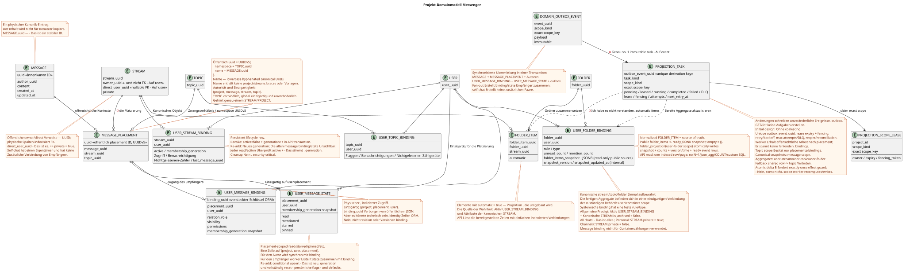

# Schwarzes Domänemodell Messenger

Status: **proposal (Entwurf) zur gemeinsamen Diskussion**.

Dieses Dokument beschreibt das Ziel-Domain-Modell für zukünftige Refactoring.
Das ist ein Public Client Interface, das sich an einem aktuellen Public Contract orientiert.
in der [`workspace_api.md`](workspace_api.md) Und ich muss
unverändert bleiben.

Die Begriffe werden in den [allgemeines Glossar](index.md#глоссарий-проектной-документации):
Platzierung, Bindung, Transaktionsbox, Projektion
(projection), fan-out und worker (Hintergrund-Aussteller)).

## Die Grundidee

`MESSAGE` — Zentrale eigenständige kanonische Wesenheit.
Die Nachricht wird unabhängig von der Anzahl genau in einem Exemplar aufbewahrt
Benutzer, die es sehen.

Standort, Zugriff und Benutzerstatus sind getrennt.
`MESSAGE_PLACEMENT` verbindet eine kanonische Nachricht mit einem bestimmten Kontext
stream/topic. `USER_MESSAGE_BINDING` ermöglicht dem Nutzer den Zugriff auf die Platzierung und
- Ich habe ihn .`visibility`/`permissions`. `USER_MESSAGE_STATE`- Er bewahrt persönliche Daten auf.
Sie können auch die Status-Anmeldung für eine bestimmte Website anmelden.
Das Kopieren erzeugt eine neue, offensichtliche Platzierung und
Die Daten werden in einem System mit einem Netzwerk von Anschlüssen und Anschlüssen verarbeitet, und die öffentliche UUID Ressource wird zum bestimmten UUID
- die.

Die Darstellung dieses Modells auf öffentliche RestAlchemy-Modelle und Wege API ist in
Einzelne proposal
[`messenger_api_domain_model.md`](messenger_api_domain_model.md).
Detaillierte Deklarationen RestAlchemy und unveränderliche HTTP/JSON-Kontrakte sind in
[`messenger_restalchemy_api_spec.md`](messenger_restalchemy_api_spec.md).

## Wesen

### `MESSAGE`

- Einzigartiger Kanonikdatensatz für Nachricht und Inhalt.
- Ihre `uuid` ist die stabile interne ID der einzigen
  kannonischer Eintrag des Inhalts und wird nicht als UUID Nachricht Ressource veröffentlicht.
- Speichert Urheberrechte und öffentliche `created_at`/`updated_at`-Nachrichten.
- Es wird nicht nachgeschrieben, wenn neue Benutzer die Nachricht sehen.
- Speichert keine persönlichen Status- oder Anzeigeflaggen.
- Die restlichen Felder werden getrennt definiert und in diesem Modell nicht
  Eintritt.

### `MESSAGE_PLACEMENT`

Globale physische Strecke `MESSAGE` in einem stream/topic:

- `uuid`, die gleichzeitig die physische Identität der Platzierung ist und
  öffentliche UUID Nachricht Ressource;
- `message_uuid`, `stream_uuid`, `topic_uuid`;
- - Ein Geschäftsschlüssel `(project_id,message_uuid,stream_uuid,topic_uuid)`.

Mehrere Positionen einer `MESSAGE` werden unabhängig verarbeitet.
führt den gewünschten Stream/topic aus dem Satz der benutzerdefinierten Bindungen aus. `topic_uuid`
obligatorisch: direct chat und self-chat haben auch eine kanonische oder technische
`TOPIC`, ohne `null` und sentinel-Werte.

### `USER_MESSAGE_BINDING`

Eine physische, indizierte Zeile für den Zugriff eines bestimmten Benutzers auf ein
- die Anlage:

- Verborgene interne `binding_uuid`;
- `placement_uuid`, `user_uuid`;
- Beziehung/Rolle, `visibility`, `permissions`;
- einzigartiger Schlüssel `(project_id,placement_uuid,user_uuid)`.

Das Löschen oder Verbergen einer Verknüpfung schließt den Zugriff des Benutzers auf diese Platzierung ab,
- ohne zu löschen .`MESSAGE`Und ohne die Zugriffe anderer Benutzer zu ändern.`revision`oder
Verknüpfung nicht verfügbar.

### `USER_MESSAGE_STATE`

Eine einzige Zeile des persönlichen Status, die einzigartig ist
`(project_id,user_uuid,placement_uuid)`. Hier werden die gespeicherten `read_at`
(oder einem gleichwertigen Marker), `membership_generation`, `mentioned`, `starred`, `pinned` und ähnliche
Die öffentliche `read` ist eine Skalarprojektion
`read_at IS NOT NULL`. Die Container-Aggregate werden nicht hier aufbewahrt.
Sie werden in einem anderen Ort kopiert.
stream/topic Ein separater Status wird erstellt; ein globaler Flaggen-Level
der kanonischen Nachricht ohne eine separate bestätigte Entscheidung nicht eingeführt wird.
Bei re-add conditional upsert wird die gleiche Business-Key-Zeile auf eine neue übertragen
generation und Atomisch alle persönlichen Flaggen zu Defaults fallen lassen; das alte
Der Zustand wird nicht mehr genutzt.

## Entscheidung über die Identität der öffentlichen Nachricht

Status der Entscheidung: ** angenommen**. Sie ersetzt den früheren Satz zu veröffentlichen
`MESSAGE.uuid`.

- Öffentliche `WorkspaceUserMessage.uuid` und `{message_uuid}`-Parameter in allen
  Die bestehenden URL sind gleich `MESSAGE_PLACEMENT.uuid`.
- UUID Die Verteilung der Einnahmen wird berechnet als
  `UUIDv5(namespace=TOPIC.uuid, name=MESSAGE.uuid)`.
- Namespace — - Das ist kanonisch .`TOPIC.uuid`. Name  nur in der Kanonik
  `MESSAGE.uuid` in der Standard-Lowcase-Hyphenated ASCII-Form, ohne braces,
  Vorlagen oder zusätzliche Felder.
- Zum Beispiel, wenn namespace
  `4ec0b996-b778-45f8-8ef4-ef863be0c047` und name
  `aaaaaaaa-aaaa-4aaa-8aaa-aaaaaaaaaaaa` Das Ergebnis ist gleich
  `8b9eb310-407c-55fb-881b-092f92ddce88`.
- Das gleiche Paar topic/message bei Wiederholung oder retry gibt immer dasselbe UUID.
  Das Kopieren in ein anderes Thema, einschließlich eines anderen Streams, erzeugt ein neues UUID
  Veröffentlichungen und nicht kopieren `MESSAGE`.
- `TOPIC.uuid` global einzigartig, jeder `TOPIC` gehört unabänderlich genau
  Einer .`STREAM`Und ...`PROJECT`. Thema in einen anderen Stream verschieben/projectnicht
  Identitätsaktualisierung: Neue `TOPIC` und offensichtliche Migration von Vertretungen erforderlich.
- UUIDv5 Die Autorität ist nicht die Einheit des Datenschutzes.
  `(project_id,message_uuid,stream_uuid,topic_uuid)`, ergänzt durch FK,
  Die sich auf die entsprechenden Topics stützen stream/project.
- `USER_MESSAGE_BINDING` Einzigartig ist mindestens
  `(project_id,user_uuid,placement_uuid)`. Sein eigenes UUID bleibt verborgen
  Technischer Schlüssel der Zeile ORM.

Die Form der öffentlichen JSON und URL ändert sich nicht, aber die Semantik UUID ändert sich.
Die zukünftige Migration sollte eine bestimmte Abbildung der alten öffentlichen
Identifikatoren auf placement UUID, aktualisieren Sie die Verweise/Marker und stellen Sie den Zeitraum
Kompatibilität oder vereinbarter Cutover/rollback. Konkreter Rollout bleibt
Einzelne Projektphase.

### `USER`, `STREAM`, `TOPIC`, `FOLDER` und ihre Fesseln

`STREAM`, `TOPIC` und `FOLDER`  kanonische Wesen in einem einzigen
Sie werden jeweils in ihrer Sichtbarkeit und ihrem persönlichen Zustand angegeben.
einzigartige Zeilen:

- `USER_STREAM_BINDING (project,user,stream)`;
- `USER_TOPIC_BINDING (project,user,topic)`;
- `USER_FOLDER_BINDING (project,user,folder)`.

`USER_STREAM_BINDING` ist persistent membership lifecycle row: nicht widerrufen
Sie entfernt sie, und sie setzt atomar `active=false` und erhöht die Monotonie.
`membership_generation`. Re-add Die alten sind noch einmal zu groß.
message bindings/state nicht automatisch sichtbar werden.

Fertige `unread_count`, `mention_count` und andere Aggregate der entsprechenden
Die Ebenen werden direkt in diesen Bindungen gespeichert, weil die Aggregat-Bereich mit
Eine separate State-Tabelle wird nicht ohne eine bewiesene
Die Notwendigkeit , den Lebenszyklus von Zugriff und Projektion zu trennen.

`FOLDER_ITEM` verbindet die kanonische `FOLDER` mit einem unterstützten
kannonisches Objekt, z.B. `STREAM`, streng in Form eines wirksamen
Der öffentliche Vertrag folders/folder_items. kopiert kein Objekt und gibt kein
neue öffentliche Aktionen. Ordner- und Elementdarstellungen werden nur von
einfache indexierte Verbindungen; `COUNT` und Umgehung von Nachrichten im Anfrageweg
Verboten.

Normalisierte `FOLDER_ITEM`  source of truth Zusammensetzung.
Einfügt öffentliche `folder_items` ohne N+1 und Aggregation beim Lesen
`USER_FOLDER_BINDING` - Er hält es bereit. read-only JSONB
`folder_items_snapshot`, Sie können die interne Version und die Zeit des Updates anzeigen.
Das öffentliche Array ist immer `[]`; die bereitgestellten Elementzähler kommen von
Einzigartiges `USER_STREAM_BINDING`.

Die Systemordner sind `USER_FOLDER_BINDING` mit einem festen
`rule`/`type`: Die Regel kann nicht über den normalen
Sie werden nicht berechnet, wenn der Client sie liest.
automatische `FOLDER_ITEM` unterstützt worker als umkonfigurierbar
Eine materialisierte Projektion, deren Quelle die aktiven
`USER_STREAM_BINDING` und die Attribute des kanonischen .`STREAM`- Das allgemeine Predikat
Zusammensetzung  aktive `USER_STREAM_BINDING` + kanonische
`STREAM.is_archived = false`; Nach dieser Zeit gelten genaue Regeln:

- `All chats` beinhaltet alle nicht-archivbezogenen stream;
- `Personal` enthält alle nicht archivierbaren Streams mit der
  `private = true` — Genau dieses Kriterium nutzt der gültige Vertrag.;
- `Channels` enthält alle nicht archivierten Streams `private = false`.

Jede Änderung von items/pin oder automatischer Zusammensetzung schreibt immutable
transactional outbox event. Es wird eine immutable typed task
`folder_projection` ohne coalescing und mit scope
`user-folder:(project_id,user_uuid,folder_uuid)`. Der Besitzer der eingezäunten Miete führt
Normalisierte items zu der aktuellen source of truth und dann in einem
Transaktionen ersetzt Snapshot, bereitem Zähler, Version/Zeit der Projektion und
Erstellt bereit öffentliche Ereignisse./folder_itemsEndpunkte undJSONNein .
Sie können das vorherige Bild sehen , bevor es im Hintergrund festgehalten wird ..

Die öffentlichen UUID-Verweise in RestAlchemy API bleiben skalare UUID-Eigenschaften, und
physische Spalten `*_uuid` sind indexierte externe Schlüssel mit offensichtlichen
Sie ist eine der wichtigsten Funktionen der gewählten Verweisung.,
`WorkspaceStream.owner` wird als UUID serialisiert, und das physische `owner_uuid`
Verweist auf den User-Workspace; URI Beziehung in der öffentlichen JSON erscheint nicht.

Wenn man einen Stream mit einem `direct_user_uuid` erstellt, wird immer private stream.
Wenn `direct_user_uuid` gleich UUID Eigentümer/aktueller Benutzer ist, ist
self-chat Die Self-Chat-Nachricht ist immer noch die gleiche.
hat eine kanonische `MESSAGE` und eine Platzierung; Urheber
`USER_MESSAGE_BINDING` und `USER_MESSAGE_STATE` bereits Zugriff und bereit Flaggen
Einer der einzigen Teilnehmer, also erstellt der Empfänger kein Fan-Out.
Bindungspare/state, und die Nachricht wird nur einmal für diesen Benutzer angezeigt.

## Verbindungen

Bearbeitbarer PlantUML-Quelltext:
[`messenger_domain_model.puml`](diagrams/messenger_domain_model.puml).

Die Verbindung mit `TOPIC` ist für jede Website erforderlich, einschließlich Direct Chat und
self-chat. Das Buch ist von dem `MESSAGE`.

## Leseweg und Hintergrundaktualisierung

Öffentliche API liest die fertigen physischen und indizierten
`USER_MESSAGE_BINDING`-Ein Benutzer-Eintrag, das eine Verbindung herstellt
`MESSAGE_PLACEMENT`, Aktiv `USER_STREAM_BINDING` des gleichen generation,
Ich habe nur eine .`MESSAGE`Und ein einzigartiges
`USER_MESSAGE_STATE`. Verborgene `binding_uuid` kann technisch sein
Die Identität der Zeile ORM, aber die öffentliche JSON/URL verwendet immer
`MESSAGE_PLACEMENT.uuid`. Es sollte keine komplizierten Berechnungen im Anfrageweg geben
Vorstellungen oder schwere Überzählungen.

Synchronisierte Übermittlung in einer Transaktion erzeugt eine kanonische `MESSAGE`,
Einer `MESSAGE_PLACEMENT`, Autoren `USER_MESSAGE_BINDING` und
`USER_MESSAGE_STATE`, sowie unveränderliche transactional outbox-Einträge
Es gibt eine für jede ausgeschriebene initial typed task.
Der Autor liest die fertigen ursprünglichen Flags sofort ohne faule Erstellung state.

Jede Transaktion , die ihren Zustand ändert , schreibt ein unveränderliches Domänenereignis in
transactional outbox. Jedes Ereignis erzeugt eine unveränderliche typische Aufgabe mit
Einzigartig .`outbox_event_uuid`; `GET`/listDie Arbeiter erhalten eine eindeutige
Arbeit, sondern scannt fehlende Verbindungen, und für jeden Empfänger
Einzeln nach der Platzierung zusammen erzeugt `USER_MESSAGE_BINDING` und einzigartig
`USER_MESSAGE_STATE`. Task trägt die erwartete membership generation und macht
conditional upsert Nur bei aktivem Membership und exaktem Übereinstimmung generation;
stale task Es gibt keine laue Erstellung von state im Leseweg.
Verzögerung der eventuellen Konsistenz von etwa einer Sekunde als Ziel SLO intent, nicht
eine strenge Garantie vor der Auswahl von operational SLO. `2xx`/`201` bedeutet commit
Die Autoren erhalten sofort Lesen-Dein-Schreiben, andere
Der Worker erfasst die Veränderung der Projektion
und alle entsprechenden durable ready WebSocket Event-Reihen atomar in einer DB
transaction: entweder beide fixiert werden oder beide rollen. dispatcher
nur Event Store liest, sendet/wiederholt/wiederholt Ereignisse und besitzt
Netzwerkverbindungen.

Topic worker besitzt nur topic-scoped placements/bindings und innerhalb des Themas
- Er hält sich an sie .`MESSAGE.created_at DESC`- Die gemeinsamen Projektionen erhalten einzelne exact
scopes: `message` für canonical Snapshots, `user-stream`, `user-topic` und
`user-folder` Sie ist für die entsprechenden Anlagen.
lease/fencing token auf den genau Scope Key; verschiedene Scopes parallel. Topic worker
kann nicht unsafe read-modify-write shared rows ausführen. Atomic counter delta ist zulässig
nur mit exactly-once effect guard auf `outbox_event_uuid`; andernfalls scope worker
Die Projektion wird neu gezählt und ersetzt..

Fan-out Ein Platzierung wird aufgeteilt in immutable keyset batches. Default
Größe  `1000` recipients, zulässige Runtime maximum  `5000`; Konfiguration
`<=0` oder `>5000` nicht startup validation.
`USER_STREAM_BINDING.user_uuid ASC` ohne `OFFSET`; jede Batch wiederholt
überprüft active membership/generation, schreibt atomar binding/state,
downstream work und ready events und erst nach commit erstellt checkpoint/next
batch. Ein Batch hat eine kurze Transaktion; root speichert cursor/count/status.

## Invarianten

1. Der öffentliche Client API und sein beobachtetes Verhalten bleiben unverändert.
2. Der Inhalt jeder Nachricht wird in einem einzigen Eintrag gespeichert `MESSAGE`.
3. Jeder Kontext-Stream/topic ist offensichtlich dargestellt `MESSAGE_PLACEMENT`.
4. Der Nutzer hat nur Zugang zu der Website über die entsprechende
   `USER_MESSAGE_BINDING`.
5. Die Empfängerbindung ist einzigartig
   `(project_id,placement_uuid,user_uuid)`.
6. Die persönlichen Nachrichtenflaggen gehören nur dem Benutzer und
   Platzierung `USER_MESSAGE_STATE`, nicht der kanonischen Nachricht.
7. Verbergen oder Löschen der Verknüpfung löscht nicht `MESSAGE` und ändert den Zugriff nicht
   andere Benutzer.
8. Der Anfrageweg verwendet die vorhandenen Bindungs-/Location-/Zustandzeilen;
   Komplexe Berechnungen werden ohne Anfrage ausgeführt.
9. `revision` oder die Verknüpfung Version wird nicht bis zur separaten Projektierung hinzugefügt
   Hintergrundbearbeitung.
10. Die öffentliche UUID Nachricht ist immer gleich `MESSAGE_PLACEMENT.uuid` berechnet
    Wie ?`UUIDv5(namespace=TOPIC.uuid, name=MESSAGE.uuid)`Er ist für alle gleich .
    Die Kanonische
    `MESSAGE.uuid` Intern, UUID benutzerdefinierte Bindung versteckt.
11. Die Änderungen des Status schreiben unveränderliche Ereignisse in die Outbox; nicht gelesen
    Sie erstellen Aufgaben, und der Arbeiter sucht nicht nach Jobs, indem er fehlende Zeilen scannt..
12. WebSocket dispatcher Der Arbeiter schreibt die Projektion und
    ready event rows in einer Transaktion; der Dispatcher erstellt keine Business Event und
    Wird nicht durch Netzversand auf seine Langlebigkeit beeinflusst.
13. Öffentliche UUID-Verweise sind skalare UUID-Eigenschaften RestAlchemy, aber
    physische UUID-Spalten bleiben als indexierte externe Schlüssel mit offensichtlichen
    URI Beziehung ändert nicht JSON-Vertrag.
14. `direct_user_uuid` beim Erstellen von Streams bedeutet `private=true`; self-chat
    enthält ein binding-Autorpaar/state und erstellt kein Paar für andere Benutzer.
15. Streams/topic/folder werden nur in einer einzigartigen Verbindung gespeichert
    der entsprechenden Behälterstufe, niemals in der Bindung/Zustand
    Die Vorstellungen lesen die vorbereiteten Werte ohne `COUNT`,
    `GROUP BY` oder umgehend.
16. Worker Aktualisiert Aggregate idempotent nach typischen Aufgaben nach
    fan-out, read/hide/move/delete Und so weiter./rebuildaus
    Die Bindung von Nachrichten ist nur im Hintergrund zulässig; eventual consistency angenommen.
17. Die kanonische `FOLDER` wird einmal gespeichert; `USER_FOLDER_BINDING` bestimmt
    Benutzerzugriff/Zustand und Fertiggeräte, und `FOLDER_ITEM`
    Verknüpft nur den Ordner mit einem unterstützten Canonobjekt.
18. Systemfolder bindings haben eine feste Regel und ihre automatischen
    Elemente sind eine umgebaute Projektion aus aktiven stream bindings;
    API Liest die Elemente und Zähler ohne die Zusammensetzung zu berechnen.
19. Synchrone Sendung erzeugt die Urheber `USER_MESSAGE_BINDING` und
    `USER_MESSAGE_STATE` Zusammen; ein Fan-Out für jeden Empfänger erstellt ebenfalls
    bereites Paar binding/state; faules Erstellen von state im read path ist verboten.
20. Initial design verwendet kein coalescing: alleine immutable outbox event
    entspricht einer immutable typed task mit einem eindeutigen derivation key.
    Lease expiry, fencing token, retry/backoff, max attempts/DLQ und reaper
    Die Handler sind impotent source event.
21. Revoke stream membership Sie wird synchron `active=false` und vergrößert
    persistent `membership_generation`. Jeder message/reaction read/action
    überprüft active membership und generation; background cleanup ist nicht
    security boundary.
22. Topic UUID ist für die Placement verpflichtend, aber nicht universell
    Jede gemeinsame Projektions-Aufgabe besitzt ihre eigene tatsächliche Projektions-Tasks. exact
    scope key; fallback Der gemeinsame Zeilenverlauf auf topic ist verboten.
23. `TOPIC.is_done` — Globaler kanonischer Zustand eines Themas. Toggle
    wird auf der Zeile `TOPIC` serialisiert, vergrößert sie version/`updated_at` und schreibt
    outbox in derselben Transaktion. `USER_TOPIC_BINDING` ist nicht authoritative
    writer Das ist das Zeichen.
24. Reaktionen absichtlich für die Kanonische `MESSAGE` in allen placements.
    Placement UUID wird nur für Access Check verwendet; raw facts und
    `reactions`/`reaction_users` Sie haben message scope. Cross-placement visibility
    zwischen verschiedenen Hörern ist eine angenommenen Semantik.
25. Für jede öffentliche Resource-List gibt es eine fehlende/`0` `page_limit`
    `100`, `1..500` Die anderen Werte werden von HTTP `400`;
    unbounded mode nicht vorhanden.
26. Reconnect verwendet durable cursor/replay: nach dem letzten Bearbeiteten
    cursor Die neuen sichtbaren Ereignisse werden ohne Unterbrechung von live.
    Lieferung at-least-once; der Client deupliziert nach event UUID und setzt fort
    cursor nur nach der Bearbeitung.
27. Alle tenant-owned-Zeilen und Scope-Keys enthalten `project_id`; physical
    `UNIQUE(project_id,uuid)` und composite FK verbieten cross-project edges.
    Mutation überprüft die Authorization innerhalb der blockierenden Transaktion erneut.
28. Fan-out batch default `1000`, hard maximum `5000`; keyset cursor —
    `user_uuid ASC`, retry Einschränkt auf ein batch, unbounded transaction
    Scheduler sorgt für bounded fairness der alten Arbeit.
29. Migration/release wird nur nach verified backup/restore rehearsal
    Native messages/states/files werden gespeichert und migriert;
    Zulip-derived messages/files Es gibt einen absichtlichen destructive reset mit manueller
    scoped cleanup Und frisch vollständig reimportieren. Zulip Workspace UUID,
    Verweise und lokalen Zustand müssen nicht gespeichert werden.

## Offene Fragen

Die einzige kanonische Liste ist in
[`messenger_architecture_inventory.md`](messenger_architecture_inventory.md#единственный-список-open-решений).
Dieses Dokument speichert nur die akzeptierten Domänenvarianten.
