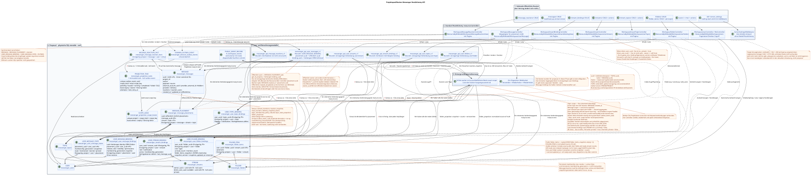

# Projektspezifikation RestAlchemy API Messenger

Status: **Projektspezifikation der Umsetzung; Dokumentation bis zur Umsetzung**.

Dieses Dokument zeigt, wie ein Workspace/Messenger v1 API funktioniert
durch gewöhnliche RestAlchemy-Modelle, einfache SQL-Vorstellungen und
Es ändert keinen öffentlichen Weg., HTTP-
Methode, JSON-Feld, Aktion, Ereignis oder Nutzlast WebSocket.
UUID Die Placement Identität wird gezielt geändert, und die Pagination und
Die Kunden sehen die Zeit der Verbreitung der Änderungen erhalten offensichtlich angenommen
Diese Änderungen erfordern eine Release Note und einen separaten
migration/cutover mapping.
Der kanonische Vertrag ist in
[`workspace_api.md`](workspace_api.md). Domänenvarianten und Hintergrundpfade
beschrieben in [`messenger_domain_model.md`](messenger_domain_model.md) und
[`messenger_api_domain_model.md`](messenger_api_domain_model.md).

Aktuelle `StoreResourceController`, `sql_canonical_store`, schwere Darstellungen,
Modelle zu erben und die bestehende Aufteilung der Klassen der Controller nicht
Sie werden in diesem Dokument nur als
Quelle des beobachteten öffentlichen Vertrags und sind ersetzbar.

## Grenze der Projektlösung und des laufenden Vertrags

Bestätigte Invarianten des Zieldesigns:

1. `MESSAGE` enthält den kanonischen Inhalt, den Autor, `source`/`provider`/`delivery` und
   öffentliche `created_at`/`updated_at` genau einmal.
2. Physischer `MESSAGE_PLACEMENT` gibt den globalen Kontext des Flusses und das Thema für
   `MESSAGE_PLACEMENT` stellt eine Platzierung dar, und
   `USER_MESSAGE_BINDING` — Das ist ein binding , das dem Benutzer Zugang zu
   Sie ist die einzige, die `(project,user,placement)`
   `USER_MESSAGE_STATE` - Er bewahrt persönliche Daten auf. `read`, `mentioned`, `starred`,
   `pinned` und ähnliche Flaggen der Nachrichtsebene.
3. `WorkspaceUserMessage.uuid` und UUID in allen URL und Antworten auf Nachrichten  es
   `MESSAGE_PLACEMENT.uuid = UUIDv5(namespace=TOPIC.uuid, name=MESSAGE.uuid)`.
   `MESSAGE.uuid` und `USER_MESSAGE_BINDING.uuid` bleiben inner.
4. Mehrere Platzierungen einer kanonischen `MESSAGE` geben mehrere Zeilen mit
   verschiedene öffentliche UUID und verschiedene stream/topic.
   placement-scoped und kommt von `USER_MESSAGE_STATE`.
5. Ein stabiler UI-Verweis enthält UUID placement; er gibt eindeutig den Kontext an
   stream/topic. Canonical content UUID Der Kunde will nichts..
6. Die Darstellung `WorkspaceUserMessage` basiert auf einer Zeile der Benutzerbindung und macht nur
   Indexverbindungen mit einer Platzierung, einem `MESSAGE` und einem Benutzerstatus.
   Öffentliche Zeitmarken kommen immer von `MESSAGE`.
7. Eine Synchronisierung in einer Transaktion erzeugt `MESSAGE`,
   `MESSAGE_PLACEMENT`, Autoren `USER_MESSAGE_BINDING` und
   `USER_MESSAGE_STATE`, sowie unveränderliche transactional outbox-Einträge
   Einer für jede auszuführende initial typed task.
   Das gibt dem Autor eine sofortige Antwort mit persönlichen Flaggen ohne
   Worker (Hintergrund-Aussteller) zusammen mit jedem
   Die Verbindung des Empfängers erzeugt ihn `USER_MESSAGE_STATE`; er sucht keine Arbeit.
   - und die fehlenden Bindungen scannen.
8. Der Poolworker hat eine anpassbare Parallelitätsgrenze. Topic-scoped work
   Besitzt ein Thema und wählt es innerhalb des Themas aus `MESSAGE.created_at DESC`;
   shared projections Sie benutzen ihre eigenen genauen Umfangsregeln.
   Fügen Sie einen neuen öffentlichen API.
9. `revision` Die Verbindung hat keine Nachricht.
10. Die Ausgangsreaktion gehört zur kanonischen `MESSAGE`; API ändert eine Zeile der Reaktion,
    und der exklusive Owner Scope `message` materialisiert öffentliche Bilder `reactions` und
    `reaction_users`, nur für Lesen verfügbar, ohne Kreislauf lesen Ändern Schreiben  im Anfrageweg.
    Die Bilder sind absichtlich gleich in allen Platzierungen, auch bei unterschiedlichen Zuschauern..
11. Jede operation, die den zustand ändert, schreibt atomar ein unveränderliches domänenereignis in outbox.
    Jedes Ereignis erzeugt genau ein einzelnes immutable typed projection task
    mit einzigartigem `outbox_event_uuid`; initial design verwendet nicht coalescing.
    `GET` und Aufgabenliste-Operationen erstellen keine.
12. Worker In einer DB-Transaktion wird der materialized state und alle
    Die entsprechenden durable ready WebSocket Event-Reihen. dispatcher
    nur event store liest, sendet/wiederholt/wiedergespielt und besitzt
    Netzwerkverbindungen.
13. UUID-Verweise, die die aktuelle öffentliche JSON als UUID übermittelt, werden in
    API RestAlchemy-Modelle mit normalen `properties.property(types.UUID())`, nicht
    `relationships.relationship`: Diese Verbindung würde sich als URI und
    Die entsprechenden physischen Spalten `*_uuid` bleiben
    Index-Außen-Schlüssel mit offensichtlicher Wirkung der Verweisungsgültigkeit.
14. Wenn der Streaming-Erstellung `direct_user_uuid` enthalt, ist der Domänenbefehl immer
    - Er hält es .`private=true`- Das ist gleich.UUID- der laufenden`owner`, erstellt
    Chat mit sich selbst mit nur einem Benutzer-Anschluss; nur Benutzer erhalten Nachrichten
    Sie werden genau einmal angezeigt.
15. `STREAM`, `TOPIC` und `FOLDER`  die kanonischen Wesen in einem einzigen Exemplar.
    Die persönlichen Aggregate der nicht gelesenen Nachrichten und Erwähnungen werden direkt in einzigartigen
    Benutzerbindungen an den Stream, den Themen und den Ordnern.
    Speichern nur Zugriff, `read_at` und persönliche Flaggen; Container Zähler dort
    Verboten.
16. `USER_STREAM_BINDING` — persistent lifecycle row mit `active` und monoton
    `membership_generation`. Revoke synchron verbietet message/reaction access;
    stale tasks Die alte Generation kann den Zugriff nicht wiederherstellen.
17. Alle öffentlichen Operationen der Liste sind eingeschränkt: Standardwert `100`,
    Das maximale Maximum ist `500`; das Fehlen von `page_limit` und `page_limit=0` bedeutet
    `100`, und ein Negativ, ein Teil von einem ganzen und mehr als `500` HTTP `400`.
18. `2xx`/`201` Es bestätigt die Festsetzung der primären Mutation, nicht die Vollendung aller.
    Der Autor erhält sofort Lesen-Schreiben; Empfänger, Zähler,
    materialized snapshots und bereitgestellte öffentliche Ereignisse erscheinen asynchron.
19. `TOPIC.is_done` — Es gehört nicht zu den globalen
    Benutzerbindung; `USER_TOPIC_BINDING` speichert nur Zugriff,
    Benachrichtigungen, persönliche Einstellungen und bereitgestellte Benutzeraggregate.

Die Namen `messenger_*` unten  die genauen Namen **dieser Projektlösung**, nicht die Genehmigung für
Die Produktionsstruktur ändert sich nicht, bevor ein einzelnes Migrationsprojekt.

## Übersicht der Schichten



Bearbeitbarer PlantUML-Quelltext:
[`messenger_restalchemy_api_spec.puml`](diagrams/messenger_restalchemy_api_spec.puml).

```text
текущий маршрут -> стандартные RA-контроллер и ресурс -> представление формы только для чтения
                                                               \-> записываемая физическая модель
```

SQL-Die Darstellung in der Zieldesign ist nur ein Formenadapter.
Die physische Zeile gibt eine Ausgangszone; eine zu einer und viele zu einer verlinkte Verknüpfungen sind zulässig»
`LEFT JOIN`/`INNER JOIN`. Verbotene Geräte, `GROUP BY`, Fensterfunktionen,
Laterale und korrelierte Unteranfragen sowie Fan-out/Verteilung einer zu vielen».

## Allgemeine Vereinbarungen RestAlchemy

### Gebiet, Transaktion und Pagination

- Zwischen-SO IAM überträgt `project_id` und aktuell `user_uuid` in den Anfrage-Kontext.
- `get_autofilters()` Fügt allen ein Feld hinzu `get`/`filter`/`update`/`delete`;
  Der Client kann sie nicht durch JSON Felder oder Anfragezeilen ersetzen.
- `get_autovalues()` Gibt den Bereich an , der dem Server gehört , wenn er erstellt wird.
- Die Anfrage RestAlchemy ist eine.
  `session`; Einzel `engine_factory.session_manager()` wird nicht geöffnet.
- Die Sammlungen verwenden `BaseResourceControllerPaginated` und speichern
  `page_limit`, `page_marker`, `X-Pagination-Limit` und
  `X-Pagination-Marker`; `sort_key=created_at&sort_dir=asc|desc` Bleibt.
  - Das ist nicht verändert..
- Die aktuelle Ausführungsemantik enthält eine bestätigte Lücke:
  Die allgemeinen RestAlchemy und `StoreResourceController` geben
  `_pagination_limit = 0`. Also die fehlenden `page_limit` und
  `page_limit=0` Jetzt gibt es `limit=None` und unbegrenztes Lesen;
  Negative und nichtintegere Werte geben HTTP `400` zurück, und für zu große positive
  Es gibt keine strengen Höchstwerte und keine Grenzen von oben.
  Verhalten.
- Zielpolitik einzigartig für alle öffentlichen Operationen Liste: fehlt
  `page_limit` und `page_limit=0` geben `100`; die Werte `1..500` werden angewendet
  genau; ein negativer, nicht ganz integrer und größer als `500` Wert gibt zurück
  HTTP `400` Es gibt keinen freien Betrieb und keine Umgehungsregelung..
- Für `GET .../topic_summary_endpoints/`, das derzeit keine Parameter akzeptiert
  Pagination, der Target-Controller nimmt die gleichen `page_limit`/`page_marker`,
  behält das JSON-Array ohne neue Envelope und fügt Standard-
  `X-Pagination-Limit`/`X-Pagination-Marker`. Das ist bewusst. observable
  Änderung, nicht Beschreibung der aktuellen Ausführung.
- Die Routenindizes geben das endgültige statische Register der registrierten
  Wege und nicht die Nutzerkollektion aus dem DB lesen; sie sind strukturell
  sind durch das Register selbst begrenzt und sind keine Umgehung der Politik resource-list.
- Der öffentliche Message Marker ist placement UUID.
  Wiederherstellt es in demselben viewer/project/filter scope und verwendet
  Stabiler Korteig `(MESSAGE.created_at,MESSAGE_PLACEMENT.uuid)`; versteckt
  `binding_uuid` Nicht in den Marker eingebunden.
- Felder, die `null` zulassen, können im Standard-Ausgang des REST-Verpackers fehlen; Beispiele JSON
  unten zeigen die vollständige Form, in der die Projektion, die `null` zulässt, eindeutig
  gleich `null`.

### UUID-Eigenschaften in API und externe Schlüssel in der DB {#uuid-свойства-в-api-и-внешние-ключи-в-бд}

Die Verbindung RestAlchemy ist der Wert API in der Form URI.
`owner`, `author_uuid`, `user_uuid`, `message_uuid`, `stream_uuid`,
`topic_uuid`, `direct_user_uuid`, `default_topic_uuid` und
andere UUID-Verweise des laufenden Vertrags werden als normale UUID-Eigenschaften erklärt.
Das Kommunikationsobjekt ist nicht an der Serialisierung beteiligt.
Schreibbare physikalische RestAlchemy -Modelle: Die Anwendung arbeitet mit Skalarmodellen UUID,
Die Migration der Schema schafft eine echte Einschränkung und einen Index für die Basis
- Das ist ein Kolumn .`*_uuid`. `project_id`bleibt die Region .IAM- die
`scope_kind`/`scope_key` outbox und Aufgaben kodieren den genauen Komponenten-Schlüssel des Bereichs,
und nicht als falscher externer Schlüssel für mehrere Tabellen gleichzeitig verwendet werden.

`MESSAGE_PLACEMENT.uuid` wird als skalar UUID-Eigenschaft erklärt und als
`WorkspaceUserMessage.uuid`. - Ich bin hier .`MESSAGE.uuid`und das Verborgene `binding_uuid`
bleiben auch skalare UUID/FK/ Schlüssel, aber die Feldlösungen lassen sie nicht in
- Das ist nicht wahr . message JSON.

Zielfeste Beschränkungen der Hauptprojektrésolution:

| UUID-Eigenschaft RestAlchemy | Physischer Index-Spalte und Ziel | Die Funktion der Verweisung |
| --- | --- | --- |
| Nachricht `author_uuid` | `messenger_messages.author_uuid -> messenger_users.uuid` | `ON DELETE RESTRICT` |
| - die Platzierung `message_uuid` | `messenger_message_placements.message_uuid -> messenger_messages.uuid` | `ON DELETE CASCADE` |
| - die Platzierung `stream_uuid` | `messenger_message_placements.stream_uuid -> messenger_streams.uuid` | `ON DELETE CASCADE` |
| - die obligatorische Platzierung `topic_uuid` | `messenger_message_placements.topic_uuid -> messenger_topics.uuid` | `ON DELETE CASCADE` |
| Benutzerbindung `placement_uuid` | `messenger_user_message_bindings.placement_uuid -> messenger_message_placements.uuid` | `ON DELETE CASCADE` |
| Benutzerbindung `user_uuid` | `messenger_user_message_bindings.user_uuid -> messenger_users.uuid` | `ON DELETE CASCADE` |
| Benutzerstatus `placement_uuid` / `user_uuid` | entsprechende UUID Platzierungen und Benutzer | `ON DELETE CASCADE` |
| Reaktionsfaktor `canonical_message_uuid` / `user_uuid` | entsprechende UUID der kanonischen Nachricht und des Benutzers | `ON DELETE CASCADE` |
| Der Fluss `owner` | physischer `messenger_streams.owner_uuid -> messenger_users.uuid`; der Pseudonym bleibt in der öffentlichen Darstellung `owner` | `ON DELETE RESTRICT` |
| Der Fluss `direct_user_uuid` | `messenger_streams.direct_user_uuid -> messenger_users.uuid` | `ON DELETE RESTRICT` |
| Der Fluss `default_topic_uuid` | `messenger_streams.default_topic_uuid -> messenger_topics.uuid` | `ON DELETE SET NULL` |
| Streaming-Bindung `stream_uuid` / `user_uuid` | entsprechende UUID Fluss und Benutzer | `ON DELETE CASCADE` |
| Streaming-Bindung `who_uuid` | `messenger_stream_bindings.who_uuid -> messenger_users.uuid` | `ON DELETE RESTRICT` |
| Benutzer an den Stream binden `stream_uuid` / `user_uuid` | entsprechende UUID Fluss und Benutzer | `ON DELETE CASCADE` |
| Benutzer an einen Ordner binden `folder_uuid` / `user_uuid` | entsprechende UUID Ordner und Benutzer | `ON DELETE CASCADE` |
| Thema `stream_uuid` | `messenger_topics.stream_uuid -> messenger_streams.uuid` | `ON DELETE CASCADE` |
| öffentliche Verweise `summary_last_message_uuid` / `last_message_uuid` | die entsprechende öffentliche UUID placement | `ON DELETE SET NULL` |
| Benutzer zum Thema binden `topic_uuid` / `user_uuid` | entsprechende UUID Themen und Benutzer | `ON DELETE CASCADE` |

Für tenant-owned edges muss die Migration die unique/FK Komponenten für
`project_id`, und die Placement muss zusätzlich auf das Thema verweisen, das zu
Der gleiche Stream/project. `TOPIC.uuid` ist global einzigartig und die Eigentumsrechte unveränderlich.
`USER_STREAM_BINDING` Bei der Abmeldung als Tombstone gespeichert; business key
bleibt einzigartig und `(active,membership_generation)` ist persistent
security state. `USER_MESSAGE_BINDING.membership_generation` — snapshot Das ist ...
Generationen und nimmt an der access predicate.

`WorkspaceStream.owner` in den API und RestAlchemy-Modellen bleibt die UUID-Eigenschaft und
Der physische Schreibstamm wird als UUID der Benutzer serialisiert.
`owner_uuid`; Die Darstellung des Flusses ohne Berechnungen gibt einen skalaren Pseudonym
`owner_uuid AS owner`. Weder eine öffentliche Ressource noch ein physischer externer Schlüssel werden in
RestAlchemy oder URI Verbindung. DDL wird hier nicht erstellt: die Tabelle fixiert
Zwangsbeschränkungen für zukünftige Migrationsprojekte.

### ADR: tenant isolation und die aktuelle Grenze der Rollen

Jede kanonische, projection, binding/state, outbox, task und public-event
Die Zeile, auf die der Tenant-Bereich anwendbar ist, enthält `project_id`.
Tabellen geben `UNIQUE(project_id, uuid)` und Komponenten an FK
`(project_id, referenced_uuid)` für `MESSAGE`, `MESSAGE_PLACEMENT`, user
bindings/state, `TOPIC`, `STREAM`, `FOLDER`, `FOLDER_ITEM`, reaction facts,
outbox/tasks/events. Die Komponenten FK placement -> topic/stream garantieren, dass
`TOPIC` Gehört dem genannten `STREAM` und demselben project. Worker queries,
scope keys und migration/backfill joins immer einbeziehen `project_id`.

API Verwenden Sie die aktuelle `ModelWithProject`, request project scope, session und
RestAlchemy filters. Lookup/list/action außerhalb des aktuellen Projekts oder für das unsichtbare
Ressource gibt `404`; sichtbare Ressource mit unzureichender Auflösung — `403`.
Mutation Lesen/Blocken von project-scoped Resource und überprüfen active
membership/permission innerhalb derselben Transaktion, sondern nicht vertraut preflight view.

Die beobachtete current-runtime Matrix wird nicht in die fehlende policy umgewandelt
neue target-Berechtigung:

| Die Operation current API | `guest` | `member` | `moderator` | `administrator` | `owner` | Target role |
| --- | --- | --- | --- | --- | --- | --- |
| `add_users` aus dem sichtbaren stream | runtime Erlaubt | runtime Erlaubt | runtime Erlaubt | runtime Erlaubt | runtime Erlaubt | **OPEN:** target permission/assignable-role matrix Erbt nicht das Fehlen der current-Prüfung |
| `PUT stream_bindings/{uuid}` non-direct | actor role Nicht überprüft; project-only lookup | Das ist es auch. | Das ist es auch. | Das ist es auch. | Das ist es auch. | **OPEN:** actor × target-role/self matrix |
| `DELETE stream_bindings/{uuid}` non-direct | actor role Nicht überprüft; project-only lookup | Das ist es auch. | Das ist es auch. | Das ist es auch. | Das ist es auch. | **OPEN:** actor × target-role/self und last-owner rule |
| update/delete binding direct/self | `400` | `400` | `400` | `400` | `400` | membership/role immutable |

`add_users` erfordert die Ansicht des Elternteils `WorkspaceUserStream`, also actor
ist ein Mitglied, aber role hierarchy current code überprüft nicht. Binding
get/update/delete ist jetzt project-scoped, aber überprüft nicht den role actor oder seine
membership `workspace_api.md` fixiert die Rolle Literals und
immutable direct membership, Aber sie verkündet es nicht. non-direct permission matrix.

Tenant-integrity Risiko # 7 ist mit Kompositionsschlüsseln geschlossen und transactional
recheck. Role/action Teil bleibt punkt OPEN: welche Rollen können hinzugefügt werden
Teilnehmern und die Zielrolle zuzuweisen; wer seine oder die anderer binding;
ob mindestens eine `owner` verpflichtend ist; ob erlaubt self-demotion/self-removal
Wenn der Besitzer verpflichtet ist, blockiert die Mutation den Stream und owner
bindings entweder version/CAS verwendet, überprüft post-state `owner_count >= 1` und
Nur dann commit; Wettbewerbstransaktionen lassen keine Null zurück owners. Direct/self
Regeln sind geschlossen: membership gleich identity pair, update/add/remove binding geben
`400`, self-chat enthält einen einzigen Besitzer, delete self-chat stream gibt auch `400`.

Mindestgemeinsame Verunreinigungen der Projektlösung:

```python
from restalchemy.common import contexts
from restalchemy.dm import filters


class RequestSessionMixin:
    @property
    def session(self):
        return contexts.Context().get_session()


class ProjectScopeMixin(RequestSessionMixin):
    def get_autofilters(self):
        return {
            "project_id": filters.EQ(self.get_context().project_id),
        }

    def get_autovalues(self):
        return {
            "project_id": self.get_context().project_id,
        }


class ViewerScopeMixin(ProjectScopeMixin):
    def get_autofilters(self):
        result = super().get_autofilters()
        result["user_uuid"] = filters.EQ(self.get_context().user_uuid)
        return result

    def get_autovalues(self):
        result = super().get_autovalues()
        result["user_uuid"] = self.get_context().user_uuid
        return result


class BoundedPaginationMixin:
    _pagination_limit = 100
    _pagination_max_limit = 500

    def normalize_page_limit(self, value):
        # Proposal contract: omitted/0 -> 100; 1..500 exact; otherwise HTTP 400.
        return pagination_policy.validate(value, default=100, maximum=500)
```

Die physischen Verbindungen in der Benutzerregion verwenden die normale Speicheridentität in dieser Region.
Der UUID ist nicht die öffentliche Ressourcen-ID der Nachricht: der Ressourcenweg nimmt
`MESSAGE_PLACEMENT.uuid`, Der Controller überprüft die Verbindungen des aktuellen
Benutzer und active stream membership mit generation.

```python
from restalchemy.dm import models
from restalchemy.dm import properties
from restalchemy.dm import types


class ProjectUserScopedModelWithUUID(models.ModelWithUUID):
    project_id = properties.property(
        types.UUID(), required=True, read_only=True, id_property=True,
    )
    user_uuid = properties.property(
        types.UUID(), required=True, read_only=True, id_property=True,
    )

    @classmethod
    def get_id_property(cls):
        return {"uuid": cls.properties.properties["uuid"]}
```

### Berechtigungen für Felder

`ResourceByRAModel` behält den Stil snake_case (`convert_underscore=False`) und
`process_filters=True`. Die Modelle der öffentlichen Vorstellungen enthalten eine volle Flachantwort;
`FieldsPermissions` gibt die für die Schreibbereiche verfügbare Oberfläche CREATE/UPDATE. an Innen-Außen-Schlüssel,
Der Arbeitsbericht und der ursprüngliche Speicher des Anbieters sind versteckt, werden nicht für den Kunden für die Aufzeichnung zugänglich erklärt.

### Die allgemeine HTTP-Semantik

- `GET` Kollektionen: `200` und Array JSON;
- `POST` Sammlungen: `201` und vollständig erstellte Ressource; wiederholt
  Die Erstellung eines determinanten direkten Flusses kann eine vorhandene Ressource mit dem Status
  `200`;
- `GET`/`PUT` Ressource: `200` und vollständige Ressource;
- Aktion `POST .../invoke`: `200` und vollständige Ressource oder dokumentiert
  Liste;
- Erfolgreich `DELETE`: `204`, Körper fehlt;
- nicht korrekt oder nicht zulässig Domain-Anfrage: `400`; ohne Authentifizierung: `401`; fehlerhaft
  Rechte: `403`; unsichtbare oder fehlende Ressource im Bereich: `404`.

### ADR: begrenzte Pagination und sichtbare Änderungenzeit

Status: **Akzeptiert bewusste Verhaltensänderung; Risiko #5 geschlossen**.

Alle Resource-List Endpoints verwenden `page_limit`: fehlen/`0` bedeutet
`100`, `1..500` Akkurates, Negatives, Unvollständiges und Mehr wird angenommen. `500`
Die Bedeutung gibt .HTTP `400`. Endpoint-specific weniger Einschränkungen in der aktuellen
Der öffentliche Workspace-Vertrag ist nicht bestätigt; daher target overrides
External Bridge Control API ist nicht in dieser Richtlinie enthalten.

Klienten, die die fehlende Parameter oder `0` als vollständig verwendet haben export,
Sie müssen die Seiten lesen, bis der nächste Marker nicht da ist.JSONNein .
wird geändert, aber rollout erfordert release/compatibility note zusammen mit der Änderung
Semantik message UUID.

Eine Transaktion , die sich ändert , erfasst den ursprünglichen Status,
erforderliche Urheberplacement/binding/state und eine oder mehrere immutable
outbox events — Es gibt eine für jede initial typierte Aufgabe.
commit Der Autor erhält immediate read-your-write. Recipient bindings/history,
Container-Aggregate, materialized Snapshots und bereit öffentliche Ereignisse
`2xx`/`201` bedeutet also, dass die Primärschallschallschallschallschallschallschallschallschallschallschallschallschallschallschallschallschallschallschallschallschallschallschallschallschallschallschallschallschallschallschallschallschallschallschallschallschallschallschallschallschallschallschallschallschallschallschallschallschallschallschallschallschallschallschallschallschallschallschallschallschallschallschallschallschallschallschallschallschallschallschallschallschallschallschallschallschallschallschallschallschallschallschallschallschallschallschallschallschallschallschallschallschallschallschallschallschallschallschallschallschallschallschallschallschallschallschallschallschallschallschallschallschallschallschallschallschallschallschallschallschallschallschallschallschallschallschallschallschallschallschallschallschallschallschallschallschallschallschallschallschallschallschallschallschallschallschallschallschallschallschallschallschallschallschallschallschallschallschallschallschallschallschallschallschallschallschallschallschallschallschallschallschallschallschallschallschallschallschallschallschallschallschallschallschallschallschallschallschallschallschallschallschallschallschallschallschallschallschallschallschallschallschallschallschallschallschallschallschallschallschallschallschallschallschallschallschallschallschallschallschallschallschallschallschallschallschallschallschallschallschallschallschallschallschallschallschallschallschallschallschallschallschallschallschallschallschallschall
Mutationen, aber nicht die Vollendung aller Hintergrundprojektionen; andere Benutzer können
Die Verzögerung beträgt etwa eine Sekunde  Ziel SLO intent, und
nicht strenge Garantie bis zur Auswahl und Nutzung des Messwerts SLO.

Die Fertigschrift WebSocket und die Projektion commit/rollback atomar in einer worker DB
transaction. Der Empfänger des Ereignisses kann nach der Lieferung
- Ich habe einen anderen Status .RESTDer Dispatcher erstellt keine Business-Event, sondern
Die Netzwerk-Send-Funktion beeinflusst nicht die Langlebigkeit.

Reconnect verpflichtend über Cursor Replay ohne Gap: Der Client übermittelt die letzte
Cursor verarbeitet, der Server fixiert High-Watermark, spielt immer mehr
neue sichtbare durable rows, buffert live tail und schaltet nach drain
Lieferung at-least-once; der Client deuploiert nach event UUID und
Das ist ein sehr alter Cursor, der einen offensichtlichen
`epoch_pruned`/`410` Fehler; die Größe des Retention- Fensters bleibt operational
policy. Event audience rows Die Mitglieder der Generation tragen daher den Dispatcher und
replay keine Datenveranstaltungen nach der Abmeldung oder aus dem alten generation.

Der genaue Fehler- und Anwendungscode bleiben im
[`workspace_api.md`](workspace_api.md#general-rules).

## Nachrichten

### ADR: Die öffentliche Identität der Nachricht über placement

Status: ** angenommen**. Dieser Beschluss schließt den ersten Block Critic-review und
ersetzt die zuvor diskutierte kanonische Identität der öffentlichen Ressource.

Öffentlich `WorkspaceUserMessage.uuid`, `{message_uuid}`, `page_marker`,
`last_message_uuid` und Verweise auf Ereignisse bedeuten `MESSAGE_PLACEMENT.uuid`.
Kanonischer `MESSAGE.uuid` bleibt der interne FK der einzigen Eintrag
UUID placement wird streng berechnet als
`UUIDv5(namespace=TOPIC.uuid, name=MESSAGE.uuid)`: name — Nur lowercase
hyphenated ASCII UUID Kanonische Nachricht ohne Klammern, Präfixe oder andere
Projekt und Stream werden nicht in name.

Wiederholung/retry eines Paar topic/message gibt das gleiche UUID zurück; ein anderes topic gibt
Der andere .UUID. `TOPIC`ist verbindlich und global einzigartig, gehört immer
`PROJECT`/`STREAM`. Das bedeutet, dass es ein neues Thema und eine Migration gibt.
placements. Die Autorität der DB bleibt unverändert
`(project_id,message_uuid,stream_uuid,topic_uuid)`; UUIDv5 Ersetzt nicht die Komponenten
FK, unique constraint oder die Zugehörigkeit zu überprüfen topic.

HTTP paths und JSON Keys nicht verändern, aber die Bedeutung des Identifikators ändert sich. cutover
Benötigen Sie Backfill Placement UUID, Anzeige der früheren links/markers/events,
Kollisionsprüfung und Kompatibilitätsplan/rollback. Dieser Rollout ist
Die Entwicklung von Migration-Design ist ein wichtiger Teil des zukünftigen Migration-Designs, anstatt eine stillschweigende Umwandlung in
request path.

### Physische Nachricht, Anordnung, Bindung und Status des Benutzers

`WorkspaceMessage` — Ein Kontext, ein persönlicher Kontext, ein persönliches Kontext, ein persönliches Kontext, ein persönliches Kontext, ein persönliches Kontext, ein persönliches Kontext, ein persönliches Kontext, ein persönliches Kontext, ein persönliches Kontext, ein persönliches Kontext, ein persönliches Kontext, ein persönliches Kontext, ein persönliches Kontext, ein persönliches Kontext, ein persönliches Kontext, ein persönliches Kontext, ein persönliches Kontext, ein persönliches Kontext, ein persönliches Kontext, ein persönliches Kontext, ein persönliches Kontext, ein persönliches Kontext, ein persönliches Kontext, ein persönliches Kontext, ein persönliches Kontext, ein persönliches Kontext, ein persönliches Kontext, ein persönliches Kontext, ein persönliches Kontext, ein persönliches Kontext, ein persönliches Kontext, ein persönliches Kontext, ein persönliches Kontext, ein persönliches Kontext, ein Kontext, ein Kontext, ein Kontext, ein Kontext, ein Kontext, ein Kontext, ein Kontext, ein Kontext, ein Kontext, ein Kontext, ein Kontext, ein Kontext, ein Kontext, ein Kontext, ein Kontext, ein Kontext, ein Kontext, ein Kontext, ein Kontext, ein Kon.
Zugriff und persönlicher Status der Nachrichtsebene sind drei verschiedene
RestAlchemy-UUID-Verweise sind skalare Eigenschaften; physikalische
Die Beschränkungen sind oben definiert, und die öffentliche Darstellung behält die früheren UUID - Felder.

```python
from restalchemy.dm import models
from restalchemy.dm import properties
from restalchemy.dm import types
from restalchemy.storage.sql import orm

from workspace.messenger_api.dm import message_payloads


class WorkspaceMessage(
    models.ModelWithUUID,
    models.ModelWithProject,
    models.ModelWithTimestamp,
    orm.SQLStorableMixin,
):
    __tablename__ = "messenger_messages"

    # Realm-global provider identity; cross-account project projection is the
    # one remaining Bridge boundary and must not choose an arbitrary account.
    PROVIDER_MAPPING_KEY = ("provider_realm_uuid", "provider_message_id")

    author_uuid = properties.property(
        types.UUID(), required=True, read_only=True,
    )
    payload = properties.property(
        message_payloads.WORKSPACE_MESSAGE_PAYLOAD_TYPE, required=True,
    )
    source_name = properties.property(
        types.Enum(["native", "zulip"]), default="native",
    )
    source = properties.property(types.Dict(), default=lambda: {"kind": "native"})
    provider_uuid = properties.property(
        types.AllowNone(types.UUID()), default=None, read_only=True,
    )
    provider_realm_uuid = properties.property(
        types.AllowNone(types.UUID()), default=None, read_only=True,
    )
    provider_message_id = properties.property(
        types.AllowNone(types.String(max_length=2048)), default=None,
        read_only=True,
    )
    provider = properties.property(types.AllowNone(types.Dict()), default=None)
    delivery = properties.property(types.AllowNone(types.Dict()), default=None)
    reactions = properties.property(types.Dict(), default=dict, read_only=True)
    reaction_users = properties.property(
        types.Dict(), default=dict, read_only=True,
    )


class WorkspaceMessagePlacement(
    models.ModelWithUUID,
    models.ModelWithProject,
    models.ModelWithTimestamp,
    orm.SQLStorableMixin,
):
    __tablename__ = "messenger_message_placements"

    # Domain command sets uuid = UUIDv5(namespace=topic_uuid, name=message_uuid).

    BUSINESS_KEY = (
        "project_id", "message_uuid", "stream_uuid", "topic_uuid",
    )

    message_uuid = properties.property(
        types.UUID(), required=True, read_only=True,
    )
    stream_uuid = properties.property(
        types.UUID(), required=True, read_only=True,
    )
    topic_uuid = properties.property(
        types.UUID(), required=True, read_only=True,
    )


class WorkspaceUserMessageBinding(
    models.ModelWithUUID,
    models.ModelWithProject,
    models.ModelWithTimestamp,
    orm.SQLStorableMixin,
):
    __tablename__ = "messenger_user_message_bindings"

    BUSINESS_KEY = ("project_id", "placement_uuid", "user_uuid")

    placement_uuid = properties.property(
        types.UUID(), required=True, read_only=True,
    )
    user_uuid = properties.property(
        types.UUID(), required=True, read_only=True,
    )
    membership_generation = properties.property(
        types.Integer(min_value=1), required=True, read_only=True,
    )
    relation_role = properties.property(types.String(max_length=64), required=True)
    visibility = properties.property(types.String(max_length=64), required=True)
    permissions = properties.property(types.Dict(), required=True)


class WorkspaceUserMessageState(
    models.ModelWithUUID,
    models.ModelWithProject,
    models.ModelWithTimestamp,
    orm.SQLStorableMixin,
):
    __tablename__ = "messenger_user_message_states"

    BUSINESS_KEY = ("project_id", "user_uuid", "placement_uuid")

    placement_uuid = properties.property(
        types.UUID(), required=True, read_only=True,
    )
    user_uuid = properties.property(
        types.UUID(), required=True, read_only=True,
    )
    membership_generation = properties.property(
        types.Integer(min_value=1), required=True, read_only=True,
    )
    read_at = properties.property(
        types.AllowNone(types.UTCDateTimeZ()), default=None,
    )
    mentioned = properties.property(types.Boolean(), default=False)
    starred = properties.property(types.Boolean(), default=False)
    pinned = properties.property(types.Boolean(), default=False)
```

Die zukünftige Migration erstellt eine versteckte realm-scoped provider mapping für
`(provider_realm_uuid,provider_message_id)`: importing account UUID, mutable
email/server URL und project sind keine canonical provider identity.
Sie sind von public JSON versteckt und ermöglichen retry/resume fresh provider import; sie sind nicht
Sie halten die alten .Workspace UUID. Public `provider.account_uuid`Bleibt.
current-contract access/account projection. Wenn ein Konto realm
Sie benennen einen Provider für verschiedene Projekte, die den physischen Aufbau einer gemeinsamen
canonical row und die Auswahl der Account-Projektion bleiben ein offenes Bridge OPEN; bis
Entscheidungen können nicht vergeben werden arbitrary primary account.

Numeric Zulip object UUIDs gleichmäßig berechnet werden:
`UUIDv5(namespace=verified_realm_uuid,
name="<entity_type>:<decimal_provider_id>")`. Nur erlaubt
`user`, `channel`, `message`, `attachment`; decimal ID — unsigned shortest
base-10 ASCII (`0` oder ohne leading zeros/sign/whitespace), name bytes —
Genau .ASCII/UTF-8Realm text wird zuerst in lowercase
hyphenated UUID und versteht 16 RFC 4122/network-order octets. Project/account
UUID Sie sind nicht an dem Algorithmus beteiligt..

Die Zeitmarkierung der Anordnung, der Bindung und des Zustands  sind die inneren Lebenszyklustempmarkierungen.
Sie ersetzen die öffentlichen Zeitzeichen der Nachricht.:
`messenger_api_user_messages_v1`.

`USER_MESSAGE_STATE.read_at` (oder semantisch gleichwertiges Marker)
ist nur eine Wahrheit für ein einziges Paar von Benutzern und Standorten. `read`
Wir haben eine einfache Skalierform `read_at IS NOT NULL`.,
weder `USER_MESSAGE_BINDING` noch `USER_MESSAGE_BINDING` speichern die nicht gelesenen Stream- oder Ordnernachrichten: diese
Die Zähler gehören zu den unten beschriebenen einzigartigen Bindungen des Benutzers an den Container.

```python
from restalchemy.dm import models
from restalchemy.dm import properties
from restalchemy.dm import types
from restalchemy.storage.sql import orm

from workspace.messenger_api.dm import message_payloads


class WorkspaceUserMessage(
    models.ModelWithProject,
    models.ModelWithTimestamp,
    orm.SQLStorableMixin,
):
    __tablename__ = "messenger_api_user_messages_v1"

    binding_uuid = properties.property(
        types.UUID(), required=True, read_only=True, id_property=True,
    )
    uuid = properties.property(types.UUID(), required=True, read_only=True)
    canonical_message_uuid = properties.property(
        types.UUID(), required=True, read_only=True,
    )
    user_uuid = properties.property(types.UUID(), required=True, read_only=True)
    stream_uuid = properties.property(types.UUID(), required=True)
    topic_uuid = properties.property(types.UUID(), required=True)
    author_uuid = properties.property(types.UUID(), required=True, read_only=True)
    payload = properties.property(
        message_payloads.WORKSPACE_MESSAGE_PAYLOAD_TYPE, required=True,
    )
    read = properties.property(types.Boolean(), default=False, read_only=True)
    pinned = properties.property(types.Boolean(), default=False, read_only=True)
    starred = properties.property(types.Boolean(), default=False, read_only=True)
    is_own = properties.property(types.Boolean(), default=False, read_only=True)
    mentioned = properties.property(types.Boolean(), default=False, read_only=True)
    reactions = properties.property(types.Dict(), default=dict, read_only=True)
    reaction_users = properties.property(types.Dict(), default=dict, read_only=True)
    source_name = properties.property(
        types.Enum(["native", "zulip"]), default="native",
    )
    source = properties.property(types.Dict(), default=lambda: {"kind": "native"})
    provider = properties.property(
        types.AllowNone(types.Dict()), default=None, read_only=True,
    )
    delivery = properties.property(
        types.AllowNone(types.Dict()), default=None, read_only=True,
    )

    @classmethod
    def get_id_property(cls):
        # Unique technical ORM identity of one view row; never a public ID.
        return {"binding_uuid": cls.properties.properties["binding_uuid"]}
```

Die oben angegebene `get_id_property()` ist absichtlich **nicht** die öffentliche Identität der Nachricht.
Eine Repräsentation ohne Rechenprozesse braucht einen einzigartigen Schlüssel, um Objekte wiederherzustellen und zu vergleichen, während
Ein Platzierung hat eine eigene Zeile für jeden Benutzer.JSON, Verweise und Routeparameter
Sie benutzen immer `MESSAGE_PLACEMENT.uuid`; `binding_uuid` ist für jede Methode versteckt.
Da der Standard `ResourceByRAModel.get_resource_id()` dem technischen Modell-ID überträgt,
Ziellösung benötigen die unten gezeigten schmalen Ressourcenadapter und die Suche in einem Controller placement ID.
Das ist die Standard-Erweiterung .RestAlchemy, nicht spezialisiert .SQL- Die Lagerhalle..

Vergleich der Darstellung:

| Öffentliches Feld | Die physische Quelle | Erlaubnis API | Aufzeichnungsweg |
| --- | --- | --- | --- |
| `uuid` | `MESSAGE_PLACEMENT.uuid` | Placement ID nur für Lesen | Einrichtung einer Platzierung |
| - Innen `binding_uuid` | `USER_MESSAGE_BINDING.uuid` | versteckt, ist nie die Ressourcen-ID | Verknüpfung durch den Autor oder worker |
| - Innen `canonical_message_uuid` | `MESSAGE.uuid` | Verborgen | Erstellen einer kanonischen Nachricht |
| `project_id`, `user_uuid` | Anschlussbereich und Benutzerzustand | Nur für das Lesen | IAM oder worker |
| `stream_uuid`, `topic_uuid` | Skalier UUID-Säulen `MESSAGE_PLACEMENT`; indexierte externe Schlüssel in der DB | Nur für die Erstellung in der öffentlichen API | Anfangsort |
| `read`, `mentioned`, `starred`, `pinned` | einzigartig für die Platzierung `USER_MESSAGE_STATE`; öffentlich `read`  skalar `read_at IS NOT NULL` | Nur für den Lesebereich CRUD | Handlungen oder worker |
| `is_own` | Die skalare Gleichheit der verbundenen ID | Nur für das Lesen | nicht als Quelle der Wahrheit gespeichert wird |
| `author_uuid`, `payload` | `MESSAGE.author_uuid/payload` | Autor nur für Lesen; `payload` für Erstellen und Aktualisieren | Kanonische Nachricht |
| `source_name`, `source` | `MESSAGE` | Nur für die Erstellung | Kanonische Nachricht |
| `provider`, `delivery` | Verkörperte Projektion `MESSAGE` | Nur für das Lesen | Provider-Pfad oder Hintergrundpfad |
| `reactions`, `reaction_users` | der materialisierte kanonische Zustand | Nur für das Lesen | Veränderung der Reaktion oder des Hintergrundweges |
| `created_at`, `updated_at` | `MESSAGE.created_at/updated_at` | Nur für das Lesen | Nur ein Kanonikum |

Die Darstellung besteht aus genau einer führenden `USER_MESSAGE_BINDING`, verbunden als viele zu einem»
mit einer `MESSAGE_PLACEMENT`, einer aktiven `USER_STREAM_BINDING` derselben
project/user/stream und der aktuellen `membership_generation`, dann wie  viele zu
Einer mit einem `MESSAGE`, sowie der indexierten
Verbindungen  eins zu eins von `USER_MESSAGE_STATE` bis `(project_id,user_uuid,placement_uuid)`.
Es vergleicht `uuid <- placement.uuid`, versteckt `binding_uuid <- user_binding.uuid` und
- Das ist verborgen .`canonical_message_uuid <- message.uuid`- Es gibt keine Empfängerrechnungen .,
Die Bedingung active+generation ist
security predicate, Ein Benutzer mit einer Nachricht in
mehrere Platzierungen erhält eine Zeile für die Bindung; diese Zeilen haben unterschiedliche
öffentliche Platzierung UUID und placement-scoped state.

`MESSAGE_PLACEMENT` Einzigartig nach
`(project_id,message_uuid,stream_uuid,topic_uuid)`. Einzigartiger Zugriff des Empfängers
- Ich weiß .`(project_id,placement_uuid,user_uuid)`- Die persönliche Verfassung ist einzigartig nach
`(project_id,user_uuid,placement_uuid)` und nur innerhalb dieses wiederverwendet
`topic_uuid` ist für jede Placement obligatorisch, einschließlich direct/self
chat; `null`, sentinel und die Speicherversion nur für den Stream sind verboten.

UUID placement wird vom Domänenbefehl vor dem Einfügen berechnet:
`UUIDv5(namespace=TOPIC.uuid, name=MESSAGE.uuid)`. Name enthält nur
lowercase hyphenated ASCII UUID Kanonische Nachricht ohne Klammern, Präfixe
oder zusätzliche Felder. `TOPIC.uuid` global einzigartig; zusammengesetzte FK
sich sicherstellen, dass das Thema zu den angegebenen `project_id` gehört und `stream_uuid`.
Ownership topic unveränderlich: Übertragen bedeutet ein neues Thema und eine offensichtliche Migration
placements. UUIDv5 ersetzt nicht den seriösen Business Key und FK.

### Transactional outbox und typische Projektionsvorgaben

Jeder Statusänderungsbefehl schreibt das unveränderliche Domain-Event in die gleiche Outbox
Die Arbeiter scannen nicht die Daten, die in den Transaktionen eingegeben werden.
Sie ist nicht in der Lage, die Daten zu verarbeiten, ohne die Anschlüsse zu finden und nicht ganze Arbeitsplatz-Tabellen zu vergleichen.
Erstellt für jeden einzelnen immutable typed task source event;
beim Ausführen der Aufgabe den letzten festgelegten Ausgangszustand liest. `GET` und erhält eine Liste
Diese Sammlung erstellt keine Events oder Aufgaben ..

```python
from restalchemy.dm import models
from restalchemy.dm import properties
from restalchemy.dm import types
from restalchemy.storage.sql import orm


TASK_KINDS = (
    "fanout",
    "content_mentions",
    "reaction_snapshot",
    "read_counters",
    "folder_projection",
    "delivery_snapshot_event",
    "topic_state_projection",
    "topic_membership_policy_rebuild",
)


class WorkspaceDomainOutboxEvent(
    models.ModelWithUUID,
    models.ModelWithProject,
    models.ModelWithTimestamp,
    orm.SQLStorableMixin,
):
    __tablename__ = "messenger_domain_outbox_events"

    event_kind = properties.property(types.Enum(TASK_KINDS), required=True)
    scope_kind = properties.property(types.String(max_length=64), required=True)
    scope_key = properties.property(types.String(max_length=512), required=True)
    payload = properties.property(types.Dict(), required=True)


class WorkspaceProjectionTask(
    models.ModelWithUUID,
    models.ModelWithProject,
    models.ModelWithTimestamp,
    orm.SQLStorableMixin,
):
    __tablename__ = "messenger_projection_tasks"

    DERIVATION_KEY = ("project_id", "outbox_event_uuid")

    outbox_event_uuid = properties.property(types.UUID(), required=True, read_only=True)
    task_kind = properties.property(types.Enum(TASK_KINDS), required=True)
    scope_kind = properties.property(types.String(max_length=64), required=True)
    scope_key = properties.property(types.String(max_length=512), required=True)
    payload = properties.property(types.Dict(), required=True)
    execution_stats = properties.property(types.Dict(), default=dict, read_only=True)
    status = properties.property(types.Enum([
        "pending", "leased", "running", "completed", "failed", "dead_letter",
    ]), default="pending")
    lease_owner = properties.property(types.AllowNone(types.String()), default=None)
    fencing_token = properties.property(types.Integer(min_value=0), default=0)
    lease_expires_at = properties.property(
        types.AllowNone(types.UTCDateTimeZ()), default=None,
    )
    attempts = properties.property(types.Integer(min_value=0), default=0)
    next_retry_at = properties.property(
        types.AllowNone(types.UTCDateTimeZ()), default=None,
    )
    last_error = properties.property(
        types.AllowNone(types.String(max_length=4096)), default=None,
    )


class WorkspaceProjectionScopeLease(
    models.ModelWithUUID,
    models.ModelWithProject,
    models.ModelWithTimestamp,
    orm.SQLStorableMixin,
):
    __tablename__ = "messenger_projection_scope_leases"
    BUSINESS_KEY = ("project_id", "scope_kind", "scope_key")

    scope_kind = properties.property(types.String(max_length=64), required=True)
    scope_key = properties.property(types.String(max_length=512), required=True)
    owner = properties.property(types.AllowNone(types.String()), default=None)
    fencing_token = properties.property(types.Integer(min_value=0), default=0)
    lease_expires_at = properties.property(
        types.AllowNone(types.UTCDateTimeZ()), default=None,
    )


class WorkspaceFanoutRoot(
    models.ModelWithUUID,
    models.ModelWithProject,
    models.ModelWithTimestamp,
    orm.SQLStorableMixin,
):
    __tablename__ = "messenger_fanout_roots"
    DERIVATION_KEY = ("project_id", "outbox_event_uuid")

    outbox_event_uuid = properties.property(types.UUID(), required=True)
    placement_uuid = properties.property(types.UUID(), required=True)
    next_user_uuid = properties.property(types.AllowNone(types.UUID()), default=None)
    processed_count = properties.property(types.Integer(min_value=0), default=0)
    status = properties.property(
        types.Enum(["pending", "running", "completed", "failed"]),
        default="pending",
    )


class WorkspaceFanoutBatchTask(
    models.ModelWithUUID,
    models.ModelWithProject,
    models.ModelWithTimestamp,
    orm.SQLStorableMixin,
):
    __tablename__ = "messenger_fanout_batch_tasks"
    BUSINESS_KEY = ("project_id", "fanout_root_uuid", "batch_no")

    fanout_root_uuid = properties.property(types.UUID(), required=True)
    batch_no = properties.property(types.Integer(min_value=0), required=True)
    start_user_uuid = properties.property(types.AllowNone(types.UUID()), default=None)
    end_user_uuid = properties.property(types.AllowNone(types.UUID()), default=None)
    batch_size = properties.property(types.Integer(min_value=1, max_value=5000))
    status = properties.property(
        types.Enum(["pending", "leased", "running", "completed", "failed", "dead_letter"]),
        default="pending",
    )
    lease_owner = properties.property(types.AllowNone(types.String()), default=None)
    fencing_token = properties.property(types.Integer(min_value=0), default=0)
    lease_expires_at = properties.property(
        types.AllowNone(types.UTCDateTimeZ()), default=None,
    )
    attempts = properties.property(types.Integer(min_value=0), default=0)
    next_retry_at = properties.property(
        types.AllowNone(types.UTCDateTimeZ()), default=None,
    )
    last_error = properties.property(
        types.AllowNone(types.String(max_length=4096)), default=None,
    )
```

`batch_no` beginnt mit `0` und wächst monoton nur nach commit
Es ist die letzte Charge. non-null idempotency key; nullable
`start_user_uuid` Es bleibt nur die Keyset-Grenze, also PostgreSQL
Die Semantik von mehreren `NULL` kann keine Duplikate des ersten erstellen batch.

Diese Namen sind die internen Namen der Projektlösung, nicht öffentliche Ressourcen.
Outbox-Ereignis speichert jeden Zustandsschritt; genau ein immutable task
Er ist einzigartig .`outbox_event_uuid`. Die wiederholte Ableitung ist
Wir haben einen potenziellen Konflikt./no-opWenn ein Prozess zwischen
append und derivation, die indizierte Reconciliation `OUTBOX LEFT JOIN TASK` nach
UUID Erstellt eine übersprungene Aufgabe; Ereignisse werden nicht verloren.

Worker Atom erhält den Leasing mit einem neuen Fencing Token, überträgt die Task von
`pending`/retryable `failed` in `leased`/`running` und kann nur die Aufzeichnung beenden
Expired lease gibt Reaper zurück/reconciliation. Fehler erhöht
`attempts`, gibt `next_retry_at` aus backoff; nach configurable max attempts
task Sie geht inDLQ (`dead_letter`) Handler und projection writes sind impotent nach
`outbox_event_uuid`. Pflicht-Messwerte: outbox/task lag, retry rate, oldest
pending/running age, expired leases, stuck tasks und DLQ size.

Initial design Bewusst zahlte er eine große Anzahl von Aufgaben für eine einfache nachweisbare
Wir brauchen ein Capacity/backpressure Limit und ein ehrliches throughput budget.
Coalescing kann nur als künftige , einzelne Optimierung nach
und ist nicht Teil dieses Modells.

### Bounded fan-out batches

Eine immutable `fanout` root-Task wird immer noch eindeutig aus einer
source outbox event. Sie erzeugt Konsistenz. immutable child
`fanout_batch` units; Es ist nicht eine Zusammenführung oder eine Verbindung von Source Events.
Einzigartig derivation key — `(project_id, fanout_root_uuid, batch_no)`;
`start_user_uuid` Es bleibt nur die `null`-Key-Set-Border.
batch verwendet die gleiche obligatorische lease/fencing/retry/backoff/DLQ/reaper
Das ist das einzige Protokoll, das sich wiederholt. batch.

Die Batchgröße ist standardmäßig `1000` recipients und runtime hard maximum
`5000`. Der Wert `<=0` oder `>5000` wird bei validation/startup; silent
clamp Default und maximum müssen sein
load-tested und bleiben innerhalb der angegebenen tunable hard maximum.

Recipient scan verwendet ein stabiles Keyset, nicht `OFFSET`: aktiv
`USER_STREAM_BINDING` Die Daten des Projektes/streamSie werden nach
`user_uuid ASC`, mit der Bedingung `user_uuid > start_user_uuid`; Autor wird ausgeschlossen.
Für jeden Kandidaten überprüft die Batch erneut `active=true` und erwartet
`membership_generation`. Re-add/bereits erfolgte Mitgliedschaft cursor,
wird von einem separaten membership/history Event bedient, daher ist der Cursor nicht
Sie kehrt zurück und benutzt das alte nicht mehr. state.

Jeder Batch wird kurz ausgeführt DB transaction: bulk insert/upsert
`USER_MESSAGE_BINDING` + placement-scoped `USER_MESSAGE_STATE`, immutable
downstream outbox/tasks tatsächlichen Scopes und alle entsprechenden durable ready
events Unique binding/state keys und source/batch derivation
keys Sie machen einen Batch re-try und sind also nicht potenziell; Wiederholungen werden nicht mehr wiedergespielt
Die nächste Batch-Zeile und die neue checkpoint
Die Root-Dateien werden nur in einem vorherigen Commit erstellt. cursor, processed count,
status und completion.

Topic scheduler Er wählt zuerst die Fan-out-Wurzeln von `MESSAGE.created_at DESC`, aber
Nach jedem bounded batch freigibt/requeue claim so, dass alte
batch/history tasks Wir haben eine begrenzte Fairness. backpressure
berücksichtigen project/topic und configured concurrency; ein riesiges Publikum nicht
kann unbounded transaction oder unendlich andere verdrängen topics.

Transaction-time intent für die Batch  `<=1s p95` nach der Messung; dies ist nicht hard API
guarantee Die Benchmark ist die notwendige Kennzahl.: batch latency, rows processed,
WAL bytes Wenn Sie verfügbar sind, recipients remaining, fan-out lag, oldest pending
batch, retry rate und DLQ. Das große Publikum wird von vielen unterstützt. batches.

`scope_key` — die interne indexierbare Darstellung ** des genauen**
Schlüssel aus der folgenden Tabelle; er ist nicht öffentlich UUID.
Der Schlüssel wird bei der Speicherkonstruktion ausgewählt, aber er kann nicht verloren gehen.
Ein `WorkspaceProjectionScopeLease` mit dem Fencing Token erlaubt
gleichzeitig einen exakt Scope schreiben; verschiedene Keys/scopes sind parallel.

| Task kind/effect | `scope_kind` und tatsächliche scope key | Garantie |
| --- | --- | --- |
| `fanout`, placement-scoped `content_mentions`, history/backfill | `topic`: `(project_id, topic_uuid)` | Folgende neueste-erste Platzierungsabwicklung innerhalb des Themas |
| `reaction_snapshot`/canonical snapshot | `message`: `(project_id, canonical_message_uuid)` | Ein Autor canonical `MESSAGE` snapshots |
| stream aggregates | `user-stream`: `(project_id, user_uuid, stream_uuid)` | Einer der Autoren der `USER_STREAM_BINDING` |
| `folder_projection` | `user-folder`: `(project_id, user_uuid, folder_uuid)` | Ein Autor normalized items, ready `USER_FOLDER_BINDING` snapshot/counts und event rows |
| topic aggregates | `user-topic`: `(project_id, user_uuid, topic_uuid)` | Ein Autor `USER_TOPIC_BINDING` |
| `topic_state_projection` | `topic`: `(project_id, topic_uuid)` | Ereignisse und freiwillige rebuildable copies nach canonical `TOPIC.is_done` commit |
| delivery/- andere shared row | Ein separates eindeutig erklärtes kind/key einer physikalischen Zeile | fallback `topic` ist verboten |

Topic worker nicht erfüllt unsafe read-modify-write shared rows. Atomic SQL
increment/decrement Wir können nur mit exactly-once effect guard,
Unique auf `outbox_event_uuid`; sonst liest der Eigentümer des tatsächlichen Scope
Wenn ein Domain-Übergang erfordert, dass die Projektion in einem anderen Domain-Übergang geschaltet wird, wird die Projektion in einem anderen Domain-Übergang geschaltet.
mehrere Scope-Effekte, schreibt API Transaction ein separates immutable outbox
event für jede ausführbare Aufgabe: Invariant Ein Event  Eine Aufgabe wird gespeichert.
Die Ergebnisse der verschiedenen Scopes werden unabhängig im Rahmen
eventual consistency.

Membership-dependent payload enthält das erwartete
`membership_generation` Für jeden user/stream target.
conditional create/upsert recipient binding/state Nur wenn physical
`USER_STREAM_BINDING.active=true` und generation ist immer noch gleich erwartet.
Nicht übereinstimmend bedeutet idempotent no-op: stale fan-out/history/backfill kann nicht
Die `USER_MESSAGE_BINDING` und die `USER_MESSAGE_BINDING` wurden erstellt. `USER_MESSAGE_STATE`
Sie speichern die Generation-Snapshot. membership lifecycle conditional
upsert Übersetzt beide einzigartigen Zeilen auf die neue Generation und atomar
Stellt persönliche State-Flags zu Defaults zurück; alte `read/star/pin/hidden`
Optional cleanup für ältere Generationen ist nicht
security-critical.

### Controller und Nachrichtenspeicher

```python
from restalchemy.api import actions
from restalchemy.api import constants
from restalchemy.api import controllers
from restalchemy.api import field_permissions
from restalchemy.api import resources
from restalchemy.dm import filters


class WorkspaceUserMessageResource(resources.ResourceByRAModel):
    def get_resource_id(self, model):
        # Location/resource identity exposed to the client.
        return str(model.uuid)

    def get_id_type(self):
        return self.get_property_type("uuid")


MESSAGE_FIELDS = field_permissions.FieldsPermissions(
    default=field_permissions.Permissions.RO,
    fields={
        "binding_uuid": {
            constants.ALL: field_permissions.Permissions.HIDDEN,
        },
        "canonical_message_uuid": {
            constants.ALL: field_permissions.Permissions.HIDDEN,
        },
        "stream_uuid": {
            constants.CREATE: field_permissions.Permissions.RW,
        },
        "topic_uuid": {
            constants.CREATE: field_permissions.Permissions.RW,
        },
        "payload": {
            constants.CREATE: field_permissions.Permissions.RW,
            constants.UPDATE: field_permissions.Permissions.RW,
        },
        "source_name": {
            constants.CREATE: field_permissions.Permissions.RW,
        },
        "source": {
            constants.CREATE: field_permissions.Permissions.RW,
        },
    },
)


class WorkspaceMessageController(
    ViewerScopeMixin,
    controllers.BaseResourceControllerPaginated,
):
    __default_sort__ = {"created_at": "asc"}
    __sortable_fields__ = ("created_at",)
    __resource__ = WorkspaceUserMessageResource(
        WorkspaceUserMessage,
        convert_underscore=False,
        process_filters=True,
        fields_permissions=MESSAGE_FIELDS,
    )

    def get(self, uuid):
        # The public path always carries MESSAGE_PLACEMENT.uuid.
        return message_queries.visible_by_placement_uuid(
            context=self.get_context(), placement_uuid=uuid, session=self.session,
        )

    def create(self, **values):
        # One transaction: message + placement + author binding/state + outbox.
        return message_commands.send(
            context=self.get_context(), values=values, session=self.session,
        )

    def update(self, uuid, **values):
        return message_commands.edit(
            context=self.get_context(), placement_uuid=uuid,
            payload=values["payload"], session=self.session,
        )

    def delete(self, uuid):
        message_commands.hard_delete(
            context=self.get_context(), placement_uuid=uuid, session=self.session,
        )

    @actions.post
    def read(self, resource, *args, **kwargs):
        return message_commands.set_read_by_placement_uuid(
            context=self.get_context(), placement_uuid=resource.uuid,
            value=True, session=self.session,
        )

    @actions.post
    def read_up_to(self, resource, *args, **kwargs):
        return message_commands.read_through(
            context=self.get_context(), placement_uuid=resource.uuid,
            session=self.session,
        )

    @actions.post
    def star(self, resource, *args, **kwargs):
        return message_commands.set_starred_by_placement_uuid(
            context=self.get_context(), placement_uuid=resource.uuid,
            value=True, session=self.session,
        )

    @actions.post
    def unstar(self, resource, *args, **kwargs):
        return message_commands.set_starred_by_placement_uuid(
            context=self.get_context(), placement_uuid=resource.uuid,
            value=False, session=self.session,
        )
```

`message_commands` hier bedeutet ein enges Modul der Domänenaktionen über
Objekte RestAlchemy und physikalische Modelle, nicht spezialisiertes Speicher und nicht handgeschrieben
SQL. Er bekommt immer `session` Anfragen. `visible_by_placement_uuid` auch.
Sie arbeitet über indexierte Bindungsmodelle, verbindet unbedingt die aktive
`USER_STREAM_BINDING` und überprüft die Generation Snapshot, dann
Das ist der einzige Kontext, den der aktuelle Benutzer wiederherstellen kann.
wird innerhalb jedes wechselnden Befehls bis zur Aufzeichnung wiederholt; visibility binding ohne
Aktives Membership ist nicht authorization.
Standard RestAlchemy `get()` bis `get_id_property()` wird hier nicht verwendet:
öffentliche Dispatcherisierung von Erhalt, Aktualisierung, Löschung und Handlungen
placement UUID und durchläuft die hier gezeigten Umschreibungen. pagination
adapter bildet auch `X-Pagination-Marker` aus `model.uuid`, ersetzt
Sichtbarer Marker auf `(project_id,current_user,placement_uuid)` und baut
RestAlchemy filters für den Aufmarsch
`(MESSAGE.created_at sort_dir,MESSAGE_PLACEMENT.uuid ASC)`. Verborgen
`binding_uuid` nicht in den Marker oder in die öffentliche Sortierung eingeht.

### Nachrichtenendpunkte abdecken

| Die Operation | Der aktuelle Weg | Ziellesen und Schreiben | Körper | Eine erfolgreiche Antwort |
| --- | --- | --- | --- | --- |
| Liste | `GET /api/workspace/v1/messenger/messages/` | `WorkspaceMessageController` -> öffentliche Vorstellung | ohne Körper; Filter und Pagination unten | `200`, `MESSAGE_LIST_RESPONSE` |
| Gründung | `POST /api/workspace/v1/messenger/messages/` | `MESSAGE` + `MESSAGE_PLACEMENT` + Autoren `USER_MESSAGE_BINDING`/`USER_MESSAGE_STATE` + unveränderliche Outbox-Events 1:1 mit initial tasks | `MESSAGE_CREATE_REQUEST` | `201`, `MESSAGE_RESPONSE` |
| - Erhalten | `GET /api/workspace/v1/messenger/messages/{message_uuid}` | placement UUID + Zugriff des aktuellen Benutzers | Ohne Körper | `200`, `MESSAGE_RESPONSE` |
| Erneuerung | `PUT /api/workspace/v1/messenger/messages/{message_uuid}` | placement UUID -> Kanonischer `MESSAGE.payload` nach der Überprüfung der Rechte | `MESSAGE_UPDATE_REQUEST` | `200`, `MESSAGE_EDIT_RESPONSE` |
| Löschen | `DELETE /api/workspace/v1/messenger/messages/{message_uuid}` | placement UUID -> Löschen der kanonischen Wurzel nach der angenommenen aktuellen Semantik | Ohne Körper | `204`, Leerkörper |
| Lesen | `POST .../{message_uuid}/actions/read/invoke` | placement UUID -> Einzigartig placement-scoped `USER_MESSAGE_STATE` | Ohne Körper | `200`, `MESSAGE_READ_RESPONSE` |
| Vorlesen bis zum Nachrichtensatz | `POST .../{message_uuid}/actions/read_up_to/invoke` | placement UUID Sie gibt eindeutig an, stream/topic boundary | Ohne Körper | `200`, `MESSAGE_READ_RESPONSE` |
| Auswähltes hinzufügen | `POST .../{message_uuid}/actions/star/invoke` | placement UUID -> placement-scoped `USER_MESSAGE_STATE` | Ohne Körper | `200`, `MESSAGE_STAR_RESPONSE` |
| Auswählbares löschen | `POST .../{message_uuid}/actions/unstar/invoke` | placement UUID -> placement-scoped `USER_MESSAGE_STATE` | Ohne Körper | `200`, `MESSAGE_RESPONSE` |

Beispiel für eine Liste:

```http
GET /api/workspace/v1/messenger/messages/?stream_uuid=75309057-419c-4b12-a7c1-3932429ec4a6&topic_uuid=4ec0b996-b778-45f8-8ef4-ef863be0c047&sort_key=created_at&sort_dir=desc&page_limit=50&page_marker=a93dca35-3061-4748-bda4-7f6f8c660ea5
```

Wenn es eine nächste Seite gibt, enthält die Antwort die Überschrift:

```text
X-Pagination-Limit: 50
X-Pagination-Marker: 6e486abb-d881-4a50-9843-2c8514908835
```

`MESSAGE_CREATE_REQUEST`:

```json
{
  "stream_uuid": "75309057-419c-4b12-a7c1-3932429ec4a6",
  "topic_uuid": "4ec0b996-b778-45f8-8ef4-ef863be0c047",
  "payload": {
    "kind": "markdown",
    "content": "Hello, workspace"
  }
}
```

`topic_uuid` kann als `null` in einer öffentlichen Anfrage ausgelassen oder übermittelt werden; in diesem
Das Team ist verpflichtet , das kanonische Thema zu lösen , bevor es die Placement erstellt .
Es ist ein Standard, sonst kommt es wieder.`400`Mit der Code .`400001007`- die
`MESSAGE_PLACEMENT.topic_uuid` Nach der Auflösung immer non-null, einschließlich
direct/self chat.

`MESSAGE_UPDATE_REQUEST`:

```json
{
  "payload": {
    "kind": "markdown",
    "content": "Edited text"
  }
}
```

`MESSAGE_RESPONSE`:

```json
{
  "uuid": "a93dca35-3061-4748-bda4-7f6f8c660ea5",
  "project_id": "22222222-2222-2222-2222-222222222222",
  "stream_uuid": "75309057-419c-4b12-a7c1-3932429ec4a6",
  "topic_uuid": "4ec0b996-b778-45f8-8ef4-ef863be0c047",
  "author_uuid": "11111111-1111-1111-1111-111111111111",
  "payload": {
    "kind": "markdown",
    "content": "Hello, workspace"
  },
  "user_uuid": "11111111-1111-1111-1111-111111111111",
  "read": true,
  "pinned": false,
  "starred": false,
  "is_own": true,
  "mentioned": false,
  "reactions": {},
  "reaction_users": {},
  "source_name": "native",
  "source": {
    "kind": "native"
  },
  "provider": null,
  "delivery": null,
  "created_at": "2026-06-22T10:10:00Z",
  "updated_at": "2026-06-22T10:10:00Z"
}
```

`MESSAGE_EDIT_RESPONSE`:

```json
{
  "uuid": "a93dca35-3061-4748-bda4-7f6f8c660ea5",
  "project_id": "22222222-2222-2222-2222-222222222222",
  "stream_uuid": "75309057-419c-4b12-a7c1-3932429ec4a6",
  "topic_uuid": "4ec0b996-b778-45f8-8ef4-ef863be0c047",
  "author_uuid": "11111111-1111-1111-1111-111111111111",
  "payload": {
    "kind": "markdown",
    "content": "Edited text"
  },
  "user_uuid": "11111111-1111-1111-1111-111111111111",
  "read": true,
  "pinned": false,
  "starred": false,
  "is_own": true,
  "mentioned": false,
  "reactions": {},
  "reaction_users": {},
  "source_name": "native",
  "source": {
    "kind": "native"
  },
  "provider": null,
  "delivery": null,
  "created_at": "2026-06-22T10:10:00Z",
  "updated_at": "2026-06-22T10:11:00Z"
}
```

`MESSAGE_READ_RESPONSE` ist dem vollen Ressourcen gleich und enthält `read: true`:

```json
{
  "uuid": "a93dca35-3061-4748-bda4-7f6f8c660ea5",
  "project_id": "22222222-2222-2222-2222-222222222222",
  "stream_uuid": "75309057-419c-4b12-a7c1-3932429ec4a6",
  "topic_uuid": "4ec0b996-b778-45f8-8ef4-ef863be0c047",
  "author_uuid": "11111111-1111-1111-1111-111111111111",
  "payload": {
    "kind": "markdown",
    "content": "Hello, workspace"
  },
  "user_uuid": "33333333-3333-3333-3333-333333333333",
  "read": true,
  "pinned": false,
  "starred": false,
  "is_own": false,
  "mentioned": false,
  "reactions": {},
  "reaction_users": {},
  "source_name": "native",
  "source": {
    "kind": "native"
  },
  "provider": null,
  "delivery": null,
  "created_at": "2026-06-22T10:10:00Z",
  "updated_at": "2026-06-22T10:10:00Z"
}
```

`MESSAGE_STAR_RESPONSE` — Die gleiche volle Zeile mit `starred: true`:

```json
{
  "uuid": "a93dca35-3061-4748-bda4-7f6f8c660ea5",
  "project_id": "22222222-2222-2222-2222-222222222222",
  "stream_uuid": "75309057-419c-4b12-a7c1-3932429ec4a6",
  "topic_uuid": "4ec0b996-b778-45f8-8ef4-ef863be0c047",
  "author_uuid": "11111111-1111-1111-1111-111111111111",
  "payload": {
    "kind": "markdown",
    "content": "Hello, workspace"
  },
  "user_uuid": "33333333-3333-3333-3333-333333333333",
  "read": true,
  "pinned": false,
  "starred": true,
  "is_own": false,
  "mentioned": false,
  "reactions": {},
  "reaction_users": {},
  "source_name": "native",
  "source": {
    "kind": "native"
  },
  "provider": null,
  "delivery": null,
  "created_at": "2026-06-22T10:10:00Z",
  "updated_at": "2026-06-22T10:10:00Z"
}
```

`MESSAGE_LIST_RESPONSE`:

```json
[
  {
    "uuid": "a93dca35-3061-4748-bda4-7f6f8c660ea5",
    "project_id": "22222222-2222-2222-2222-222222222222",
    "stream_uuid": "75309057-419c-4b12-a7c1-3932429ec4a6",
    "topic_uuid": "4ec0b996-b778-45f8-8ef4-ef863be0c047",
    "author_uuid": "11111111-1111-1111-1111-111111111111",
    "payload": {
      "kind": "markdown",
      "content": "Hello, workspace"
    },
    "user_uuid": "11111111-1111-1111-1111-111111111111",
    "read": true,
    "pinned": false,
    "starred": false,
    "is_own": true,
    "mentioned": false,
    "reactions": {},
    "reaction_users": {},
    "source_name": "native",
    "source": {
      "kind": "native"
    },
    "provider": null,
    "delivery": null,
    "created_at": "2026-06-22T10:10:00Z",
    "updated_at": "2026-06-22T10:10:00Z"
  }
]
```

Nur der Autor kann eine kanonische Nachricht bearbeiten oder löschen.
beginnt mit `(project_id, текущий пользователь, UUID placement)` und verlangt
aktive Mitgliedschaft im Stream plus anwendbares sichtbares Bindungsverhältnis; nicht zugänglich
Die Nachricht wird zurückgegeben `404`.
Nach dieser Rechteprüfung sind Bearbeiten und Löschen von Inhalten kanonische Vorgänge.
Placement gibt eindeutig die Antwortzeile und den Status der persönlichen Aktion an.
Feld `payload` mit Markierung Markdown
ist auf 140 000 Zeichen begrenzt, nachdem die Randleertungen entfernt wurden, wie im aktuellen Vertrag..

## Reaktionen auf Nachrichten

Die öffentlichen Felder `reactions` und `reaction_users` werden in jedem gespeichert
Antwort `WorkspaceUserMessage` mit den aktuellen Namen und Formen JSON.
Materialisierte Bilder der kanonischen `MESSAGE`, nur für Lesen verfügbar; Anfragen API nie
Sie führen keinen "lesen" "verändern" "schreiben" -Zyklus für eine dieser JSON Werte aus..

Die Quelle der Wahrheit  ein einzelnes, aufzuzeichnendes Modell der Ausgangseffekte.
Ein Teilnehmer hat eine Reaktion `emoji_name` auf eine kanonische `MESSAGE`.
Das öffentliche Anfrage-Antwort-Feld `message_uuid` ist nun placement UUID und
definiert eindeutig den Access-Kontext; hidden fact FK bleibt canonical message UUID.
`USER_MESSAGE_BINDING` und active `USER_STREAM_BINDING` werden für die Überprüfung verwendet
Zugang zu generation.

Akzeptiert canonical-message-global semantics: Fakten und Snapshots sind für alle gemeinsam
placements Ich bin allein .`MESSAGE`. Action verwendet öffentliche PlatzierungUUIDNur
für die Project/access/generation Prüfung, dann schreibt er die Tatsache auf canonical
message UUID. Daher UUID/Reaktoraktivität können absichtlich sichtbar sein
Es ist eine Art von Placement, das sich auf die Nutzung von anderen Publikumsschichten, einschließlich privater, bezieht.
Ein offensichtlich akzeptierter Privacy Trade-off (Critic risk #8), nicht ein OPEN oder ein Defekt.
`WorkspaceMessageReactionView.message_uuid` bleibt die Placement UUID der spezifischen
access-scoped Antwortzeilen; canonical FK ist nicht angezeigt.

```python
from restalchemy.dm import models
from restalchemy.dm import properties
from restalchemy.dm import types
from restalchemy.storage.sql import orm


# Reaction-relevant excerpt of the canonical declaration shown above.
class WorkspaceMessage(
    models.ModelWithUUID,
    models.ModelWithProject,
    models.ModelWithTimestamp,
    orm.SQLStorableMixin,
):
    __tablename__ = "messenger_messages"

    reactions = properties.property(types.Dict(), default=dict, read_only=True)
    reaction_users = properties.property(
        types.Dict(), default=dict, read_only=True,
    )


class WorkspaceMessageReactionFact(
    models.ModelWithUUID,
    models.ModelWithProject,
    models.ModelWithTimestamp,
    orm.SQLStorableMixin,
):
    __tablename__ = "messenger_message_reaction_facts"

    BUSINESS_KEY = (
        "project_id", "canonical_message_uuid", "user_uuid", "emoji_name",
    )

    canonical_message_uuid = properties.property(
        types.UUID(), required=True, read_only=True,
    )
    user_uuid = properties.property(
        types.UUID(), required=True, read_only=True,
    )
    emoji_name = properties.property(types.String(max_length=128), required=True)


class WorkspaceMessageReactionView(
    models.ModelWithUUID,
    models.ModelWithProject,
    models.ModelWithTimestamp,
    orm.SQLStorableMixin,
):
    __tablename__ = "messenger_api_message_reactions_v1"

    # Public placement UUID; never the internal canonical MESSAGE.uuid.
    message_uuid = properties.property(types.UUID(), required=True)
    user_uuid = properties.property(types.UUID(), required=True, read_only=True)
    emoji_name = properties.property(types.String(max_length=128), required=True)
    provider = properties.property(
        types.AllowNone(types.Dict()), default=None, read_only=True,
    )
    delivery = properties.property(
        types.AllowNone(types.Dict()), default=None, read_only=True,
    )
```

Vergleich der Darstellung:

| Öffentliches Feld | Die physische Quelle | Erlaubnis API | Aufzeichnungsweg |
| --- | --- | --- | --- |
| `uuid` | UUID der ursprünglichen Reaktionssache | ID Nur für das Lesen | Tatsache zu schaffen |
| `project_id` | Das Gebiet des Ausgangsfakts | Nur für das Lesen | IAM |
| `message_uuid` | öffentlich `MESSAGE_PLACEMENT.uuid`; vor der Aufzeichnung wird der Verweis in den verborgenen `canonical_message_uuid`-Fakt erlaubt | Erstellen und Erneuerung | Ein Satz nach dem Tatsache access check placement |
| `user_uuid` | Teilnehmer des Ausgangsverhaltens | Nur für das Lesen | IAM bei der Erstellung |
| `emoji_name` | Bedeutung der Ausgangsakte | Erstellen und Erneuerung | Ein Faktensatz |
| `provider`, `delivery` | eine gereinigte Projektion der Kommunikation und des Providers in einfacher Darstellung | Nur für das Lesen | Provider-Pfad oder Hintergrundpfad |
| `created_at`, `updated_at` | Lebenszyklus der Ausgangsakte | Nur für das Lesen | Ein Faktensatz |

Die Datenbank sorgt für die Einzigartigkeit des Geschäftsschlüssels
`(project_id, canonical_message_uuid, user_uuid, emoji_name)`. Parallelbenutzer können sicher einfügen und
Die Doppelzeile werden von einem Benutzer abgelehnt , wenn die Doppelzeile nicht mehr als eine Zeile sind .
Keine dieser Bilder JSON ist an der
Einzigartigkeit zu gewährleisten oder Konflikte zu bearbeiten.

Öffentliche Darstellung  ist eine führende Zeile reaction fact mit einfachen
many-to-one joins zu den ausgewählten access placement.
`WorkspaceMessageReactionController` - Wird von der Region angewendet
Projekt und vor der Rückgabe oder Änderung der Tatsache überprüft den bereitgestellten indexierten Weg
`USER_MESSAGE_BINDING -> MESSAGE_PLACEMENT -> active USER_STREAM_BINDING` - Auf
Sichtbarkeit, Generation und Rechte.
ist nicht Teil der Geschäftsidentität der Reaktion, und eine separate Kopie der Reaktion für
Da UUID-only GET/PUT/DELETE Reaktionen keine
placement UUID, eine genaue Art und Weise, um öffentliche Daten zu speichern/wiederherzustellen
`message_uuid` und access context bei mehreren Platzierungen bleibt in einem
OPEN-Liste: nur eindeutig festgelegte stabile Richtlinien wählen,
aber weder hidden binding noch willkürliche Zeile view.

```python
from restalchemy.api import constants
from restalchemy.api import controllers
from restalchemy.api import field_permissions
from restalchemy.api import resources


REACTION_FIELDS = field_permissions.FieldsPermissions(
    default=field_permissions.Permissions.RO,
    fields={
        "message_uuid": {
            constants.CREATE: field_permissions.Permissions.RW,
            constants.UPDATE: field_permissions.Permissions.RW,
        },
        "emoji_name": {
            constants.CREATE: field_permissions.Permissions.RW,
            constants.UPDATE: field_permissions.Permissions.RW,
        },
    },
)


class WorkspaceMessageReactionController(
    ProjectScopeMixin,
    controllers.BaseResourceControllerPaginated,
):
    __resource__ = resources.ResourceByRAModel(
        WorkspaceMessageReactionView,
        convert_underscore=False,
        process_filters=True,
        fields_permissions=REACTION_FIELDS,
    )

    def create(self, **values):
        return reaction_fact_commands.create_one(
            context=self.get_context(), values=values, session=self.session,
        )

    def get(self, uuid):
        reaction = super().get(uuid=uuid)
        reaction_access.ensure_visible_for_resolved_placement(
            context=self.get_context(), reaction=reaction,
            session=self.session,
        )
        return reaction

    def filter(self, **filters):
        return reaction_queries.visible_facts(
            context=self.get_context(), filters=filters, session=self.session,
        )

    def update(self, uuid, **values):
        return reaction_fact_commands.update_one_owned(
            context=self.get_context(), reaction_uuid=uuid,
            values=values, session=self.session,
        )

    def delete(self, uuid):
        reaction_fact_commands.delete_one_owned(
            context=self.get_context(), reaction_uuid=uuid, session=self.session,
        )
```

Diese engen Befehle erlauben öffentliche Platzierung UUID, synchron überprüfen
active membership und generation, dann rufen Sie die Standardoperation
RestAlchemy Einfügen, Aktualisieren oder Löschen von genau einem Ausgangs-
Sie aktualisieren nicht die Daten der aktuellen kurzen Transaktion. `MESSAGE.reactions`,
`MESSAGE.reaction_users` Oder ein gemeinsames Dokument .JSONIhr einziger .
Filterumdefinierung verwendet ähnlich die indizierten RestAlchemy-Modelle und
Die Verbindung RestAlchemy über die fertigen Bindungen hinweg; es fügt keine aggregierende Darstellung oder
Handgeschrieben SQL.

Nach erfolgreichem Faktenwechsel wählt die Hintergrundbearbeitung genau eine fenced
Schlüssel-Slot Scope `message` `(project_id, canonical_message_uuid)`.
Dieser Slot liest alle Ausgangseffekte für jeden betroffenen Kanonischen
`canonical_message_uuid` — sowohl das alte als auch das neue Ziel, wenn die Aktualisierung die Tatsache verschiebt,  und
Ersetzt atomar `MESSAGE.reactions` und `MESSAGE.reaction_users`.
Diese Bilder sind eine umkonstruierbare Ableitung und können sich von der Änderung der Tatsache auf
Parallelteilnehmer setzen sicher oder
entfernt unabhängige Zeilen; nur dieser Eigentümer schreibt gemeinsame Bilder,
Also gibt es keinen Wettlauf mit einem Verlust der Aktualisierung auf dem Anfrageweg API wegen des lesenÄndernSchreiben-Zyklus.
Die kanonische Nachricht hat mehrere Themen, scope key nicht
wird geändert und topic lock wird nicht verwendet; spezifisches storage/claim primitive für
- Ein gemeinsamer Lease/fencingDas Protokoll bleibt offen. implementation detail.

| Die Operation | Der aktuelle Weg | Ziellesen und Schreiben | Körper | Eine erfolgreiche Antwort |
| --- | --- | --- | --- | --- |
| Liste | `GET /api/workspace/v1/messenger/message_reactions/` | Reaktionen im Bereich | ohne Körper; Filter `message_uuid`/`user_uuid` und Pagination werden unterstützt | `200`, `REACTION_LIST_RESPONSE` |
| Gründung | `POST /api/workspace/v1/messenger/message_reactions/` | placement UUID -> access check -> ein Ausgangsfall der Reaktion auf die kanonische Nachricht | `REACTION_CREATE_REQUEST` | `201`, `REACTION_RESPONSE` |
| - Erhalten | `GET /api/workspace/v1/messenger/message_reactions/{reaction_uuid}` | Reaktionen im Bereich | Ohne Körper | `200`, `REACTION_RESPONSE` |
| Erneuerung | `PUT /api/workspace/v1/messenger/message_reactions/{reaction_uuid}` | ein Benutzer-Besitzungs-Faktor | `REACTION_UPDATE_REQUEST` | `200`, `REACTION_UPDATE_RESPONSE` |
| Löschen | `DELETE /api/workspace/v1/messenger/message_reactions/{reaction_uuid}` | ein Benutzer-Besitzungs-Faktor | Ohne Körper | `204`, Leerkörper |

Beispiel für eine Liste:

```http
GET /api/workspace/v1/messenger/message_reactions/?message_uuid=a93dca35-3061-4748-bda4-7f6f8c660ea5&page_limit=100
```

`REACTION_CREATE_REQUEST`:

```json
{
  "message_uuid": "a93dca35-3061-4748-bda4-7f6f8c660ea5",
  "emoji_name": "thumbs_up"
}
```

`REACTION_UPDATE_REQUEST`:

```json
{
  "emoji_name": "heart"
}
```

`REACTION_RESPONSE`:

```json
{
  "uuid": "bd4b7632-8788-435a-93cc-6873657335c6",
  "project_id": "22222222-2222-2222-2222-222222222222",
  "message_uuid": "a93dca35-3061-4748-bda4-7f6f8c660ea5",
  "user_uuid": "11111111-1111-1111-1111-111111111111",
  "emoji_name": "thumbs_up",
  "provider": null,
  "delivery": null,
  "created_at": "2026-06-22T10:12:00Z",
  "updated_at": "2026-06-22T10:12:00Z"
}
```

`REACTION_UPDATE_RESPONSE`:

```json
{
  "uuid": "bd4b7632-8788-435a-93cc-6873657335c6",
  "project_id": "22222222-2222-2222-2222-222222222222",
  "message_uuid": "a93dca35-3061-4748-bda4-7f6f8c660ea5",
  "user_uuid": "11111111-1111-1111-1111-111111111111",
  "emoji_name": "heart",
  "provider": null,
  "delivery": null,
  "created_at": "2026-06-22T10:12:00Z",
  "updated_at": "2026-06-22T10:13:00Z"
}
```

`REACTION_LIST_RESPONSE`:

```json
[
  {
    "uuid": "bd4b7632-8788-435a-93cc-6873657335c6",
    "project_id": "22222222-2222-2222-2222-222222222222",
    "message_uuid": "a93dca35-3061-4748-bda4-7f6f8c660ea5",
    "user_uuid": "11111111-1111-1111-1111-111111111111",
    "emoji_name": "thumbs_up",
    "provider": null,
    "delivery": null,
    "created_at": "2026-06-22T10:12:00Z",
    "updated_at": "2026-06-22T10:12:00Z"
  }
]
```

Erstellung eines Duplikats des kanonischen `(canonical_message_uuid, user_uuid, emoji_name)` wird abgelehnt
Jeder Benutzer, der die Nachricht sieht, kann
Eine Liste oder eine Ressource erhalten; nur der Eigentümer der Reaktion kann sie aktualisieren oder löschen.
wird als Placement UUID über sichtbare Verbindung und active membership;
Kanonische FK Tatsache nicht veröffentlicht.
die oben angegebene canonical-message-global Semantik absichtlich angenommen wurde.
Die bekannte Differenz des laufenden Vertrags bleibt klar angegeben: die generierte OpenAPI umfasst
Ausgangszählen `provider_metadata` und `delivery_metadata` in
Schemata `WorkspaceMessageReactions`, wohingegen die Ausführungszeitprojektion sie entfernt.
Ziel öffentliche JSON oben folgt der Laufzeit Verhalten und veröffentlicht nur `provider`/`delivery`.

## Ströme und Strömeverknüpfungen

### Physische und öffentliche Modelle

Die kanonischen Daten des Stroms und der Mitgliedschaft bleiben getrennt.
Der Zustand der nicht gelesenen Nachrichten und der letzten Nachricht wird direkt in
Einzigartige Bindung des Benutzers an den Stream, da der Aggregationsbereich
Die gleiche Kardinalität; eine separate Zustandstabelle wird standardmäßig nicht eingeführt.
Die öffentlichen `owner` und `direct_user_uuid`  skalarischen UUID-Eigenschaften, und die physikalischen
Die Spalten `owner_uuid`/`direct_user_uuid` sind durch die externen Indexierungen
Wenn `direct_user_uuid` vorhanden ist, ist der Domain-Erstellbefehl atomar
setzt `private=true`; das Feld `private` selbst im öffentlichen Kontrakt
Für den normalen Direct Chat-Pair ist die physische Zeile
hält den Ersteller in `owner_uuid` und den zweiten Teilnehmer in `direct_user_uuid`, aber
public view gibt viewer-relative peer: Eigentümer zurück —
`STREAM.direct_user_uuid`, Für den zweiten Teilnehmer  `STREAM.owner_uuid`. self-chat
Das ist ein einfacher Skalare `CASE` über einer
Kanonische Zeile und führende `USER_STREAM_BINDING`, statt relationship, URI,
Aggregation oder Umlauf der Teilnehmer.

`WorkspaceStreamBinding` ist persistent membership lifecycle row. Revoke
Sie wird nicht physisch gelöscht: die Transaktion wird atomar `active=false`,
Er erhöht die monotone `membership_generation` und schreibt outbox.
erhöht generation und aktiviert die gleiche Business-Key-Zeile wie die neue lifecycle.
Alte Message bindings/states werden nie automatisch sichtbar.

Jede öffentliche Message GET/list/action und jeder Reaktion Access Check führt
Indexverbindung oder erneute Prüfung der aktiven
`USER_STREAM_BINDING` nach `(project_id,current_user,placement.stream_uuid)` und
Gleichheit Generation Snapshot in `USER_MESSAGE_BINDING` zur aktuellen Generation.
Eine `USER_MESSAGE_BINDING` ohne aktive Mitgliedschaft gibt nicht authorization.
Deshalb schließt revoke den Zugriff unmittelbar nach dem commit , egal ob der Zugriff zurückbleibt .
cleanup/projections.

```python
from restalchemy.dm import models
from restalchemy.dm import properties
from restalchemy.dm import types
from restalchemy.storage.sql import orm


class WorkspaceStream(
    models.ModelWithUUID,
    models.ModelWithProject,
    models.ModelWithRequiredNameDesc,
    models.ModelWithTimestamp,
    orm.SQLStorableMixin,
):
    __tablename__ = "messenger_streams"

    owner_uuid = properties.property(types.UUID(), required=True, read_only=True)
    source_name = properties.property(
        types.Enum(["native", "zulip"]), default="native",
    )
    source = properties.property(types.Dict(), default=lambda: {"kind": "native"})
    invite_only = properties.property(types.Boolean(), default=False)
    announce = properties.property(types.Boolean(), default=False)
    direct_user_uuid = properties.property(
        types.AllowNone(types.UUID()), default=None,
    )
    private = properties.property(types.Boolean(), default=False)
    is_archived = properties.property(types.Boolean(), default=False)
    color = properties.property(types.Integer(min_value=0, max_value=16777215))
    default_topic_uuid = properties.property(
        types.AllowNone(types.UUID()), default=None, read_only=True,
    )
    provider = properties.property(types.AllowNone(types.Dict()), default=None)
    delivery = properties.property(types.AllowNone(types.Dict()), default=None)


class WorkspaceStreamBinding(
    models.ModelWithUUID,
    models.ModelWithProject,
    models.ModelWithTimestamp,
    orm.SQLStorableMixin,
):
    __tablename__ = "messenger_stream_bindings"

    BUSINESS_KEY = ("project_id", "user_uuid", "stream_uuid")

    stream_uuid = properties.property(types.UUID(), required=True, read_only=True)
    user_uuid = properties.property(types.UUID(), required=True, read_only=True)
    who_uuid = properties.property(types.UUID(), required=True, read_only=True)
    active = properties.property(types.Boolean(), default=True, read_only=True)
    membership_generation = properties.property(
        types.Integer(min_value=1), default=1, read_only=True,
    )
    role = properties.property(
        types.Enum(["guest", "member", "moderator", "administrator", "owner"]),
        default="member",
    )
    notification_mode = properties.property(
        types.Enum(["mentions_only", "muted", "all_messages"]),
        default="all_messages",
    )
    notification_updated_at = properties.property(types.UTCDateTimeZ(), required=True)
    unread_count = properties.property(types.Integer(min_value=0), default=0)
    active_unread_count = properties.property(types.Integer(min_value=0), default=0)
    passive_unread_count = properties.property(types.Integer(min_value=0), default=0)
    last_message_uuid = properties.property(
        types.AllowNone(types.UUID()), default=None,
    )
```

Angebotene öffentliche Darstellung des Streams
`messenger_api_user_streams_v1` wird aus einem einzigartigen Bindung von aktuellen
Sie wird von einem Benutzer an einen Stream angeschlossen und einen kanonischen Stream anbinden.
Nachrichten und `last_message_uuid` sind bereits in der Spitze der Bindung gespeichert; in diesem
Die Anmeldung ist nicht anzuschließen, die Verbindung zu umgehen oder
Aggregationen.

```python
from restalchemy.dm import models
from restalchemy.dm import properties
from restalchemy.dm import types
from restalchemy.storage.sql import orm


class WorkspaceUserStream(
    ProjectUserScopedModelWithUUID,
    models.ModelWithRequiredNameDesc,
    models.ModelWithTimestamp,
    orm.SQLStorableMixin,
):
    __tablename__ = "messenger_api_user_streams_v1"

    owner = properties.property(types.UUID(), required=True, read_only=True)
    role = properties.property(types.String(max_length=32), required=True, read_only=True)
    notification_mode = properties.property(types.String(max_length=32), read_only=True)
    unread_count = properties.property(types.Integer(min_value=0), read_only=True)
    active_unread_count = properties.property(types.Integer(min_value=0), read_only=True)
    passive_unread_count = properties.property(types.Integer(min_value=0), read_only=True)
    source_name = properties.property(types.String(max_length=32), required=True)
    source = properties.property(types.Dict(), default=lambda: {"kind": "native"})
    invite_only = properties.property(types.Boolean(), default=False)
    announce = properties.property(types.Boolean(), default=False)
    direct_user_uuid = properties.property(
        types.AllowNone(types.UUID()), default=None, read_only=True,
    )
    private = properties.property(types.Boolean(), default=False, read_only=True)
    is_archived = properties.property(types.Boolean(), default=False, read_only=True)
    color = properties.property(types.Integer(min_value=0, max_value=16777215))
    last_message_uuid = properties.property(
        types.AllowNone(types.UUID()), default=None, read_only=True,
    )
    default_topic_uuid = properties.property(
        types.AllowNone(types.UUID()), default=None, read_only=True,
    )
    provider = properties.property(types.AllowNone(types.Dict()), default=None, read_only=True)
    delivery = properties.property(types.AllowNone(types.Dict()), default=None, read_only=True)
```

Angebotene öffentliche Darstellung der Bindung
`messenger_api_stream_bindings_v1` behält die vorhandenen flachen UUID-Felder.
Das aufgezeichnete Physikmodell verwendet die gleichen skalaren UUID Eigenschaften über
Index-Spalten von externen Schlüsseln und nicht URI Verbindungen offenbart.

In `messenger_api_user_streams_v1` wird öffentliche `owner` als
`STREAM.owner_uuid AS owner`. Die öffentliche `direct_user_uuid` wird berechnet
viewer-relative einfacher Skalar `CASE`: für `binding.user_uuid =
stream.owner_uuid` возвращается `stream.direct_user_uuid`, Und für den zweiten
Teilnehmer  `stream.owner_uuid`; self-chat gibt den gleichen zurück UUID.
Die Berechnung verwendet nur eine Hauptreihenbindung und eine Kanonische stream row,
enthält keine one-to-many-join oder Aggregation und wird gleich auf
list/get/event snapshot.

```python
class WorkspaceStreamBindingView(
    models.ModelWithUUID,
    models.ModelWithProject,
    models.ModelWithTimestamp,
    orm.SQLStorableMixin,
):
    __tablename__ = "messenger_api_stream_bindings_v1"

    viewer_user_uuid = properties.property(types.UUID(), required=True, read_only=True)
    stream_uuid = properties.property(types.UUID(), required=True, read_only=True)
    user_uuid = properties.property(types.UUID(), required=True, read_only=True)
    who_uuid = properties.property(types.UUID(), required=True, read_only=True)
    role = properties.property(types.String(max_length=32), required=True)
    notification_mode = properties.property(types.String(max_length=32), required=True)
    notification_updated_at = properties.property(types.UTCDateTimeZ(), required=True)
```

Vergleich der Felder:

| Öffentliche Ressource/Feld | Die physische Quelle | Zugriffsrechte/Aufzeichnungsweg |
| --- | --- | --- |
| Strim: `uuid`, name/description/source/privacy/color/default/timestamps | `WorkspaceStream` | Erstellen/Aktualisieren oder Aktionen des Streams; Identitäts-/Quellbeschränkungen erhalten |
| Strim: `owner` | Skalier UUID-Pseudonym `owner_uuid AS owner` des kanonischen Stroms | CRUD Nur für das Lesen |
| Strim: `direct_user_uuid` | viewer-relative scalar `CASE` Über `WorkspaceStream.owner_uuid/direct_user_uuid` und aktuell `WorkspaceStreamBinding.user_uuid` | Nur bei Create , nur bei Antworten |
| Strim: `user_uuid`, `role`, `notification_mode` | Benutzer-Einzigartigkeitsbindung an den Stream | CRUD Nur zum Lesen; Wirkung von Benachrichtigungen |
| Stromzähler, `last_message_uuid` | dasselbe Benutzer-Unique-Bindung zum Stream | nur Lesen/Hintergrund-Update |
| Strim: `provider`, `delivery` | Kanonische/materialisierte Projektion | Nur lesen |
| - Das ist ein Schlüssel.: `uuid`, `stream_uuid`, `user_uuid`, `who_uuid` | Skalier UUID - Eigenschaften der Bindung über indexierten äußeren Schlüsseln | Nur-lesbare Identifikatoren; werden über add-users |
| Anschluss: `role`, Benachrichtigungsfelder | - Das ist ein Schlüssel. | `PUT` Anschluss oder Wirkung von Benachrichtigungen |
| Zeitzeichen der Bindung | - Das ist ein Schlüssel. | Nur lesen |

Die inneren `active` und `membership_generation` werden nicht in die öffentliche JSON.
Sie sind Security State: alle public message/reaction paths müssen überprüft werden
Sie sind synchron, und die Hintergrundreinigung ist nicht an der Entscheidung über den Zugriff beteiligt..

### Controller/Ressourcen

```python
from restalchemy.api import actions
from restalchemy.api import constants
from restalchemy.api import controllers
from restalchemy.api import field_permissions
from restalchemy.api import resources
from restalchemy.dm import filters


STREAM_FIELDS = field_permissions.FieldsPermissions(
    default=field_permissions.Permissions.RO,
    fields={
        "name": {
            constants.CREATE: field_permissions.Permissions.RW,
            constants.UPDATE: field_permissions.Permissions.RW,
        },
        "description": {
            constants.CREATE: field_permissions.Permissions.RW,
            constants.UPDATE: field_permissions.Permissions.RW,
        },
        "source_name": {constants.CREATE: field_permissions.Permissions.RW},
        "source": {constants.CREATE: field_permissions.Permissions.RW},
        "invite_only": {
            constants.CREATE: field_permissions.Permissions.RW,
            constants.UPDATE: field_permissions.Permissions.RW,
        },
        "announce": {
            constants.CREATE: field_permissions.Permissions.RW,
            constants.UPDATE: field_permissions.Permissions.RW,
        },
        "direct_user_uuid": {constants.CREATE: field_permissions.Permissions.RW},
        "color": {
            constants.CREATE: field_permissions.Permissions.RW,
            constants.UPDATE: field_permissions.Permissions.RW,
        },
    },
)


class WorkspaceStreamController(
    ViewerScopeMixin,
    controllers.BaseResourceControllerPaginated,
):
    __resource__ = resources.ResourceByRAModel(
        WorkspaceUserStream,
        convert_underscore=False,
        process_filters=True,
        fields_permissions=STREAM_FIELDS,
    )

    def create(self, **values):
        # The domain command forces private=True whenever direct_user_uuid exists.
        # direct_user_uuid == context.user_uuid is the supported self-chat case.
        return stream_commands.create(
            context=self.get_context(), values=values, session=self.session,
        )

    def update(self, uuid, **values):
        return stream_commands.update(
            context=self.get_context(), stream_uuid=uuid,
            values=values, session=self.session,
        )

    def delete(self, uuid):
        stream_commands.delete(
            context=self.get_context(), stream_uuid=uuid, session=self.session,
        )

    @actions.post
    def archive(self, resource, *args, **kwargs):
        return stream_commands.set_archived(resource, True, session=self.session)

    @actions.post
    def unarchive(self, resource, *args, **kwargs):
        return stream_commands.set_archived(resource, False, session=self.session)

    @actions.post
    def notifications(self, resource, *args, **values):
        return stream_commands.set_notifications(resource, values, self.session)

    @actions.post
    def read(self, resource, *args, **kwargs):
        return stream_commands.mark_read(resource, session=self.session)


class WorkspaceStreamBindingController(
    ProjectScopeMixin,
    controllers.BaseResourceControllerPaginated,
):
    __resource__ = resources.ResourceByRAModel(
        WorkspaceStreamBindingView,
        hidden_fields=["viewer_user_uuid"],
        convert_underscore=False,
        process_filters=True,
    )

    def get_autofilters(self):
        result = super().get_autofilters()
        result["viewer_user_uuid"] = filters.EQ(self.get_context().user_uuid)
        return result

    def update(self, uuid, **values):
        return stream_binding_commands.update_visible(
            context=self.get_context(), binding_uuid=uuid,
            values=values, session=self.session,
        )

    def delete(self, uuid):
        stream_binding_commands.revoke_visible(
            context=self.get_context(), binding_uuid=uuid, session=self.session,
        )

    @actions.post
    def add_users(self, resource, *args, **role_users):
        return stream_binding_commands.add_users(
            context=self.get_context(), stream_uuid=resource.uuid,
            role_users=role_users, session=self.session,
        )
```

`add_users` immer noch innerhalb des Stroms routen, aber verarbeitet werden
Die Identität des persönlichen Chats/Chat mit
Sie ist eine Domain-Überprüfung, nicht eine Ablegerung des Universal Controllers..
Der Chat erstellt eine einzigartige Verbindung zum Stream nur für den aktuellen Besitzer;
Ein normaler privater Chat schafft Verbindungen für zwei einzigartige Nutzer des Paares.

`revoke_visible` Wird nicht gelöscht, wenn wir die physische Reihe löschen.
Die aktuelle Zeile membership erhöht `membership_generation`, setzt
`active=false` und schreibt outbox. `add_users` für den vorhandenen Tombstone auch unter
Er erhöht die Generation, setzt `active=true` und erstellt eine neue Generation.
Die Antwort von Grant bedeutet, dass
membership sofort aktiv; historische Nachrichten erscheinen asynchron.
Der alte placement-scoped-state wird nicht mehr verwendet: worker conditional-upsert
Überträgt binding/state auf die aktuelle generation und legt den vollständigen state auf
defaults. Einzigartiger Business Key `(project_id,user_uuid,placement_uuid)` bei
Das ist die Art, wie die alten Flaggen erhalten bleiben. lifecycle.

### Endpunkte der Streams abdecken

| Die Operation | Der aktuelle Weg | Ziel-Lese-/Schreibweg | Körper | Eine erfolgreiche Antwort |
| --- | --- | --- | --- | --- |
| Liste | `GET /api/workspace/v1/messenger/streams/` | Streams im Bereich des Benutzers anzeigen | ohne Körper; Filter/Pagination | `200`, `STREAM_LIST_RESPONSE` |
| Gründung | `POST /api/workspace/v1/messenger/streams/` | Streaming + Eigentümerbindung + Standardthema | `STREAM_CREATE_REQUEST` | `201`, `STREAM_RESPONSE`; Der bestehende idympotente persönliche Strom: `200` |
| - Erhalten | `GET /api/workspace/v1/messenger/streams/{stream_uuid}` | Streams im Bereich des Benutzers anzeigen | Ohne Körper | `200`, `STREAM_RESPONSE` |
| Erneuerung | `PUT /api/workspace/v1/messenger/streams/{stream_uuid}` | Kanonischer Strom | `STREAM_UPDATE_REQUEST` | `200`, `STREAM_RESPONSE` |
| Löschen | `DELETE /api/workspace/v1/messenger/streams/{stream_uuid}` | Wurzel des kanonischen Stroms | Ohne Körper | `204`, Leerkörper |
| Benutzer hinzufügen | `POST .../{stream_uuid}/actions/add_users/invoke` | physische Bindungen des Stroms | `STREAM_ADD_USERS_REQUEST` | `200`, `STREAM_BINDING_LIST_RESPONSE` |
| - Archiv zu machen | `POST .../{stream_uuid}/actions/archive/invoke` | - Das ist ein Kanonisch `is_archived=true` | Ohne Körper | `200`, `STREAM_ARCHIVED_RESPONSE` |
| Wiederherstellung aus dem Archiv | `POST .../{stream_uuid}/actions/unarchive/invoke` | - Das ist ein Kanonisch `is_archived=false` | Ohne Körper | `200`, `STREAM_RESPONSE` |
| Nachricht | `POST .../{stream_uuid}/actions/notifications/invoke` | den aktuellen Benutzer zu binden | `STREAM_NOTIFICATIONS_REQUEST` | `200`, `STREAM_NOTIFICATIONS_RESPONSE` |
| Lesen | `POST .../{stream_uuid}/actions/read/invoke` | Verbindungen/Nachrichtenstatus des aktuellen Benutzers | Ohne Körper | `200`, `STREAM_READ_RESPONSE` |

Beispiel für die Liste:

```http
GET /api/workspace/v1/messenger/streams/?private=false&page_limit=50&page_marker=75309057-419c-4b12-a7c1-3932429ec4a6
```

`STREAM_CREATE_REQUEST`:

```json
{
  "name": "Engineering",
  "description": "Engineering workspace",
  "source_name": "native",
  "source": {
    "kind": "native"
  },
  "invite_only": false,
  "announce": false
}
```

`STREAM_DIRECT_CREATE_REQUEST` verwendet denselben Weg und fügt hinzu UUID
Ein anderer Teilnehmer:

```json
{
  "name": "Direct",
  "description": "Private workspace",
  "source_name": "native",
  "source": {
    "kind": "native"
  },
  "direct_user_uuid": "33333333-3333-3333-3333-333333333333"
}
```

`STREAM_SELF_CHAT_CREATE_REQUEST` - Er benutzt sie .UUID- Das ist der aktuelle .IAM- der Benutzer.:

```json
{
  "name": "Personal notes",
  "description": "",
  "source_name": "native",
  "source": {
    "kind": "native"
  },
  "direct_user_uuid": "11111111-1111-1111-1111-111111111111"
}
```

In beiden Fällen überträgt der Client nicht `private`: der Domänenbefehl speichert und
- Er bringt es zurück .`private: true`- Die Antwort für den Chat hat die gleiche öffentliche Form
Strima: der aktuellen Benutzer in `owner`/`user_uuid`, Rolle `owner` und derselbe UUID
Der aktuelle Benutzer in `direct_user_uuid`:

```json
{
  "uuid": "64184b31-e43c-5b0d-95f8-b7b50bdc03c9",
  "name": "Personal notes",
  "description": "",
  "project_id": "22222222-2222-2222-2222-222222222222",
  "owner": "11111111-1111-1111-1111-111111111111",
  "user_uuid": "11111111-1111-1111-1111-111111111111",
  "role": "owner",
  "notification_mode": "all_messages",
  "unread_count": 0,
  "active_unread_count": 0,
  "passive_unread_count": 0,
  "source_name": "native",
  "source": {
    "kind": "native"
  },
  "invite_only": false,
  "announce": false,
  "direct_user_uuid": "11111111-1111-1111-1111-111111111111",
  "private": true,
  "is_archived": false,
  "color": 3368601,
  "last_message_uuid": null,
  "default_topic_uuid": "4ec0b996-b778-45f8-8ef4-ef863be0c047",
  "provider": null,
  "delivery": null,
  "created_at": "2026-06-22T09:00:00Z",
  "updated_at": "2026-06-22T09:00:00Z"
}
```

Erstellen gibt `201` zurück; Wiederholung/Parallelerstellung derselben
Die Identität des persönlichen Chats kann die vorhandene Ressource von
`200`, Sie haben nur eine Verbindung zum Chat.
Der aktuelle Nutzer ist der einzige Anhaltspunkt für die Sichtbarkeit.
Erstellt immer noch eine kanonische `MESSAGE`, eine Platzierung in
Dieser private Stream/Theme, ein Autor-Bindung und ihr Ereignis in der Transaktions-
Ausgangsabschluss (outbox).
findet einen zusätzlichen Empfänger und erstellt daher keinen neuen
`USER_MESSAGE_BINDING`; Diese Benutzer erhalten nur eine Nachricht
Einmal.

`STREAM_UPDATE_REQUEST`:

```json
{
  "name": "Platform Engineering",
  "description": "Platform and reliability",
  "invite_only": true,
  "announce": false,
  "color": 3368601
}
```

Die Identität der Quelle ist unverändert nach der Erstellung.
Die persönlichen Chat-Anfragen bleiben ebenfalls unverändert; Konflikt-Anfragen werden zurückgeschickt. `400`.

`STREAM_ADD_USERS_REQUEST`:

```json
{
  "member": [
    "33333333-3333-3333-3333-333333333333",
    "44444444-4444-4444-4444-444444444444"
  ],
  "owner": [
    "55555555-5555-5555-5555-555555555555"
  ]
}
```

Nicht unterstützte Rolle gibt `400001004` zurück; Wert für eine nicht unterstützte Rolle
Die Liste UUID, gibt zurück `400001005`.

`STREAM_NOTIFICATIONS_REQUEST`:

```json
{
  "notification_mode": "mentions_only"
}
```

`STREAM_RESPONSE`:

```json
{
  "uuid": "75309057-419c-4b12-a7c1-3932429ec4a6",
  "name": "Engineering",
  "description": "Engineering workspace",
  "project_id": "22222222-2222-2222-2222-222222222222",
  "owner": "11111111-1111-1111-1111-111111111111",
  "user_uuid": "11111111-1111-1111-1111-111111111111",
  "role": "owner",
  "notification_mode": "all_messages",
  "unread_count": 2,
  "active_unread_count": 2,
  "passive_unread_count": 0,
  "source_name": "native",
  "source": {
    "kind": "native"
  },
  "invite_only": false,
  "announce": false,
  "direct_user_uuid": null,
  "private": false,
  "is_archived": false,
  "color": 3368601,
  "last_message_uuid": "a93dca35-3061-4748-bda4-7f6f8c660ea5",
  "default_topic_uuid": "4ec0b996-b778-45f8-8ef4-ef863be0c047",
  "provider": null,
  "delivery": null,
  "created_at": "2026-06-22T09:00:00Z",
  "updated_at": "2026-06-22T10:10:00Z"
}
```

`STREAM_ARCHIVED_RESPONSE`:

```json
{
  "uuid": "75309057-419c-4b12-a7c1-3932429ec4a6",
  "name": "Engineering",
  "description": "Engineering workspace",
  "project_id": "22222222-2222-2222-2222-222222222222",
  "owner": "11111111-1111-1111-1111-111111111111",
  "user_uuid": "11111111-1111-1111-1111-111111111111",
  "role": "owner",
  "notification_mode": "all_messages",
  "unread_count": 2,
  "active_unread_count": 2,
  "passive_unread_count": 0,
  "source_name": "native",
  "source": {
    "kind": "native"
  },
  "invite_only": false,
  "announce": false,
  "direct_user_uuid": null,
  "private": false,
  "is_archived": true,
  "color": 3368601,
  "last_message_uuid": "a93dca35-3061-4748-bda4-7f6f8c660ea5",
  "default_topic_uuid": "4ec0b996-b778-45f8-8ef4-ef863be0c047",
  "provider": null,
  "delivery": null,
  "created_at": "2026-06-22T09:00:00Z",
  "updated_at": "2026-06-22T10:15:00Z"
}
```

`STREAM_NOTIFICATIONS_RESPONSE`:

```json
{
  "uuid": "75309057-419c-4b12-a7c1-3932429ec4a6",
  "name": "Engineering",
  "description": "Engineering workspace",
  "project_id": "22222222-2222-2222-2222-222222222222",
  "owner": "11111111-1111-1111-1111-111111111111",
  "user_uuid": "11111111-1111-1111-1111-111111111111",
  "role": "owner",
  "notification_mode": "mentions_only",
  "unread_count": 2,
  "active_unread_count": 1,
  "passive_unread_count": 1,
  "source_name": "native",
  "source": {
    "kind": "native"
  },
  "invite_only": false,
  "announce": false,
  "direct_user_uuid": null,
  "private": false,
  "is_archived": false,
  "color": 3368601,
  "last_message_uuid": "a93dca35-3061-4748-bda4-7f6f8c660ea5",
  "default_topic_uuid": "4ec0b996-b778-45f8-8ef4-ef863be0c047",
  "provider": null,
  "delivery": null,
  "created_at": "2026-06-22T09:00:00Z",
  "updated_at": "2026-06-22T10:16:00Z"
}
```

`STREAM_READ_RESPONSE`:

```json
{
  "uuid": "75309057-419c-4b12-a7c1-3932429ec4a6",
  "name": "Engineering",
  "description": "Engineering workspace",
  "project_id": "22222222-2222-2222-2222-222222222222",
  "owner": "11111111-1111-1111-1111-111111111111",
  "user_uuid": "11111111-1111-1111-1111-111111111111",
  "role": "owner",
  "notification_mode": "mentions_only",
  "unread_count": 0,
  "active_unread_count": 0,
  "passive_unread_count": 0,
  "source_name": "native",
  "source": {
    "kind": "native"
  },
  "invite_only": false,
  "announce": false,
  "direct_user_uuid": null,
  "private": false,
  "is_archived": false,
  "color": 3368601,
  "last_message_uuid": "a93dca35-3061-4748-bda4-7f6f8c660ea5",
  "default_topic_uuid": "4ec0b996-b778-45f8-8ef4-ef863be0c047",
  "provider": null,
  "delivery": null,
  "created_at": "2026-06-22T09:00:00Z",
  "updated_at": "2026-06-22T10:16:00Z"
}
```

`STREAM_LIST_RESPONSE`:

```json
[
  {
    "uuid": "75309057-419c-4b12-a7c1-3932429ec4a6",
    "name": "Engineering",
    "description": "Engineering workspace",
    "project_id": "22222222-2222-2222-2222-222222222222",
    "owner": "11111111-1111-1111-1111-111111111111",
    "user_uuid": "11111111-1111-1111-1111-111111111111",
    "role": "owner",
    "notification_mode": "all_messages",
    "unread_count": 2,
    "active_unread_count": 2,
    "passive_unread_count": 0,
    "source_name": "native",
    "source": {
      "kind": "native"
    },
    "invite_only": false,
    "announce": false,
    "direct_user_uuid": null,
    "private": false,
    "is_archived": false,
    "color": 3368601,
    "last_message_uuid": "a93dca35-3061-4748-bda4-7f6f8c660ea5",
    "default_topic_uuid": "4ec0b996-b778-45f8-8ef4-ef863be0c047",
    "provider": null,
    "delivery": null,
    "created_at": "2026-06-22T09:00:00Z",
    "updated_at": "2026-06-22T10:10:00Z"
  }
]
```

### Endpunkte der Strombindungen bedecken

| Die Operation | Der aktuelle Weg | Ziel-Lese-/Schreibweg | Körper | Eine erfolgreiche Antwort |
| --- | --- | --- | --- | --- |
| Liste | `GET /api/workspace/v1/messenger/stream_bindings/` | Einheitlich eingeschränkte Anzeige der Bindungen | ohne Körper; Filter `stream_uuid`/Paginationen | `200`, `STREAM_BINDING_LIST_RESPONSE` |
| - Erhalten | `GET /api/workspace/v1/messenger/stream_bindings/{binding_uuid}` | Einheitlich eingeschränkte Anzeige der Bindungen | Ohne Körper | `200`, `STREAM_BINDING_RESPONSE` |
| Erneuerung | `PUT /api/workspace/v1/messenger/stream_bindings/{binding_uuid}` | Körperliche Verbindung | `STREAM_BINDING_UPDATE_REQUEST` | `200`, `STREAM_BINDING_UPDATE_RESPONSE` |
| Löschen | `DELETE /api/workspace/v1/messenger/stream_bindings/{binding_uuid}` | Körperliche Verbindung | Ohne Körper | `204`, Leerkörper |

`STREAM_BINDING_UPDATE_REQUEST`:

```json
{
  "role": "moderator",
  "notification_mode": "mentions_only",
  "notification_updated_at": "2026-06-22T10:17:00Z"
}
```

`STREAM_BINDING_RESPONSE`:

```json
{
  "uuid": "3195a887-da5d-440b-bdf8-0d3d995a9e01",
  "project_id": "22222222-2222-2222-2222-222222222222",
  "stream_uuid": "75309057-419c-4b12-a7c1-3932429ec4a6",
  "user_uuid": "33333333-3333-3333-3333-333333333333",
  "who_uuid": "11111111-1111-1111-1111-111111111111",
  "role": "member",
  "notification_mode": "all_messages",
  "notification_updated_at": "1970-01-01T00:00:00Z",
  "created_at": "2026-06-22T09:05:00Z",
  "updated_at": "2026-06-22T09:05:00Z"
}
```

`STREAM_BINDING_UPDATE_RESPONSE`:

```json
{
  "uuid": "3195a887-da5d-440b-bdf8-0d3d995a9e01",
  "project_id": "22222222-2222-2222-2222-222222222222",
  "stream_uuid": "75309057-419c-4b12-a7c1-3932429ec4a6",
  "user_uuid": "33333333-3333-3333-3333-333333333333",
  "who_uuid": "11111111-1111-1111-1111-111111111111",
  "role": "moderator",
  "notification_mode": "mentions_only",
  "notification_updated_at": "2026-06-22T10:17:00Z",
  "created_at": "2026-06-22T09:05:00Z",
  "updated_at": "2026-06-22T10:17:00Z"
}
```

`STREAM_BINDING_LIST_RESPONSE`, auch zurückgegeben `add_users`:

```json
[
  {
    "uuid": "3195a887-da5d-440b-bdf8-0d3d995a9e01",
    "project_id": "22222222-2222-2222-2222-222222222222",
    "stream_uuid": "75309057-419c-4b12-a7c1-3932429ec4a6",
    "user_uuid": "33333333-3333-3333-3333-333333333333",
    "who_uuid": "11111111-1111-1111-1111-111111111111",
    "role": "member",
    "notification_mode": "all_messages",
    "notification_updated_at": "1970-01-01T00:00:00Z",
    "created_at": "2026-06-22T09:05:00Z",
    "updated_at": "2026-06-22T09:05:00Z"
  }
]
```

Rollen aktualisieren/Verknüpfungen löschen und Benutzer für den privaten Chat hinzufügen
oder Chat mit sich abgelehnt mit `400`; normaler Löschung entzieht dies
Benutzer, die ohne Streaming zugreifen.

### Grenze der Aggregate im Ordnerbindungsfeld

CRUD Ordner und eingebettete `folder_items` bleiben außerhalb des Haupt
Die Quelle der Projektion der ungelesenen
Der Ordner und die einzigartige Verbindung
Benutzer- und Ordner-Dateien sind getrennt; eine separate Zustandstabelle ist standardmäßig nicht verfügbar
Es wird erstellt, weil die Bindung bereits genau die richtige Kardinalität hat..

```python
from restalchemy.dm import models
from restalchemy.dm import properties
from restalchemy.dm import types
from restalchemy.storage.sql import orm


class WorkspaceFolder(
    models.ModelWithUUID,
    models.ModelWithProject,
    models.ModelWithTimestamp,
    orm.SQLStorableMixin,
):
    __tablename__ = "messenger_folders"

    title = properties.property(
        types.String(min_length=1, max_length=64), required=True,
    )
    background_color_value = properties.property(
        types.AllowNone(types.Integer(min_value=0, max_value=2**32 - 1)),
        default=None,
    )
    system_type = properties.property(
        types.AllowNone(types.Enum(["all", "created"])),
        default="created", read_only=True,
    )


class WorkspaceUserFolderBinding(
    ProjectUserScopedModelWithUUID,
    orm.SQLStorableMixin,
):
    __tablename__ = "messenger_user_folder_bindings"

    BUSINESS_KEY = ("project_id", "user_uuid", "folder_uuid")

    folder_uuid = properties.property(types.UUID(), required=True, read_only=True)
    unread_count = properties.property(types.Integer(min_value=0), default=0)
    mention_count = properties.property(types.Integer(min_value=0), default=0)
    # Internal materialized projection. The public view exposes the same value
    # under the existing `folder_items` key; API requests never write it.
    folder_items_snapshot = properties.property(
        types.List(), default=list, read_only=True,
    )
    folder_items_snapshot_version = properties.property(
        types.Integer(min_value=0), default=0, read_only=True,
    )
    folder_items_snapshot_updated_at = properties.property(
        types.AllowNone(types.UTCDateTimeZ()), default=None, read_only=True,
    )
    # Internal proposal values; this field is not added to public JSON.
    automatic_rule = properties.property(
        types.AllowNone(types.Enum(["all_streams", "personal", "channels"])),
        default=None,
        read_only=True,
    )


class WorkspaceFolderItem(
    ProjectUserScopedModelWithUUID,
    orm.SQLStorableMixin,
):
    __tablename__ = "messenger_folder_items"

    BUSINESS_KEY = ("project_id", "user_uuid", "folder_uuid", "stream_uuid")

    folder_uuid = properties.property(types.UUID(), required=True, read_only=True)
    stream_uuid = properties.property(types.UUID(), required=True, read_only=True)
    order_index = properties.property(
        types.AllowNone(types.Integer(max_value=2**31 - 1)), default=None,
    )
    pinned_at = properties.property(types.AllowNone(types.UTCDateTimeZ()), default=None)
    chat_type = properties.property(
        types.Enum(["stream", "group", "private"]), required=True,
    )
    automatic = properties.property(types.Boolean(), default=False, read_only=True)


class WorkspaceUserFolder(
    models.ModelWithProject,
    models.ModelWithTimestamp,
    orm.SQLStorableMixin,
):
    __tablename__ = "messenger_api_user_folders_v1"

    binding_uuid = properties.property(
        types.UUID(), required=True, read_only=True, id_property=True,
    )
    uuid = properties.property(types.UUID(), required=True, read_only=True)
    user_uuid = properties.property(types.UUID(), required=True, read_only=True)
    title = properties.property(types.String(max_length=64), required=True)
    background_color_value = properties.property(
        types.AllowNone(types.Integer(min_value=0, max_value=2**32 - 1)),
        default=None,
    )
    unread_count = properties.property(types.Integer(min_value=0), read_only=True)
    system_type = properties.property(
        types.AllowNone(types.Enum(["all", "created"])), read_only=True,
    )
    # View mapping: USER_FOLDER_BINDING.folder_items_snapshot AS folder_items.
    folder_items = properties.property(types.List(), default=list, read_only=True)
```

`messenger_api_user_folders_v1` hat eine erste Zeile
`WorkspaceUserFolderBinding` und eine indexisierte Verbindung mit der kanonischen
`unread_count` kommt direkt aus der Bindung; die Darstellung wird nicht ausgeführt
`COUNT`, `GROUP BY`, Korrelatierte Unteranfrage und keine Verbindung von Nachrichten.
Öffentliche `folder_items` zeigt direkt bereit JSONB
`WorkspaceUserFolderBinding.folder_items_snapshot`; Ein leeres Bild ist immer
Wird als `[]` serialisiert, nicht als `null`. RestAlchemy
resource Liest eine Indexzeile pro Ordner und gibt die Liste oder
Seite ohne N+1, `json_agg`, `COUNT`, Unteranfragen und custom SQL in request
path. `folder_items` Es bleibt nur zum Lesen.; create/delete/pin/unpin
Sie ändern die normalisierten `WorkspaceFolderItem`, nicht die JSONB-Aufnahmen..

Jedes Bildelement hat eine exakte aktuelle öffentliche Form:
`uuid`, `project_id`, `folder_uuid`, `user_uuid`, `stream_uuid`, `chat_type`,
`order_index`, `pinned_at`, `unread_count`, `active_unread_count`,
`passive_unread_count`, `created_at`, `updated_at`. Erste acht und vorübergehende
Die Markierungen werden aus dem normalisierten `FOLDER_ITEM` gelesen, und drei fertige Zähler  aus
Einzigartig `USER_STREAM_BINDING` nach
`(project_id,user_uuid,stream_uuid)`. Array wird serialisiert
Bestimmt: Zuerst Zeilen von `pinned_at != null` bis
`pinned_at DESC`, Dann die anderen; innerhalb jeder Gruppe —
`order_index ASC NULLS LAST`, `created_at ASC`, `uuid ASC`.

`folder_items_snapshot_version` — Monoton wachsende innere
Die Version der fertigen Projektion, und `folder_items_snapshot_updated_at`  Zeit der Projektion
Sie ändern sich nur, wenn sich die Wirklichkeit ändert.
der determinanten Snapshot; retry/reconciliation mit dem gleichen Ergebnis — no-op.
Beide Felder sind inner, nicht in JSON und nicht
Sie ersetzen öffentliche `FOLDER.created_at`/`updated_at` oder zeitliche Markierungen
Der Serialisierer muss nur diese feste Schaltung produzieren.
öffentliche Element; die inneren `automatic` und Projektionsfelder nicht lecken.

Systemordner `All chats`, `Personal` und `Channels` im Zielmodell
sind systemisch `WorkspaceUserFolderBinding` mit einem festen inneren
`automatic_rule`. Diese Verbindung kann nicht gelöscht oder auf eine andere verlegt werden
- Die Regel über öffentliche .API- Das Regelfeld bleibt intern: öffentlich
`system_type` und alle JSON Ordner/Ordnerelemente werden nicht geändert.

Die Systemordner werden in physischen Ordnern gespeichert
`WorkspaceFolderItem`. In Bezug auf die physische Domäne ist die Quelle der Wahrheit —
Aktiv `USER_STREAM_BINDING` + Kanonische
`STREAM.is_archived = false`; in den RestAlchemy-Deklarationen ist `WorkspaceStreamBinding`
mit `WorkspaceStream` und demselben Predikat.
Dann definiert das allgemeine Predikat `private` den Ordner:

- `All chats` enthält jeden für den Benutzer verfügbaren nicht-archivbezogenen Stream;
- `Personal` enthält nur nicht archivierbare Streams von
  `WorkspaceStream.private = true`; Das aktuelle Verhalten erfordert keine
  `direct_user_uuid`;
- `Channels` beinhaltet nicht archivierbare Streams von
  `WorkspaceStream.private = false`.

Die Zusammensetzung wird nicht in der Kundenanfrage berechnet. create/delete/pin/unpin
`FOLDER_ITEM`, und auch die Änderung des automatischen Zusammensatzes in derselben
Wenn eine Änderung der Quelle eine Transaktion beeinflusst, die immutable outbox event ist,
mehrere Systemordner, API transaction schreibt ein einzelnes Ereignis für jeden
exact user-folder scope, Sie können die Invariante Ein Event Ein Task behalten.
wird abhängig ausgeführt
Einzelne immutable typed task `folder_projection` mit exact scope
`user-folder:(project_id,user_uuid,folder_uuid)`. Der Besitzer der eingezäunten Miete liest die letzten
Normalisierte items und fertig `USER_STREAM_BINDING`, dann in einer
Transaktionen abhängig ersetzt `folder_items_snapshot`,
`unread_count`, `mention_count`, Die Version/Zeit der Projektion wird dann erstellt.
Wiederholung ist sicher: Sie baut
Das gleiche Ergebnis aus der aktuellen source of truth; unique derivation/effect key nicht
Das ist ein sehr einfaches Verfahren, um die Daten zu übertragen.
Hintergrund-Handler; GET/list nicht ändern und nicht erstellen task.

Das Bild muss eine kontrollierte Grenze an Elementen und Größe haben
Sie ist nicht serialisiert JSONB und wird nie still geschnitten, weil die aktuelle
Der öffentliche Vertrag verspricht eine vollständige `folder_items`.
Die Anzahl der Kapazitätsgrenzen und die Anzahl der
Überfüllungsrichtlinien für die System `All chats` beziehen sich auf den einheitlichen OPEN-Punkt
capacity/SLO und müssen mit Belastungsmessungen bis rollout.

### Status Critic risk #12

Das Risiko schwerer /N+1-Lese der eingelegten `folder_items` ** ist durch die gewählte Zielgruppe gelöst **
Form: öffentliche Lesung kommt von einer fertigen JSONB-Projektion in
`USER_FOLDER_BINDING`, und die normalisierten `FOLDER_ITEM` bleiben die Quelle
Die numerischen Kapazitätsgrenzen für count/bytes und kompatiblen mit der vollständigen Antwort
Die Operationspolitik der Überflutung bleibt ein separater OPEN-Parameter rollout,
aber die gewählte Lesen/Schreiben-Architektur und den Status nicht ändern Critic risk #12.

| Das aktuelle öffentliche Feld JSON | Bereite physische Quelle |
| --- | --- |
| `unread_count` Ordner | Einzigartig `WorkspaceUserFolderBinding.unread_count` |
| `folder_items` Ordner | `WorkspaceUserFolderBinding.folder_items_snapshot` (read-only JSONB, `[]` für den leeren Ordner) |
| `unread_count` Ordnerelement | `unread_count` Benutzer-Nutzer-Nutzer-Nutzer-Nutzer-Nutzer-Nutzer-Nutzer-Nutzer-Nutzer-Nutzer-Nutzer-Nutzer-Nutzer-Nutzer-Nutzer-Nutzer-Nutzer-Nutzer-Nutzer-Nutzer-Nutzer-Nutzer-Nutzer-Nutzer-Nutzer-Nutzer-Nutzer-Nutzer-Nutzer-Nutzer-Nutzer-Nutzer-Nutzer-Nutzer-Nutzer-Nutzer-Nutzer-Nutzer-Nutzer-Nutzer-Nutzer-Nutzer-Nutzer-Nutzer-Nutzer-Nutzer-Nutzer-Nutzer-Nutzer-Nutzer-Nutzer |
| `active_unread_count` Ordnerelement | `active_unread_count` Benutzer-Nutzer-Nutzer-Nutzer-Nutzer-Nutzer-Nutzer-Nutzer-Nutzer-Nutzer-Nutzer-Nutzer-Nutzer-Nutzer-Nutzer-Nutzer-Nutzer-Nutzer-Nutzer-Nutzer-Nutzer-Nutzer-Nutzer-Nutzer-Nutzer-Nutzer-Nutzer-Nutzer-Nutzer-Nutzer-Nutzer-Nutzer-Nutzer-Nutzer-Nutzer-Nutzer-Nutzer-Nutzer-Nutzer-Nutzer-Nutzer-Nutzer-Nutzer-Nutzer-Nutzer-Nutzer-Nutzer-Nutzer-Nutzer-Nutzer-Nutzer-Nutzer |
| `passive_unread_count` Ordnerelement | `passive_unread_count` Benutzer-Nutzer-Nutzer-Nutzer-Nutzer-Nutzer-Nutzer-Nutzer-Nutzer-Nutzer-Nutzer-Nutzer-Nutzer-Nutzer-Nutzer-Nutzer-Nutzer-Nutzer-Nutzer-Nutzer-Nutzer-Nutzer-Nutzer-Nutzer-Nutzer-Nutzer-Nutzer-Nutzer-Nutzer-Nutzer-Nutzer-Nutzer-Nutzer-Nutzer-Nutzer-Nutzer-Nutzer-Nutzer-Nutzer-Nutzer-Nutzer-Nutzer-Nutzer-Nutzer-Nutzer-Nutzer-Nutzer-Nutzer-Nutzer-Nutzer-Nutzer-Nutzer |

Genaue Erstellungs-, Aktualisierungs- und Löschkörper und vollständig unverändert JSON
Die Datenbestände/Elemente der Dateien bleiben in
[`workspace_api.md`](workspace_api.md#folders) und
[`workspace_api.md`](workspace_api.md#folder-items). Dieser Teil ändert
nur den Ursprung des Ziellagregats und fügt kein öffentliches Feld hinzu oder
Endpunkt.

## Themen der Streams

### Physische und öffentliche Modelle

Kanonische Themendaten sind für die Aufzeichnung verfügbar.
Ausführung, Zähler, letzte Nachricht und Verfall der Paareinweise
Der Benutzer/das Thema ist physisch und materialisiert sich direkt in einer einzigartigen
Der Benutzer ist an das Thema gebunden, da sein Bereich  dieselbe Paar ist.
Die Zustandstabelle wird nicht ohne den bestätigten Lebenszyklusbedarf eingeführt.

```python
from restalchemy.dm import models
from restalchemy.dm import properties
from restalchemy.dm import types
from restalchemy.storage.sql import orm


class WorkspaceStreamTopic(
    models.ModelWithUUID,
    models.ModelWithProject,
    models.ModelWithTimestamp,
    orm.SQLStorableMixin,
):
    __tablename__ = "messenger_topics"

    stream_uuid = properties.property(types.UUID(), required=True, read_only=True)
    name = properties.property(types.String(max_length=128), required=True)
    color = properties.property(types.Integer(min_value=0, max_value=16777215))
    source_name = properties.property(
        types.Enum(["native", "zulip"]), default="native",
    )
    source = properties.property(types.Dict(), default=lambda: {"kind": "native"})
    summary = properties.property(
        types.AllowNone(types.String(min_length=1, max_length=4096)), default=None,
    )
    summary_last_message_uuid = properties.property(
        types.AllowNone(types.UUID()), default=None,
    )
    summary_enabled = properties.property(types.Boolean(), default=True)
    summary_system_prompt = properties.property(
        types.AllowNone(types.String(min_length=1, max_length=16384)), default=None,
    )
    summary_reasoning_effort = properties.property(
        types.AllowNone(types.Enum(["off", "minimal", "low", "medium", "high"])),
        default=None,
    )
    provider = properties.property(types.AllowNone(types.Dict()), default=None)
    delivery = properties.property(types.AllowNone(types.Dict()), default=None)
    is_done = properties.property(types.Boolean(), default=False)
    version = properties.property(types.Integer(min_value=0), default=0, read_only=True)


class WorkspaceUserTopicBinding(
    ProjectUserScopedModelWithUUID,
    orm.SQLStorableMixin,
):
    __tablename__ = "messenger_user_topic_bindings"

    BUSINESS_KEY = ("project_id", "user_uuid", "topic_uuid")

    topic_uuid = properties.property(
        types.UUID(), required=True, read_only=True,
    )
    notification_mode = properties.property(
        types.Enum(["mute", "default", "unmute", "follow"]), default="default",
    )
    unread_count = properties.property(types.Integer(min_value=0), default=0)
    active_unread_count = properties.property(types.Integer(min_value=0), default=0)
    passive_unread_count = properties.property(types.Integer(min_value=0), default=0)
    last_message_uuid = properties.property(
        types.AllowNone(types.UUID()), default=None,
    )
    summary_has_new_messages = properties.property(
        types.AllowNone(types.Boolean()), default=None,
    )
```

Die vorgeschlagene öffentliche Darstellung `messenger_api_user_topics_v1` wird gebaut
Siehe auch:
Das Kanonische Thema.

```python
class WorkspaceUserTopic(
    ProjectUserScopedModelWithUUID,
    models.ModelWithTimestamp,
    orm.SQLStorableMixin,
):
    __tablename__ = "messenger_api_user_topics_v1"

    name = properties.property(types.String(max_length=128), required=True)
    stream_uuid = properties.property(types.UUID(), required=True)
    color = properties.property(types.Integer(min_value=0, max_value=16777215))
    last_message_uuid = properties.property(
        types.AllowNone(types.UUID()), default=None, read_only=True,
    )
    unread_count = properties.property(types.Integer(min_value=0), read_only=True)
    active_unread_count = properties.property(types.Integer(min_value=0), read_only=True)
    passive_unread_count = properties.property(types.Integer(min_value=0), read_only=True)
    is_default = properties.property(types.Boolean(), default=False, read_only=True)
    is_done = properties.property(types.Boolean(), default=False, read_only=True)
    notification_mode = properties.property(types.String(max_length=32), read_only=True)
    summary = properties.property(
        types.AllowNone(types.String(min_length=1, max_length=4096)),
        default=None, read_only=True,
    )
    summary_last_message_uuid = properties.property(
        types.AllowNone(types.UUID()), default=None, read_only=True,
    )
    summary_has_new_messages = properties.property(
        types.AllowNone(types.Boolean()), default=None, read_only=True,
    )
    summary_enabled = properties.property(types.Boolean(), default=True, read_only=True)
    summary_system_prompt = properties.property(
        types.AllowNone(types.String(min_length=1, max_length=16384)),
        default=None, read_only=True,
    )
    summary_reasoning_effort = properties.property(
        types.AllowNone(types.String(max_length=16)), default=None, read_only=True,
    )
    source_name = properties.property(types.String(max_length=32), required=True)
    source = properties.property(types.Dict(), default=lambda: {"kind": "native"})
    provider = properties.property(types.AllowNone(types.Dict()), default=None, read_only=True)
    delivery = properties.property(types.AllowNone(types.Dict()), default=None, read_only=True)
```

Vergleich der Felder:

| Öffentliche Felder | Die physische Quelle | Zugriffsrechte/Aufzeichnungsweg |
| --- | --- | --- |
| `uuid`, `name`, `stream_uuid`, `color`, `is_done`, Quelle, Zusammenfassungen/Konfiguration, provider/delivery, kanonische Zeitzeichen | `WorkspaceStreamTopic` | Erstellung/Aktualisierung des Namens, Atom `toggle_done`, Aktion mit Zusammenfassung/Hintergrundbearbeitung |
| `project_id`, `user_uuid` | Bindungsbereich/IAM | Nur lesen |
| `last_message_uuid`, Zähler, Benachrichtigungen, Verfall der Zeichnung | ein einzigartiger Zeile , der den Benutzer mit dem Thema verbindet | CRUD Nur für Lesen; Handlungen/Hintergrundbearbeitung |
| `is_default` | Skaliergleichheit UUID des Themas durch den Standard des angeschlossenen Stroms | nur Lesebildadapter |

```python
from restalchemy.api import actions
from restalchemy.api import constants
from restalchemy.api import controllers
from restalchemy.api import field_permissions
from restalchemy.api import resources


TOPIC_FIELDS = field_permissions.FieldsPermissions(
    default=field_permissions.Permissions.RO,
    fields={
        "name": {
            constants.CREATE: field_permissions.Permissions.RW,
            constants.UPDATE: field_permissions.Permissions.RW,
        },
        "stream_uuid": {constants.CREATE: field_permissions.Permissions.RW},
        "color": {constants.CREATE: field_permissions.Permissions.RW},
        "source_name": {constants.CREATE: field_permissions.Permissions.RW},
        "source": {constants.CREATE: field_permissions.Permissions.RW},
    },
)


class WorkspaceStreamTopicController(
    ViewerScopeMixin,
    controllers.BaseResourceControllerPaginated,
):
    __resource__ = resources.ResourceByRAModel(
        WorkspaceUserTopic,
        convert_underscore=False,
        process_filters=True,
        fields_permissions=TOPIC_FIELDS,
    )

    def create(self, **values):
        return topic_commands.create(
            context=self.get_context(), values=values, session=self.session,
        )

    def update(self, uuid, **values):
        return topic_commands.rename(
            context=self.get_context(), topic_uuid=uuid,
            name=values["name"], session=self.session,
        )

    def delete(self, uuid):
        topic_commands.delete(
            context=self.get_context(), topic_uuid=uuid, session=self.session,
        )

    @actions.post
    def toggle_done(self, resource, *args, **kwargs):
        return topic_commands.toggle_done_canonical(
            context=self.get_context(), topic_uuid=resource.uuid,
            session=self.session,
        )

    @actions.post
    def notifications(self, resource, *args, **values):
        return topic_commands.set_notifications(resource, values, self.session)

    @actions.post
    def set_default(self, resource, *args, **kwargs):
        return topic_commands.set_default(resource, session=self.session)

    @actions.post
    def set_summary_prompt(self, resource, *args, **values):
        return topic_commands.set_summary_prompt(resource, values, self.session)

    @actions.post
    def read(self, resource, *args, **kwargs):
        return topic_commands.mark_read(resource, session=self.session)
```

`toggle_done` behält die bestehende öffentliche Form körperlos -> `200` mit
Die aktuelle Benutzeransicht, aber nur die kanonische Zeile ändert
`TOPIC`. In einer Transaktion nach erneuter Überprüfung des Projektumfangs und der Genehmigung
Der Controller blockiert eine Zeile des Themas, führt `is_done = not is_done`,
Er erhöht `version`, er aktualisiert `updated_at` und er fügt hinzu immutable outbox event.
Parallele Toggle-Anfragen werden auf dieser Zeile serialisiert und werden daher nicht verloren
Schaltfläche; `USER_TOPIC_BINDING.is_done` ist keine Quelle der Wahrheit und nicht
wird mit der Anfrage aufgezeichnet.

Row-locking erstellt keinen öffentlichen `409`: nach erfolgreichem commit kehrt zurück
`200`. Eine interne Wiederholung der Transaktion ist nur zulässig , wenn der vorherige Versuch
Wenn der Client die Antwort verpasst hat und der Ausgang des Commits unbekannt ist,,
Nicht-impotentes Blind-Toggle nicht wiederholen  erstmal ausführen
`GET` Sie können die Aktion nur wiederholen , wenn der gewünschte Zustand nicht erreicht wurde ..
Es wird der aktuelle Endpunkt ohne neues Request-Feld gespeichert; zukünftig explicit
desired-state action würde eine getrennte Änderung des öffentlichen Vertrages verlangen.

Nach dem canonical commit immutable `topic_state_projection` task
Erstellt bereitgestellte `topic.updated` Aufzeichnungen für sichtbare Benutzer und nur, wenn
Das wird von den Messungen verlangt, um die read-only copy `is_done` in
Diese Kopie stammt immer von `TOPIC` und ist nicht schreibbar.
wird atomar in einer DB-Transaktion mit der Projektion dispatchable; alle Kunden sehen eine gemeinsame
Status des Themas.

### Endpunkte mit Themen bedecken

| Die Operation | Der aktuelle Weg | Ziel-Lese-/Schreibweg | Körper | Eine erfolgreiche Antwort |
| --- | --- | --- | --- | --- |
| Liste | `GET /api/workspace/v1/messenger/stream_topics/` | Nutzerbereichsbeschränkte Themen darstellen | ohne Körper; Filter/Pagination | `200`, `TOPIC_LIST_RESPONSE` |
| Gründung | `POST /api/workspace/v1/messenger/stream_topics/` | Kanonisches Thema + Benutzerstatus | `TOPIC_CREATE_REQUEST` | `201`, `TOPIC_RESPONSE` |
| - Erhalten | `GET /api/workspace/v1/messenger/stream_topics/{topic_uuid}` | Nutzerbereichsbeschränkte Themen darstellen | Ohne Körper | `200`, `TOPIC_RESPONSE` |
| Erneuerung | `PUT /api/workspace/v1/messenger/stream_topics/{topic_uuid}` | Name des kanonischen Themas | `TOPIC_UPDATE_REQUEST` | `200`, `TOPIC_RESPONSE` |
| Löschen | `DELETE /api/workspace/v1/messenger/stream_topics/{topic_uuid}` | Die Wurzel der kanonischen Themen | Ohne Körper | `204`, Leerkörper |
| Ausführungszweck wechseln | `POST .../{topic_uuid}/actions/toggle_done/invoke` | Kanonisch `TOPIC.is_done`; das Binden überprüft nur den Zugriff | Ohne Körper | `200`, `TOPIC_ACTION_RESPONSE` |
| Nachricht | `POST .../{topic_uuid}/actions/notifications/invoke` | den aktuellen Benutzer mit dem Thema verbinden | `TOPIC_NOTIFICATIONS_REQUEST` | `200`, `TOPIC_ACTION_RESPONSE` |
| Einstellung des Standardthemas | `POST .../{topic_uuid}/actions/set_default/invoke` | Default-Strom-Theme-Ekstern-Schlüssel | Ohne Körper | `200`, `TOPIC_ACTION_RESPONSE` |
| Anpassung der Abfrage | `POST .../{topic_uuid}/actions/set_summary_prompt/invoke` | Konfigurierung des kanonischen Themas | `TOPIC_SUMMARY_PROMPT_REQUEST` | `200`, `TOPIC_ACTION_RESPONSE` |
| Lesen | `POST .../{topic_uuid}/actions/read/invoke` | Verbindungen/Nachrichtenstatus des aktuellen Benutzers | Ohne Körper | `200`, `TOPIC_ACTION_RESPONSE` |

Beispiel für die Liste:

```http
GET /api/workspace/v1/messenger/stream_topics/?stream_uuid=75309057-419c-4b12-a7c1-3932429ec4a6&page_limit=50
```

`TOPIC_CREATE_REQUEST`:

```json
{
  "name": "Releases",
  "stream_uuid": "75309057-419c-4b12-a7c1-3932429ec4a6"
}
```

`TOPIC_UPDATE_REQUEST`:

```json
{
  "name": "Release planning"
}
```

`TOPIC_NOTIFICATIONS_REQUEST`:

```json
{
  "notification_mode": "follow"
}
```

Zulässige Werte: `mute`, `default`, `follow`; `unmute` nur akzeptiert
wenn der aktuelle Strommodus  `muted` ist, sonst kehrt er zurück `400001006`.

`TOPIC_SUMMARY_PROMPT_REQUEST`:

```json
{
  "summary_system_prompt": "Summarize decisions, owners, and unresolved risks.",
  "summary_reasoning_effort": "medium",
  "summary_enabled": true
}
```

Mindestens eines von drei Feldern ist erforderlich. Jedes ist optional; Werte
Die Rechner können die Rechner nicht mehr mit dem Null-Rechner verbinden..
Nur der Eigentümer/Administrator des Streams kann diese Aktion ausrufen.
Sie bekommen `403`.

`TOPIC_RESPONSE`:

```json
{
  "uuid": "4ec0b996-b778-45f8-8ef4-ef863be0c047",
  "project_id": "22222222-2222-2222-2222-222222222222",
  "name": "Releases",
  "stream_uuid": "75309057-419c-4b12-a7c1-3932429ec4a6",
  "user_uuid": "11111111-1111-1111-1111-111111111111",
  "color": 4491468,
  "last_message_uuid": "a93dca35-3061-4748-bda4-7f6f8c660ea5",
  "unread_count": 2,
  "active_unread_count": 2,
  "passive_unread_count": 0,
  "is_default": false,
  "is_done": false,
  "notification_mode": "default",
  "summary": null,
  "summary_last_message_uuid": null,
  "summary_has_new_messages": null,
  "summary_enabled": true,
  "summary_system_prompt": null,
  "summary_reasoning_effort": null,
  "source_name": "native",
  "source": {
    "kind": "native"
  },
  "provider": null,
  "delivery": null,
  "created_at": "2026-06-22T09:10:00Z",
  "updated_at": "2026-06-22T10:10:00Z"
}
```

`TOPIC_ACTION_RESPONSE` — Die vollständige Themenzeile; dieses Beispiel zeigt das Thema nach
Aktivitäten follow, set-default, toggle-done, Anfrage- und Leserneuheiten:

```json
{
  "uuid": "4ec0b996-b778-45f8-8ef4-ef863be0c047",
  "project_id": "22222222-2222-2222-2222-222222222222",
  "name": "Releases",
  "stream_uuid": "75309057-419c-4b12-a7c1-3932429ec4a6",
  "user_uuid": "11111111-1111-1111-1111-111111111111",
  "color": 4491468,
  "last_message_uuid": "a93dca35-3061-4748-bda4-7f6f8c660ea5",
  "unread_count": 0,
  "active_unread_count": 0,
  "passive_unread_count": 0,
  "is_default": true,
  "is_done": true,
  "notification_mode": "follow",
  "summary": null,
  "summary_last_message_uuid": null,
  "summary_has_new_messages": null,
  "summary_enabled": true,
  "summary_system_prompt": "Summarize decisions, owners, and unresolved risks.",
  "summary_reasoning_effort": "medium",
  "source_name": "native",
  "source": {
    "kind": "native"
  },
  "provider": null,
  "delivery": null,
  "created_at": "2026-06-22T09:10:00Z",
  "updated_at": "2026-06-22T10:20:00Z"
}
```

`TOPIC_LIST_RESPONSE`:

```json
[
  {
    "uuid": "4ec0b996-b778-45f8-8ef4-ef863be0c047",
    "project_id": "22222222-2222-2222-2222-222222222222",
    "name": "Releases",
    "stream_uuid": "75309057-419c-4b12-a7c1-3932429ec4a6",
    "user_uuid": "11111111-1111-1111-1111-111111111111",
    "color": 4491468,
    "last_message_uuid": "a93dca35-3061-4748-bda4-7f6f8c660ea5",
    "unread_count": 2,
    "active_unread_count": 2,
    "passive_unread_count": 0,
    "is_default": false,
    "is_done": false,
    "notification_mode": "default",
    "summary": null,
    "summary_last_message_uuid": null,
    "summary_has_new_messages": null,
    "summary_enabled": true,
    "summary_system_prompt": null,
    "summary_reasoning_effort": null,
    "source_name": "native",
    "source": {
      "kind": "native"
    },
    "provider": null,
    "delivery": null,
    "created_at": "2026-06-22T09:10:00Z",
    "updated_at": "2026-06-22T10:10:00Z"
  }
]
```

## Benutzer Workspace und `/me/`

`WorkspaceUser` — eine physische Projektion (projection), die aufgezeichnet wird, und nicht
Der öffentliche Controller ist nur für
In einem öffentlichen Modell ist es möglich, die Daten von anderen Personen zu lesen, außer von Ihrem eigenen Account.
keine ursprünglichen Provider-Identifikatoren: nur eine gereinigte Hülle ist vorhanden.

```python
from restalchemy.dm import models
from restalchemy.dm import properties
from restalchemy.dm import types
from restalchemy.storage.sql import orm


class WorkspaceUser(
    models.ModelWithUUID,
    models.ModelWithTimestamp,
    orm.SQLStorableMixin,
):
    __tablename__ = "messenger_users"

    username = properties.property(
        types.String(min_length=1, max_length=128), required=True,
    )
    source = properties.property(types.Enum(["iam", "zulip"]), default="iam")
    identity_kind = properties.property(
        types.AllowNone(types.Enum(["external"])), default=None, read_only=True,
    )
    display_name = properties.property(
        types.AllowNone(types.String(max_length=256)), default=None, read_only=True,
    )
    provider = properties.property(
        types.AllowNone(types.Dict()), default=None, read_only=True,
    )
    status = properties.property(
        types.Enum(["active", "idle", "offline", "do_not_disturb"]),
        default="active",
    )
    status_emoji = properties.property(
        types.AllowNone(types.String(max_length=64)), default=None,
    )
    status_text = properties.property(
        types.AllowNone(types.String(max_length=256)), default=None,
    )
    first_name = properties.property(
        types.AllowNone(types.String(max_length=128)), default=None,
    )
    last_name = properties.property(
        types.AllowNone(types.String(max_length=128)), default=None,
    )
    email = properties.property(
        types.AllowNone(types.String(max_length=256)), default=None,
    )
    avatar = properties.property(types.String(max_length=2048), required=True)
    last_ping_at = properties.property(types.UTCDateTimeZ(), required=True)
```

| Öffentliche Felder | Die physische Quelle | Zugriffsrechte / Weg |
| --- | --- | --- |
| `uuid`, Zeitzeichen | `WorkspaceUser` | Nur lesen |
| `username`/`first_name`/`last_name`/`email`/`source` | Projektion IAM/Anbieter | Browser API nur für Lesen |
| `identity_kind`, `display_name`, `provider` | gereinigte Außenprojektion | nur für Lesen; ursprüngliche Provider-IDs sind verborgen |
| `status`/`status_emoji`/`status_text`/`last_ping_at` | die physische Projektion des Benutzers | Aktion `presence` für eigene Konten |
| `avatar` | die physische Projektion des Benutzers | Ein-/Abladungsaktionen für eigene Konten |

```python
from restalchemy.api import actions
from restalchemy.api import controllers
from restalchemy.api import field_permissions
from restalchemy.api import resources


class WorkspaceUserController(
    RequestSessionMixin,
    controllers.BaseResourceControllerPaginated,
):
    __resource__ = resources.ResourceByRAModel(
        WorkspaceUser,
        convert_underscore=False,
        process_filters=True,
        fields_permissions=field_permissions.UniversalPermissions(
            permission=field_permissions.Permissions.RO,
        ),
    )

    @actions.post
    def presence(self, resource, *args, **values):
        return user_commands.set_own_presence(
            context=self.get_context(), resource=resource,
            values=values, session=self.session,
        )

    @actions.post
    def avatar_upload(self, resource, *args, **multipart):
        return user_commands.set_own_avatar(
            context=self.get_context(), resource=resource,
            multipart=multipart, session=self.session,
        )

    @actions.post
    def avatar_reset(self, resource, *args, **kwargs):
        return user_commands.reset_own_avatar(
            context=self.get_context(), resource=resource, session=self.session,
        )


class MeController(WorkspaceUserController):
    def filter(self, filters, order_by=None):
        return self.get(self.get_context().user_uuid)
```

Die Benutzer sind global, also ist `ProjectScopeMixin` absichtlich nicht vorhanden.
`get` Der aktuelle Benutzer IAM kann ihn verwerten oder aktualisieren
IAM-Projektion;`get`- Ein anderer .UUIDEs bleibt nur eine Operation auf der Projektion..

| Die Operation | Der aktuelle Weg | Ziel-Lese-/Schreibweg | Körper | Eine erfolgreiche Antwort |
| --- | --- | --- | --- | --- |
| Benutzerliste | `GET /api/workspace/v1/users/` | der physische Benutzerressource | ohne Körper; Filter/Pagination | `200`, `USER_LIST_RESPONSE` |
| Benutzer erhalten | `GET /api/workspace/v1/users/{user_uuid}` | der physische Benutzerressource | Ohne Körper | `200`, `USER_RESPONSE` |
| Anwesenheit | `POST .../{user_uuid}/actions/presence/invoke` | Statusfelder für eigene Konten | `USER_PRESENCE_REQUEST` | `200`, `USER_PRESENCE_RESPONSE` |
| Avatar-Aufnahme | `POST .../{user_uuid}/actions/avatar_upload/invoke` | Avatar für eigene Konten; Multipart-Datei | multipart, ohne JSON-Körper | `200`, `USER_AVATAR_RESPONSE` |
| Avatar zurückschicken | `POST .../{user_uuid}/actions/avatar_reset/invoke` | Avatar für eigene Konten | Sie ist leer .JSON- Objekt. | `200`, `USER_RESPONSE` |
| eigene Eingabe | `GET /api/workspace/v1/me/` | aktueller Benutzer IAM | ohne Körper und Anfrageparameter | `200`, `USER_RESPONSE` |

`USER_PRESENCE_REQUEST`:

```json
{
  "status": "active",
  "emoji": "coffee",
  "text": "Focusing"
}
```

`emoji`/`text` Sie können es abschwächen, um den Wert zu behalten, oder Sie können es übertragen.
Wie ?`null`Nur die eigene ist erlaubt. UUID
Benutzer-Authentifizierung.

Das Avatar-Upload verwendet Multipart, also ist es nicht absichtlich für sie erfunden worden.
JSON:

```http
POST /api/workspace/v1/users/11111111-1111-1111-1111-111111111111/actions/avatar_upload/invoke
Content-Type: multipart/form-data

file=<PNG, JPEG, GIF, or WebP binary part, maximum 25 MiB>
```

Das Ablegen des Avatars behält den aktuellen sichtbaren JSON-Körper:

```json
{}
```

`USER_RESPONSE`:

```json
{
  "uuid": "11111111-1111-1111-1111-111111111111",
  "username": "alice",
  "source": "iam",
  "identity_kind": null,
  "display_name": null,
  "provider": null,
  "status": "active",
  "status_emoji": null,
  "status_text": null,
  "first_name": "Alice",
  "last_name": "Example",
  "email": "alice@example.com",
  "avatar": "urn:gravatar:00000000000000000000000000000000",
  "last_ping_at": "2026-06-22T10:20:00Z",
  "created_at": "2026-06-20T08:00:00Z",
  "updated_at": "2026-06-22T10:20:00Z"
}
```

`USER_PRESENCE_RESPONSE`:

```json
{
  "uuid": "11111111-1111-1111-1111-111111111111",
  "username": "alice",
  "source": "iam",
  "identity_kind": null,
  "display_name": null,
  "provider": null,
  "status": "active",
  "status_emoji": "coffee",
  "status_text": "Focusing",
  "first_name": "Alice",
  "last_name": "Example",
  "email": "alice@example.com",
  "avatar": "urn:gravatar:00000000000000000000000000000000",
  "last_ping_at": "2026-06-22T10:21:00Z",
  "created_at": "2026-06-20T08:00:00Z",
  "updated_at": "2026-06-22T10:21:00Z"
}
```

`USER_AVATAR_RESPONSE`:

```json
{
  "uuid": "11111111-1111-1111-1111-111111111111",
  "username": "alice",
  "source": "iam",
  "identity_kind": null,
  "display_name": null,
  "provider": null,
  "status": "active",
  "status_emoji": null,
  "status_text": null,
  "first_name": "Alice",
  "last_name": "Example",
  "email": "alice@example.com",
  "avatar": "urn:image:8f33f33a-534a-4bdb-8b55-5273a2b4b218",
  "last_ping_at": "2026-06-22T10:20:00Z",
  "created_at": "2026-06-20T08:00:00Z",
  "updated_at": "2026-06-22T10:22:00Z"
}
```

`USER_LIST_RESPONSE`:

```json
[
  {
    "uuid": "11111111-1111-1111-1111-111111111111",
    "username": "alice",
    "source": "iam",
    "identity_kind": null,
    "display_name": null,
    "provider": null,
    "status": "active",
    "status_emoji": null,
    "status_text": null,
    "first_name": "Alice",
    "last_name": "Example",
    "email": "alice@example.com",
    "avatar": "urn:gravatar:00000000000000000000000000000000",
    "last_ping_at": "2026-06-22T10:20:00Z",
    "created_at": "2026-06-20T08:00:00Z",
    "updated_at": "2026-06-22T10:20:00Z"
  }
]
```

## Lese-, Schreib- und Hintergrundverarbeitungspfade

### Lesen

1. Der Controller erhält den Bereich IAM und wendet die indexierten Autofilter an.
2. Die Nachrichtenkollektion liest `messenger_api_user_messages_v1`, beginnend mit
   `USER_MESSAGE_BINDING`, Dann führt er die Indexverbindungen mit einem
   `MESSAGE_PLACEMENT`, Ein `MESSAGE` und ein `USER_MESSAGE_STATE`;
   Die öffentliche `uuid` kommt von `MESSAGE_PLACEMENT`, und die versteckte Identität der Zeile  von
   Benutzerbindung (binding).
3. Die Streamsammlung liest die eindeutige Verbindung des Benutzers zum Stream und eine
   Fluss; Themen-Sammlung  einzigartige Verbindung des Benutzers zu einem Thema und einem Thema;
   Ordnerkollektion  einzigartige Benutzerbindung zu einem Ordner und einem Ordner;
   Die Reaktionszusammenstellung führt zu einer Reaktion.
   sind direkt in den Containerbindungen.
4. `ResourceByRAModel` die Rechte an öffentlichen Feldern anwendet und die früheren
   Flach JSON.
5. Keine der Leseformen berechnet das Publikum, die Aggregation, die letzte Nachricht.,
   Zähler, Rechte oder Sichtbarkeit durch Umgehen mehrerer Zeilen.

### Aufzeichnungsweg

- Die Versendung in einer Transaktion erzeugt genau eine `MESSAGE`, eine Platzierung
  (placement) `MESSAGE_PLACEMENT`, Autoren `USER_MESSAGE_BINDING` und
  `USER_MESSAGE_STATE`, und auch unveränderlich `WorkspaceDomainOutboxEvent`.
  Der Autor liest die fertigen persönlichen Flaggen ohne faule Schöpfung state.
  In API gibt es keine Fan-out Empfänger, Berechnung von Rechten/Sichtbarkeit und Umzählung von Aggregaten.
- Kopieren  interne Domänenoperation: Sie erstellt eine eindeutig neue
  `MESSAGE_PLACEMENT` in ausgewählten Streams/topic, die Urheber-Benutzer-
  Verknüpfung und Outbox-Event für die alte `MESSAGE`; neues topic gibt ein neues
  öffentliche Placement UUID, kein neuer öffentlicher Endpunkt erscheint.
- Nachrichtenbearbeiten überprüft Benutzerrechte,
  ändert den Inhalt der Kanonik und schreibt das unveränderliche Outbox-Event in
  derselben Transaktion.
- `DELETE` Siehe auch:
  Kanonische Wurzel und Kaskaden  Platzierungen, Benutzerbindungen,
  Nutzerzustände und abhängige Fakten.
- `read`/`star`/`pin` Sie ändern die einzigartige `USER_MESSAGE_STATE`; Zugriff auf
  Die Angabe der Anordnung, Sichtbarkeit und Rechte gehören `USER_MESSAGE_BINDING`. stream/topic
  die entsprechende Kanonische Zeile oder die eindeutige benutzerdefinierte
  - Ich habe eine Verbindung..
- Revoke membership Beim request transaction wird gespeichert physical
  `USER_STREAM_BINDING`, Erhöht `membership_generation`, stellt
  `active=false` Und schreibt outbox. Nach der commit message/reaction paths sofort
  Re-add erzeugt eine neue Generation; die vorherigen bindings/state werden nicht
  Wieder aktiviert werden.
- Erstellen/Aktualisieren/Löschen einer Reaktion schreibt oder löscht genau eine Zeile
  Das ändert nichts an den Bildern.`reactions`/`reaction_users`, und
  Die öffentliche Lesung wird nicht zusammengefasst; die Änderung der Reaktion wird auch aufgezeichnet
  unveränderliches Outbox-Ereignis.
- Jede Zustand verändernde Operation schreibt atomar unveränderlich
  Domänen/outbox-Die Veranstaltung.`GET`und Liste erhalten keine Arbeitsschriften erstellen
  oder Projektionsvorgaben.
- Alle Befehle erhalten die aktuelle Sitzung RestAlchemy.
  Die Anwendung hat keine handgeschriebene SQL und eine separate Benutzer-
  - Die Speicher.

### Hintergrundbearbeitungspfad

Nach dem Versand erstellt der Projektor eine separate Transaktions-Outbox immutable
Typisierte Aufgabe `fanout` für Source Event und offensichtliche `MESSAGE_PLACEMENT`.
Worker Nein .
Sie scannt nach fehlenden Verknüpfungen in Tabellen .
scope/kind Sie wird von der Aufgabe ausgelesen, den letzten Ausgangszustand gelesen, den Zugriff berechnet und
Erhältnerrechte und erstellt für jeden Empfänger ein fertiges Paar
`USER_MESSAGE_BINDING` + `USER_MESSAGE_STATE`. Die Verbindung ist einzigartig
`(project_id,placement_uuid,user_uuid)`, und state  nach
`(project_id,user_uuid,placement_uuid)`; Die leichte Erstellung von state im Leseweg wird nicht verwendet.
getrennt; worker führt nie die erforderlichen Streams/topic aus der Menge heraus
Die Empfänger können die Nachricht etwa auf
Eine Sekunde später; das ist die geplante Übereinstimmung mit der Verzögerung
(eventual consistency). Die öffentlichen `created_at`/`updated_at` werden weiterhin aufgenommen.
von `MESSAGE`, also ändert die späte Bindung nicht das Datum.

Jedes membership-dependent fan-out/history/backfill target trägt die erwartete
`membership_generation`. Conditional create/upsert wird nur bei
`active=true` und genau übereinstimmen generation; stale task macht no-op. Re-add
Erstellt eine neue Placement-Scoped-Bindung/stateDie Antwort ist: grant
bedeutet sofort aktive Mitgliedschaft, aber die historische Sichtbarkeit erscheint
Asynchron nach projection commit. Cleanup der alten Generationen ist optional und nicht
ist security boundary.

Ein kurzer Überblick über den Kontext worker:

- Einstellbare Wettbewerbsgrenze `N`, ohne ausgewählten Parameternamen
  Konfiguration oder Primitiv der Ausführung;
- Einziger dynamischer Besitz `(project_id, topic_uuid)` nur für
  topic-scoped placement/binding work; shared projections Sie haben ihre scopes;
- Innerhalb des erfassten Themas — `MESSAGE.created_at DESC`;
  `14:20`, `14:19`, `14:15` Sie werden genau in dieser Reihenfolge verarbeitet;
- fan-out Die Verarbeitung und Umstrukturierung folgen demselben
  Die Regel ist:»;
- zuerst neue  muss den endgültigen Fortschritt der alten
  Nachrichten;
- Die Einführung eines "Gefangenen" Mechanismus, der Gerechtigkeit und der zusätzlichen Kriterien für die gleichen
  Zeitmarken bleiben offen.

Die Art der Aufgaben, die bereits in diesem Projektvorschlag bestätigt wurden:

- `fanout` für bereitem Paar `USER_MESSAGE_BINDING` +
  `USER_MESSAGE_STATE` Empfänger einer konkreten Platzierung;
- `content_mentions` für Inhalte/Erwähnungen;
- `reaction_snapshot` Für die kanonischen Reaktionsbilder;
- `read_counters` für den Zustand des Lesens und der materialisierten Zähler;
- `delivery_snapshot_event` für die Projektion der Lieferung und des Zustands öffentlicher Veranstaltungen;
- `topic_membership_policy_rebuild` für die Neustrukturierung der Teilnehmer/Politik;
- `topic_state_projection` für ready `topic.updated` nach canonical TOPIC commit;
- `folder_projection` für normalisierte Zubereitungen
  `folder_items_snapshot`, Zähler und ready event aus demselben Ordner;
  exact scope — `user-folder:(project_id,user_uuid,folder_uuid)`.

Jedes immutable outbox-Event führt genau eine immutable typed task aus unique
`outbox_event_uuid`; coalescing Es gibt einige Ereignisse, die nicht vorhanden sind.
Bei der Mehrfeldwirkung schreibt die Transaktion ein einzelnes Ereignis für jede task.
Worker Liest immer den letzten aufgezeichneten Ausgangszustand, aber
Ich habe eine spezielle Effect-Funktion. source event.

`read_counters` und damit verbundene typische Aufgaben nach fan-out, `read`, `hide`,
`move`, `delete` und andere beeinflussende Änderungen undpotenziell aktualisieren die
Die Aggregate in `WorkspaceStreamBinding`, `WorkspaceUserTopicBinding` und
`WorkspaceUserFolderBinding`. Sie schreiben die Containerzähler nicht in
`USER_MESSAGE_BINDING`/`USER_MESSAGE_STATE`. Eine vollständige Umzählung der Nachrichten
und Bindungen nur als offensichtliche Hintergrund-Wiederherstellung/Umstrukturierungsaufgabe zulässig;
Der Weg der Anfrage wird nie gestartet. folder
aggregates werden von den Eigentümern `user-stream`, `user-topic` und `user-folder`
exact scope keys; topic worker Diese geteilten Zeilen werden nicht geändert. Atomic counter delta
zulässig nur mit unique `outbox_event_uuid` effect guard, andernfalls scope worker
Die Verzögerung der Projektionen der verschiedenen Scopes ist
mit Verzögerung angenommenen Vereinbarungen.

Worker `message` Bereich mit Schlüssel
`(project_id, canonical_message_uuid)` Materialisiert Reaktionsbilder.
Public placement UUID wird nur für access/authorization und dann verwendet
kann in der inneren canonical `MESSAGE`. Nach der Änderung der ursprünglichen
`WorkspaceMessageReactionFact` worker Er liest die Fakten.
der betroffenen kanonischen Nachricht und als einziger Autor der Aufzeichnung atomar
ersetzt beide nur lesbare Bilder: `MESSAGE.reactions` und
`MESSAGE.reaction_users`. Fakten sind die Quelle der Wahrheit, Bilder erlauben
Die Antwort/Liste API wird nicht ausgeführt
Für die kanonische Nachricht mit mehreren Themen scope
key bleibt gleich; ein Lease/fencing Token erlaubt genau ein Eintrag
Eine Antwort und eine Liste.
`reaction_users` Absichtlich in allen Placements dieses `MESSAGE` sichtbar, einschließlich
placements Das ist die allgemein anerkannte Privacy-Semantik ..

Worker In einer DB-Transaktion wird der materialized state und alle
entsprechende ready `WorkspaceEvent`/WebSocket rows; unique derivation key nach
`outbox_event_uuid` Das macht Wiederholung immer potenziell.
WebSocket-dispatcher Liest den durable store, sendet, wiederholt und
wird abgespielt; network send hat keinen Einfluss auf die Langlebigkeit business event.

Das vollständige Modell des Worker befindet sich in
[`messenger_api_domain_model.md`](messenger_api_domain_model.md#путь-фоновой-обработки).

## Kardinität und Indizes

| Lesemodell | Erster Satz | Erlaubte Verbindungen | Pflichtindexpfade |
| --- | --- | --- | --- |
| Benutzernachricht | Benutzer-Bindung der Nachricht | Bindung -> Platzierung -> Nachricht, viele zu einem; Bindung -> active stream membership mit generation; Bindung -> Benutzerstatus, eine zu einer per user/placement | Anordnung `(project_id,message_uuid,stream_uuid,topic_uuid)`; Bindung `(project_id,placement_uuid,user_uuid)`; Zustand `(project_id,user_uuid,placement_uuid)`; public cursor `(MESSAGE.created_at,placement.uuid)` |
| Benutzerfluss | Benutzer-Einzigartigkeitsbindung an den Stream | -> ein kanonischer Stream | einzigartige `(project_id,user_uuid,stream_uuid)`; indexierte FK-Flow; bereitgestellte Zähler im Bindeglied |
| Streaming-Bindung | Sichtbarer Anschluss-Adapter | -> Ein Zielbindung | Filter nach Viewer/project/uuid und Stream |
| Benutzerthema | Benutzer-Nummern für das Thema | -> Thema -> Fluss zum Vergleich des Standardskalarwerts | einzigartige `(project_id,user_uuid,topic_uuid)`; FK Themen/Flow; bereitgestellte Zähler im Bindemittel |
| Benutzerordner | Benutzer-Folder-Einzigartigkeitsbindung | -> ein Ordner | einzigartige `(project_id,user_uuid,folder_uuid)`; indexierte FK-Dateien; bereitgelesener Zähler und Erwähnungen im Bindemittel |
| Reaktion | Reaktionsbeginn | -> Kanonische Nachricht, Viele zu einem» | UUID der Tatsache; einzigartige `(project_id,canonical_message_uuid,user_uuid,emoji_name)`; public message ref und access über placement + active membership |
| Benutzer | der persönliche Nutzer | nicht erforderlich | `uuid`; unterstützte Katalogfilter |

Darstellungsvarianten:

1. Die führende physische Identität ist einzigartig im authentifizierten Bereich.
2. Jeder verbundene FK und jeder Komponenten-Key
   Bereich/Filter/Reihenfolge entspricht Index.
3. `LEFT JOIN` Autoriert nicht und stellt nicht verfallene Zeilen wieder her:
   Es ist nur ein Adapter, der die gewünschte flache Form hat..
4. `MESSAGE_PLACEMENT` — die einzige Quelle der Wahrheit über die Platzierung stream/topic
   und einzigartig in `(project_id,message_uuid,stream_uuid,topic_uuid)`.
   `USER_MESSAGE_BINDING` Einzigartig
   `(project_id,placement_uuid,user_uuid)`; worker Sie verarbeitet jede
   Die Angabe ist unabhängig und nimmt niemals den Kontext aus den Bindungen.
5. Das öffentliche `WorkspaceUserMessage.uuid` ist immer gleich
   `MESSAGE_PLACEMENT.uuid = UUIDv5(namespace=TOPIC.uuid, name=MESSAGE.uuid)`.
   Verschiedene Platzierungen haben unterschiedliche public UUID; versteckte `binding_uuid` unterscheidet
   user-scoped ORM rows Einer placement.
6. `USER_MESSAGE_STATE` Einzigartig
   `(project_id,user_uuid,placement_uuid)`, Deshalb sind es persönliche Flaggen.
   eindeutig der öffentlich adressierten Platzierung gehören.
7. Keine Leservorstellung enthält Aggregation, Gruppierung,
   Fensterfunktion, lateral/correlated Subquery oder Verbindung Ein-zu-viele».
8. Die öffentliche Nachrichtenordnung verwendet die kanonische
   `MESSAGE.created_at`. Die Lebenszyklustempel der Bindung werden nie
   Sie bestimmen die Zeitreihenfolge.
9. Der Dernormalisierte `message_created_at` wird nicht in die Verbindung hinzugefügt..
   Unveränderlicher Index-Sortierungsschlüssel  nur Optimierung in
   Öffnen Sie die Öffnung der Öffnung der Öffnung der Öffnung der Öffnung der Öffnung der Öffnung der Öffnung der Öffnung der Öffnung der Öffnung der Öffnung der Öffnung der Öffnung der Öffnung der Öffnung
   Die Quelle der Wahrheit bleibt `MESSAGE`.
10. Die Ausgangsfaktoren der Reaktionen sind einzigartig in
   `(project_id,canonical_message_uuid,user_uuid,emoji_name)`. Änderungen über API nie
   nicht den lesen-Ändern-Schreiben (`read-modify-write`) -Zyklus des allgemeinen JSON
   Reaktionen; ein fenced worker scope `message`  einziger Autor beider
   Kanonische Reaktionsbilder.
11. Jede Änderung des Zustands veröffentlicht die unveränderliche
    Domänen/outbox-Ereignis; Lesungen veröffentlichen nichts. Jedes Ereignis führt
    eine unveränderliche typische Aufgabe mit unique `outbox_event_uuid`; initial design nicht
    Wird durch Coalescing ausgeführt. effect
    Wir sind in der Lage..
12. Materialisierter Zustand und alle entsprechenden bereitgestellten öffentlichen Aufzeichnungen
    Ereignisse WebSocket werden atomar in einer einzigen Worker-Transaktion erfasst: entweder
    Sie können beide Ergebnisse erhalten oder beide umdrehen.
    Die Ausgabe/Wiederholung/Wiedergabe gehört ausschließlich einem einzelnen
    - Ein Dispatcher/Service.
13. Die kanonischen Daten von Stream, Themen und Ordnern werden alle gleichzeitig gespeichert.,
    Nachrichten und bereitgestellte Benutzeraggregate befinden sich in einzigartigen
    Benutzerbindungen an den Container: `(project,user,stream)`,
    `(project,user,topic)` und `(project,user,folder)`.
    ohne bestätigte Lebenszyklunterfordernis nicht eingesetzt werden.
14. `USER_MESSAGE_BINDING`/`USER_MESSAGE_STATE` Speichern nur Zugriff/Zustand
    Einer Platzierung, `read_at` und persönliche Flaggen; Stream-Zähler/topic/folder dort
    Die API Vorstellungen verbinden die vorhandenen Werte.
    Sie zählen nie die Nachrichtenzeilen..
15. Die Aktualisierung der Aggregatprojektionen ist idempotent und mit Verzögerung vereinbart.
    Umstrukturieren aus Nachrichtenbindungen  nur Hintergrundwiederherstellung, nicht
    Lesen/Schreiben-Operation der Kundenanfrage.
16. `USER_STREAM_BINDING` Erlebt revoke/re-add als persistent lifecycle row.
    `active` und monotone `membership_generation` synchron autorisieren jeden
    message/reaction path. Binding/state Die alten Generationen sind unsichtbar.; stale
    background task macht keine Op, und die Reinigung ist nicht security boundary.
17. Topic ownership gilt nur für topic-scoped placement/binding work.
    Canonical message snapshots und user-stream/user-topic/user-folder projections
    erhalten separate exact scopes; ein lease/fencing token wirkt auf einen
    key, Verschiedene Scopes parallel, Fallback auf Thema verboten. Counter delta
    erfordert genau-once effect guard bei `outbox_event_uuid`; andernfalls scope worker
    recomputes/writes.

## Die Abdeckungsmatrix CRUD/Aktionen

| Ressource | Liste | Erstellung | Erhalten | Erneuerung | Löschen | Aktivitäten |
| --- | --- | --- | --- | --- | --- | --- |
| Nachrichten | - Ja , das ist es . | - Ja , das ist es . | - Ja , das ist es . | Inhalt | - Ja , das ist es . | `read`, `read_up_to`, `star`, `unstar` |
| Reaktionen auf Nachrichten | - Ja , das ist es . | - Ja , das ist es . | - Ja , das ist es . | message/emoji | - Ja , das ist es . | Nein , nicht |
| Ströme | - Ja , das ist es . | - Ja , das ist es . | - Ja , das ist es . | Änderungen des Metadatenstroms | - Ja , das ist es . | `add_users`, `archive`, `unarchive`, `notifications`, `read` |
| Ströme verbinden | - Ja , das ist es . | Es gibt keine direkte Schöpfung. | - Ja , das ist es . | role/notification | - Ja , das ist es . | Sie werden über `add_users`-Flow erzeugt |
| Themen der Ströme | - Ja , das ist es . | - Ja , das ist es . | - Ja , das ist es . | name | - Ja , das ist es . | `toggle_done`, `notifications`, `set_default`, `set_summary_prompt`, `read` |
| Benutzer | - Ja , das ist es . | Nein , nicht | - Ja , das ist es . | keine allgemeine Aktualisierung | Nein , nicht | `presence`, `avatar_upload`, `avatar_reset` |
| eigene Eingabe | `GET` Ein Objekt | Nein , nicht | aktueller Benutzer | Nein , nicht | Nein , nicht | Nein , nicht |

Jede dieser Zellen ist in einem benachbarten Bereich der Ressource mit einer bestimmten Anzeige offen .
Modell/Ressource/Controller RestAlchemy und verweisen auf das genaue Beispiel
Keine aktuelle Kern-Route wurde übersprungen..

## Die übrigen Familien öffentlicher Routen

Die folgenden Routen bleiben Teil von Workspace v1. Sie sind absichtlich nicht
Die Kernmessungen/Flows/Themen werden in dieser Spezifikation neu gestaltet.
Die Daten sind nach den genannten Normen zu erstellen.
Verweise; dieses Dokument entfernt sie nicht und ändert ihre Umsetzung nicht.

```python
# Contract-only inventory, not a target-model declaration.
OUTSIDE_CORE_DOMAIN_SPEC = {
    "folders_and_items": "workspace_api.md#folders",
    "files": "workspace_api.md#files",
    "drafts": "workspace_api.md#drafts",
    "topic_summary_management": "workspace_api.md#stream-topics",
    "events_and_epoch": "workspace_api.md#events-and-epoch",
    "external_integration": "zulip_bridge_v1_product_and_api.md",
    "push_devices": "workspace_api.md#push-devices",
    "services": "workspace_api.md#services",
    "server_settings_and_websocket": "workspace_api.md",
}
```

| Familie | Laufende öffentliche Routen | Grenze des laufenden Vertrags / der internen Vermarktung | Status in der Projektvorschrift |
| --- | --- | --- | --- |
| - die Routenindizes | `GET /api/workspace/v1/`, `GET /api/workspace/v1/messenger/` | aktuelle Controller der Route-Listen; [`workspace_api.md`](workspace_api.md#endpoint-summary)  | Unverändert, ohne Kernumbau. |
| Ordner | CRUD `/messenger/folders/` | genaue Datenformen in [`workspace_api.md`](workspace_api.md#folders); In der Zielmodell kannonische `FOLDER` wird einmal gespeichert, und der Zugriff, der persönliche Status und die bereitgestellten Aggregate der nicht gelesenen Nachrichten/Erwähnungen sind in einer einzigartigen `USER_FOLDER_BINDING` | öffentlicher Vertrag ohne Änderungen; die Grenze der Aggregate ist hier festgelegt |
| Ordner-Elemente | Liste/Erstellung/Erhalt/Löschung und `pin`/`unpin` | genaue Datenformen in [`workspace_api.md`](workspace_api.md#folder-items); Ziel `FOLDER_ITEM` verbindet den Ordner mit einem kanonisch unterstützten Objekt, z.B. einem Stream, und die bereitgestellten Zähler kommen von der einzigartigen Bindung des Benutzers an den Stream | öffentlicher Vertrag ohne Änderungen; ohne Aggregation von Nachrichtenzeilen und ohne neue Handlungen |
| Dateien | Liste/Erstellen/Erhalten/Aktualisieren/Löschen/`download` | die aktuelle Grenze der Metadaten/Zugriffs-/Speicher in [`workspace_api.md`](workspace_api.md#files); `project_id` bleibt in den Antworten versteckt. API | ohne Änderungen; nicht gewählt |
| Entwürfe | CRUD mit ETag/`If-Match` | genaue Eigentümerbereich, Revision und Vertrag ohne Ereignisse in [`workspace_api.md`](workspace_api.md#drafts)  | ohne Änderungen; Revision des Entwurfs ist nicht mit der verbotenen Revision der Verbindung der Nachricht verbunden |
| Verwaltung des Zusammenfassungsthemas | CRUD Endpunkt und GET/PUT Einstellungen des Projekts | genaue Konto- und Inhaltsverträge [`workspace_api.md`](workspace_api.md#topic-summary-administration)  | ohne Änderungen; worker-Zusammenfassung hier nicht überarbeitet |
| Die Ereignisse/epoch | `GET /api/workspace/v1/events/`, `GET /api/workspace/v1/epoch/` | Nachhaltige Formen der Ereignisdaten, der Kurzer Generation/Version epoch und das Verhalten des Abbruchs `410` in [`workspace_api.md`](workspace_api.md#events-and-epoch)  | öffentlicher Vertrag ohne Änderungen; Ziel-Invariant der Pagination ist unten beschrieben |
| Außen-Zahlen | CRUD und `reconnect`/`disconnect` | Die Reinigung der dynamischen Modelle, ETag und die Aktionen in [`zulip_bridge_v1_product_and_api.md`](zulip_bridge_v1_product_and_api.md)  | ohne Änderungen; die Spezifikation des externen Domänen besitzt die Projektierung |
| Außen-Chats | Liste/Empfang und `select`/`deselect`/`move` | Begleitender Außenvertrag | - Das ist nicht wahr . |
| Außenoperationen | Liste/Erhalt/Löschung/`retry`/`preflight` | Begleitender Außenvertrag | - Das ist nicht wahr . |
| Die Brücken-Exemplare | Liste/Empfang/`suspend`/`resume`/`revoke` | Begleitender Außenvertrag | - Das ist nicht wahr . |
| Politik/Zustand des Providers | GET/PUT Politik und Handlungen; GET Zustand | Begleitender Außenvertrag | - Das ist nicht wahr . |
| push-Geräte | Wir sind potenziell. PUT/DELETE | genaue Datenformen HPKE und Status in [`workspace_api.md`](workspace_api.md#push-devices)  | - Das ist nicht wahr . |
| Dienstleistungen | Liste/Empfang |  [`workspace_api.md`](workspace_api.md#services)  | - Das ist nicht wahr . |
| Server-Einstellungen | eine kanonische Operation `GET /api/workspace/v1/messenger/server_settings`; eine Variante mit dem abschließenden `/`  Pseudonym (alias) desselben Mittlereinarbeiters (middleware) mit dem direkten `200` ohne Weiterleitung (redirect) | ist nicht in der generierten OpenAPI; genaues Objekt in [`workspace_api.md`](workspace_api.md#server-settings)  | Es ist eine einzige Operation, nicht zwei Endpunkte. |
| WebSocket | `/api/workspace/v1/events/ws` | fehlt in der generierten OpenAPI; die Authentifizierungssemantik, die die Bearbeitung und Schließung in [`workspace_api.md`](workspace_api.md#websocket-realtime-summary)  | - Das ist nicht wahr . |

Aktuelle Veröffentlichung (Runtime) der Listen `events`, `external_accounts`, `external_chats`,
`external_operations` und `external_bridge_instances` verfasst fehlende oder
Null `limit` als keine Einschränkung; negativer oder nicht ganz
Wird HTTP `400`, und der positive Wert jeder Größe wird ohne
Es gibt eine Hilfsfunktion für `events`.
Funktion mit dem Standardwert `100` und dem Maximum `500`, aber
HTTP-Der Controller ruft nicht `normalize_events_limit`, also ist diese Funktion nicht
Das ändert das aktuelle Verhalten des Endpunktes.
`limit` Die Beschränkung gilt, aber die Umdefinition der Antwort in
`ExternalResourceController` Sie umgeht die Überschrift `X-Pagination-*`.
Diese HTTP -Listen verwenden die Standardregel `100`, maximal `500`,
`0 -> 100`, und ungültig/zu groß gibt HTTP `400`; Standardwerte
pagination headers Sie kommen in Folge zurück..

Die aktuellen Typen von öffentlichen Veranstaltungen umfassen `external_account`,
`external_chat` und `external_operation`; ihre Inhaltstypen von Ereignissen/Aktionen sind nicht
Sie werden in das Modell des Kerns zusammengefasst. Messenger.

## Grenze des Vertrags/OpenAPI

Die generierte OpenAPI bleibt eine autoritäre Quelle für HTTP-Schemata und
Die Kontrollen werden von den Kontrollen durchgeführt, wobei die bestätigten Ausnahmen berücksichtigt werden
der tatsächlichen Vermarktung:

- Die generierten Schaltpläne `WorkspaceMessageReactions` zeigen jetzt die ursprünglichen
  Eigenschaften `provider_metadata`/`delivery_metadata`;
- in der tatsächlichen Umsetzung
  `resource_projection.as_dict(..., "message_reactions")` Sie löscht sie und
  Er bringt nur die gereinigten zurück. `provider`/`delivery`;
- Dieses Projektangebot behält die Grenze der tatsächlichen Umsetzung und
  der öffentlichen Vertrag und fügt keine Ausgangsgänge in eine Anfrage oder Antwort;
- Die fünf Aktionen der Brücken-Installation/Provider-Politik sind jetzt in
  generierten OpenAPI Antwortschemata `ExternalOperation_Get`, während
  Die tatsächlichen Controller und der begleitende öffentliche Vertrag werden zurückgegeben
  die aktualisierte Ressource der entsprechenden Familie;
  `reconnect`/`disconnect`
  Der `select`/`deselect`/`move` Chat-Account und die `select`/`deselect`/`move` Chat-Account verwenden bereits die Antwort-Schemata
  Ich habe meine Familie in`openapi_contract.py`- Spezifikationen der Operationen in
    [`diagrams/sequence/external/operations/`](diagrams/sequence/external/operations/)
  folgen der tatsächlichen Umsetzung und zählen jede betroffene Aktion auf.

Kanonische `server_settings` und sein Pseudonym mit dem Schlußwort `/` sowie
WebSocket Ereignisse  Eintrittspunkt der tatsächlichen Umsetzung außerhalb der generierten
OpenAPI. Dieser Entwurfsvorschlag ändert nicht den Produktionscode oder
OpenAPI.

## Runbook Migration und Ausgabe

Die angenommenen Operatorenverfahren sind in
[`migration_release_runbook.md`](diagrams/sequence/worker_flows/migration_release_runbook.md).
Vor der Migration müssen die vereinbarten Datenbank- und Objektspeicher-Backups überprüft werden
restore rehearsal, recorded revisions/cursors Und schreib /integration freeze dort,
wo die Umwandlung mit den aktiven nicht kompatibel ist writers. Versioned DB migrations
Sie erstellen das Ziel-Schema, sie migrieren abhängig. authoritative native
messages/states/files, Sie entfernen die bewiesene Zulip Projektion und erhöhen
`projection_reset_generation`. Der Operator führt pre/post `check-only` und
acceptance gates; Messenger worker bounded/idempotent entfernt zero-reference
file objects, und Bridge startet automatisch. checkpointed fresh reimport.
Writes nicht bis acceptance gates.

Zulip-derived messages, projections, files/attachments, attachment links,
provider mappings und abgeleitete storage objects werden absichtlich destructive
reset Nach Backup: Scoped versioned migration + automatisch vollständig fresh
reimport. Die alten Zulip
canonical/public/file UUID, deep links, Workspace-local states/reactions/manual
placements und external-id→old-UUID mapping nicht gespeichert werden. fresh import
benennt neue canonical/file UUID; retry/resume dieser neuen Import ist verpflichtet
Ich habe das Potenzial , neue Zeilen in der stabilen provider identity.
Physical blob nur bei nachgewiesener Abwesenheit gelöscht retained native
ownership/reference; native rows/blobs/references/checksums Sie wandern und
Failure jeder migration/script/gate bedeutet stop und
restore Das überprüfte Backup zusammen mit dem vorherigen application version.

## Offene Lösungen

Geschlossene Lösungen Critic-review:

- **Risk #1 resolved:** öffentliche Message ID  bestimmt placement UUID,
  also sind GET/actions und marker eindeutig ohne hidden binding UUID.
- **Risk #2 resolved:** persistent stream membership mit `active` und
  `membership_generation` Erstellt eine synchrone Denier-Border; Stale Worker Work nicht
  kann den Zugriff wiederherstellen.
- **Risk #3 resolved:** Eine immutable task in Outbox Event verhindert das Verlieren
  Die Verlagerung der Lease/retry/reaper/DLQ wird durch die Koalition geschlossen.
  crash-stuck lifecycle.
- **Risk #4 resolved:** topic worker beschränkt auf topic-scoped work; jede shared
  projection wird in seinen exaktem Bereich mit dem einzigen fenced writer.
- **Risk #5 resolved:** Alle öffentlichen Listen verwenden `100` standardmäßig und
  Maximal `500`, und `0` bedeutet nicht mehr unlimited; observable timing
  `2xx`/`201` = commit primary mutation mit immediate author RYW und asynchron
  recipient/projection/event effects als compatibility change.
- **Risk #6 resolved:** `is_done` ist ein kanonisches globales Feld
  `TOPIC`; atomic locked toggle + `version` Siehe auch:
  Benutzerbindungen sind nicht schreibbar source dieses Merkmals.
- **Risk #7 partially resolved:** tenant integrity - Ist geschlossen . project-scoped
  models, composite FK/UNIQUE und transactional authorization recheck; role/action
  matrix non-direct membership bleibt OPEN wo der current contract es nicht ist
  bestimmt.
- **Risk #8 accepted:** raw reaction facts und Snapshots absichtlich haben
  canonical-message scope und alle gleich sind. placements; cross-audience
  visibility offensichtlich von Benutzer akzeptiert.
- **Risk #9 resolved:** projection update und durable ready events werden festgehalten
  Eine Transaktion; reconnect verwendet mandatory cursor replay ohne gap,
  at-least-once delivery und client dedupe nach event UUID.
- **Risk #10 resolved:** fan-out verwendet immutable keyset batches mit default
  `1000`, hard maximum `5000`, checkpoint/retry Einer Batch und bounded fairness;
  unbounded recipient transaction Verboten.
- **Risk #11 resolved:** verified backup/restore rehearsal, versioned migrations,
  Handgebundene Scripts und acceptance/rollback gate werden gespeichert authoritative
  native data; Zulip-derived messages/files die offenkundig angenommen werden. destructive
  reset mit der provenance manifest und fresh complete reimport.
- **Risk #12 resolved:** Normalisierte `FOLDER_ITEM` bleiben die Quelle
  Die Wahrheit, und `USER_FOLDER_BINDING.folder_items_snapshot` stellt eine genaue
  die aktuelle Form nested `folder_items` mit einer Indexlesung ohne N+1 und
  runtime aggregation.

Die einzige kanonische Liste der wirklich verbliebenen Lösungen ist in
[`messenger_architecture_inventory.md`](messenger_architecture_inventory.md#единственный-список-open-решений).
Andere Proposal-Dokumente erstellen keine Parallelliste OPEN.

DDL Tabellen/Vorstellungen, Migration, Python-Working Code, Implementierung von Worker und Tests
Absichtlich fehlen bis zur Rezension dieser Entscheidungen anfangs
- die Unterlagen» (docs-first).
