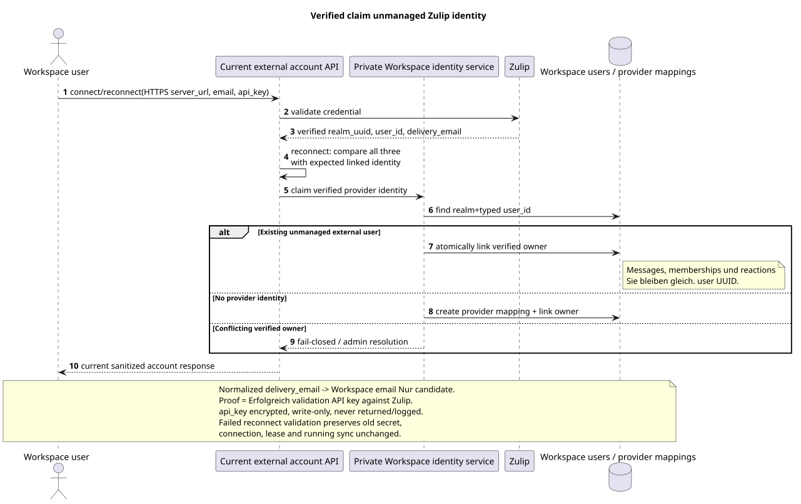

# Lebenszyklus des Kontos und identity Zulip

Status: **proposal; current public API gespeichert, target semantics geklärt**.

[← Hauptindex der Dokumentation](../index.md) · [Index Zulip Bridge](README.md) · [Bootstrap und recovery](coordination_and_recovery.md) · [Provider mappings und content](provider_mappings_and_content.md)

Dokument zeichnet den Lebenszyklus eines einzelnen Benutzers auf Zulip account, verified
identity claim Es fügt keine Routen, Felder hinzu.,
actions Der aktuelle öffentliche Vertrag bleibt in der
[`workspace_api.md`](../workspace_api.md) und
[`zulip_bridge_v1_product_and_api.md`](../zulip_bridge_v1_product_and_api.md).

## Nicht veränderbar öffentlich account API

Alle Pfade unten sind unter
`/api/workspace/v1/messenger`. Maximal ein Account mit
`settings.kind="zulip"` Einer ist erlaubt Workspace owner.

| Method | Current route | Speichert semantics |
| --- | --- | --- |
| `GET` | `/external_accounts/` | Liste der aktuell gesäuberten Accounts owner. |
| `POST` | `/external_accounts/` | Erstellen und überprüfen Sie Zulip account mit client-generated `uuid` und write-only credential. |
| `GET` | `/external_accounts/{account_uuid}` | Sanitized snapshot Nur die eigene account. |
| `PUT` | `/external_accounts/{account_uuid}` | Revision-safe Die Änderung `selection_mode`, `history_depth`, `default_project_id`; `If-Match` bleibt erhalten. |
| `POST` | `/external_accounts/{account_uuid}/actions/reconnect/invoke` | Überprüfen und ersetzen Sie `server_url`/email/`api_key`, dann führen Sie den gleichen Bootstrap aus wie bei connect. |
| `POST` | `/external_accounts/{account_uuid}/actions/disconnect/invoke` | Sync stoppen, indem man account/credential und frozen visible history. |
| `DELETE` | `/external_accounts/{account_uuid}` | Aktive empty `204` zurückgeben; target cleanup account-scoped und nicht löschen shared canonical data. |

Zulip create/reconnect Sie empfängt HTTPS `server_url`, email und write-only
`api_key`. Workspace prüft HTTPS, verschlüsselt den Schlüssel bis zur dauerhaften Speicherung und niemals
Gibt keine Anmeldeinformationen oder einen verschlüsselten Umschlag zurück, schreibt ihn nicht in public event,
Log, Trace oder Safe Error. Reconnect validiert die neue Anmeldeurkunde gegen
erwartete verified `realm_uuid`, provider `user_id` und normalized
`delivery_email`. Nur eine vollständige Übereinstimmung erlaubt eine atomare Umwandlung. encrypted
secret Jeder Validierung/mismatch-Fehler lässt den alten zurück.
credential, connection, lease und sync mit.

Das öffentliche Feld `selection_mode` speichert die exakten Literals `explicit` und `all`.
Das vom Benutzer vereinbarte Wort individual bedeutet bereits vorhandenen
`explicit`: owner wählt einzelne Chats aus. `all` bleibt dynamisch  neu
Alle verfügbaren Chats erhalten automatisch einen Assignment in `default_project_id`.

`history_depth` Nur für `new`, `7_days`, `30_days`, `90_days`, `all`;
default — `30_days`. Filter Wirkt für jeden einzeln connected account.
Jeder ausgewählte externer Chat ist zu jeder Zeit genau einem zugewiesen Workspace
project; Wirkung
`/external_chats/{chat_uuid}/actions/move/invoke` - Er hält es. atomic reassignment
Ohne Zwischenzustand "nicht" oder "in zweien" projects».

## Connect und reconnect

Connect und reconnect verwenden einen Algorithmus von
[`coordination_and_recovery.md`](coordination_and_recovery.md#единый-bootstrap-connect-reconnect-и-recovery):

1. Workspace Validiert die Anmeldeinformationen über Zulip und erhält verified
   `realm_uuid`, authenticated Zulip `user_id` und `delivery_email`.
2. Für die Wiederverbindung vergleicht sie mit der erwarteten Linked Identity.
   Die Übereinstimmung in einer Workspace Transaktion ersetzt encrypted secret und
   verbindet/bestätigt verified provider identity; mismatch fail-closed und nicht
   Stoppt die alte Verbindung.
3. Workspace sticky scheduler Benennt einen Account healthy compatible
   Bridge mit dem Mindestwert normalized load `active_accounts / declared_capacity`
   Wir haben die Lease/fencing Generation. owner.
4. Bridge Registriert eine neue Zulip Event-Warteschlange nur für supported event types,
   Erhält boundary und startet sofort sequential realtime loop.
5. Erst nach erfolgreicher Registrierung erstellt die boundary Bridge eine
   Workspace root history task mit current selection/history settings.

Die alte Zulip queue/cursor ist nicht prerequisite reconnect. Local Bridge
cache Es könnte leer sein.; authoritative account, mappings, tasks, outbound
operations und lease generation sind in Workspace.

## Disconnect

Disconnect Atomisch transferiert account in den current `disconnected` Lifecycle und
Erst dann wird die Leasinggeneration aufgehoben. commit:

- Neue Zulip Events und outbound Provider Calls für Account werden nicht akzeptiert;
- credential/account bleiben für current reconnect action;
- selected-chat assignments, user bindings Und die bereits sichtbare Geschichte bleibt
  frozen und nach den aktuellen Zugriffsregeln gelesen werden;
- canonical/provider mappings nicht gelöscht;
- pending work bis zu reconnect nicht ausgeführt und nicht auf ein anderes ausgeführt account.

Disconnect ist nicht Löschen und verbirgt nicht den bereits verfügbaren Verlauf.

## Delete: accepted target semantics {#delete-accepted-target-semantics}

Die öffentliche `DELETE` Route und `204` werden erhalten, aber die Ziel-Cleaningup unterscheidet sich von
Das ist eine veränderte Form der semantics,
Nicht eine Veränderung. browser contract.

In einem account-scoped cleanup operation Workspace:

1. Sync abbrechen, Fencing den Mietvertrag widerrufen und neue verbieten provider
   calls.
2. Bindet verified Zulip identity von IAM/Workspace owner; external identity
   kann unmanaged author/member ohne bleiben session/credentials.
3. Entfernt encrypted account credential, account assignment/mappings und queued
   history/outbound work Nur das. account.
4. Löscht nur account-derived user bindings, access/projection rows und
   account provenance. Native access und Zugriff, der von anderen bestätigt wurde connected
   account, - Sie werden aufbewahrt..
5. Löscht nicht shared canonical `MESSAGE`, `TOPIC`, `STREAM`, user identity oder
   file, während sie über einen anderen connected account zugänglich sind oder native
   relation.
6. Löscht nur nach Beweismaterial die physical file/blob zero remaining
   references; shared/deduplicated object Sie wird nie von account flag.

Cleanup retry Wird nicht überschrieben. author UUID,
message content, reactions oder memberships der verbleibenden canonical union.
Wenn der zu löschende Account den Provider des Routing-Common-Service besitzt same-project chat,
Workspace bis zur Account Cleanup Atomübertragung stream/topic/message/file
provenance Der erste verbleibende Selected Alias. `DELETE 204`
wird nicht ohne den allgemeinen Stream outbound route.

## Verified user claim

Ausgangsgestalt , die bearbeitet werden kann:
[`identity_claim.puml`](diagrams/identity_claim.puml).

Normalized Zulip `delivery_email` und normalized Workspace account email geben
Nur der erste Kandidat.
provider identity key.

Verified claim wird so ausgeführt::

1. Existing Workspace user wird eindeutig aufgerufen current account create/reconnect mit
   Zulip `api_key`.
2. Bridge Validiert die Credential bei Zulip und erhält authenticated
   `(realm_uuid,user_id,delivery_email)`.
3. Workspace Überprüft die Identität des Providers unter Transaction Lock owner link.
4. Wenn stable identity unmanaged ist, bindet Workspace sie an IAM owner UUID,
   ohne einen neuen User UUID zu erstellen und ohne Nachrichten zu überschreiben, memberships,
   reactions, URNs oder provider mappings.
5. Wenn die Identität bereits für einen anderen Besitzer verifiziert wurde, wird die Operation fail-closed und
   erfordert eine administrative Genehmigung; email similarity ändert nichts.

## Unmanaged external identities und bots

History/realtime `realm_user/add` erstellt oder wiederverwendet eine unmanaged
external Workspace user nach stabiler Provider Identity, wenn zutreffend Workspace
account Nein, so ist es. identity:

- als author/member sichtbar und nur dort teilnimmt, wo sie importiert wurde;
- keine Anmeldeinformationen, kein Login/session oder die Berechtigung, im Namen der Person zu handeln;
- kann später ohne Änderung beansprucht werden UUID/references;
- Erhält user updates/avatar/status nach accepted event coverage.

`realm_bot/add` Erstellt einen speziellen Bot-Benutzer. `realm_bot/update` Metadata bleibt
unsupported. Zulip deactivate/delete Deaktiviert/löscht den Bot einseitig und
sein account-derived access; der shared message content wird nicht gelöscht.

## Multi-account canonical union

Für einen verified Zulip realm canonical provider entities bilden union
Alle connected accounts:

- provider user/channel/topic/message/file identity wird einmal erstellt und
  wird nach stable realm-scoped mapping;
- history depth und selection werden für jeden einzeln angewendet account;
- per-account provenance und per-user bindings/access unterscheiden sich;
- Ein Account kann einen tieferen Verlauf hinzufügen canonical topics,
  messages Und Dateien, die niemand sonst gesehen hat. account;
- Wenn Sie einen Account löschen, wird nur seine Zugriffsbestätigung gelöscht, nicht sein Account.
  shared row.

Wenn ein Chatprovider gleichzeitig von mehreren ausgewählt wird accounts, target
muss die verbleibenden account-access sources bis zum Löschen als binding/file und nicht
erste Account als ewige verwenden owner canonical row.

Die Entscheidung `2A` gibt die Cross-Account-Border eindeutig an: eins
realm-global provider chat kann nur in einem ausgewählt werden `project_id`.
Same-project accounts Sie werden den einheitlichen Stream/topic graph übernutzen, und die Wahl des Alias in
Das andere Projekt bekommt `409 provider_scope_conflict`. Public
`provider.account_uuid` zeigt den aktuellen routing owner an; bei ihm
deselect/delete ownership Atomisch an den Rest weitergegeben Selected alias ohne
Änderungen der canonical row oder des öffentlichen Browser-Kontrakts.
Die Entscheidung ist in
[`workspace_server_v2_decisions.md`](../workspace_server_v2_decisions.md#2a--один-realm-global-provider-chat-принадлежит-одному-project).

[← Hauptindex der Dokumentation](../index.md) · [Index Zulip Bridge](README.md) · [Bootstrap und recovery](coordination_and_recovery.md) · [Provider mappings und content](provider_mappings_and_content.md)
