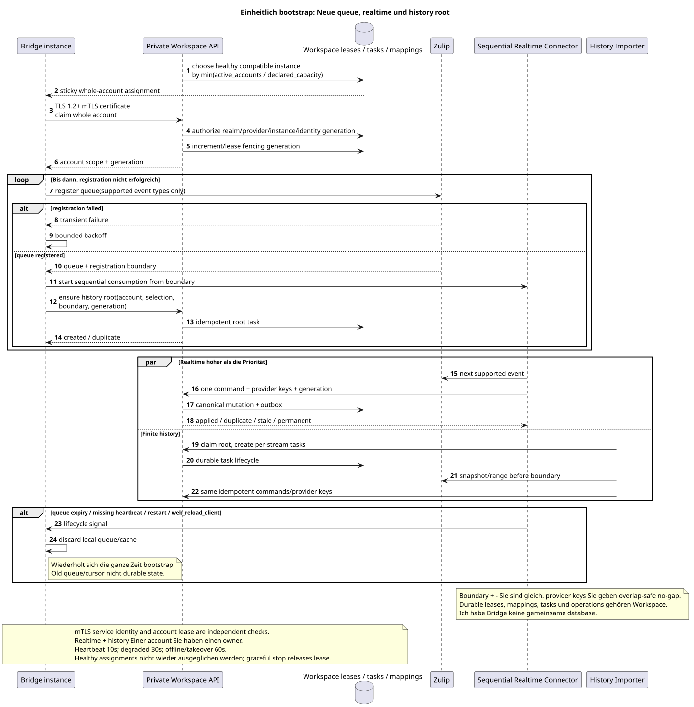

# Überblick über die Zilarchitektur Zulip Bridge

Status: **proposal; docs-first, public Workspace API unverändert**.

[← Hauptindex der Dokumentation](../index.md) · [Index Zulip Bridge](README.md) · [Ereignismatrix](event_coverage.md) · [Kanonisches Inventar](../messenger_architecture_inventory.md)

Zulip Bridge — Ein separater vertrauenswürdiger Kontur ohne direkten Zugang zu Workspace DB.
Es besteht aus zwei unabhängigen Prozessen, die einen private Workspace
API, Eine Identitäts-Service-Richtlinie und identische provider/idempotency keys.

## Komponenten und Grenzen der Verantwortung

| Komponente | Besitzt | Das tut er nicht. |
| --- | --- | --- |
| `Zulip Realtime Connector` | Whole-account lease, neue supported Zulip queue, streng konsequente Inbound-Luppe und durable Workspace-origin delivery | Importiert nicht die alte Range, macht nicht recipient fan-out/projections |
| `Zulip History Importer` | Workspace-owned root/per-stream tasks und endgültiger Import des ausgewählten history range | Besitzt keine Realtime-Warteschlange, speichert keine message checkpoint v1 |
| Private Workspace API | Wirksam realm-bound mTLS service identity, server-owned scope, provider mappings, idempotent canonical mutation, account/task/outbound lifecycle | Vertrauenslos HTTP header/body, übertragen Bridge `project_id`/user oder account lease als Ersatz authentication |
| Workspace workers | Fan-out, bindings/state, snapshots/counters, ready events | Sie lesen nicht Zulip und sind nicht Bridge workers |
| WebSocket dispatcher | Replay/live delivery durable ready events | Erstellt keine Business Events und entscheidet keine provider sync |

Alles durable assignments, account lease generations, mappings, history tasks,
outbound operations, failures und audit evidence sind in Workspace. Bridge
keine gemeinsame Datenbank; local cache/queue connection kann verloren gehen und wiederhergestellt werden.

Bridge ist ein Protokolladapter, nicht ein zweiter Domain-Service Workspace.
wird Zulip event zu einem privaten Befehl umwandeln und Workspace outbound
operation zurück in Zulip, aber nicht entscheidet historical visibility, membership
bindings, archive/delete policy oder notification eligibility.

Beide Prozesse werden die bestehende S2S boundary
`workspace-external-bridge-api`: TLS 1.2+ mutual TLS, realm control CA und
generation-bound client certificate mit URI SAN, die nur
`realm_uuid`/`provider_kind`/`bridge_instance_uuid`/`identity_generation`.
Einmalige enrollment und renewal/revoke lifecycle bleiben die gleichen wie in
current control/file/Provider API. Whole-account lease/fencing Überprüft
Für jeden Account-Befehl ist es nicht möglich authentication.

## Account und identity boundary

Aktuelle public account/chat routes und Payloads werden gespeichert. Connect/reconnect
Validiert Zulip `api_key`, erhält verified realm/user/`delivery_email` und
Nur dann wird die Identität gebunden.
Workspace account wird unmanaged external user ohne Login/session; spät
verified claim Die Identität wird übernommen.:
[`account_lifecycle_and_identity.md`](account_lifecycle_and_identity.md).

History depth und selected chat scope gehören zu einem bestimmten Account, aber
canonical provider entities Sie bilden eine realm-weite Union.
nur seine credential/work/access evidence; shared canonical rows bleiben.

## Einheitlicher Bootstrap und recovery

Ausgangsgestalt , die bearbeitet werden kann:
[`bootstrap_to_realtime.puml`](diagrams/bootstrap_to_realtime.puml).

Connect, reconnect, queue expiry, missing heartbeat, `restart` und
`web_reload_client` Sie führen denselben Algorithmus aus.:

1. Workspace scheduler Zeigt den gesamten Account an healthy compatible Bridge
   mit minimalem normalized load `active_accounts / declared_capacity` und gibt
   lease/fencing generation. Assignment sticky.
2. Registriert eine neue Zulip Warteschlange nur für unterstützte Eventtypen und erhält
   registration boundary. Bei Fehlern wiederholt mit backoff; History wird nicht gestartet.
3. Starten Sie sofort eine streng sequentielle Echtzeit-Schleife von boundary.
4. Erstellt eine Workspace history root task für den Snapshot/range bis
   boundary mit account selection/history settings.

Die alte Zulip queue/cursor ist keine durable prerequisite.
provider keys Überlappungen, aber keine Gap: die erste tatsächliche state mutation
erstellt outbox/event, Wiederholung wird duplicate/no-op.

V1 kann mit einem Bridge arbeiten, aber die Schaltung unterstützt mehrere instances.
Die neue gesunde Instanz wird nicht re-balance: sie erhält
Neue Aufgaben; nur für dead/draining owner. Graceful
shutdown Erst nach dem Abbau der Leasingverträge, ist die Übernahme erlaubt. `60s` offline timeout
Und er bekommt immer ein neues. fencing generation. Heartbeat interval `10s`, status
`degraded` Nach `30s`, `offline` nach `60s`.

## Die allgemeine Domänenmutation der Nachricht

Inbound realtime und history verwenden den gleichen Befehl. Workspace
transaction Sie ist ...:

1. ermöglicht realm-scoped provider mapping und canonical `MESSAGE`;
2. Erlaubt ein verbindliches `TOPIC`, das einem gehört `STREAM`/`PROJECT`;
3. Erstellt `MESSAGE_PLACEMENT`, author `USER_MESSAGE_BINDING` und
   placement-scoped `USER_MESSAGE_STATE`;
4. Berechnet public placement UUID wie
   `UUIDv5(namespace=TOPIC.uuid, name=MESSAGE.uuid)`;
5. Schreibt immutable outbox event.

`2xx`/`201` bedeutet commit canonical state/idempotency, nicht Abschluss fan-out.
Workspace workers Sie erstellen asynchron die recipient state, counters/snapshots und ready
events. Bridge ersetzt dieses Subsystem nicht.

## Structure, content und files

- Numeric users/channels/messages/attachments haben realm-scoped UUIDv5 mit exact
  ASCII name `<entity_type>:<decimal_provider_id>`; allowed types und decimal
  normalization in der provider mapping document.
- Zulip topic hat Workspace-owned durable mapping und alias history; UUID nicht
  Direct/group direct wird private `STREAM` und
  mandatory synthetic default `TOPIC`.
- Whole-topic rename behalten topic UUID. canonical
  `MESSAGE`, Löscht die alte Platzierung, erstellt die Plazierung in target topic; old URL
  - Er bringt es zurück .`404`, public events delete+create/update.
- Eine Datei entspricht `(realm_uuid,attachment_id)`; Message Links sind getrennt,
  physical blob Nur wenn zero references.
- Public content — Nur gültig canonical Markdown/URN. Latest raw Zulip
  payload/version/converter metadata Verborgen private; nicht revision history raw
  Neust-first unresolved links werden angezeigt deferred repair; reconversion
  Erfüllt nur manual versioned batch tool.

Weitere Informationen: [`provider_mappings_and_content.md`](provider_mappings_and_content.md).

## Realtime, history und outbound

Realtime per account Er liest genau eine Geschichte, macht sie zu einer Geschichte. internal
command, wiederholt sich bis applied/duplicate/stale oder classified permanent failure,
Die History-Root erstellt Per-Stream-Tasks, verschiedene
streams werden parallel zur configured limit ausgeführt, ein Stream  ein worker,
topics/messages Wenn Sie den aktuellen Start starten,
stream task wiederholt den gesamten Bereich; Provider keys machen bereits importierte
Schnell no-op.

Der gesamte History Pool eines Bridge hat den default `4`; upper limit/optimum bleiben
Zwischen Konten wird fairer Round-robin verwendet, innerhalb account —
newest stream first. Workers account Sie nutzen die rate limiter. Zulip
`Retry-After` Stoppt history account; realtime hat Priorität und
wird durch.

Workspace-origin mutation Atomisch speichert canonical state, outbox und durable
outbound operation. Transient delivery retry Sie ist besorgt. failover; internal
`permanent_failed` Erstellt keine neuen public endpoint. Last confirmed mutation
wins, delete wins stale edit, echo suppresses reciprocal write. Weitere Informationen:
[`delivery_and_events.md`](delivery_and_events.md).

## Public events

Jeder tatsächliche client-visible transition — live, backfill, deferred repair
oder die Konversion  erzeugt atomar genau eins ready public event. Duplicate/no-op
event Workspace worker commit-it projection+event zusammen, dispatcher
Er bringt nur/replay-Ich will ihn essen.`delivery_class`und notification metadata bleiben
in current shape; Bridge kann nicht gelöst werden desktop/push policy.

## Event coverage und Beschränkungen

Die kanonische Richtungsmatrix ist nur in
[`event_coverage.md`](event_coverage.md). Unsupported families Sie bekommen nicht
guessed fallback. Restliche Transport/serialization/limits/policy Lösungen
nur in
[- Das ist ein Kanonisch OPEN-list](README.md#единый-список-open-решений-zulip-bridge).

[← Hauptindex der Dokumentation](../index.md) · [Index Zulip Bridge](README.md) · [Ereignismatrix](event_coverage.md) · [Kanonisches Inventar](../messenger_architecture_inventory.md)
