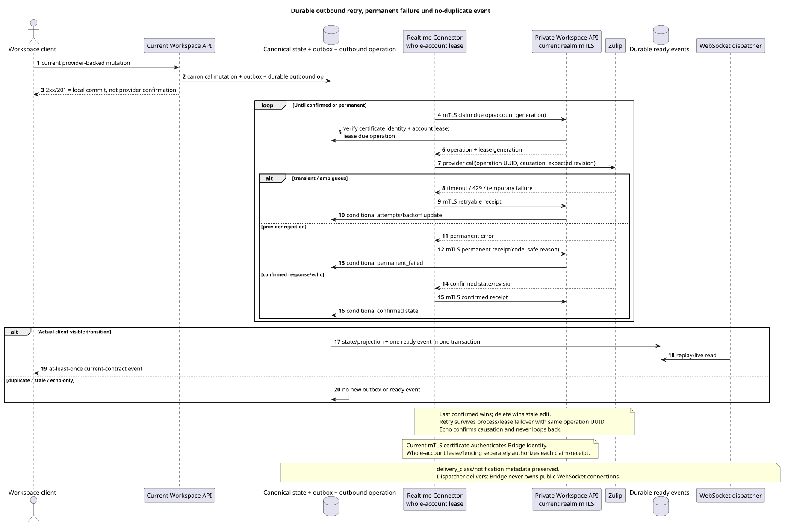

# Outbound delivery, conflicts und public events

Status: **proposal; public routes/`delivery`/event shapes unverändert**.

[← Hauptindex der Dokumentation](../index.md) · [Index Zulip Bridge](README.md) · [Realtime Connector](realtime_connector.md) · [Innenbereich Workspace API](internal_workspace_api.md)

Das Dokument gibt durable outbound semantics und die Regel an public WebSocket events.
Es fügt keine Benachrichtigung UI, Konflikt UI, Retry Route oder neue public
status literal.

## Die Bedeutung eines erfolgreichen Workspace response

Für eine provider-backed mutation public Workspace `2xx`/`201` bedeutet, dass eine
Lokal transaction committed:

- canonical primary mutation und laufende author/placement/state rows;
- immutable domain outbox event;
- durable outbound provider operation mit stable operation UUID,
  `causation_uuid`, provider target mapping und expected revision/state;
- Die bestehende sanitized `delivery` Projektion in der aktuellen contract shape.

Response bedeutet nicht, dass Zulip bereits bestätigt hat mutation. Transient provider
failure nicht den committed Workspace Status rückgängig machen und nicht verlieren operation: retry
survives Connector process crash, account lease expiry und transfer zu einem anderen
Bridge instance.

Current public
`/external_operations/{operation_uuid}/actions/retry/invoke` Und seine Fehler nicht
Für den internen Inbound `permanent_failed` wird kein neuer erstellt. UI/action:
Das ist nicht neu. public retry endpoint.

## Durable operation lifecycle

Ausgangsgestalt , die bearbeitet werden kann:
[`outbound_delivery.puml`](diagrams/outbound_delivery.puml).

Internal operation - Er hält es auf. operation UUID, source outbox event UUID, account
lease generation, provider object identity, expected/confirmed provider
revision, causation, attempts/backoff und sanitized failure code/reason.

Mindestzahl internal outcomes:

| Outcome | Semantics |
| --- | --- |
| `pending` | Durable operation committed, provider call Noch nicht bestätigt.. |
| `retryable` | Transient network/`429`/provider failure; same operation waits until `next_retry_at`. |
| `confirmed` | Provider response/state/echo confirms requested transition. |
| `permanent_failed` | Provider endless retry ist verboten. |
| `superseded` | Eine neuere confirmed/delete operation macht die alte Mutation nicht anwendbar. |

Das ist ein internes Modell, keine Erweiterung. current public `delivery.status`. Existing
`delivery`, `safe_error`, `can_retry`, `can_discard`, duplicate/reconciliation
fields die aktuellen Werte und authorization. Internal
`permanent_failed` nur über die bereits zulässige sanitized failure
semantics; raw provider response/content nicht veröffentlicht.

Future operator requeue kann durch eine separate Lösung hinzugefügt werden, aber jetzt nicht
Permanent failure wird gespeichert/alarmiert und verfügbar private
reconciliation; neue browser notification/retry action wird nicht erstellt.

## Retry und account failover

Bridge Authentifiziert private API request mit aktuellen realm-bound mTLS client
certificate und erhält separat die whole-account lease/fencing generation von
Workspace. Vor jedem Provider Call und Receipt Update überprüft Workspace und
certificate identity, und Account Generation. expiry:

1. Der alte Besitzer kann nicht mehr überprüfen result.
2. Nur nach `60s` wird der Offline-Timeout-Scheduler gesetzt healthy compatible
   owner; Neue Bridge Claims alle Account mit neuen Fencing Generation, führt
   Normal Bootstrap und über private API erhält due operations.
3. Retry verwendet die gleiche Operation UUID/provider key/causation und beginnt
   reconcile-- Das ist ... ambiguous provider state.
4. Confirmation wird conditional nach lease generation geschrieben und provider
   revision; stale response wird no-op.

Bridge-local retry queue nicht autoritative. Backoff/attempts/next retry und
terminal state Sie befinden sich in Workspace.

Graceful draining/shutdown lease offensichtlich freigibt; healthy sticky account nicht
wird nur wegen des Auftretens von weniger belasteten instance.

## Conflict semantics

- Last **confirmed** mutation wins; arrival time/job time nicht version.
- Delete wins over concurrent oder später geliefert stale edit.
- Für die bidirectional presence/status liefert die Bridge beide konsequent
  Winner: Gewinnt der Letzte confirmed state.
- `origin`/`causation_uuid` werden für Echo Suppression verwendet/idempotency- Nein .
  als Priorität Workspace oder Zulip.
- Echo Die gleiche causation bestätigt operation und erzeugt nicht reciprocal
  outbound work.
- Keine Text-Merge, keine versteckte Gabel oder conflict UI.
- Stale edit Nach dem Löschen erhält internal no-op/superseded outcome; canonical
  deleted state und Client-Events werden nicht zurückgefahren.
- Same provider operation retry Ich bin nicht in der Lage; ambiguous result wird nach
  provider identity/revision/state, Nicht nach dem Zeitstempel-Vorhersage.

## Genau ein ready Event pro tatsächlicher transition

Jede Transaktion, die tatsächlich erstellt/verändert/löscht client-visible
state, Atomisch erzeugt genau eine entsprechende durable ready public event
Für diese transition/audience. gilt dies gleichermaßen für `live`, history
backfill, deferred reference repair und manual reconversion.

- State/projection row und ready event commit together oder rollback together.
- Idempotent duplicate/stale/no-op Erstellt keine neuen public event.
- Bei einer History/realtime-Overlappe erzeugt die erste committed transition ein Event, die zweite
  mit dem gleichen provider key/version gibt duplicate/no-op ohne event.
- Recipient fan-out Erstellt nur eine ready event in einer Transaktion, die
  Eine spezifische recipient projection sichtbar.
- Delete old placement + create/update target placement bei partial move  zwei
  Wir haben eine Reihe von realen public state transitions, jede mit einem current-contract event, aber retry
  Er wiederholt sie nicht..

`delivery_class` (`live`/`backfill`) und bestehende
`notification_eligible`/notification metadata in der public sanitized
projection. Bridge nicht gelöst desktop/push eligibility: client verwendet
current contract. Backfill event Es gibt es, aber die Metadaten machen es nicht zu
desktop notification.

WebSocket dispatcher Er erstellt keine Business Events, er liest. durable event store,
macht replay/live delivery at-least-once, und der Client dedupe-it nach event UUID.

## Internal retention

- Successfully completed history tasks und confirmed/successful outbound delivery
  operations Sie werden durch die interne Reinigung gelöscht `30 days`.
- `permanent_failed` operation zusammen mit safe code/reason gespeichert `90 days`,
  Dann wird es gelöscht. internal cleanup.
- Provider mappings und latest hidden raw payload/converter Metadata haben keine
  task TTL: Sie leben so lange wie die entsprechende Workspace/provider
  entity.

Retention nicht public fields hinzufügt/actions. Möglich future internal requeue
nicht realisiert und nicht das bestehende public external-operation retry route.

## Beobachtbarkeit

Account/operation-scoped Metrics ohne Anforderung content/credential:

- pending/retryable age, attempts, next retry und oldest operation;
- confirmed/permanent_failed/superseded counts by safe code;
- account lease owner/generation mismatch und stale receipt rejection;
- provider rate-limit/backoff und outbound lag;
- duplicate/no-op count und unexpected duplicate-ready-event guard;
- public projection→ready event transaction failures und Dispatcher lag separat.

[← Hauptindex der Dokumentation](../index.md) · [Index Zulip Bridge](README.md) · [Realtime Connector](realtime_connector.md) · [Innenbereich Workspace API](internal_workspace_api.md)
