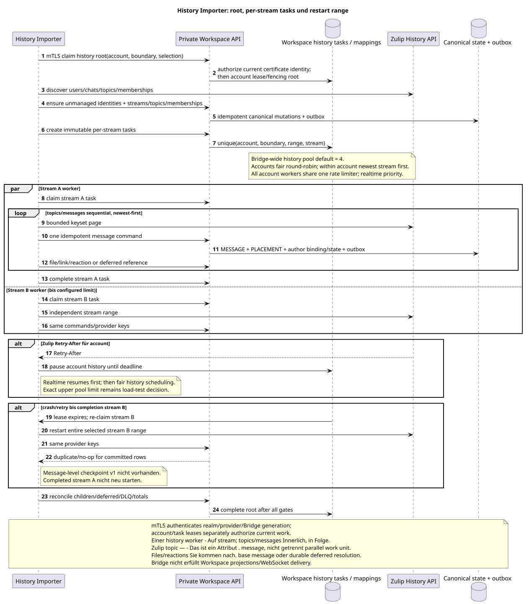

# Zulip History Importer

Status: **Vorschlag; endgültig Workspace-task-driven import**.

[← Hauptindex der Dokumentation](../index.md) · [Index Zulip Bridge](README.md) · [Ereignismatrix](event_coverage.md) · [Bootstrap und recovery](coordination_and_recovery.md) · [Provider mappings/content](provider_mappings_and_content.md)

`Zulip History Importer` führt den finite import des ausgewählten account history
range. Er besitzt keine Realtime-Warteschlange, schreibt keine Workspace DB und speichert keine
message-level checkpoint. Durable root/child tasks und results gehören
Workspace private API.

## Vorbedingungen

History root erst nach erfolgreicher Registrierung der neuen supported-events
queue und start realtime von der Registrierungsgrenze. server-owned
account, verified realm, selection, `history_depth`, boundary, lease generation
Und die stabile Task Identity..

Importer ruft current private API nur unter demselben realm-bound mTLS client
certificate, dass der Realtime Connector der Daten Bridge instance. Certificate
überprüft die Service Identity; Claim jede Root/stream Task und active whole-account
lease/fencing Sie beweisen das Recht , mit einem bestimmten account/range.

History depth (`new`, `7_days`, `30_days`, `90_days`, `all`) wird angewendet per
account; default `30_days`. Canonical entities Sie bilden die Vereinigung aller connected
accounts, also kann deeper account topics/messages/files ohne
Kopieren provider identity.

## Root und per-stream tasks

Ausgangsgestalt , die bearbeitet werden kann:
[`history_importer.puml`](diagrams/history_importer.puml).

Root task Erstellt für jeden eine unwandelbare Child-Task selected
channel/direct/group-direct stream:

1. Prüft/erstellt unmanaged external user identities und bot identities;
   verified connection claim — Einzelne account operation.
2. Erlaubt realm-scoped canonical channels/streams.
3. Für den Channel liest accessible-topic Metadata und enthält nur Topics, die
   Die haben Nachrichten drin. account history range.
4. Direct/group direct Erstellt einen privaten Stream mit einem mandatory synthetic
   default topic.
5. Überträgt memberships/subscriptions und server-owned project assignment in
   Workspace; domain service Sie entscheiden selbst historical visibility und bindings.
6. Erstellt per-stream-Tasks in der Reihenfolge last activity descending.

Workspace idempotency/unique task key Gewährleistet, dass der Retry-Root keine
zweites Kind für dasselbe immutable stream range.

## Parallelismus und Ordnung

Ein Bridge hat gemeinsam configurable history worker pool, default `4`.
Die genauen Safe Upper Limit und Optimum bleiben bis zu den Lasttests. stream tasks
können parallel ausgeführt werden, aber ein Stream gleichzeitig Claims genau ein
history worker. Topics und Messages innerhalb des Streams werden nachfolgend verarbeitet,
Da Zulip topic  ein Attribut ist message; message priority — `created_at DESC`,
bei gleicher Zahl stable provider message ID descending. `OFFSET` wird nicht verwendet;
Jede gebundene Anfrage verwendet keyset/provider pagination.

Scheduler wählt Accounts Fair Round-Robin, und innerhalb des ausgewählten account —
newest stream first Alle Worker Accounts teilen sich einen
account-level rate limiter. Zulip `Retry-After` Stoppt die Geschichte genau
dieser Account; realtime lane hat Priorität und wird bei der ersten Wiederholung.

Realtime loop unabhängig und immer höher als die Priorität/admission. History worker nicht
hält das Konto-weite Sperren vorübergehend aufrecht provider request; lease generation
wird bei jeder claim und jeder private API commit.

## No message-level checkpoint v1

Child task Die letzte importierte Nachricht wird nicht gespeichert. process crash, lease expiry
oder retryable failure unfinished stream task beginnt den gesamten selected range mit
Dieselbe Realität/provider keys werden zuvor umgewandelt committed users/topics/
messages/files/reactions in duplicate/no-op, ohne eine zweite zu erstellen canonical row,
outbox oder ready event. Die vollendeten Stream-Aufgaben werden nicht neu gestartet.

Task lifecycle Workspace-owned: `pending` → `leased/running` → `completed` oder
`failed`, mit attempts/backoff, lease expiry/fencing, bounded retries und DLQ.
Default pool `4` Nur die Obergrenze./optimumund gemessen rate/batch
budgets bleiben in canonical OPEN-list.

## Message und dependency order

Im Stream-Importer werden zunächst die User, der Stream, die obligatorischen Themen und
memberships/bindings. Dann für jeden message newest-first:

1. Einer der beiden idempotent `message.create`/`update`/`delete`/`move` command;
2. Workspace transaction erstellt/aktualisiert canonical `MESSAGE`, placement,
   author binding/state und outbox;
3. Nach der Basis-Nachricht importiert files/attachment links und reactions;
4. unresolved older quote/message/file reference Behält sich als verschoben, nicht
   synthetic public object;
5. actual later repair Erstellt eine normale Outbox/ready Event, no-op  nichts.

Eine canonical-Datei kann für alle `(realm_uuid,attachment_id)`. Topic
Der Name wird über Workspace-owned mapping/alias history erlaubt.
verändert UUID; partial move erstellt target placement und löscht old placement.

## Current state, deletes und unsupported families

History stellt den nachweisbaren current state des ausgewählten Snapshots/range wieder her, und
Nicht erfundene Revisionsgeschichte. Nur für die raw-Nachricht gespeichert latest
payload/revision/hash/converter metadata. Persistent supported state umfasst
message flags, reactions, memberships, selected user fields/status, files and
links. Presence/typing/heartbeat/restart Nicht zurückgefüllt. Experimental
`submessage`, unsupported UI/personal/org families nicht importiert werden;
`saved_snippets` Bleibt. OPEN.

## Completion und reconciliation

Stream task `completed` bedeutet terminal processing im immutable range und
durably classified deferred/permanent items. Root Sie ist zu Ende. child
tasks und reconciliation:

- selected stream/topic/message ranges, provider identity uniqueness und gaps;
- memberships/access, attachment references, reactions und deferred refs;
- no duplicate canonical rows/outbox/events wenn sich das mit realtime;
- Workspace task/DLQ/outbound failures and projection lag reported separately.

Backfill actual transition Atomisch erstellt man ein bereites öffentliches Ereignis über
gewöhnlicher Workspace Projektionsweg mit `delivery_class="backfill"`; duplicate/no-op
Es wird kein Event erstellt. notification policy.
The message snapshot carries `read`; the final fence is `history.finalize`.

## Graceful restart und observability

Graceful stop Stoppt neue Stream-Claim, beendet/übergibt current task und
Hard Crash erlaubt Übernahme nur nach
`60s` offline timeout; Der neue fenced owner wiederholt bootstrap, unfinished stream
task range, Aber nicht completed siblings.

Completed history tasks sind audit/retry evidence `30 days`, danach
Internal retention cleanup entfernt sie. Provider mappings/raw entity metadata
Sie folgen nicht dieser Aufgabe TTL und leben mit der entsprechenden entity.

Metriken: root/child counts, stream ordering/age, full-range restarts,
messages/files/reactions scanned vs applied/duplicate, deferred/DLQ, provider
rate limits, history lag and reconciliation mismatch. Raw content/credential Nein .
Loggen Sie sich ein.

[← Hauptindex der Dokumentation](../index.md) · [Index Zulip Bridge](README.md) · [Ereignismatrix](event_coverage.md) · [Bootstrap und recovery](coordination_and_recovery.md) · [Provider mappings/content](provider_mappings_and_content.md)
