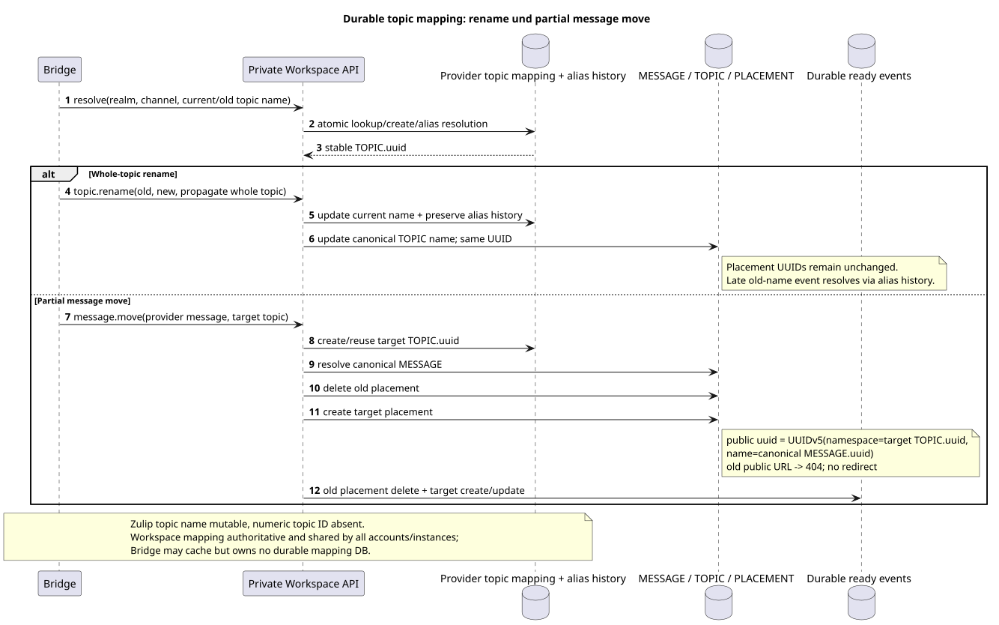
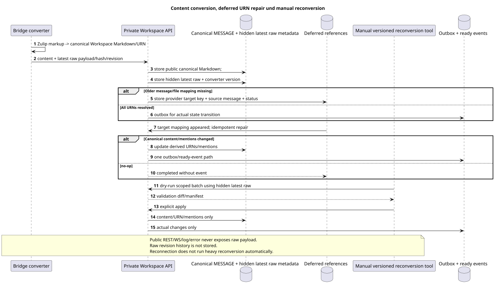

# Provider mappings, topics, files und content conversion

Status: **proposal; internal design, public Markdown/URN contract unverändert**.

[← Hauptindex der Dokumentation](../index.md) · [Index Zulip Bridge](README.md) · [Account lifecycle und identity](account_lifecycle_and_identity.md) · [Innenbereich Workspace API](internal_workspace_api.md)

Das Dokument wird festgehalten realm-global provider identity, durable topic mapping,
file/attachment reuse und Zulip↔Workspace content conversion. Bridge speichert nicht
authoritative mappings Lokal und nicht hinzufügen Bridge-specific public markup.

## Realm-scoped provider identity

Stable numeric Zulip IDs Sie benutzen logische key
`(verified_realm_uuid, entity_kind, numeric_provider_id)`. `entity_kind`
ist zwingend erforderlich und verhindert die Kollision der gleichen Anzahl zwischen user/channel/
message/attachment domains.

| Provider kind | Stable logical key | Canonical result |
| --- | --- | --- |
| user | `(realm_uuid,"user",user_id)` | Einer managed oder unmanaged `WorkspaceUser` identity. |
| channel | `(realm_uuid,"channel",channel_id)` | Einer canonical channel `STREAM`. |
| message | `(realm_uuid,"message",message_id)` | Eine canonical `MESSAGE`, unabhängig von importing account. |
| attachment/file | `(realm_uuid,"attachment",attachment_id)` | Eine canonical Workspace File; Links zu Messages sind getrennt. |

Target UUID/provider mapping Benutzt einen genauen Algorithmus:

1. Namespace — Überprüft wurde , dass es stable ist .Zulip realm UUIDEr wird nur als
   canonical lowercase hyphenated UUID text, Sie werden in UUID zerlegt und in UUID übertragen.
   UUIDv5 Wie 16 ?RFC 4122/network-byte-order octets. Project/account UUIDIch habe nie
   werden nicht als namespace.
2. Die zulässige `entity_type`  ist genau eine von lowercase ASCII literals:
   `user`, `channel`, `message`, `attachment`.
3. Numeric provider ID Das ist ein Zeichen, das als Ganzes ohne Zeichen aufgedeckt wird.,
   Die Ablehnung des Bruchteils oder der nicht-numerischen Bedeutung. decimal form —
   shortest base-10 ASCII: `0` Für null, sonst Ziffern `0..9` ohne leading zeros,
   `+`, die Lücke oder locale formatting.
4. UUIDv5 name — genaue ASCII-Zeile
   `<entity_type>:<decimal_provider_id>`, Zum Beispiel `message:12345`.
5. Bytes name ist gleich ASCII/UTF-8 Bytes dieser Zeile ohne NUL, BOM, newline,
   braces, prefix, project/account/server URL oder zusätzliche Felder.

Wir haben  `UUIDv5(namespace=verified_realm_uuid, name_bytes)`.
numeric ID Die verschiedenen Typen sind nicht durch die obligatorische prefix.
Mutable email/name/server URL und importing account nicht in identity.

Provider mapping und canonical row werden atomar erstellt/gelesen private
Workspace API. Multiple Bridge instances/accounts Sie erhalten ein Ergebnis.;
local cache kann ohne Verlust entsorgt werden identity.

## Discovery und history scope

History depth Wird per account verwendet. Für den Channel Stream root task liest
Zulip accessible-topic metadata Und die Zeitgrenze. account
nur Themen, die eine Message in ihm haben, werden projiziert `history_depth` range.
Ein anderer Account mit einem tieferen Bereich kann später neue hinzufügen
canonical topics/messages; Das ist eine normale Union-Erweiterung, nicht duplicate.

Direct, self-direct und group direct werden in private Workspace `STREAM` angezeigt
Mit einem Mandatory synthetic default`TOPIC`. Nullable/sentinelThema für
placement Exact stable conversation key wird von provider mapping,
nicht aus display name.

## Durable topic mapping Ohne numeric Zulip topic ID

Ausgangsgestalt , die bearbeitet werden kann:
[`topic_mapping_and_move.puml`](diagrams/topic_mapping_and_move.puml).

Zulip topic hat keine stable numeric ID, also kann `TOPIC.uuid` nicht ausgeführt werden
nur von mutable topic name. Workspace besitzt durable provider topic mapping,
Bridge nur über privateAPI. Mapping speichert logisch:

- `realm_uuid` und stable provider channel identity;
- current normalized provider topic identity/name;
- stable canonical `TOPIC.uuid`;
- rename/alias history, ausreichend für late old-name event;
- immutable owning canonical stream/project association.

Die Erstellung von /reuse erfolgt unter Workspace transaction lock.
Bridge instances Einer Realm nutzt Mapping, und Bridge Cache ist nicht
source of truth.

### Whole-topic rename

Whole-topic rename Aktualisiert den canonical topic name und den alias history, aber behält
- Das ist derselbe .`TOPIC.uuid`. Spätere Ereignisse mit altem Namen werden über den History in derselben Liste gelöscht
topic identity. Da der Namespace-Placement UUID gleich bleibt, public
message placement URLs nicht nur wegen whole-topic rename.

### Partial message move

Partial move Ein Teil der Nachrichten ist nicht rename:

1. Workspace findet die canonical source `MESSAGE` auf realm/message mapping.
2. Target topic erstellt oder wiederverwendet wird durable mapping.
3. Source `MESSAGE_PLACEMENT` wird gelöscht; content `MESSAGE` wird nicht kopiert.
4. Ziel-Themen erstellen eine neue Platzierung mit public UUID
   `UUIDv5(namespace=TOPIC.uuid, name=MESSAGE.uuid)`.
5. Die alte public message URL nach commit gibt current `404` zurück; redirect und
   hidden primary placement Verboten.
6. In der gleichen state transition werden Transaktionen erstellt ready events: deletion
   der alten Placement und current-contract create/update snapshot der neuen
   placement. Duplicate retry Er erzeugt kein zweites Paar. events.

## Canonical files und attachments

Eine canonical Workspace file entspricht
`(realm_uuid,attachment_id)`. Repeated history/realtime import und Verweise aus
mehrere messages/accounts wiederverwenden file row/blob. Normalisiert
message↔file links sind separate source-of-truth-Zeilen und haben eine eigene
referential integrity.

Das Löschen von account oder einer attachment relation löscht file/blob nicht, solange
Physical object wird nur nach dem
zero-reference check. Provider file bytes/metadata und mapping account-independent;
access wird durch message/stream/user bindings.

Workspace→Zulip upload wird nur als Teil ausgeführt provider-backed
message/action mit verified account/mapping. Normaler unrelated Workspace file nicht
wird automatisch an Zulip gesendet.

Typed UUIDv5 serialization für users/channels/messages/attachments vollständig
ist nichtOPEN. Business uniqueness file bleibt erhalten
`(realm_uuid,attachment_id)`.

## Kanonischer Markdown und URNs

Public `payload.kind="markdown"` und aktuelle URNs werden ohne Erweiterung gespeichert:

- `[name](urn:user:<user-uuid>)`;
- `[message](urn:message:<placement-uuid>)`;
- `[stream](urn:stream:<stream-uuid>)`;
- `[topic](urn:topic:<topic-uuid>)`;
- `[file](urn:file:<file-uuid>?name=...)`;
- `` und `urn:video`;
- `[url](urn:url:https://...)`;
- - die derzeitigen Quote/replyMarkdown-Rules aus
    [`workspace_api.md`](../workspace_api.md#messages).

Inbound Zulip content converter Er erzeugt nur canonical Workspace Markdown.
Outbound converter Löscht URNs über durable provider mappings und bildet
Zulip markup. Nicht erlaubt UUID wird nicht durch display name/URL ersetzt.

## Latest raw provider layer

Ausgangsgestalt , die bearbeitet werden kann:
[`content_conversion_and_repair.puml`](diagrams/content_conversion_and_repair.puml).

Eine canonical provider-Nachricht wird nur gespeichert latest raw Zulip message
payload, latest provider revision/hash, converter version und bounded conversion
result metadata. Revision history raw payloads nicht geführt.

Raw layer vollständig verborgen:

- nicht in Serie public REST list/get/search/action response;
- nicht in public WebSocket event;
- nicht in log, trace, metric label oder public/safe error;
- nur von einem private authenticated Provider /Bridge API und versioned manual
  reconversion tooling mit server-owned realm/account scope.

Provider mapping, latest hidden raw payload, provider revision/hash, converter
version und Conversion Metadata leben so lange wie die entsprechende
Workspace/provider entity. Es ist ein interner Lebenszyklus, kein separates öffentliches Feld und
nicht unabhängig raw revision archive.

Public content Es ist immer ein kanonischer Markdown.`provider`/`delivery`Sie bleiben
Die Daten werden von den vorhandenen sanitized public projections verwendet; keine raw protocol fields hinzugefügt.

## Deferred references - und newest-first import

Die neue Nachricht kann eine ältere Nachricht zitieren , die noch nicht importiert wurde message/file.
Converter Speichert den internen Referenzverzug provider target key,
canonical source message UUID, converter version und repair status. Public
Markdown Erhält nicht synthetic entity.

Wenn die Target-Mapping erscheint, erlaubt idempotent repair nur erneut
affected references. Wenn canonical public content/mentions/derived URNs
Wirklich geändert, wird die Transaktion den Message-Status aktualisiert, schreibt outbox und
Es wird ein einziges ready-current-contract-Ereignis erstellt. event.

## Manual reconversion

Heavy reconversion Es wird nie innerhalb des Schemas migration oder normalen ausgeführt
request path. Schema migration kann nur ein neues registrieren converter
version/need. Ein separates versioned manual Tool muss unterstützt werden:

- `dry-run`/check-only und explicit apply;
- realm/account/project/range scope;
- bounded batches, restart/checkpoint und audit manifest;
- raw access Nur über private authenticated boundary;
- validation counts/diffs bis apply und reconciliation nach.

Reconversion kann canonical Markdown, derived URNs und mentions ändern.
- Das ändert sich. author, canonical/placement UUID, stream/topic, public timestamps,
read/star/pin state, reactions Jede tatsächliche Änderung folgt
der üblichen Outbox/projection/ready-event-Regel; no-op erstellt keine event.

[← Hauptindex der Dokumentation](../index.md) · [Index Zulip Bridge](README.md) · [Account lifecycle und identity](account_lifecycle_and_identity.md) · [Innenbereich Workspace API](internal_workspace_api.md)
