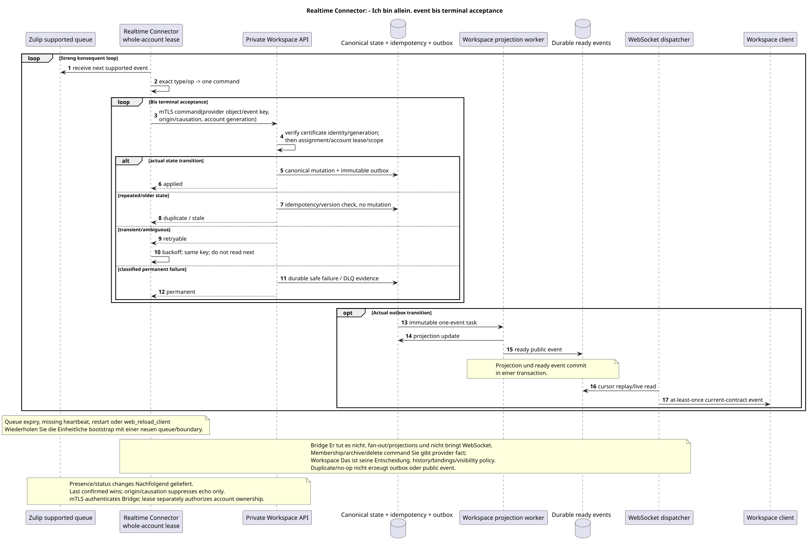

# Zulip Realtime Connector

Status: **proposal; ständiger sequential process, public API unverändert**.

[← Hauptindex der Dokumentation](../index.md) · [Index Zulip Bridge](README.md) · [Ereignismatrix](event_coverage.md) · [Bootstrap und recovery](coordination_and_recovery.md) · [Outbound delivery](delivery_and_events.md)

`Zulip Realtime Connector` Betreibt alle externen Accounts unter einem
Workspace-issued lease. Er akzeptiert nur unterstützte Ereignisse, sendet
durable Workspace-origin operations Und schreibt nie Workspace DB direkt..
Er ist ein Protokoll-Translator und trifft keine Workspace Domain-Policy Entscheidungen.

## Start

Ausgangsgestalt , die bearbeitet werden kann:
[`realtime_connector.puml`](diagrams/realtime_connector.puml).

Connector Es wird immer über
[Einheitlich bootstrap](coordination_and_recovery.md#единый-bootstrap-connect-reconnect-и-recovery):

1. Authentifizieren Sie das aktuelle realm-bound mTLS Client Certificate und dann claims
   Der gesamte Account mit einer separaten fencing generation.
2. Registriert eine neue Warteschlange mit allowlist supported event types.
3. Erhält registration boundary.
4. Er fängt sofort an. realtime consumption.
5. Nach erfolgreichem Start erzeugt history root task.

Registration failure Erlaubt keine History ohne boundary. Queue expiry, missing
heartbeat, `restart` und `web_reload_client` befreien die aktuelle Verbindung und
Old queue/cursor ist nicht durable state.

## Streng konsequent inbound loop

Per account gleichzeitig genau ein inbound event:

1. Erhalten next supported event.
2. Senden Sie den Befehl über current mTLS private API; Workspace unabhängig
   überprüft die Identitäts- und account lease/fencing generation.
3. Classifizieren Sie genau `type`/`op` nach
      [`event_coverage.md`](event_coverage.md), ohne eine annähernd fallback.
4. Erstellen eines privaten Workspace Befehls mit provider object/event key,
   origin/causation und provider revision/hash, wenn es existiert.
5. Wiederholen des Befehls bis terminal acceptance.
6. Nur nach applied/duplicate/stale/confirmed oder classified permanent
   failure Weitergehen event.

Transient timeout/`429`/temporary provider error Verlässt das gleiche Event in
Missing Dependency bleibt als durable Workspace deferred reference
Unsupported Events dürfen nicht in die Terminal-Akzeptanz eingehen subscription;
Wenn der Provider sie zurückgibt, schreibt Connector bounded audit/metric und nicht
Erstellt guessed mutation.

## Workspace transaction und async boundary

Private API Erhält nur die Service-Identität aus dem geprüften mTLS certificate,
a project/source/user/account scope  von Workspace assignments/mappings und
active lease. Für die tatsächliche Mutation macht er in einer Transaktion
idempotency check, canonical mutation, placement/binding/state Wenn nötig
und immutable outbox append. Duplicate/no-op erzeugt keine zweite outbox/event.

Recipient fan-out, counters, reactions/file snapshots und ready public events
- Das tun sie .WorkspaceDie Connector erwartet nicht, dass sie zu Ende gehen, und nicht
Die Ready-Event wird atomar mit der tatsächlichen projection;
WebSocket dispatcher bleibt eine eigenständige Komponente..

## Supported message/content paths

- Create/update/delete/move messages, reactions, files/attachments, read/unread,
  starred, mentions/links/render-related changes Folgen bidirectional matrix.
- Inbound content wird in canonical Workspace Markdown/URN; latest raw
  payload Deferred older references werden über Workspace.
- Whole-topic rename behalten durable topic UUID. Partial move löscht old
  placement, Erstellt eine neue Platzierung in dem Zielthema; old public URL gibt zurück
  `404`, redirect nicht erstellt.
- Reactions Sie adressieren public placement für access, aber fact/snapshot bleiben
  canonical-message-global nach dem semantics.
- File reuse wird `(realm_uuid,attachment_id)`; unrelated native file
  nicht in Zulip.

## Structure, users und ephemeral events

- Zulip channel create Erstellt mapped Workspace stream; native Workspace stream
  create nicht erzeugt Zulip channel.
- Membership add/remove in group/private chat wird von einer übertragen Workspace private
  command. Bridge erstellt keinen neuen Stream wegen der Änderung des Inhalts und löst nicht,
  Welche Geschichte sichtbar ist oder welche Messagebindings erstellen/löschen: das macht
  Workspace domain service Nach stream settings.
- Channel archive/delete wird als Provider Command übermittelt; Workspace entscheidet
  archive/history/bindings/visibility. Bridge nicht doppeln policy.
- Weitere subscription/topic/user selected updates folgen exact matrix.
- Unbekannte ordinary identity wird unmanaged external user bei import;
  verified existing user claim wird nur explicit account connection.
- Bot add Erstellt special user; bot metadata update unsupported;
  deactivate/delete Kommt schon. Zulip→Workspace.
- Presence/status/typing Zwei-seitige; presence/typing TTL-based und nicht durable
  history, `user_status` persistent. Echo suppression nicht erzeugt reciprocal op.

Für die bidirectional presence/status Connector liefert Änderungen konsequent
Die letzte bestätigte Veränderung ist, dass die Zellzelle von einem Körper, der von zwei Seiten getrennt ist, nicht selbst den Konflikt löst.
Siegert. `origin`/`causation_uuid` werden nur für Echo Suppression und
idempotency, Sie geben nicht einer Seite Priorität.

## Workspace-origin outbound lane

Workspace `2xx` - Er hält es. local canonical mutation + outbox + durable outbound
operation. Connector Erhält due operation über private API unter dem gleichen account
generation, ruft Zulip und bestätigt es bedingungsweise receipt. Transient retries
Sie sind besorgt. process/lease failover. Last confirmed wins; delete wins stale edit;
echo Bestätigt die Causation ohne Rückkehr command. Provider permanent rejection
wird intern `permanent_failed`, nicht neu public action/status.

Vollständig semantics:
[`delivery_and_events.md`](delivery_and_events.md).

## Backpressure, restart und observability

Realtime lane Es hat Vorrang vor der Geschichte. inbound loop sequential,
seine queue growth wird von der provider queue/backoff, nicht von parallel, geregelt reorder.
Alle history workers-Konten werden geteilt account-level limiter; `Retry-After`
Pausiert die Geschichte, während Realtime erst wiederhergestellt wird.
Auf graceful stop Connector nimmt nicht next event/provider operation, beendet oder
Lasst die retryable Current Unit zurück, leiht die Conditional aus.:
Der neue Besitzer startet Bootstrap, und replay/overlap wird dedupliziert provider keys.

Metriken: queue registration/expiry, event processing age, terminal outcomes,
duplicate/no-op, retry/backoff, lease generation mismatch, echo match failure,
outbound pending/permanent failure und einzeln Workspace projection/WS lag. Raw
content, email und credential sind in labels/logs/errors.

[← Hauptindex der Dokumentation](../index.md) · [Index Zulip Bridge](README.md) · [Ereignismatrix](event_coverage.md) · [Bootstrap und recovery](coordination_and_recovery.md) · [Outbound delivery](delivery_and_events.md)
