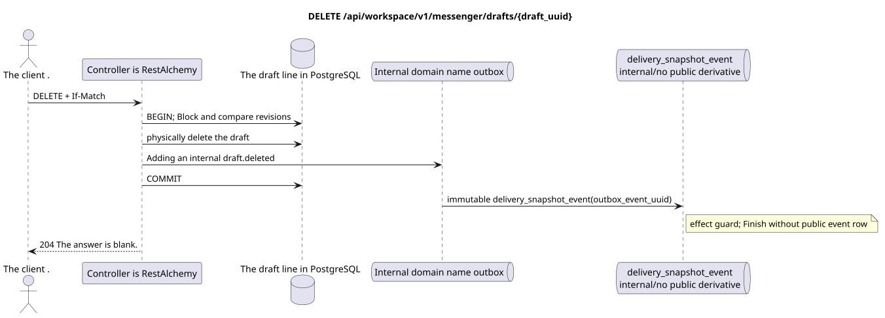

# `DELETE /api/workspace/v1/messenger/drafts/{draft_uuid}`


General reliability target invariant: each immutable outbox event emits exactly one immutable typed task with a unique `outbox_event_uuid`; coalescing is absent. The task stores the actual exact scope key, uses lease/fencing, retry/backoff, max attempts/DLQ, reaper, and an idempotent effect guard. Topic scope applies only to placement/message-binding work; shared rows do not receive an implicit fallback to topic.

[← Main documentation index](../../../../index.md) · [Sequence diagram index](../../README.md) · [Workspace content and users section](../README.md)

Status: target operational specification, developed first in documentation. The current public contract
remains unchanged and is normative in [`workspace_api.md`](../../../../workspace_api.md).
This file describes target transaction and projection boundaries; it is not
production code, SQL migrations, or a new endpoint.



[Editable PlantUML source](diagrams/delete_draft.puml)

## Purpose and public contract

Physically delete an owner's draft using optimistic concurrency.

Authentication: IAM Bearer token; `project_id` and the current `user_uuid` are taken from the IAM context.

## Path and request parameters

| Location | Name | Type / rule |
| --- | --- | --- |
| path | `draft_uuid` | UUID |
| header | `If-Match` | mandatory exact strict revision |

Collection pagination, where provided, preserves the current `page_limit` contract and UUID
`page_marker` and returns `X-Pagination-Limit`, as well as
`X-Pagination-Marker` only if a next page exists.

## Request body

No request body.

## Successful response

`204` with an empty response body.


## Errors and authorization

A missing `If-Match` returns `428`. An invalid/stale revision returns `412` with the current snapshot and ETag. An inaccessible draft is returned as not found.

General validation error response form:

```json
{
  "type": "ValidationErrorException",
  "code": 400,
  "message": "Validation error occurred."
}
```

## Target RestAlchemy boundary

```python
from restalchemy.api import controllers as ra_controllers
from restalchemy.api import resources as ra_resources
from restalchemy.dm import models
from restalchemy.dm import properties
from restalchemy.dm import types
from restalchemy.storage.sql import orm


class WorkspaceDraft(models.ModelWithUUID, models.ModelWithProject,
                     models.ModelWithTimestamp, orm.SQLStorableMixin):
    # Contract boundary only; target physical naming/decomposition is not selected.
    __tablename__ = "m_workspace_drafts"
    user_uuid = properties.property(types.UUID(), required=True, read_only=True)
    stream_uuid = properties.property(types.UUID(), required=True, read_only=True)
    topic_uuid = properties.property(types.UUID(), required=True, read_only=True)
    payload = properties.property(types.Dict(), required=True)
    revision = properties.property(types.Integer(min_value=1), read_only=True)


class WorkspaceDraftController(ra_controllers.BaseResourceControllerPaginated):
    __resource__ = ra_resources.ResourceByRAModel(
        model_class=WorkspaceDraft,
        convert_underscore=False,
        process_filters=True,
    )
    # Narrow overrides preserve owner scope, keyset marker, ETag and If-Match.
```

Each public entity reference is declared as a scalar UUID property in RestAlchemy, not `relationship` (which would serialize as a URI). The corresponding physical column `*_uuid` is an indexed foreign key with an explicitly chosen referential action. Therefore, the public JSON preserves the UUID unchanged.

The target internal draft model here is intentionally not reworked. The declaration fixes the immutable scalar UUID/ETag boundary. Physical user/stream/topic UUID columns remain indexed FKs with cascade behavior from the current contract; RestAlchemy relationships must not change the public UUID JSON.

## Synchronous API path

1. Parse `If-Match`.
2. Lock the owner's draft and compare the revision.
3. Physically delete it and add an internal immutable domain draft record to the outbox without a public derivative.
4. Commit the transaction and return `204`.

## Outbox, typed tasks, worker, and real-time work

The current contract does not create a deletion marker or a public event.

The internal immutable outbox event emits one `delivery_snapshot_event`,
which idempotently records the absence of a public derivative and completes;
no ready Workspace event row or WebSocket delivery is created.

## Idempotency, keys, and races

The exact revision precondition prevents deletion of a draft updated in parallel. FK cascades also delete drafts when an owner/stream/topic is deleted without public events.

## Client visibility moment

The initiating client immediately sees the committed draft. Other clients will see it only after a reload or an explicit re-request of drafts; there is no sent update with eventual consistency.

[← Main documentation index](../../../../index.md) · [Sequence diagram index](../../README.md) · [Workspace content and users section](../README.md)
