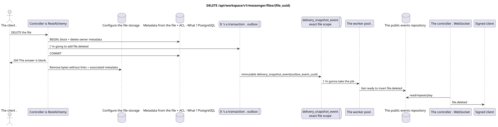

# `DELETE /api/workspace/v1/messenger/files/{file_uuid}`


General reliability target invariant: each immutable outbox event emits exactly one immutable typed task with a unique `outbox_event_uuid`; coalescing is absent. The task stores the actual exact scope key, uses lease/fencing, retry/backoff, max attempts/DLQ, a reaper, and an idempotent effect guard. Topic scope applies only to placement/message-binding work; shared rows do not receive an implicit fallback to topic.

[← Main documentation index](../../../../index.md) · [Sequence diagram index](../../README.md) · [Workspace content and users section](../README.md)

Status: target operational specification, developed first in documentation. The current public contract
remains unchanged and is normative in [`workspace_api.md`](../../../../workspace_api.md).
This file describes target transaction and projection boundaries; it is not
production code, SQL migrations, or a new endpoint.



[Editable PlantUML source](diagrams/delete_file.puml)

## Purpose and public contract

Delete the owner's file and revoke access to its bytes.

Authentication: Bearer IAM token; `project_id` and the current `user_uuid` are taken from the IAM context.

## Path and request parameters

| Location | Name | Type / rule |
| --- | --- | --- |
| path | `file_uuid` | UUID |

Collection pagination, where provided, preserves the current `page_limit` contract and UUID
`page_marker` and returns `X-Pagination-Limit`, as well as
`X-Pagination-Marker` only if a next page exists.

## Request body

No request body.

## Successful response

`204` with an empty response body.


## Errors and authorization

Only the owner can delete. An inaccessible UUID or a UUID belonging to another owner is not disclosed. Storage cleanup errors occur after canonical deletion and do not restore public access.

General validation error response form:

```json
{
  "type": "ValidationErrorException",
  "code": 400,
  "message": "Validation error occurred."
}
```

## Target RestAlchemy boundary

```python
from restalchemy.api import controllers as ra_controllers
from restalchemy.api import resources as ra_resources
from restalchemy.dm import models
from restalchemy.dm import properties
from restalchemy.dm import types
from restalchemy.storage.sql import orm


class WorkspaceFile(models.ModelWithUUID, models.ModelWithProject,
                    models.ModelWithTimestamp, orm.SQLStorableMixin):
    # Contract boundary only; target storage decomposition is not selected.
    __tablename__ = "m_workspace_files"
    user_uuid = properties.property(types.UUID(), required=True, read_only=True)
    stream_uuid = properties.property(types.AllowNone(types.UUID()))
    name = properties.property(types.String(max_length=255), required=True)
    description = properties.property(types.String(max_length=255), default="")
    content_type = properties.property(types.String(max_length=255), required=True)
    size_bytes = properties.property(types.Integer(min_value=0), required=True)
    hash = properties.property(types.String(max_length=255), required=True)


class WorkspaceFileController(ra_controllers.BaseResourceControllerPaginated):
    __resource__ = ra_resources.ResourceByRAModel(
        model_class=WorkspaceFile,
        hidden_fields=["project_id"],
        convert_underscore=False,
        process_filters=True,
    )
    # Narrow multipart/storage/download overrides preserve the current contract.
```

Each public entity reference is declared as a scalar UUID property in RestAlchemy, not as `relationship` (which would serialize as a URI). The corresponding physical column `*_uuid` is an indexed foreign key with an explicitly chosen referential action. Therefore, the public JSON preserves the UUID unchanged.

The current metadata/storage/ACL contract is preserved; the target physical partitioning is not selected. `project_id` remains hidden. The scalar `user_uuid` and the `null`-allowing `stream_uuid` remain public UUID values, supported by indexed FKs. Dynamic access via stream membership is checked against canonical stream bindings.

## Synchronous API path

1. Find and lock the owner's file metadata.
2. Delete the canonical file/ACL row and add an immutable `file.deleted` record to the outbox.
3. Commit the transaction and return `204`.
4. After transaction commit, delete binary data and associated metadata that are no longer referenced.

## Outbox, typed tasks, worker, and real-time work

The ready deletion event is created asynchronously. Public access disappears upon metadata deletion commit, before object cleanup completes if possible.

The committed domain file record in the outbox creates a separate immutable
`delivery_snapshot_event` with the exact file scope and a unique
`outbox_event_uuid`. The worker idempotently writes the ready `file.deleted`, and
the dispatcher sends, retries, or replays it.

## Idempotency, keys, and races

The UUID defines one canonical metadata record. Deletion and updates are serialized on this row; a later operation sees the deletion. Storage cleanup allows retries and must account for references.

## Client visibility moment

The initiating client immediately receives committed metadata. Other clients receive the ready file event after projection delay. Storage cleanup after committed deletion may complete later, without restoring access to metadata.

[← Main documentation index](../../../../index.md) · [Sequence diagram index](../../README.md) · [Workspace content and users section](../README.md)
