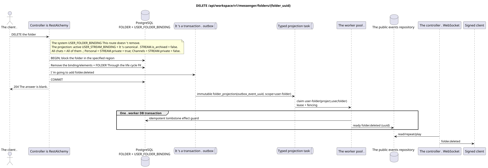

# `DELETE /api/workspace/v1/messenger/folders/{folder_uuid}`

[← Main documentation index](../../../../index.md) · [Sequence diagram index](../../README.md) · [Workspace content and users section](../README.md)

Status: Target operation specification, developed first in documentation. The current public contract
remains unchanged and is normative in [`workspace_api.md`](../../../../workspace_api.md).
This file describes target transaction and projection boundaries; it is not
production code, SQL migrations, or a new endpoint.



[Editable PlantUML source](diagrams/delete_folder.puml)

## Purpose and public contract

Delete the current user's folder.

Authentication: IAM Bearer token; `project_id` and the current `user_uuid` are taken from the IAM context.

## Path and request parameters

| Location | Name | Type / rule |
| --- | --- | --- |
| path | `folder_uuid` | UUID |

Collection pagination, where applicable, preserves the current `page_limit` contract and UUID
`page_marker` and returns `X-Pagination-Limit`, as well as
`X-Pagination-Marker` only if a next page exists.

## Request body

No request body.

## Successful response

`204` with an empty response body.


## Errors and authorization

Invalid or unauthorized input is handled by the common RESTAlchemy/IAM error boundary; resources within the specified scope are not exposed beyond user/project boundaries.

General validation error response format:

```json
{
  "type": "ValidationErrorException",
  "code": 400,
  "message": "Validation error occurred."
}
```

## Target RestAlchemy boundary

```python
from restalchemy.api import controllers as ra_controllers
from restalchemy.api import resources as ra_resources
from restalchemy.dm import models
from restalchemy.dm import properties
from restalchemy.dm import types
from restalchemy.storage.sql import orm


class WorkspaceFolder(models.ModelWithUUID, models.ModelWithProject,
                      models.ModelWithTimestamp, orm.SQLStorableMixin):
    __tablename__ = "messenger_folders"
    title = properties.property(types.String(min_length=1, max_length=64), required=True)
    background_color_value = properties.property(types.AllowNone(types.Integer()))


class WorkspaceUserFolderBinding(models.ModelWithUUID, models.ModelWithProject,
                                 models.ModelWithTimestamp, orm.SQLStorableMixin):
    __tablename__ = "messenger_user_folder_bindings"
    # Public UUID links are scalar UUID properties, never URI relationships.
    user_uuid = properties.property(types.UUID(), required=True, read_only=True)
    folder_uuid = properties.property(types.UUID(), required=True, read_only=True)
    unread_count = properties.property(types.Integer(min_value=0), default=0, read_only=True)
    mention_count = properties.property(types.Integer(min_value=0), default=0, read_only=True)
    folder_items_snapshot = properties.property(types.List(), default=list, read_only=True)
    folder_items_snapshot_version = properties.property(types.Integer(min_value=0), default=0, read_only=True)
    folder_items_snapshot_updated_at = properties.property(types.AllowNone(types.UTCDateTimeZ()), read_only=True)
    BUSINESS_KEY = ("project_id", "user_uuid", "folder_uuid")


class WorkspaceUserFolder(models.ModelWithTimestamp, orm.SQLStorableMixin):
    __tablename__ = "messenger_api_user_folders_v1"
    binding_uuid = properties.property(types.UUID(), id_property=True, read_only=True)
    uuid = properties.property(types.UUID(), read_only=True)
    title = properties.property(types.String(min_length=1, max_length=64))
    background_color_value = properties.property(types.AllowNone(types.Integer()))
    unread_count = properties.property(types.Integer(min_value=0), read_only=True)
    system_type = properties.property(types.AllowNone(types.Enum(["all", "created"])), read_only=True)
    folder_items = properties.property(types.List(), read_only=True)


class FolderController(ra_controllers.BaseResourceControllerPaginated):
    __resource__ = ra_resources.ResourceByRAModel(
        model_class=WorkspaceUserFolder,
        hidden_fields=["binding_uuid", "project_id", "user_uuid"],
        convert_underscore=False,
        process_filters=True,
    )
```

Each public reference to an entity is declared as a scalar UUID property in RestAlchemy, not `relationship` (which would serialize as a URI). The corresponding physical column `*_uuid` is an indexed foreign key with an explicitly chosen referential action. Therefore, the public JSON preserves the UUID unchanged.

On read, the public `folder_items` is taken directly from the read-only JSONB `folder_items_snapshot`; normalized `FOLDER_ITEM` remain the source of truth. Folder deletion does not assemble an array in the request path; FK lifecycle removes the root/binding and dependent items. Reading does not use N+1, `json_agg`, `COUNT`, or custom SQL.

Only the user folder with rule/type `created` is deleted. The system
`USER_FOLDER_BINDING` has a fixed rule and is not deleted by this
route. Its automatic `FOLDER_ITEM` are a worker-maintained, recoverable projection from active `USER_STREAM_BINDING` and canonical
`STREAM` with `is_archived = false`: `All chats` includes all such available
streams, `Personal` includes only streams with `STREAM.private = true`, and `Channels` includes
only those with `STREAM.private = false`. The projection lifecycle is managed by a background
task, not by manual deletion of the system folder.

## Synchronous API path

1. Find the folder and user binding within the specified scope.
2. Delete folder items and binding via declared FK ownership, then delete the canonical folder according to its lifecycle.
3. Add an immutable `folder.deleted` record with the public folder UUID to the outbox.
4. Commit the transaction and return `204`.

## Outbox, typed tasks, worker, and real-time work

The delete request does not recalculate unread counts. Cleanup and the deletion event marker are built based on committed keys.

The committed event emits an immutable `folder_projection` without coalescing,
with exact scope `user-folder:(project_id,user_uuid,folder_uuid)` and a unique
`outbox_event_uuid`. Since source rows are already deleted, the worker idempotently
commits a ready `folder.deleted` tombstone based on outbox keys; within the same worker DB
transaction, an effect guard is committed. The dispatcher delivers the event
only after commit. Retry/backoff, DLQ/reaper are mandatory.

## Idempotency, keys, and races

A competing operation in the same scope either executes before the deletion or receives a "not found" response. Dependent cleanup is performed by FK actions; a handwritten chain of SQL deletions is not introduced.

## Client visibility moment

The REST response reflects the synchronous folder change. Other clients will see the corresponding ready event after a limited projection delay with eventual consistency.

[← Main documentation index](../../../../index.md) · [Sequence diagram index](../../README.md) · [Workspace content and users section](../README.md)
