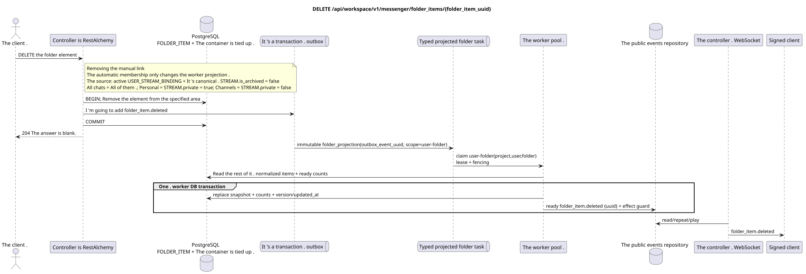

# `DELETE /api/workspace/v1/messenger/folder_items/{folder_item_uuid}`

[← Main documentation index](../../../../index.md) · [Sequence diagram index](../../README.md) · [Workspace content and users section](../README.md)

Status: Target operation specification, developed first in documentation. The current public contract
remains unchanged and is normative in [`workspace_api.md`](../../../../workspace_api.md).
This file describes target transaction and projection boundaries; this is not
production code, SQL migrations, or a new endpoint.



[Editable PlantUML source](diagrams/delete_folder_item.puml)

## Purpose and public contract

Remove a stream from the current user's folder.

Authentication: IAM Bearer token; `project_id` and current `user_uuid` are taken from the IAM context.

## Path and request parameters

| Location | Name | Type / rule |
| --- | --- | --- |
| path | `folder_item_uuid` | UUID |

Collection pagination, where applicable, preserves the current `page_limit` contract and UUID
`page_marker` and returns `X-Pagination-Limit`, as well as
`X-Pagination-Marker` only if a next page exists.

## Request body

No request body.

## Successful response

`204` with an empty response body.


## Errors and authorization

Invalid or unauthorized input is handled by the common RESTAlchemy/IAM error boundary; resources in the specified scope are not exposed beyond user/project boundaries.

Common validation error response format:

```json
{
  "type": "ValidationErrorException",
  "code": 400,
  "message": "Validation error occurred."
}
```

## Target RestAlchemy boundary

```python
from restalchemy.api import controllers as ra_controllers
from restalchemy.api import resources as ra_resources
from restalchemy.dm import models
from restalchemy.dm import properties
from restalchemy.dm import types
from restalchemy.storage.sql import orm


class WorkspaceFolderItem(models.ModelWithUUID, models.ModelWithProject,
                          models.ModelWithTimestamp, orm.SQLStorableMixin):
    __tablename__ = "messenger_folder_items"
    user_uuid = properties.property(types.UUID(), required=True, read_only=True)
    folder_uuid = properties.property(types.UUID(), required=True)
    stream_uuid = properties.property(types.UUID(), required=True)
    chat_type = properties.property(types.Enum(["stream", "group", "private"]), required=True)
    order_index = properties.property(types.AllowNone(types.Integer()))
    pinned_at = properties.property(types.AllowNone(types.UTCDateTimeZ()), read_only=True)


class WorkspaceUserFolderItem(models.ModelWithTimestamp, orm.SQLStorableMixin):
    __tablename__ = "messenger_api_user_folder_items_v1"
    uuid = properties.property(types.UUID(), id_property=True, read_only=True)
    project_id = properties.property(types.UUID(), read_only=True)
    user_uuid = properties.property(types.UUID(), read_only=True)
    folder_uuid = properties.property(types.UUID(), read_only=True)
    stream_uuid = properties.property(types.UUID(), read_only=True)
    chat_type = properties.property(
        types.Enum(["stream", "group", "private"]), read_only=True,
    )
    order_index = properties.property(types.AllowNone(types.Integer()))
    pinned_at = properties.property(types.AllowNone(types.UTCDateTimeZ()), read_only=True)
    # Ready fields are joined from unique USER_STREAM_BINDING. They are not
    # stored on WorkspaceFolderItem and are never calculated on API reads.
    unread_count = properties.property(types.Integer(min_value=0), read_only=True)
    active_unread_count = properties.property(types.Integer(min_value=0), read_only=True)
    passive_unread_count = properties.property(types.Integer(min_value=0), read_only=True)


class FolderItemController(ra_controllers.BaseResourceControllerPaginated):
    __resource__ = ra_resources.ResourceByRAModel(
        model_class=WorkspaceUserFolderItem,
        convert_underscore=False,
        process_filters=True,
    )
    # Writes use WorkspaceFolderItem; reads use the calculation-free view.
```

Each public reference to an entity is declared as a scalar UUID property in RestAlchemy, not `relationship` (which would serialize as a URI). The corresponding physical column `*_uuid` is an indexed foreign key with an explicitly chosen referential action. Therefore, the public JSON preserves the UUID unchanged.

The physical element has indexed FKs `folder_uuid`, `stream_uuid`, and `user_uuid` with `ON DELETE CASCADE`. Its public UUID references remain scalar. The three unread fields are copied via a simple indexed join from the unique `USER_STREAM_BINDING` by `(project_id,user_uuid,stream_uuid)`; they are never stored in the message binding and are not counted in this query.

The route removes the manual link in the user folder. Membership
in the automatic `FOLDER_ITEM` in the system folder is not removed manually: this
is a recoverable materialized projection that the worker idempotently
maintains based on the active `USER_STREAM_BINDING` and canonical `STREAM` with
`is_archived = false`. `All chats` includes all such accessible streams,
`Personal` — only streams with `STREAM.private = true`, `Channels` — only with
`STREAM.private = false`. Source changes pass through a transactional
outbox and a separate immutable task with a unique `outbox_event_uuid`.

## Synchronous API path

1. Find and lock the element in the specified scope.
2. Delete only this element row.
3. Add an immutable `folder_item.deleted` record to the outbox.
4. Commit the transaction and return `204`.

## Outbox, typed tasks, worker, and real-time work

The request does not trigger counter recovery; the deletion marker is materialized asynchronously.

The outbox event emits an immutable `folder_projection` without coalescing and with exact scope
`user-folder:(project_id,user_uuid,folder_uuid)`. The owner of the fenced lease reads
the remaining normalized items and ready stream counts, and then in a single worker DB
transaction replaces the deterministic `folder_items_snapshot`, counters,
version/updated_at, and ready `folder_item.deleted`. The dispatcher reads the event only
after commit; retry/backoff, DLQ/reaper, and effect guard are mandatory.

## Idempotency, keys, and races

The row UUID together with the user/project scope uniquely defines the deletion. Competing delete/get operations are resolved by transaction order; no foreign stream or folder is deleted.

## Client visibility moment

The REST response `204` immediately reflects the deletion of the normalized item. The nested read-only folder snapshot, counters, and WebSocket tombstone may lag until `folder_projection` completes.

[← Main documentation index](../../../../index.md) · [Sequence diagram index](../../README.md) · [Workspace content and users section](../README.md)
