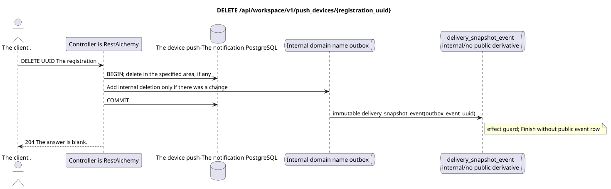

# `DELETE /api/workspace/v1/push_devices/{registration_uuid}`


General target reliability invariant: each immutable outbox event emits exactly one immutable typed task with a unique `outbox_event_uuid`; coalescing is absent. The Task stores the actual exact scope key, uses lease/fencing, retry/backoff, max attempts/DLQ, reaper, and an idempotent effect guard. Topic scope applies only to placement/message-binding work; shared rows do not receive implicit fallback to topic.

[← Main documentation index](../../../../index.md) · [Sequence diagram index](../../README.md) · [Workspace content and users section](../README.md)

Status: target operation specification, developed first in documentation. The current public contract
remains unchanged and is normative in [`workspace_api.md`](../../../../workspace_api.md).
This file describes target transaction and projection boundaries; this is not
production code, SQL migrations, or a new endpoint.



[Editable PlantUML source](diagrams/delete_push_device.puml)

## Purpose and public contract

Idempotently delete the current user's installation registration.

Authentication: Bearer IAM token; `project_id` and current `user_uuid` are taken from the IAM context.

## Request path and parameters

| Location | Name | Type / rule |
| --- | --- | --- |
| path | `registration_uuid` | UUID |

Pagination for collections, where provided, preserves the current contract `page_limit` and UUID
`page_marker` and returns `X-Pagination-Limit`, as well as
`X-Pagination-Marker` only when a next page exists.

## Request body

No request body.

## Successful response

`204` with an empty response body.


## Errors and authorization

The operation returns `204` both when the registration in the specified scope is deleted and when it is already absent. Incorrect UUID/IAM context is handled by the common validation boundary.

Common error response format for validation errors:

```json
{
  "type": "ValidationErrorException",
  "code": 400,
  "message": "Validation error occurred."
}
```

## Target RestAlchemy boundary

```python
from restalchemy.api import controllers as ra_controllers
from restalchemy.api import resources as ra_resources
from restalchemy.dm import models
from restalchemy.dm import properties
from restalchemy.dm import types
from restalchemy.storage.sql import orm


class PushDevice(models.ModelWithUUID, models.ModelWithProject,
                 models.ModelWithTimestamp, orm.SQLStorableMixin):
    __tablename__ = "m_workspace_push_devices"
    user_uuid = properties.property(types.UUID(), required=True, read_only=True)
    transport = properties.property(types.Enum(["fcm"]), required=True)
    platform = properties.property(types.Enum(["android", "ios"]), required=True)
    registration_token = properties.property(types.String(max_length=4096), required=True)
    encryption = properties.property(types.Dict(), required=True)


class PushDeviceController(ra_controllers.BaseResourceController):
    __resource__ = ra_resources.ResourceByRAModel(model_class=PushDevice)
    # Narrow PUT upsert and idempotent DELETE overrides preserve owner scope.
```

Each public link to an entity is declared as a scalar UUID property of RestAlchemy, not `relationship` (which would serialize as a URI). The corresponding physical column `*_uuid` is an indexed foreign key with explicitly chosen referential action. Therefore, the public JSON preserves UUIDs unchanged.

Push notification registration management is outside the Messenger entity refactoring scope. Installation UUID — resource key. `user_uuid` and `project_id` are server-side scalar UUID fields, supported by indexed scope columns; encryption uses the existing `kind` HPKE model.

## Synchronous API path

1. Determine the owner scope.
2. Delete the row only upon matching UUID, project, and user.
3. If the row changed, add an internal immutable deletion record to the outbox without a public derivative.
4. In both cases, commit the transaction and return `204`.

## Outbox, typed tasks, worker, and real-time work

No public task/event or push notification payload is created.

The current contract manages only registrations. The internal immutable
outbox event emits one `delivery_snapshot_event`, which idempotently
records the absence of a public derivative and terminates; Workspace event row
and WebSocket delivery are not created. Push payload encryption and delivery are
outside this endpoint.

## Idempotency, keys, and races

Deletion is idempotent and does not expose registrations from another owner scope. Competing replacement and deletion operations serialize by registration UUID.

## Client visibility moment

Registration change is visible at the time of HTTP response return. No public WebSocket event exists for it.

[← Main documentation index](../../../../index.md) · [Sequence diagram index](../../README.md) · [Workspace content and users section](../README.md)
