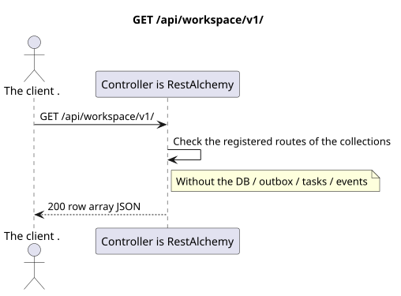

# `GET /api/workspace/v1/`

[← Main documentation index](../../../../index.md) · [Sequence diagram index](../../README.md) · [Workspace content and users section](../README.md)

Status: Target operation specification, developed first in documentation. The current public contract
remains unchanged and is normative in [`workspace_api.md`](../../../../workspace_api.md).
This file describes target transaction and projection boundaries; this is not
production code, SQL migrations, or a new endpoint.



[Editable PlantUML source](diagrams/get_api_routes_index.puml)

## Purpose and public contract

List the current collection route names directly under the Workspace v1 root.

Authentication: IAM Bearer token; `project_id` and the current `user_uuid` are taken from the IAM context.

## Path and query parameters

No path or query parameters are accepted.

Collection pagination, where applicable, preserves the current `page_limit` contract and UUID
`page_marker` and returns `X-Pagination-Limit`, as well as
`X-Pagination-Marker` only if a next page exists.

## Request body

No request body.

## Successful response

`200`

```json
[
  "epoch",
  "events",
  "me",
  "messenger",
  "push_devices",
  "services",
  "users"
]
```


## Errors and authorization

IAM authentication errors are handled by the common Workspace error boundary. For this route list, there is no runtime "resource not found" case, and it does not accept functional filters.

The general validation error response format:

```json
{
  "type": "ValidationErrorException",
  "code": 400,
  "message": "Validation error occurred."
}
```

## Target RestAlchemy boundary

```python
from restalchemy.api import controllers as ra_controllers


class WorkspaceApiEndpointController(ra_controllers.RoutesListController):
    __TARGET_PATH__ = "/v1/"


class MessengerApiEndpointController(ra_controllers.RoutesListController):
    __TARGET_PATH__ = "/v1/messenger/"
```

For this routing/middleware response, there is no domain model or physical foreign key.

`RoutesListController` validates the static route tree; its runtime row list is the public boundary of the route index, not a domain resource model.

## Synchronous API path

1. Authenticate the request.
2. Check the registered route tree in memory.
3. Return ordered collection route names. No DB transaction is required.

## Outbox, typed tasks, worker, and real-time work

This read does not write a domain event or outbox record, does not create a typed projection task, and does not publish a public event. DB-based resources are read via indexes without computation. All counters are already materialized; the query does not perform `COUNT`, `GROUP BY`, correlated subqueries, and does not scan message bindings.

The WebSocket dispatcher is not involved.

## Idempotency, keys, and races

The operation is safe to repeat because it does not change state. Resource identity and filter scope are stable for the duration of the DB transaction.

## Client visibility moment

The client receives the committed state available at the moment the read transaction executes; the query does not schedule new deferred work.

[← Main documentation index](../../../../index.md) · [Sequence diagram index](../../README.md) · [Workspace content and users section](../README.md)
