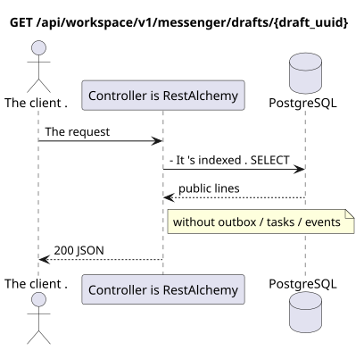

# `GET /api/workspace/v1/messenger/drafts/{draft_uuid}`

[← The main index of the documentation](../../../../index.md) · [Index of sequence diagrams](../../README.md) · [Content and users Workspace](../README.md)

Status: the target specification of the operation, first developed in the documentation.
remains unchanged and is the normative [`workspace_api.md`](../../../../workspace_api.md).
This file describes the transaction and projection target boundaries; it doesn ' t
production code, migration SQL or new endpoint.



[The source that you can edit PlantUML](diagrams/get_draft.puml)

## Purpose and public contract

Get one draft of the owner and a strict ETag of his revisions.

Authentication: Bearer IAM; `project_id` and current `user_uuid` tokens are taken from context IAM.

## Path and query settings

| Location | Name of the person | Type / rule |
| --- | --- | --- |
| The way | `draft_uuid` | UUID |

The collection pagination, where it is provided, preserves the current contract `page_limit` and UUID
`page_marker` and returns `X-Pagination-Limit`, and
`X-Pagination-Marker` Only if there 's a next page ..

## The body of the query

The body of the query is missing.

## A Successful Answer

`200`

```json
{
  "uuid": "ca14d274-0057-4a9a-a34b-fb1174be6a17",
  "project_id": "22222222-2222-2222-2222-222222222222",
  "user_uuid": "11111111-1111-1111-1111-111111111111",
  "stream_uuid": "75309057-419c-4b12-a7c1-3932429ec4a6",
  "topic_uuid": "4ec0b996-b778-45f8-8ef4-ef863be0c047",
  "payload": {
    "kind": "markdown",
    "content": "Draft message"
  },
  "revision": 1,
  "created_at": "2026-07-17T08:00:00Z",
  "updated_at": "2026-07-17T08:00:00Z"
}
```

Answer title: `ETag: "1"` (current strict revision)).

## Errors and authorization

Incorrect filters return HTTP `400`; unavailable single resource returns not found. Errors IAM pass through the common authentication error boundary Workspace.

General form of response for validation error:

```json
{
  "type": "ValidationErrorException",
  "code": 400,
  "message": "Validation error occurred."
}
```

## The target boundary RestAlchemy

```python
from restalchemy.api import controllers as ra_controllers
from restalchemy.api import resources as ra_resources
from restalchemy.dm import models
from restalchemy.dm import properties
from restalchemy.dm import types
from restalchemy.storage.sql import orm


class WorkspaceDraft(models.ModelWithUUID, models.ModelWithProject,
                     models.ModelWithTimestamp, orm.SQLStorableMixin):
    # Contract boundary only; target physical naming/decomposition is not selected.
    __tablename__ = "m_workspace_drafts"
    user_uuid = properties.property(types.UUID(), required=True, read_only=True)
    stream_uuid = properties.property(types.UUID(), required=True, read_only=True)
    topic_uuid = properties.property(types.UUID(), required=True, read_only=True)
    payload = properties.property(types.Dict(), required=True)
    revision = properties.property(types.Integer(min_value=1), read_only=True)


class WorkspaceDraftController(ra_controllers.BaseResourceControllerPaginated):
    __resource__ = ra_resources.ResourceByRAModel(
        model_class=WorkspaceDraft,
        convert_underscore=False,
        process_filters=True,
    )
    # Narrow overrides preserve owner scope, keyset marker, ETag and If-Match.
```

Each public reference to an entity is declared a scalar UUID property RestAlchemy, not `relationship` (which would be serialized as URI). The corresponding physical column `*_uuid`  an indexed external key with an explicitly selected reference action. Therefore, public JSON keeps UUID unchanged.

The target internal model of the drafts is not deliberately reworked here. The announcement fixes an unchanged scalar boundary UUID/ETag. The physical UUID-columns of the user/stream/topic remain FK-indexed with cascading behavior from the current contract; the relationship RestAlchemy should not change the public one. UUID JSON.

## Synchronous path API

1. Check the area IAM.
2. Read the indexed resource.
3. Serial out the unchanged public JSON.

## Outbox, Typed tasks, worker and real-time work

This reading does not record a domain event or outbox record, does not create a typed projection task, and does not publish a public event. DB-based resources are read by indexes without computations. All counters are already materialized; the query does not execute `COUNT`, `GROUP BY`, correlated subqueries, and does not scan message bindings.

The WebSocket controller is not involved.

## Idempotence, keys and races

The operation is safe to repeat because it does not change the state..

## The moment of visibility for the client

The client gets a fixed state available at the time of the read transaction; the request does not schedule a new deferred work.

[← The main index of the documentation](../../../../index.md) · [Index of sequence diagrams](../../README.md) · [Content and users Workspace](../README.md)
