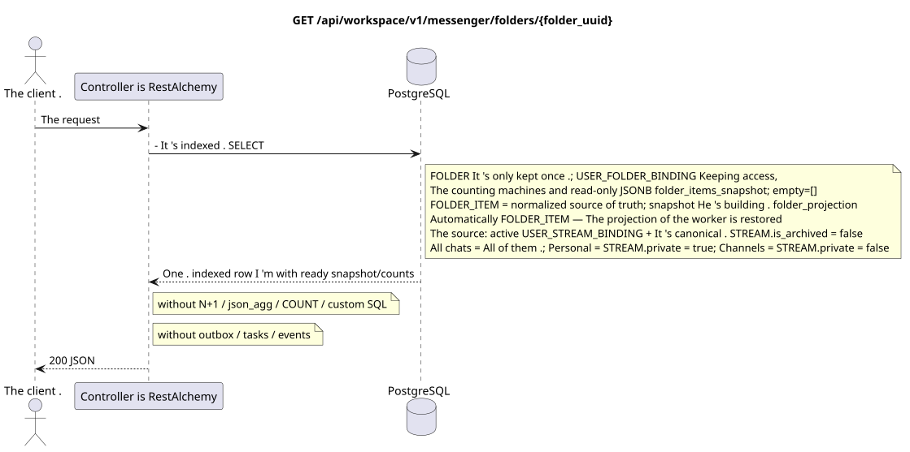

# `GET /api/workspace/v1/messenger/folders/{folder_uuid}`

[← The main index of the documentation](../../../../index.md) · [Index of sequence diagrams](../../README.md) · [Content and users Workspace](../README.md)

Status: the target specification of the operation, first developed in the documentation.
remains unchanged and is the normative [`workspace_api.md`](../../../../workspace_api.md).
This file describes the transaction and projection target boundaries; it doesn ' t
production code, migration SQL or new endpoint.



[The source that you can edit PlantUML](diagrams/get_folder.puml)

## Purpose and public contract

Get one folder from the current user.

Authentication: Bearer IAM; `project_id` and current `user_uuid` tokens are taken from context IAM.

## Path and query settings

| Location | Name of the person | Type / rule |
| --- | --- | --- |
| The way | `folder_uuid` | UUID |

The collection pagination, where it is provided, preserves the current contract `page_limit` and UUID
`page_marker` and returns `X-Pagination-Limit`, and
`X-Pagination-Marker` Only if there 's a next page ..

## The body of the query

The body of the query is missing.

## A Successful Answer

`200`

```json
{
  "uuid": "50ecadd0-9823-4d97-b54c-806cc672c210",
  "title": "Inbox",
  "background_color_value": 4280391411,
  "unread_count": 3,
  "system_type": "created",
  "folder_items": [
    {
      "uuid": "9f41b1a7-77f9-4c12-bdc6-d3cebc5dbf50",
      "project_id": "22222222-2222-2222-2222-222222222222",
      "folder_uuid": "50ecadd0-9823-4d97-b54c-806cc672c210",
      "user_uuid": "11111111-1111-1111-1111-111111111111",
      "stream_uuid": "75309057-419c-4b12-a7c1-3932429ec4a6",
      "chat_type": "stream",
      "order_index": 10,
      "pinned_at": null,
      "unread_count": 3,
      "active_unread_count": 3,
      "passive_unread_count": 0,
      "created_at": "2026-06-22T09:30:00Z",
      "updated_at": "2026-06-22T09:30:00Z"
    }
  ],
  "created_at": "2026-06-22T09:30:00Z",
  "updated_at": "2026-06-22T09:30:00Z"
}
```


## Errors and authorization

Incorrect filters return HTTP `400`; unavailable single resource returns not found. Errors IAM pass through the common authentication error boundary Workspace.

General form of response for validation error:

```json
{
  "type": "ValidationErrorException",
  "code": 400,
  "message": "Validation error occurred."
}
```

## The target boundary RestAlchemy

```python
from restalchemy.api import controllers as ra_controllers
from restalchemy.api import resources as ra_resources
from restalchemy.dm import models
from restalchemy.dm import properties
from restalchemy.dm import types
from restalchemy.storage.sql import orm


class WorkspaceFolder(models.ModelWithUUID, models.ModelWithProject,
                      models.ModelWithTimestamp, orm.SQLStorableMixin):
    __tablename__ = "messenger_folders"
    title = properties.property(types.String(min_length=1, max_length=64), required=True)
    background_color_value = properties.property(types.AllowNone(types.Integer()))


class WorkspaceUserFolderBinding(models.ModelWithUUID, models.ModelWithProject,
                                 models.ModelWithTimestamp, orm.SQLStorableMixin):
    __tablename__ = "messenger_user_folder_bindings"
    # Public UUID links are scalar UUID properties, never URI relationships.
    user_uuid = properties.property(types.UUID(), required=True, read_only=True)
    folder_uuid = properties.property(types.UUID(), required=True, read_only=True)
    unread_count = properties.property(types.Integer(min_value=0), default=0, read_only=True)
    mention_count = properties.property(types.Integer(min_value=0), default=0, read_only=True)
    folder_items_snapshot = properties.property(types.List(), default=list, read_only=True)
    folder_items_snapshot_version = properties.property(types.Integer(min_value=0), default=0, read_only=True)
    folder_items_snapshot_updated_at = properties.property(types.AllowNone(types.UTCDateTimeZ()), read_only=True)
    BUSINESS_KEY = ("project_id", "user_uuid", "folder_uuid")


class WorkspaceUserFolder(models.ModelWithTimestamp, orm.SQLStorableMixin):
    __tablename__ = "messenger_api_user_folders_v1"
    binding_uuid = properties.property(types.UUID(), id_property=True, read_only=True)
    uuid = properties.property(types.UUID(), read_only=True)
    title = properties.property(types.String(min_length=1, max_length=64))
    background_color_value = properties.property(types.AllowNone(types.Integer()))
    unread_count = properties.property(types.Integer(min_value=0), read_only=True)
    system_type = properties.property(types.AllowNone(types.Enum(["all", "created"])), read_only=True)
    folder_items = properties.property(types.List(), read_only=True)


class FolderController(ra_controllers.BaseResourceControllerPaginated):
    __resource__ = ra_resources.ResourceByRAModel(
        model_class=WorkspaceUserFolder,
        hidden_fields=["binding_uuid", "project_id", "user_uuid"],
        convert_underscore=False,
        process_filters=True,
    )
```

Each public reference to an entity is declared a scalar UUID property RestAlchemy, not `relationship` (which would be serialized as URI). The corresponding physical column `*_uuid`  an indexed external key with an explicitly selected reference action. Therefore, public JSON keeps UUID unchanged.

The read model returns one indexed `WorkspaceUserFolderBinding` with one canonical `WorkspaceFolder`. the public `folder_items` is directly taken from the read-only JSONB `folder_items_snapshot` (`[]` for the empty folder). GET does not perform N+1, `json_agg`, `COUNT`, subqueries or custom SQL. the normalized `FOLDER_ITEM` remain the source of truth; the snapshot and ready counters materialize `folder_projection`. `folder_uuid` and `user_uuid`  indexed FKs with `ON DELETE CASCADE`.

System folder  is `USER_FOLDER_BINDING` with fixed rule/type: its
You can't delete or manually change the rule.
`FOLDER_ITEM` — The re-created materialized projection.
idmpotently supports it from the active `USER_STREAM_BINDING` and canonical
`STREAM` with `is_archived = false`: `All chats` (All chats) includes all such
available streams, `Personal` (Personal)  only streams from
`STREAM.private = true`, `Channels` («Channels)  only with
`STREAM.private = false`. API It only reads them with simple indexed ones.
The public contract and the set of actions do not change.

## Synchronous path API

1. Check the area IAM.
2. Read the indexed resource.
3. Serial out the unchanged public JSON.

## Outbox, Typed tasks, worker and real-time work

This reading does not write to outbox and does not create a task. RestAlchemy
resource reads one indexed binding row; counters and read-only JSONB
`folder_items_snapshot` We're ready. The request is not being fulfilled. N+1, `json_agg`, `COUNT`,
`GROUP BY`, correlated subqueries or custom SQL; it does not correct snapshot.

The WebSocket controller is not involved.

## Idempotence, keys and races

The operation is safe to repeat because it does not change the state..

## The moment of visibility for the client

The client gets a fixed state available at the time of the read transaction; the request does not schedule a new deferred work.

[← The main index of the documentation](../../../../index.md) · [Index of sequence diagrams](../../README.md) · [Content and users Workspace](../README.md)
