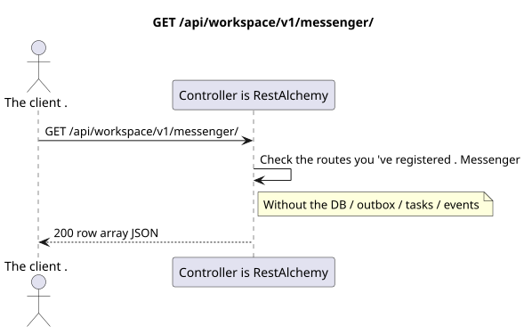

# `GET /api/workspace/v1/messenger/`

[← The main index of the documentation](../../../../index.md) · [Index of sequence diagrams](../../README.md) · [Content and users Workspace](../README.md)

Status: the target specification of the operation, first developed in the documentation.
remains unchanged and is the normative [`workspace_api.md`](../../../../workspace_api.md).
This file describes the transaction and projection target boundaries; it doesn ' t
production code, migration SQL or new endpoint.



[The source that you can edit PlantUML](diagrams/get_messenger_routes_index.puml)

## Purpose and public contract

List current collection route names directly below the root Messenger v1.

Authentication: Bearer IAM; `project_id` and current `user_uuid` tokens are taken from context IAM.

## Path and query settings

Path and query parameters not accepted.

The collection pagination, where it is provided, preserves the current contract `page_limit` and UUID
`page_marker` and returns `X-Pagination-Limit`, and
`X-Pagination-Marker` Only if there 's a next page ..

## The body of the query

The body of the query is missing.

## A Successful Answer

`200`

```json
[
  "drafts",
  "external_accounts",
  "external_bridge_instances",
  "external_chats",
  "external_operations",
  "external_provider_health",
  "external_provider_policies",
  "files",
  "folder_items",
  "folders",
  "message_reactions",
  "messages",
  "stream_bindings",
  "stream_topics",
  "streams",
  "topic_summary_endpoints",
  "topic_summary_settings"
]
```


## Errors and authorization

Authentication errors IAM are handled by the common error boundary Workspace. For this list of runtime routes there is no case of resource not found and it does not accept functional filters.

General form of response for validation error:

```json
{
  "type": "ValidationErrorException",
  "code": 400,
  "message": "Validation error occurred."
}
```

## The target boundary RestAlchemy

```python
from restalchemy.api import controllers as ra_controllers


class WorkspaceApiEndpointController(ra_controllers.RoutesListController):
    __TARGET_PATH__ = "/v1/"


class MessengerApiEndpointController(ra_controllers.RoutesListController):
    __TARGET_PATH__ = "/v1/messenger/"
```

For this routing/intermediate software response, there is no domain model or physical external key.

`RoutesListController` checks the static route tree; its execution time line list  public route index boundary, not domain resource model.

## Synchronous path API

1. Authenticate the query.
2. Check the memory of the registered route tree Messenger.
3. Returns the sorted names of the routes of the collections..

## Outbox, Typed tasks, worker and real-time work

This reading does not record a domain event or outbox record, does not create a typed projection task, and does not publish a public event. DB-based resources are read by indexes without computations. All counters are already materialized; the query does not execute `COUNT`, `GROUP BY`, correlated subqueries, and does not scan message bindings.

The WebSocket controller is not involved.

## Idempotence, keys and races

The operation is safe to repeat because it does not change the state..

## The moment of visibility for the client

The client gets a fixed state available at the time of the read transaction; the request does not schedule a new deferred work.

[← The main index of the documentation](../../../../index.md) · [Index of sequence diagrams](../../README.md) · [Content and users Workspace](../README.md)
