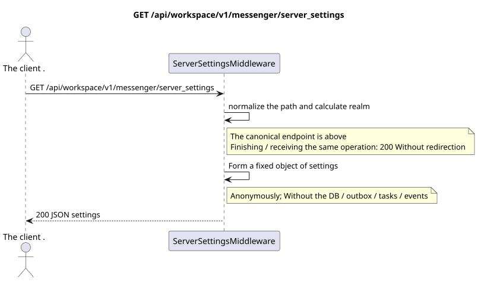

# `GET /api/workspace/v1/messenger/server_settings`

[← The main index of the documentation](../../../../index.md) · [Index of sequence diagrams](../../README.md) · [Content and users Workspace](../README.md)

Status: the target specification of the operation, first developed in the documentation.
remains unchanged and is the normative [`workspace_api.md`](../../../../workspace_api.md).
This file describes the transaction and projection target boundaries; it doesn ' t
production code, migration SQL or new endpoint.



[The source that you can edit PlantUML](diagrams/get_server_settings.puml)

## Purpose and public contract

Returns the anonymous Zulip-compatible server discovery object.
canonical operation — `GET /api/workspace/v1/messenger/server_settings`.
A request to the same path with the completion `/` takes the same intermediate PO and returns
same `200` without redirection; this is the behavior of one operation, not the second route.

Authentication is not required; this is the only endpoint Workspace without authentication that uses UI.

## Path and query settings

| Location | Name of the person | Type / rule |
| --- | --- | --- |
| The request | `any unsupported name` | The names are accepted but ignored; the sorted names appear in `ignored_parameters_unsupported` |

## The body of the query

The body of the query is missing.

## A Successful Answer

`200`

```json
{
  "result": "success",
  "msg": "Welcome to Exordos Workspace",
  "authentication_methods": {
    "password": true,
    "dev": false,
    "email": true,
    "ldap": false,
    "remoteuser": false,
    "github": false,
    "azuread": false,
    "gitlab": false,
    "google": false,
    "apple": false,
    "saml": false,
    "openid connect": false
  },
  "push_notifications_enabled": true,
  "email_auth_enabled": true,
  "require_email_format_usernames": true,
  "realm_url": "https://workspace.example.com",
  "realm_name": "Exordos Workspace",
  "realm_icon": "urn:url:https://workspace.example.com/logo-512x512.png",
  "realm_description": "<p>Exordos Workspace messenger.</p>",
  "realm_web_public_access_enabled": false,
  "meet_url": "https://meet.genesis-core.tech",
  "external_authentication_methods": [],
  "realm_uri": "https://workspace.example.com"
}
```


## Errors and authorization

The interim software is returning .`200`Both for the canonical path and for the same path with the final one.`/`, without redirection: both options are normalized through`rstrip("/")`The unsupported query parameters do not cause an error; their names are returned in the response.`Host`and proxy follows the documented boundary of the reverse proxy.

General form of response for validation error:

```json
{
  "type": "ValidationErrorException",
  "code": 400,
  "message": "Validation error occurred."
}
```

## The target boundary RestAlchemy

```python
# Middleware endpoint: it deliberately has no RestAlchemy resource/model.
class ServerSettingsMiddleware:
    PATH = "/v1/server_settings"

    def process_request(self, request):
        # Returns the fixed public discovery object for both slash forms.
        ...
```

For this routing/intermediate software response, there is no domain model or physical external key.

URL realm are formed from `Host` and trusted `X-Forwarded-Proto`; this intermediate software must remain outside the resource router RestAlchemy.

## Synchronous path API

1. Normalise the finish.
2. Calculate the public URL realm from the trusted query headers.
3. Create and return a fixed discovery object..

## Outbox, Typed tasks, worker and real-time work

This reading does not record a domain event or outbox record, does not create a typed projection task, and does not publish a public event. DB-based resources are read by indexes without computations. All counters are already materialized; the query does not execute `COUNT`, `GROUP BY`, correlated subqueries, and does not scan message bindings.

The WebSocket controller is not involved.

## Idempotence, keys and races

The operation is safe to repeat because it does not change the state..

## The moment of visibility for the client

The client gets a fixed state available at the time of the read transaction; the request does not schedule a new deferred work.

[← The main index of the documentation](../../../../index.md) · [Index of sequence diagrams](../../README.md) · [Content and users Workspace](../README.md)
