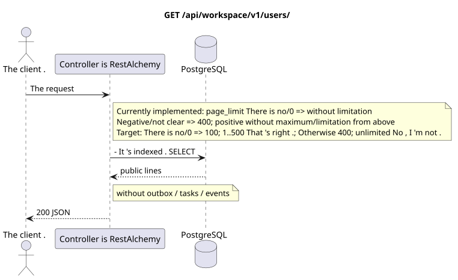

# `GET /api/workspace/v1/users/`

[← The main index of the documentation](../../../../index.md) · [Index of sequence diagrams](../../README.md) · [Content and users Workspace](../README.md)

Status: the target specification of the operation, first developed in the documentation.
remains unchanged and is the normative [`workspace_api.md`](../../../../workspace_api.md).
This file describes the transaction and projection target boundaries; it doesn ' t
production code, migration SQL or new endpoint.



[The source that you can edit PlantUML](diagrams/get_users_list.puml)

## Purpose and public contract

List the users already materialized Workspace; global route does not perform the import of identity preemption IAM.

Authentication: Bearer IAM; `project_id` and current `user_uuid` tokens are taken from context IAM.

## Path and query settings

| Location | Name of the person | Type / rule |
| --- | --- | --- |
| The request | `page_limit` | current: the absence/`0` means unlimited; target: the absence/`0` => `100`, `1..500` exactly, negative/non-target/`>500` => `400` without clamp |
| The request | `page_marker` | UUID Last resource of the previous page |

The collection pagination, where it is provided, preserves the current contract `page_limit` and UUID
`page_marker` and returns `X-Pagination-Limit`, and
`X-Pagination-Marker` Only if there 's a next page ..

Target default — `100`, hard maximum — `500`; `0` also means `100`, unbounded mode is missing. The parameter name and public JSON-form do not change; full export clients read until the next marker.

## The body of the query

The body of the query is missing.

## A Successful Answer

`200`

```json
[
  {
    "uuid": "11111111-1111-1111-1111-111111111111",
    "username": "admin",
    "source": "iam",
    "status": "active",
    "status_emoji": "coffee",
    "status_text": "Focusing",
    "first_name": "Workspace",
    "last_name": "Administrator",
    "email": "admin@example.com",
    "avatar": "urn:gravatar:0123456789abcdef0123456789abcdef",
    "last_ping_at": "2026-07-17T08:00:00Z",
    "created_at": "2026-07-01T08:00:00Z",
    "updated_at": "2026-07-17T08:00:00Z"
  }
]
```


## Errors and authorization

Incorrect filters return HTTP `400`; unavailable single resource returns not found. Errors IAM pass through the common authentication error boundary Workspace.

General form of response for validation error:

```json
{
  "type": "ValidationErrorException",
  "code": 400,
  "message": "Validation error occurred."
}
```

## The target boundary RestAlchemy

```python
from restalchemy.api import controllers as ra_controllers
from restalchemy.api import resources as ra_resources
from restalchemy.dm import models
from restalchemy.dm import properties
from restalchemy.dm import types
from restalchemy.storage.sql import orm


class WorkspaceUser(models.ModelWithUUID, models.ModelWithTimestamp,
                    orm.SQLStorableMixin):
    __tablename__ = "messenger_users"
    username = properties.property(types.String(min_length=1, max_length=128), required=True)
    source = properties.property(types.Enum(["iam", "zulip"]), default="iam")
    status = properties.property(types.Enum(["active", "idle", "offline", "do_not_disturb"]))
    status_emoji = properties.property(types.AllowNone(types.String(max_length=64)))
    status_text = properties.property(types.AllowNone(types.String(max_length=256)))
    avatar = properties.property(types.String(max_length=2048), required=True)


class WorkspaceUserController(ra_controllers.BaseResourceControllerPaginated):
    __resource__ = ra_resources.ResourceByRAModel(
        model_class=WorkspaceUser,
        convert_underscore=False,
        process_filters=True,
    )
    # Narrow own-user IAM refresh and presence/avatar actions preserve the API.
```

Each public reference to an entity is declared a scalar UUID property RestAlchemy, not `relationship` (which would be serialized as URI). The corresponding physical column `*_uuid`  an indexed external key with an explicitly selected reference action. Therefore, public JSON keeps UUID unchanged.

`WorkspaceUser` — public UUID-like links of the provider remain scalar fields in the sanitized container of the provider; physical links  indexed FK. Identity fields belonging to IAM are read-only to browser queries.

## Synchronous path API

1. Run the authentication.
2. Read materialized users through indexed filters/pagination.
3. Sanitize external provider metadata from the server.
4. Restore list without importing users IAM.

## Outbox, Typed tasks, worker and real-time work

This reading does not record a domain event or outbox record, does not create a typed projection task, and does not publish a public event. DB-based resources are read by indexes without computations. All counters are already materialized; the query does not execute `COUNT`, `GROUP BY`, correlated subqueries, and does not scan message bindings.

The WebSocket controller is not involved.

## Idempotence, keys and races

The operation is safe to repeat because it does not change the state..

## The moment of visibility for the client

The client gets a fixed state available at the time of the read transaction; the request does not schedule a new deferred work.

[← The main index of the documentation](../../../../index.md) · [Index of sequence diagrams](../../README.md) · [Content and users Workspace](../README.md)
