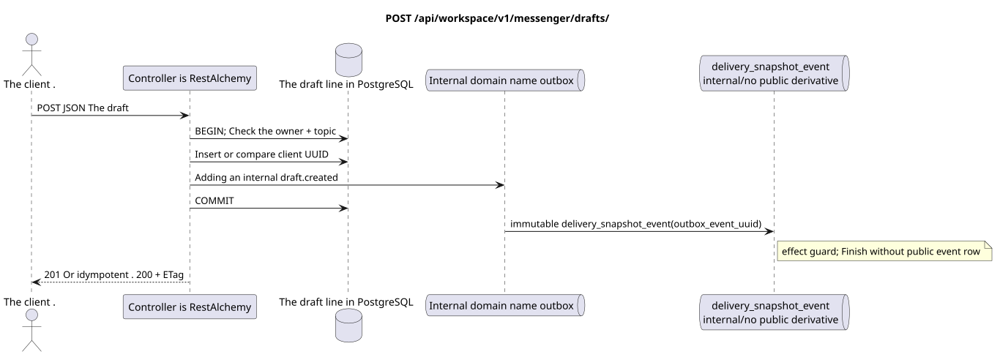

# `POST /api/workspace/v1/messenger/drafts/`


Common target-invariant of reliability: each immutable outbox event outputs exactly one immutable typed task with unique `outbox_event_uuid`; coalescing is absent. Task stores the actual exact scope key, uses lease/fencing, retry/backoff, max attempts/DLQ, reaper and idempotent effect guard. Topic scope is applied only to placement/message-binding work; shared rows do not receive implicit fallback on topic.

[← The main index of the documentation](../../../../index.md) · [Index of sequence diagrams](../../README.md) · [Content and users Workspace](../README.md)

Status: the target specification of the operation, first developed in the documentation.
remains unchanged and is the normative [`workspace_api.md`](../../../../workspace_api.md).
This file describes the transaction and projection target boundaries; it doesn ' t
production code, migration SQL or new endpoint.



[The source that you can edit PlantUML](diagrams/post_drafts_create.puml)

## Purpose and public contract

Create an owner draft using the client-created UUID as the idpotency key.

Authentication: Bearer IAM; `project_id` and current `user_uuid` tokens are taken from context IAM.

## Path and query settings

Path and query parameters not accepted.

The collection pagination, where it is provided, preserves the current contract `page_limit` and UUID
`page_marker` and returns `X-Pagination-Limit`, and
`X-Pagination-Marker` Only if there 's a next page ..

## The body of the query

```json
{
  "uuid": "ca14d274-0057-4a9a-a34b-fb1174be6a17",
  "stream_uuid": "75309057-419c-4b12-a7c1-3932429ec4a6",
  "topic_uuid": "4ec0b996-b778-45f8-8ef4-ef863be0c047",
  "payload": {
    "kind": "markdown",
    "content": "Draft message"
  }
}
```

## A Successful Answer

`201` for the new line or `200`

```json
{
  "uuid": "ca14d274-0057-4a9a-a34b-fb1174be6a17",
  "project_id": "22222222-2222-2222-2222-222222222222",
  "user_uuid": "11111111-1111-1111-1111-111111111111",
  "stream_uuid": "75309057-419c-4b12-a7c1-3932429ec4a6",
  "topic_uuid": "4ec0b996-b778-45f8-8ef4-ef863be0c047",
  "payload": {
    "kind": "markdown",
    "content": "Draft message"
  },
  "revision": 1,
  "created_at": "2026-07-17T08:00:00Z",
  "updated_at": "2026-07-17T08:00:00Z"
}
```

Answer title: `ETag: "1"`.

## Errors and authorization

Missing/excess fields or incorrect Markdown return `400`. Reuse of UUID with other canonical creation fields returns `409`; the exact error body contains the line `message`..

General form of response for validation error:

```json
{
  "type": "ValidationErrorException",
  "code": 400,
  "message": "Validation error occurred."
}
```

## The target boundary RestAlchemy

```python
from restalchemy.api import controllers as ra_controllers
from restalchemy.api import resources as ra_resources
from restalchemy.dm import models
from restalchemy.dm import properties
from restalchemy.dm import types
from restalchemy.storage.sql import orm


class WorkspaceDraft(models.ModelWithUUID, models.ModelWithProject,
                     models.ModelWithTimestamp, orm.SQLStorableMixin):
    # Contract boundary only; target physical naming/decomposition is not selected.
    __tablename__ = "m_workspace_drafts"
    user_uuid = properties.property(types.UUID(), required=True, read_only=True)
    stream_uuid = properties.property(types.UUID(), required=True, read_only=True)
    topic_uuid = properties.property(types.UUID(), required=True, read_only=True)
    payload = properties.property(types.Dict(), required=True)
    revision = properties.property(types.Integer(min_value=1), read_only=True)


class WorkspaceDraftController(ra_controllers.BaseResourceControllerPaginated):
    __resource__ = ra_resources.ResourceByRAModel(
        model_class=WorkspaceDraft,
        convert_underscore=False,
        process_filters=True,
    )
    # Narrow overrides preserve owner scope, keyset marker, ETag and If-Match.
```

Each public reference to an entity is declared a scalar UUID property RestAlchemy, not `relationship` (which would be serialized as URI). The corresponding physical column `*_uuid`  an indexed external key with an explicitly selected reference action. Therefore, public JSON keeps UUID unchanged.

The target internal model of the drafts is not deliberately reworked here. The announcement fixes an unchanged scalar boundary UUID/ETag. The physical UUID-columns of the user/stream/topic remain FK-indexed with cascading behavior from the current contract; the relationship RestAlchemy should not change the public one. UUID JSON.

## Synchronous path API

1. Check the exact set of fields to create and the full Markdown of up to 40,000 characters.
2. Verify the owner is a member and the thread is a member.
3. Insert by client UUID or compare existing owner line for exact idempotent iteration.
4. Add internal unmodifiable domain entry to the outbox without public derivative.
5. Record the transaction and return the string with the string ETag.

## Outbox, Typed tasks, worker and real-time work

Creating a draft does not affect messages, reactions, unread counters or file links.

The internal immutable outbox event returns one `delivery_snapshot_event`,
which idempotently fixes the absence of a public derivative and ends;
The Workspace event row and WebSocket-delivery are not created.

## Idempotence, keys and races

Client UUID  idempotence key: identical repetition returns an existing draft (`200`), distinct reuse  `409`. Unique UUID together with the owner/project area prevents duplication of lines.

## The moment of visibility for the client

The initiator client immediately sees the fixed draft. Other clients will only see it after a reboot or explicit re-request of the drafts; no consistent update is sent in the end..

[← The main index of the documentation](../../../../index.md) · [Index of sequence diagrams](../../README.md) · [Content and users Workspace](../README.md)
