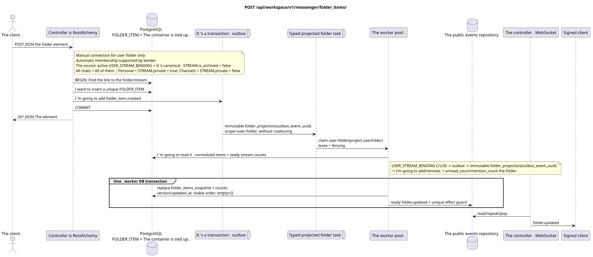

# `POST /api/workspace/v1/messenger/folder_items/`

[← The main index of the documentation](../../../../index.md) · [Index of sequence diagrams](../../README.md) · [Content and users Workspace](../README.md)

Status: the target specification of the operation, first developed in the documentation.
remains unchanged and is the normative [`workspace_api.md`](../../../../workspace_api.md).
This file describes the transaction and projection target boundaries; it doesn ' t
production code, migration SQL or new endpoint.



[The source that you can edit PlantUML](diagrams/post_folder_items_create.puml)

## Purpose and public contract

Add a stream to the current user folder.

Authentication: Bearer IAM; `project_id` and current `user_uuid` tokens are taken from context IAM.

## Path and query settings

Path and query parameters not accepted.

The collection pagination, where it is provided, preserves the current contract `page_limit` and UUID
`page_marker` and returns `X-Pagination-Limit`, and
`X-Pagination-Marker` Only if there 's a next page ..

## The body of the query

```json
{
  "folder_uuid": "50ecadd0-9823-4d97-b54c-806cc672c210",
  "stream_uuid": "75309057-419c-4b12-a7c1-3932429ec4a6",
  "chat_type": "stream",
  "order_index": 10
}
```

## A Successful Answer

`201`

```json
{
  "uuid": "9f41b1a7-77f9-4c12-bdc6-d3cebc5dbf50",
  "project_id": "22222222-2222-2222-2222-222222222222",
  "folder_uuid": "50ecadd0-9823-4d97-b54c-806cc672c210",
  "user_uuid": "11111111-1111-1111-1111-111111111111",
  "stream_uuid": "75309057-419c-4b12-a7c1-3932429ec4a6",
  "chat_type": "stream",
  "order_index": 10,
  "pinned_at": null,
  "unread_count": 0,
  "active_unread_count": 0,
  "passive_unread_count": 0,
  "created_at": "2026-06-22T09:30:00Z",
  "updated_at": "2026-06-22T09:30:00Z"
}
```


## Errors and authorization

Incorrect or unauthorized input data is processed by the RESTAlchemy/IAM error boundary; resources in the specified area are not disclosed outside the user/project boundaries.

General form of response for validation error:

```json
{
  "type": "ValidationErrorException",
  "code": 400,
  "message": "Validation error occurred."
}
```

## The target boundary RestAlchemy

```python
from restalchemy.api import controllers as ra_controllers
from restalchemy.api import resources as ra_resources
from restalchemy.dm import models
from restalchemy.dm import properties
from restalchemy.dm import types
from restalchemy.storage.sql import orm


class WorkspaceFolderItem(models.ModelWithUUID, models.ModelWithProject,
                          models.ModelWithTimestamp, orm.SQLStorableMixin):
    __tablename__ = "messenger_folder_items"
    user_uuid = properties.property(types.UUID(), required=True, read_only=True)
    folder_uuid = properties.property(types.UUID(), required=True)
    stream_uuid = properties.property(types.UUID(), required=True)
    chat_type = properties.property(types.Enum(["stream", "group", "private"]), required=True)
    order_index = properties.property(types.AllowNone(types.Integer()))
    pinned_at = properties.property(types.AllowNone(types.UTCDateTimeZ()), read_only=True)


class WorkspaceUserFolderItem(models.ModelWithTimestamp, orm.SQLStorableMixin):
    __tablename__ = "messenger_api_user_folder_items_v1"
    uuid = properties.property(types.UUID(), id_property=True, read_only=True)
    project_id = properties.property(types.UUID(), read_only=True)
    user_uuid = properties.property(types.UUID(), read_only=True)
    folder_uuid = properties.property(types.UUID(), read_only=True)
    stream_uuid = properties.property(types.UUID(), read_only=True)
    chat_type = properties.property(
        types.Enum(["stream", "group", "private"]), read_only=True,
    )
    order_index = properties.property(types.AllowNone(types.Integer()))
    pinned_at = properties.property(types.AllowNone(types.UTCDateTimeZ()), read_only=True)
    # Ready fields are joined from unique USER_STREAM_BINDING. They are not
    # stored on WorkspaceFolderItem and are never calculated on API reads.
    unread_count = properties.property(types.Integer(min_value=0), read_only=True)
    active_unread_count = properties.property(types.Integer(min_value=0), read_only=True)
    passive_unread_count = properties.property(types.Integer(min_value=0), read_only=True)


class FolderItemController(ra_controllers.BaseResourceControllerPaginated):
    __resource__ = ra_resources.ResourceByRAModel(
        model_class=WorkspaceUserFolderItem,
        convert_underscore=False,
        process_filters=True,
    )
    # Writes use WorkspaceFolderItem; reads use the calculation-free view.
```

Each public reference to an entity is declared a scalar UUID property RestAlchemy, not `relationship` (which would be serialized as URI). The corresponding physical column `*_uuid`  an indexed external key with an explicitly selected reference action. Therefore, public JSON keeps UUID unchanged.

The physical element has the indexed FK `folder_uuid`, `stream_uuid` and `user_uuid` with `ON DELETE CASCADE`. Its public UUID links remain scalar. Three fields of unread are copied by a simple indexed connection from the unique `USER_STREAM_BINDING` to `(project_id,user_uuid,stream_uuid)`; they are never stored in the message binding and are not counted in this query.

This operation creates a manual link to the user folder with the supported
canonical object (current contract  flow). Automatic membership
in system folders not manually created: changes `USER_STREAM_BINDING`
write a transactional outbox, a separate immutable task with unique `outbox_event_uuid` runs
Worker, and it's going to potentially add/remove automatic `FOLDER_ITEM` and
updates the finished units `unread_count`/`mention_count` in
`USER_FOLDER_BINDING`. The projection source is  active `USER_STREAM_BINDING` and
canonical `STREAM` with `is_archived = false`: `All chats` includes all such
available flows, `Personal`  only flows with `STREAM.private = true`,
`Channels` — only with `STREAM.private = false`.

## Synchronous path API

1. Find the current user ' s folder and stream bindings.
2. Check `chat_type` and optional order.
3. Insert a unique row of a folder element.
4. Add a recording to the outbox `folder_item.created`.
5. Record the transaction and return the item connected to the ready flow meters.

## Outbox, Typed tasks, worker and real-time work

The query does not calculate the aggregates of the folder or stream. `USER_STREAM_BINDING`.

Outbox event produces an immutable `folder_projection` without coalescing, with exact
scope `user-folder:(project_id,user_uuid,folder_uuid)` and unique
`outbox_event_uuid`. The owner of the fenced lease reads normalized `FOLDER_ITEM` source of
truth and the ready counters `USER_STREAM_BINDING`, deterministically serializes
Exactly public array and in one worker DB transaction replaces
`folder_items_snapshot`, The countdown, version/updated_at and ready `folder.updated`.
The event manager reads only after commit; retry/backoff, DLQ/reaper and
We 're going to have to have a potential effect guard ..

## Idempotence, keys and races

Business key `(project_id,user_uuid,folder_uuid,stream_uuid)` prevents duplication of membership. Competing creations are allowed by restriction; loser gets standard conflict/error boundary.

## The moment of visibility for the client

The response REST immediately reflects the normalized item. The read-only `folder_items_snapshot` inserted in the parent folder, its ready counters and WebSocket event may lag before completion `folder_projection`; this is the planned eventual consistency.

[← The main index of the documentation](../../../../index.md) · [Index of sequence diagrams](../../README.md) · [Content and users Workspace](../README.md)
