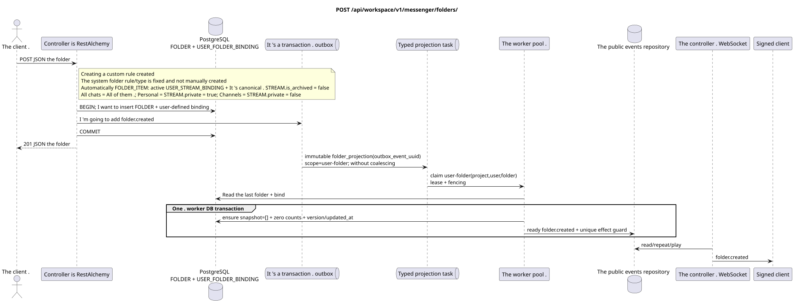

# `POST /api/workspace/v1/messenger/folders/`

[← The main index of the documentation](../../../../index.md) · [Index of sequence diagrams](../../README.md) · [Content and users Workspace](../README.md)

Status: the target specification of the operation, first developed in the documentation.
remains unchanged and is the normative [`workspace_api.md`](../../../../workspace_api.md).
This file describes the transaction and projection target boundaries; it doesn ' t
production code, migration SQL or new endpoint.



[The source that you can edit PlantUML](diagrams/post_folders_create.puml)

## Purpose and public contract

Create a folder for the current user.

Authentication: Bearer IAM; `project_id` and current `user_uuid` tokens are taken from context IAM.

## Path and query settings

Path and query parameters not accepted.

The collection pagination, where it is provided, preserves the current contract `page_limit` and UUID
`page_marker` and returns `X-Pagination-Limit`, and
`X-Pagination-Marker` Only if there 's a next page ..

## The body of the query

```json
{
  "title": "Inbox",
  "background_color_value": 4280391411
}
```

## A Successful Answer

`201`

```json
{
  "uuid": "50ecadd0-9823-4d97-b54c-806cc672c210",
  "title": "Inbox",
  "background_color_value": 4280391411,
  "unread_count": 0,
  "system_type": "created",
  "folder_items": [],
  "created_at": "2026-06-22T09:30:00Z",
  "updated_at": "2026-06-22T09:30:00Z"
}
```


## Errors and authorization

Incorrect or unauthorized input data is processed by the RESTAlchemy/IAM error boundary; resources in the specified area are not disclosed outside the user/project boundaries.

General form of response for validation error:

```json
{
  "type": "ValidationErrorException",
  "code": 400,
  "message": "Validation error occurred."
}
```

## The target boundary RestAlchemy

```python
from restalchemy.api import controllers as ra_controllers
from restalchemy.api import resources as ra_resources
from restalchemy.dm import models
from restalchemy.dm import properties
from restalchemy.dm import types
from restalchemy.storage.sql import orm


class WorkspaceFolder(models.ModelWithUUID, models.ModelWithProject,
                      models.ModelWithTimestamp, orm.SQLStorableMixin):
    __tablename__ = "messenger_folders"
    title = properties.property(types.String(min_length=1, max_length=64), required=True)
    background_color_value = properties.property(types.AllowNone(types.Integer()))


class WorkspaceUserFolderBinding(models.ModelWithUUID, models.ModelWithProject,
                                 models.ModelWithTimestamp, orm.SQLStorableMixin):
    __tablename__ = "messenger_user_folder_bindings"
    # Public UUID links are scalar UUID properties, never URI relationships.
    user_uuid = properties.property(types.UUID(), required=True, read_only=True)
    folder_uuid = properties.property(types.UUID(), required=True, read_only=True)
    unread_count = properties.property(types.Integer(min_value=0), default=0, read_only=True)
    mention_count = properties.property(types.Integer(min_value=0), default=0, read_only=True)
    folder_items_snapshot = properties.property(types.List(), default=list, read_only=True)
    folder_items_snapshot_version = properties.property(types.Integer(min_value=0), default=0, read_only=True)
    folder_items_snapshot_updated_at = properties.property(types.AllowNone(types.UTCDateTimeZ()), read_only=True)
    BUSINESS_KEY = ("project_id", "user_uuid", "folder_uuid")


class WorkspaceUserFolder(models.ModelWithTimestamp, orm.SQLStorableMixin):
    __tablename__ = "messenger_api_user_folders_v1"
    binding_uuid = properties.property(types.UUID(), id_property=True, read_only=True)
    uuid = properties.property(types.UUID(), read_only=True)
    title = properties.property(types.String(min_length=1, max_length=64))
    background_color_value = properties.property(types.AllowNone(types.Integer()))
    unread_count = properties.property(types.Integer(min_value=0), read_only=True)
    system_type = properties.property(types.AllowNone(types.Enum(["all", "created"])), read_only=True)
    folder_items = properties.property(types.List(), read_only=True)


class FolderController(ra_controllers.BaseResourceControllerPaginated):
    __resource__ = ra_resources.ResourceByRAModel(
        model_class=WorkspaceUserFolder,
        hidden_fields=["binding_uuid", "project_id", "user_uuid"],
        convert_underscore=False,
        process_filters=True,
    )
```

Each public reference to an entity is declared a scalar UUID property RestAlchemy, not `relationship` (which would be serialized as URI). The corresponding physical column `*_uuid`  an indexed external key with an explicitly selected reference action. Therefore, public JSON keeps UUID unchanged.

It 's a one-off .`WorkspaceUserFolderBinding`With the zero-counting machines and the`folder_items_snapshot=[]`- public .`folder_items`directly displays this read-onlyJSONBReading one line doesn't do N+1,`json_agg`, `COUNT`Or custom .SQL- Future changes to the normalized`FOLDER_ITEM`They 'll only update the image through `folder_projection`.

This operation creates a custom folder with rule/type `created`; it doesn't
The system `USER_FOLDER_BINDING` has fixed rules.
rule/type, and their automatic `FOLDER_ITEM` idpotent is supported by the worker
of the active `USER_STREAM_BINDING` and canonical `STREAM` c
`is_archived = false`. `All chats` («All chats) includes all available chats
streams, `Personal` (Personal)  only streams from
`STREAM.private = true`, `Channels` («Channels)  only with
`STREAM.private = false`. No new public actions are being introduced.

## Synchronous path API

1. Check `title` (1..64) and optional ARGB.
2. Insert one canonical `FOLDER`.
3. Insert unique `USER_FOLDER_BINDING` current user with ready aggregates `unread_count` and mentions.
4. In the same transaction, add the unchanged domain entry `folder.created` to outbox.
5. Capture the transaction and read the flat view of the user folder.

## Outbox, Typed tasks, worker and real-time work

API does not scan messages or calculate folder counters..

Fixed event returns immutable `folder_projection` without coalescing,
with exact scope `user-folder:(project_id,user_uuid,folder_uuid)` and unique
`outbox_event_uuid`. The owner of the fenced lease reads the last source of truth and in
one worker DB transaction is fixed `folder_items_snapshot=[]`, zero
The controller delivers the version/updated_at and ready `folder.created`.
event only after commit; retry/backoff, DLQ/reaper are required.

## Idempotence, keys and races

Unique `(project_id,user_uuid,folder_uuid)` prevents duplicate lines of sight. Repeat client without client ID  new request to create; rollback of transaction leaves neither folder nor record outbox.

## The moment of visibility for the client

The response REST reflects a synchronous change in the folder. Other clients will see the corresponding ready event after a limited delay of the projection with consistency in the end.

[← The main index of the documentation](../../../../index.md) · [Index of sequence diagrams](../../README.md) · [Content and users Workspace](../README.md)
