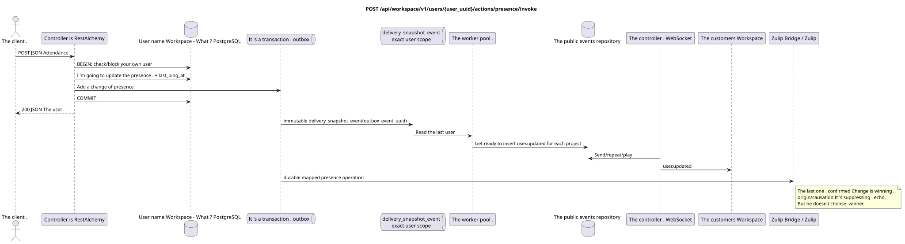

# `POST /api/workspace/v1/users/{user_uuid}/actions/presence/invoke`


Common target-invariant of reliability: each immutable outbox event outputs exactly one immutable typed task with unique `outbox_event_uuid`; coalescing is absent. Task stores the actual exact scope key, uses lease/fencing, retry/backoff, max attempts/DLQ, reaper and idempotent effect guard. Topic scope is applied only to placement/message-binding work; shared rows do not receive implicit fallback on topic.

[← The main index of the documentation](../../../../index.md) · [Index of sequence diagrams](../../README.md) · [Content and users Workspace](../README.md)

Status: the target specification of the operation, first developed in the documentation.
remains unchanged and is the normative [`workspace_api.md`](../../../../workspace_api.md).
This file describes the transaction and projection target boundaries; it doesn ' t
production code, migration SQL or new endpoint.



[The source that you can edit PlantUML](diagrams/post_user_presence.puml)

## Purpose and public contract

Update your own presence and activity mark of authenticated user.

Authentication: Bearer IAM; `project_id` and current `user_uuid` tokens are taken from context IAM.

## Path and query settings

| Location | Name of the person | Type / rule |
| --- | --- | --- |
| The way | `user_uuid` | must match the UUID authenticated user |

The collection pagination, where it is provided, preserves the current contract `page_limit` and UUID
`page_marker` and returns `X-Pagination-Limit`, and
`X-Pagination-Marker` Only if there 's a next page ..

## The body of the query

```json
{
  "status": "active",
  "emoji": "coffee",
  "text": "Focusing"
}
```

## A Successful Answer

`200`

```json
{
  "uuid": "11111111-1111-1111-1111-111111111111",
  "username": "admin",
  "source": "iam",
  "status": "active",
  "status_emoji": "coffee",
  "status_text": "Focusing",
  "first_name": "Workspace",
  "last_name": "Administrator",
  "email": "admin@example.com",
  "avatar": "urn:gravatar:0123456789abcdef0123456789abcdef",
  "last_ping_at": "2026-07-17T08:00:00Z",
  "created_at": "2026-07-01T08:00:00Z",
  "updated_at": "2026-07-17T08:00:00Z"
}
```


## Errors and authorization

Only the authenticated user's own UUID is accepted. `status` accepts `active|idle|offline|do_not_disturb`; `emoji` and `text` can be omitted to keep the previous values, or passed as `null` to clear.

General form of response for validation error:

```json
{
  "type": "ValidationErrorException",
  "code": 400,
  "message": "Validation error occurred."
}
```

## The target boundary RestAlchemy

```python
from restalchemy.api import controllers as ra_controllers
from restalchemy.api import resources as ra_resources
from restalchemy.dm import models
from restalchemy.dm import properties
from restalchemy.dm import types
from restalchemy.storage.sql import orm


class WorkspaceUser(models.ModelWithUUID, models.ModelWithTimestamp,
                    orm.SQLStorableMixin):
    __tablename__ = "messenger_users"
    username = properties.property(types.String(min_length=1, max_length=128), required=True)
    source = properties.property(types.Enum(["iam", "zulip"]), default="iam")
    status = properties.property(types.Enum(["active", "idle", "offline", "do_not_disturb"]))
    status_emoji = properties.property(types.AllowNone(types.String(max_length=64)))
    status_text = properties.property(types.AllowNone(types.String(max_length=256)))
    avatar = properties.property(types.String(max_length=2048), required=True)


class WorkspaceUserController(ra_controllers.BaseResourceControllerPaginated):
    __resource__ = ra_resources.ResourceByRAModel(
        model_class=WorkspaceUser,
        convert_underscore=False,
        process_filters=True,
    )
    # Narrow own-user IAM refresh and presence/avatar actions preserve the API.
```

Each public reference to an entity is declared a scalar UUID property RestAlchemy, not `relationship` (which would be serialized as URI). The corresponding physical column `*_uuid`  an indexed external key with an explicitly selected reference action. Therefore, public JSON keeps UUID unchanged.

`WorkspaceUser` — public UUID-like links of the provider remain scalar fields in the sanitized container of the provider; physical links  indexed FK. Identity fields belonging to IAM are read-only to browser queries.

## Synchronous path API

1. Check your own UUID.
2. Check `status` and optional fields.
3. Update the `status` field and set `last_ping_at=now`.
4. Add a recording to the outbox `user.presence_changed`.
5. Record the transaction and return the full user photo.

## Outbox, Typed tasks, worker and real-time work

API It doesn 't update the events of each recipient simultaneously .`offline`separate responsibility of the worker.

Separate immutable `delivery_snapshot_event` with exact user scope reads
The last canonical user and atomically creates ready records
`user.updated` with effect guard on `outbox_event_uuid`.
The dispatcher sends, repeats or plays them; the worker WebSocket-
He doesn 't have any connections ..

## Idempotence, keys and races

The user canonical string serializes competing presence records; beats the last fixed value `status`. Each outbox event outputs a separate immutable task; the idempotent processor reads the current initial state, so repeating the same task does not render the outdated image as the current one..

For mapped Zulip identity Bridge sequentially delivers Workspace-origin and
Zulip-origin presence/status changes. Last confirmed change wins;
`origin`/`causation_uuid` They just suppress their own echo and don 't prioritize .
Public request/response shape does not change.

## The moment of visibility for the client

The current client immediately receives the updated canonical user. Other clients receive the full shot `user.updated` after the accepted delay of projection/dispatch.

[← The main index of the documentation](../../../../index.md) · [Index of sequence diagrams](../../README.md) · [Content and users Workspace](../README.md)
