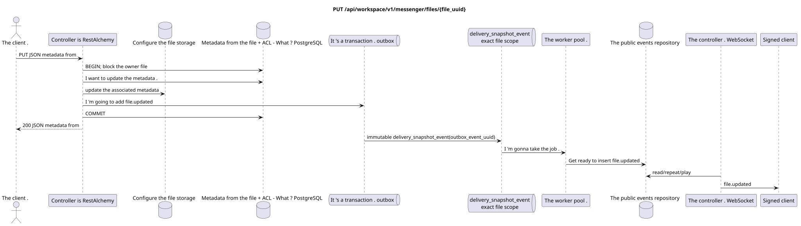

# `PUT /api/workspace/v1/messenger/files/{file_uuid}`


Common target-invariant of reliability: each immutable outbox event outputs exactly one immutable typed task with unique `outbox_event_uuid`; coalescing is absent. Task stores the actual exact scope key, uses lease/fencing, retry/backoff, max attempts/DLQ, reaper and idempotent effect guard. Topic scope is applied only to placement/message-binding work; shared rows do not receive implicit fallback on topic.

[← The main index of the documentation](../../../../index.md) · [Index of sequence diagrams](../../README.md) · [Content and users Workspace](../README.md)

Status: the target specification of the operation, first developed in the documentation.
remains unchanged and is the normative [`workspace_api.md`](../../../../workspace_api.md).
This file describes the transaction and projection target boundaries; it doesn ' t
production code, migration SQL or new endpoint.



[The source that you can edit PlantUML](diagrams/put_file_update.puml)

## Purpose and public contract

Update the owner file metadata; bytes remain unchanged.

Authentication: Bearer IAM; `project_id` and current `user_uuid` tokens are taken from context IAM.

## Path and query settings

| Location | Name of the person | Type / rule |
| --- | --- | --- |
| The way | `file_uuid` | UUID |

The collection pagination, where it is provided, preserves the current contract `page_limit` and UUID
`page_marker` and returns `X-Pagination-Limit`, and
`X-Pagination-Marker` Only if there 's a next page ..

## The body of the query

```json
{
  "name": "renamed.txt",
  "description": "Renamed example"
}
```

## A Successful Answer

`200`

```json
{
  "uuid": "f11353e0-712d-4b99-a716-5cdba848cc05",
  "user_uuid": "11111111-1111-1111-1111-111111111111",
  "stream_uuid": "75309057-419c-4b12-a7c1-3932429ec4a6",
  "name": "renamed.txt",
  "description": "Renamed example",
  "content_type": "text/plain",
  "size_bytes": 12,
  "hash": "abc",
  "created_at": "2026-07-17T08:00:00Z",
  "updated_at": "2026-07-17T08:01:00Z"
}
```


## Errors and authorization

Only the owner can update. Incorrect metadata returns `400`; unavailable UUID or UUID of another owner is not disclosed. Current contract does not specify a prerequisite ETag for metadata updates.

General form of response for validation error:

```json
{
  "type": "ValidationErrorException",
  "code": 400,
  "message": "Validation error occurred."
}
```

## The target boundary RestAlchemy

```python
from restalchemy.api import controllers as ra_controllers
from restalchemy.api import resources as ra_resources
from restalchemy.dm import models
from restalchemy.dm import properties
from restalchemy.dm import types
from restalchemy.storage.sql import orm


class WorkspaceFile(models.ModelWithUUID, models.ModelWithProject,
                    models.ModelWithTimestamp, orm.SQLStorableMixin):
    # Contract boundary only; target storage decomposition is not selected.
    __tablename__ = "m_workspace_files"
    user_uuid = properties.property(types.UUID(), required=True, read_only=True)
    stream_uuid = properties.property(types.AllowNone(types.UUID()))
    name = properties.property(types.String(max_length=255), required=True)
    description = properties.property(types.String(max_length=255), default="")
    content_type = properties.property(types.String(max_length=255), required=True)
    size_bytes = properties.property(types.Integer(min_value=0), required=True)
    hash = properties.property(types.String(max_length=255), required=True)


class WorkspaceFileController(ra_controllers.BaseResourceControllerPaginated):
    __resource__ = ra_resources.ResourceByRAModel(
        model_class=WorkspaceFile,
        hidden_fields=["project_id"],
        convert_underscore=False,
        process_filters=True,
    )
    # Narrow multipart/storage/download overrides preserve the current contract.
```

Each public reference to an entity is declared a scalar UUID property RestAlchemy, not `relationship` (which would be serialized as URI). The corresponding physical column `*_uuid`  an indexed external key with an explicitly selected reference action. Therefore, public JSON keeps UUID unchanged.

The current metadata/repository contract/ACL is preserved; the target physical breakdown is not selected.`project_id` remains hidden. The scalar `user_uuid` and the permissive `null` `stream_uuid` remain public UUID values supported by indexed FKs. Dynamic access by membership in the stream is checked by the canonical bindings of the stream.

## Synchronous path API

1. Find the owner of the file.
2. Check the metadata that changes and save the unchanged byte/hash contract.
3. Update the canonical metadata/contact file as needed.
4. Add to outbox the unchangeable entry `file.updated` in the DB transaction and fix it.
5. Restore the sanitized metadata.

## Outbox, Typed tasks, worker and real-time work

ACL participant capture and message scanning are not performed..

The fixed file domain entry in the outbox creates a separate immutable
`delivery_snapshot_event` with the exact scope of the file and the unique
`outbox_event_uuid`. The worker is idempotently recording the ready `file.updated`, and
The dispatcher sends, repeats or plays it.

## Idempotence, keys and races

The owner domain prevents updates between users. Competing metadata entries are resolved by serializing the DB line; the current contract does not promise optimistic ETag.

## The moment of visibility for the client

The initiator client immediately receives the fixed metadata. Other clients receive the file's ready event after the projection is delayed. Clearing the cache after the fixed deletion may be completed later without restoring access to the metadata.

[← The main index of the documentation](../../../../index.md) · [Index of sequence diagrams](../../README.md) · [Content and users Workspace](../README.md)
